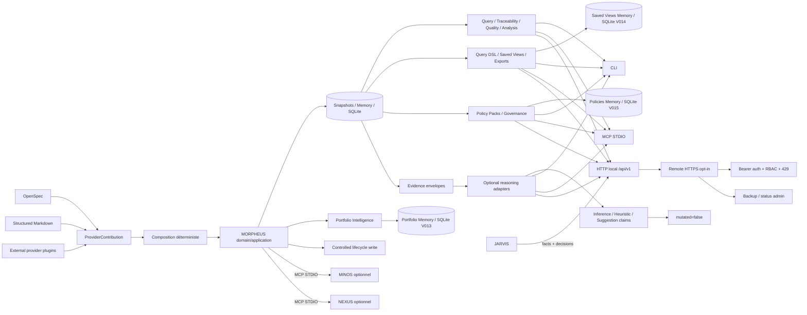

# Documentation MORPHEUS

Cette page est le point d’entrée de la documentation active de MORPHEUS.

MORPHEUS est un **Specification & Intent Intelligence Engine** local-first. Il normalise des spécifications, compose plusieurs providers réels sans effacer provenance ni conflits, publie des snapshots versionnés, expose requêtes/traçabilité/qualité, applique des mutations lifecycle explicitement contrôlées, raisonne sur des portfolios multi-projets, fournit un Query DSL provider-neutral avec saved views/exports, distribue des Policy Packs versionnés, explicables et auditables, peut exposer un mode serveur d’équipe optionnel avec HTTPS/auth/RBAC et propose une analyse assistée fondée sur des preuves qui conserve strictement faits, inférences, heuristiques et suggestions séparés.

La version produit publiée reste **MORPHEUS 1.0.0** sous le tag stable `v1.0.0`. Les jalons M21→M27 sont qualifiés et intégrés dans `develop`.

## Baseline intégrée

```text
M20 / R1         ✅ MORPHEUS 1.0.0 publié
M21              ✅ validé / intégré
M22              ✅ validé / intégré
M23              ✅ validé / intégré
M24              ✅ validé / intégré
M25              ✅ validé / intégré
M26              ✅ validé / intégré
M27              ✅ validé / intégré
M27 exact head   f97307c878125550693699124ca717f64f305a3a
M27 PR head      026c1d5f8671cd7b879fa89d51af8e83a5f06272
M27 merge        f8810803bd5ae7d57c4858e1e384c6a0132e1a45
M27 tests        602 PASS Windows + Linux
M27 architecture 238 PASS Windows + Linux
```

Preuves qualifiées principales :

- [`validation/VALIDATION_R1.md`](validation/VALIDATION_R1.md) — publication officielle `v1.0.0` ;
- [`validation/VALIDATION_M21.md`](validation/VALIDATION_M21.md) — production integrity ;
- [`validation/VALIDATION_M22.md`](validation/VALIDATION_M22.md) — Provider SDK & Plugin Discovery ;
- [`validation/VALIDATION_M23.md`](validation/VALIDATION_M23.md) — Portfolio Specification Intelligence ;
- [`validation/VALIDATION_M24.md`](validation/VALIDATION_M24.md) — Query DSL, Saved Views & Reporting ;
- [`validation/VALIDATION_M25.md`](validation/VALIDATION_M25.md) — Policy Packs & Governance Automation ;
- [`validation/VALIDATION_M26.md`](validation/VALIDATION_M26.md) — Optional Team / Remote Server Mode ;
- [`validation/VALIDATION_M27.md`](validation/VALIDATION_M27.md) — Evidence-backed Assisted Reasoning.

## Parcours utilisateur

| Besoin | Document |
|---|---|
| installer / mettre à jour / désinstaller | [Installation 1.0](user/INSTALLATION.md) |
| comprendre les concepts et garanties | [Guide utilisateur](user/README.md) |
| exécuter un premier scénario | [Démarrage rapide](user/QUICKSTART.md) |
| trouver une commande et ses options | [Référence CLI](user/CLI.md) |
| utiliser les plugins provider | [Plugins provider](user/PROVIDER_PLUGINS.md) |
| raisonner sur plusieurs projets | [Portfolios multi-projets](user/PORTFOLIOS.md) |
| requêtes, saved views et exports | [Query DSL, Saved Views & Reporting](user/QUERY_VIEWS_REPORTING.md) |
| policy packs et gouvernance | [Policy Packs](user/POLICY_PACKS.md) |
| utiliser le mode équipe / serveur remote | [Team / Remote Server](user/TEAM_REMOTE_SERVER.md) |
| produire des inférences assistées sans modifier les faits | [Assisted Reasoning](user/ASSISTED_REASONING.md) |
| configurer MINOS, NEXUS ou JARVIS | [Intégrations optionnelles](user/INTEGRATIONS.md) |

Les distributions Windows/Linux embarquent leur runtime Java. L’utilisateur final n’a pas besoin d’installer un JDK.

## Parcours développeur

| Besoin | Document |
|---|---|
| comprendre les modules | [Guide développeur](developer/README.md) |
| comprendre les couches et invariants | [Architecture](developer/ARCHITECTURE.md) |
| compiler, tester et packager | [Build, tests et validation](developer/BUILD_AND_TEST.md) |
| comprendre M23 | [Portfolio Specification Intelligence](developer/PORTFOLIO_INTELLIGENCE.md) |
| comprendre M24 | [Query Platform](developer/QUERY_PLATFORM.md) |
| comprendre M25 | [Policy Platform](developer/POLICY_PLATFORM.md) |
| comprendre M26 | [Remote Server Platform](developer/REMOTE_SERVER_PLATFORM.md) |
| comprendre M27 | [Evidence-backed Assisted Reasoning](developer/ASSISTED_REASONING.md) |
| contrat HTTP | [API HTTP](developer/API.md) |
| serveur MCP | [Serveur MCP](developer/MCP.md) |
| ports MINOS/NEXUS/JARVIS | [Intégrations cross-engine](developer/INTEGRATIONS.md) |

Baseline technique : Java 21, Maven Wrapper 3.9.16, SQLite, Java MCP SDK 2.0.0, API locale `jdk.httpserver`, façade remote HTTPS optionnelle `HttpsServer`, distribution `jpackage` + setup Windows Inno Setup.

## Vue rapide du système



## Gouvernance et preuves

- [`governance/ROADMAP.md`](governance/ROADMAP.md) — roadmap globale courante ;
- [`roadmap/POST_M20_EVOLUTION.md`](roadmap/POST_M20_EVOLUTION.md) — trajectoire MORPHEUS 1.x ;
- [`roadmap/M27_EXECUTION.md`](roadmap/M27_EXECUTION.md) — plan final M27 ;
- [`validation/README.md`](validation/README.md) — index des preuves qualifiées ;
- [`adr/README.md`](adr/README.md) — index des ADR ;
- [`adr/0095-evidence-backed-assisted-reasoning.md`](adr/0095-evidence-backed-assisted-reasoning.md) — décision M27 acceptée ;
- [`governance/DOCUMENTATION_STATUS.md`](governance/DOCUMENTATION_STATUS.md) — autorité documentaire.

## Références machine

- [`reference/`](reference/) — index des contrats ;
- [`openapi/morpheus-v1.yaml`](openapi/morpheus-v1.yaml) — contrat OpenAPI v1 historique/cumulatif ;
- [`openapi/morpheus-v1-portfolio-m23.yaml`](openapi/morpheus-v1-portfolio-m23.yaml) — supplément portfolio M23 ;
- [`openapi/morpheus-v1-query-m24.yaml`](openapi/morpheus-v1-query-m24.yaml) — supplément Query DSL / Saved Views / Export M24 ;
- [`openapi/morpheus-v1-policy-m25.yaml`](openapi/morpheus-v1-policy-m25.yaml) — supplément Policy Packs / Governance M25 ;
- [`openapi/morpheus-v1-remote-m26.yaml`](openapi/morpheus-v1-remote-m26.yaml) — supplément Team / Remote Server M26 ;
- [`openapi/morpheus-v1-reasoning-m27.yaml`](openapi/morpheus-v1-reasoning-m27.yaml) — supplément Evidence-backed Assisted Reasoning M27 ;
- [`../contracts/public-surfaces.tsv`](../contracts/public-surfaces.tsv) — manifeste de surfaces publiques ;
- [`../distribution/README.md`](../distribution/README.md) — release et distributions 1.0.

## État livré

```text
C0 → M27       ✅ VALIDÉS / INTÉGRÉS
D0 + D1        ✅ VALIDÉS / INTÉGRÉS
R1             ✅ v1.0.0 + GitHub Release publiée
Prochain jalon ⏳ NON DÉFINI
```

## Frontières

```text
MORPHEUS = specification facts + intent + lifecycle rules
           + controlled state invariants + provider composition facts
           + portfolio specification facts
           + provider-neutral query/view/reporting contracts
           + provider-neutral governance policy contracts
           + optional remote/team access boundary
           + evidence-backed assisted claims separated from published facts
MINOS    = code intelligence
NEXUS    = context selection / ranking / fusion / compression
JARVIS   = sequencing + orchestration + action choice
```

MORPHEUS 1.x conserve notamment :

```text
DomainIdentity != EntityVersionId != SourceLocator != ExternalReference
PROPOSED never leaks into CURRENT
APPLY != PROMOTE != ACTIVATE
READ_CHANGES != WRITE_CHANGE
ALLOWED != applied
UNKNOWN != BLOCKED
precedence != provenance erasure
conflict != silent last-write-wins
cross-project identity != source path
portfolio membership != source ownership
traversal is bounded and explainable
DSL != SQL passthrough
saved view != materialized truth
export != mutation
bounded query != silently truncated semantics
constraint text != executable policy
policy recommendation != applied mutation
policy version != mutable latest
policy override != provenance erasure
dry-run != mutation
policy evaluation != lifecycle mutation
local mode remains first-class
remote mode is opt-in
remote mode requires TLS + authentication
authentication != authorization
READ != WRITE != ADMIN
backup != live restore
restore != implicit migration
server state != provider source of truth
facts != inference
inference != suggestion
heuristic != published fact
confidence is explicit and bounded
adapter discovery != adapter execution
adapter absence != MORPHEUS failure
adapter failure != fact loss
reasoning execution != mutation
surface parity != same transport shape
```

Les preuves `VALIDATION_*.md` conservent le SHA et le gate réellement exécutés. Les commits de consolidation documentaire post-gate et post-merge restent distincts du SHA exact qualifié.