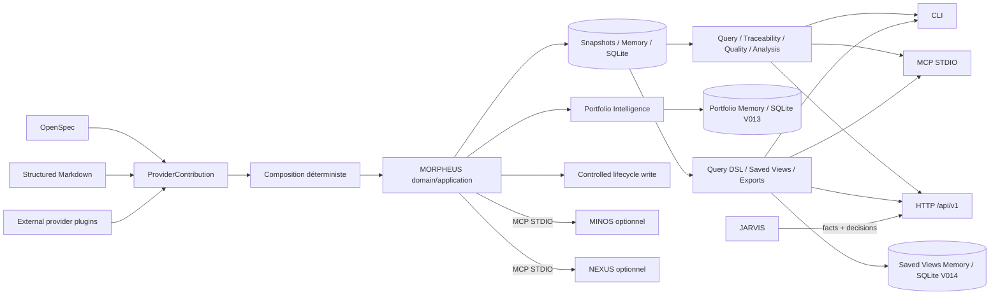

# Documentation MORPHEUS

Cette page est le point d’entrée de la documentation active de MORPHEUS.

MORPHEUS est un **Specification & Intent Intelligence Engine** local-first. Il normalise des spécifications, compose plusieurs providers réels sans effacer provenance ni conflits, publie des snapshots versionnés, expose requêtes/traçabilité/qualité, applique des mutations lifecycle explicitement contrôlées, raisonne sur des portfolios multi-projets et, depuis M24, fournit un Query DSL provider-neutral, des saved views versionnées et des exports déterministes.

La version produit publiée reste **MORPHEUS 1.0.0** sous le tag stable `v1.0.0`. Les jalons M21→M24 sont des évolutions 1.x qualifiées et intégrées sur cette baseline produit.

## Baseline et dernier jalon

```text
M20 / R1         ✅ MORPHEUS 1.0.0 publié
M21              ✅ validé / intégré
M22              ✅ validé / intégré
M23              ✅ validé / intégré
M24              ✅ validé / intégré
M24 executable   be69e47da0ae209d2246df9c67bc08caeafb2bb0
M24 PR head      863c2fa8f1fd7dcb40ef437c7fe6b8da016c0f58
M24 merge        2b483ded10c783fff22c25035db89475c5c9fdaf
M24 tests        543 PASS Windows + Linux
M24 architecture 221 PASS Windows + Linux
NOW              M25 — Policy Packs & Governance Automation
```

Preuves principales :

- [`validation/VALIDATION_R1.md`](validation/VALIDATION_R1.md) — publication officielle `v1.0.0` ;
- [`validation/VALIDATION_M21.md`](validation/VALIDATION_M21.md) — production integrity ;
- [`validation/VALIDATION_M22.md`](validation/VALIDATION_M22.md) — Provider SDK & Plugin Discovery ;
- [`validation/VALIDATION_M23.md`](validation/VALIDATION_M23.md) — Portfolio Specification Intelligence ;
- [`validation/VALIDATION_M24.md`](validation/VALIDATION_M24.md) — Query DSL, Saved Views & Reporting.

## Parcours utilisateur

| Besoin | Document |
|---|---|
| installer / mettre à jour / désinstaller | [Installation 1.0](user/INSTALLATION.md) |
| comprendre les concepts et garanties | [Guide utilisateur](user/README.md) |
| exécuter un premier scénario | [Démarrage rapide](user/QUICKSTART.md) |
| trouver une commande et ses options | [Référence CLI](user/CLI.md) |
| utiliser les plugins provider | [Plugins provider](user/PROVIDER_PLUGINS.md) |
| raisonner sur plusieurs projets | [Portfolios multi-projets](user/PORTFOLIOS.md) |
| requêtes, saved views et exports | [Query DSL, Saved Views & Reporting](user/QUERY_VIEWS_REPORTING.md) |
| configurer MINOS, NEXUS ou JARVIS | [Intégrations optionnelles](user/INTEGRATIONS.md) |

Les distributions Windows/Linux embarquent leur runtime Java. L’utilisateur final n’a pas besoin d’installer un JDK.

## Parcours développeur

| Besoin | Document |
|---|---|
| comprendre les modules | [Guide développeur](developer/README.md) |
| comprendre les couches et invariants | [Architecture](developer/ARCHITECTURE.md) |
| compiler, tester et packager | [Build, tests et validation](developer/BUILD_AND_TEST.md) |
| comprendre M23 | [Portfolio Specification Intelligence](developer/PORTFOLIO_INTELLIGENCE.md) |
| comprendre M24 | [Query Platform](developer/QUERY_PLATFORM.md) |
| contrat HTTP | [API HTTP](developer/API.md) |
| serveur MCP | [Serveur MCP](developer/MCP.md) |
| ports MINOS/NEXUS/JARVIS | [Intégrations cross-engine](developer/INTEGRATIONS.md) |

Baseline technique : Java 21, Maven Wrapper 3.9.16, SQLite, Java MCP SDK 2.0.0, API locale `jdk.httpserver`, distribution `jpackage` + setup Windows Inno Setup.

## Vue rapide du système



## Gouvernance et preuves

- [`governance/ROADMAP.md`](governance/ROADMAP.md) — roadmap globale courante ;
- [`roadmap/POST_M20_EVOLUTION.md`](roadmap/POST_M20_EVOLUTION.md) — trajectoire active MORPHEUS 1.x ;
- [`roadmap/M24_EXECUTION.md`](roadmap/M24_EXECUTION.md) — exécution M24 terminée ;
- [`validation/README.md`](validation/README.md) — index des preuves ;
- [`adr/README.md`](adr/README.md) — index des ADR ;
- [`governance/DOCUMENTATION_STATUS.md`](governance/DOCUMENTATION_STATUS.md) — autorité documentaire.

## Références machine

- [`reference/`](reference/) — index des contrats ;
- [`openapi/morpheus-v1.yaml`](openapi/morpheus-v1.yaml) — contrat OpenAPI v1 historique/cumulatif ;
- [`openapi/morpheus-v1-portfolio-m23.yaml`](openapi/morpheus-v1-portfolio-m23.yaml) — supplément portfolio M23 ;
- [`openapi/morpheus-v1-query-m24.yaml`](openapi/morpheus-v1-query-m24.yaml) — supplément Query DSL / Saved Views / Export M24 ;
- [`../contracts/public-surfaces.tsv`](../contracts/public-surfaces.tsv) — manifeste de surfaces publiques ;
- [`../distribution/README.md`](../distribution/README.md) — release et distributions 1.0.

## État livré et suite

```text
C0 → M24       ✅ VALIDÉS / INTÉGRÉS
D0 + D1        ✅ VALIDÉS / INTÉGRÉS
R1             ✅ v1.0.0 + GitHub Release publiée
M25            ⏭ Policy Packs & Governance Automation
M26 → M27      LATER
```

## Frontières

```text
MORPHEUS = specification facts + intent + lifecycle rules
           + controlled state invariants + provider composition facts
           + portfolio specification facts
           + provider-neutral query/view/reporting contracts
MINOS    = code intelligence
NEXUS    = context selection / ranking / fusion / compression
JARVIS   = sequencing + orchestration + action choice
```

MORPHEUS 1.x conserve notamment :

```text
DomainIdentity != EntityVersionId != SourceLocator != ExternalReference
PROPOSED never leaks into CURRENT
APPLY != PROMOTE != ACTIVATE
READ_CHANGES != WRITE_CHANGE
ALLOWED != applied
UNKNOWN != BLOCKED
precedence != provenance erasure
conflict != silent last-write-wins
cross-project identity != source path
portfolio membership != source ownership
traversal is bounded and explainable
DSL != SQL passthrough
saved view != materialized truth
export != mutation
bounded query != silently truncated semantics
```

Les preuves `VALIDATION_*.md` conservent le SHA et le gate réellement exécutés. Les commits de consolidation documentaire post-gate et post-merge restent distincts du SHA exécutable qualifié.