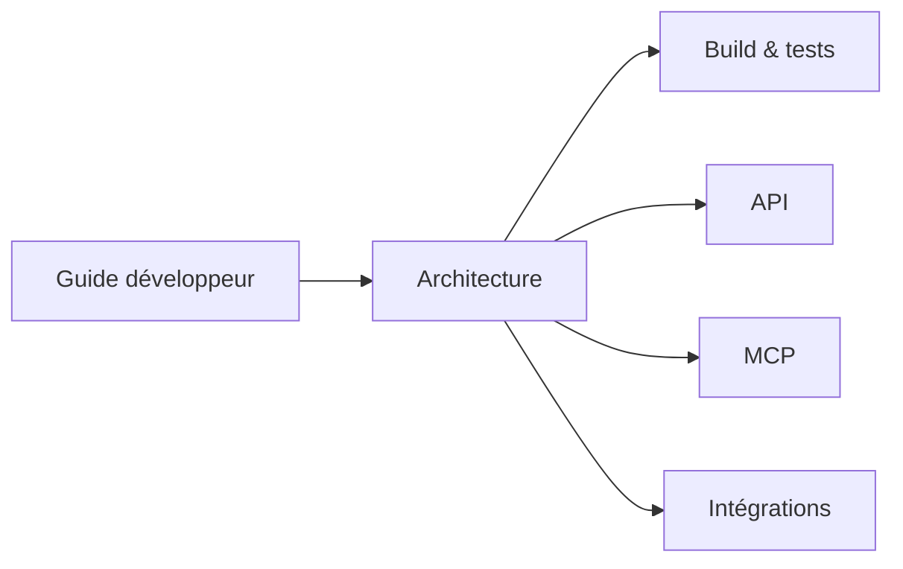
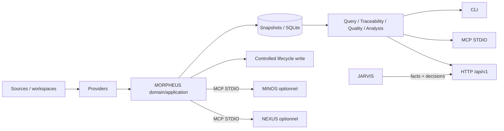

# Documentation MORPHEUS

Cette page est le point d’entrée de la documentation active de MORPHEUS.

MORPHEUS est un **Specification & Intent Intelligence Engine** local-first. Il normalise des spécifications, publie des snapshots versionnés, expose des requêtes et de la traçabilité, produit des diagnostics qualité, analyse les changements, applique des mutations lifecycle explicitement contrôlées et fournit des contrats d’intégration optionnels pour MINOS, NEXUS et JARVIS.

La documentation utilisateur et développeur contient des diagrammes Mermaid de type **UML class**, **state**, **sequence** et des vues de composants pour expliciter les workflows et les frontières d’architecture directement dans GitHub.

La distinction entre documentation active, décisions normatives et preuves historiques est définie dans [`governance/DOCUMENTATION_STATUS.md`](governance/DOCUMENTATION_STATUS.md).

## Parcours utilisateur

| Besoin | Document |
|---|---|
| comprendre les concepts et garanties | [Guide utilisateur](user/README.md) |
| installer et exécuter un premier scénario | [Démarrage rapide](user/QUICKSTART.md) |
| trouver une commande et ses options | [Référence CLI](user/CLI.md) |
| configurer MINOS, NEXUS ou JARVIS | [Intégrations optionnelles](user/INTEGRATIONS.md) |

Parcours conseillé :


Les distributions portables Windows/Linux embarquent leur runtime Java. L’utilisateur final n’a pas besoin d’installer un JDK pour exécuter l’archive portable.

## Parcours développeur

| Besoin | Document |
|---|---|
| importer le projet et comprendre les modules | [Guide développeur](developer/README.md) |
| comprendre couches, domaine, temporalité et lifecycle | [Architecture](developer/ARCHITECTURE.md) |
| compiler, tester et packager | [Build, tests et validation](developer/BUILD_AND_TEST.md) |
| implémenter/consommer le contrat HTTP | [API HTTP](developer/API.md) |
| implémenter/consommer le serveur MCP | [Serveur MCP](developer/MCP.md) |
| comprendre les ports MINOS/NEXUS/JARVIS | [Intégrations cross-engine](developer/INTEGRATIONS.md) |

Parcours conseillé :



Baseline technique actuelle : Java 21, Maven Wrapper 3.9.16, SQLite, Java MCP SDK 2.0.0 et API HTTP basée sur `jdk.httpserver`.

## Vue rapide du système



## Produit et spécification

- [`product/CAHIER_DES_CHARGES.md`](product/CAHIER_DES_CHARGES.md) — baseline fonctionnelle et technique de haut niveau validée en C0 ;
- [`product/USE_CASES.md`](product/USE_CASES.md) — cas d’usage issus du cadrage C0 ;
- [`product/MVP.md`](product/MVP.md) — périmètre MVP historique ;
- [`domain/MODEL.md`](domain/MODEL.md) — modèle de domaine de cadrage et historique de conception.

Ces documents de cadrage expliquent l’intention fondatrice. Les contrats et états courants plus récents sont décrits par le code, les ADR acceptées, les références machine et les roadmaps actives.

## Gouvernance et preuves

- [`governance/README.md`](governance/README.md) — index de gouvernance ;
- [`governance/DOCUMENTATION_STATUS.md`](governance/DOCUMENTATION_STATUS.md) — autorité et statut des familles documentaires ;
- [`governance/ROADMAP.md`](governance/ROADMAP.md) — état global courant des jalons et synthèse post-M14 ;
- [`roadmap/README.md`](roadmap/README.md) — index des plans historiques et actifs ;
- [`roadmap/POST_M14_EXECUTION.md`](roadmap/POST_M14_EXECUTION.md) — roadmap détaillée D0 + M15→M20 ;
- [`roadmap/M17_EXECUTION.md`](roadmap/M17_EXECUTION.md) — dernier jalon intégré ;
- [`governance/PLAN.md`](governance/PLAN.md) — plan de cadrage C0/M0 historique ;
- [`governance/AUDIT_COHERENCE_C0.md`](governance/AUDIT_COHERENCE_C0.md) — audit C0 ;
- [`validation/`](validation/) — preuves de validation C0 et M0 à M17 ;
- [`adr/`](adr/) — Architecture Decision Records.

## Références machine

- [`reference/`](reference/) — index des contrats ;
- [`openapi/morpheus-v1.yaml`](openapi/morpheus-v1.yaml) — contrat OpenAPI machine-readable ;
- [`../distribution/README.md`](../distribution/README.md) — construction et packaging des distributions.

## État livré et suite planifiée

```text
C0 → M14       ✅ validés et intégrés
D0             ✅ validé / intégré
M15            ✅ validé / intégré — 371/371
M16            ✅ validé / intégré — 393/393
M17            ✅ validé / intégré — 410/410
Architecture   ✅ 167/167 PASS au gate M17
Packaging Win  ✅ PASS au gate M17

M18            ⏭ real providers / multi-provider — prochain
M19            ⏳ production hardening / scale
M20            ⏳ release engineering / installation PROD / 1.0
```

Frontière actuelle :

```text
MORPHEUS = specification facts + lifecycle rules + controlled state invariants
MINOS    = code intelligence
NEXUS    = context selection / ranking / fusion / compression
JARVIS   = sequencing + orchestration + action choice
```

M17 ajoute une écriture lifecycle explicite sans modifier cette frontière : `ALLOWED != applied`, `READ_CHANGES != WRITE_CHANGE`, CAS/idempotency/audit sont obligatoires.

La cible M20 aligne l’installation Windows sur le standard produit retenu pour MINOS : setup par utilisateur sous `%LOCALAPPDATA%\Programs\MORPHEUS`, données séparées sous `%LOCALAPPDATA%\MORPHEUS`, PATH optionnel, checksums et GitHub Releases. Le ZIP portable reste supporté pour l’automatisation et le diagnostic.

## Conventions de lecture

Dans la documentation :

- `CURRENT`, `PROPOSED`, `HISTORICAL` désignent la temporalité des connaissances ;
- `BUILDING` à `RETIRED` désignent le lifecycle technique d’un `KnowledgeSnapshot` ;
- `DRAFT` à `ARCHIVED`/`ABANDONED` désignent le lifecycle métier d’un `ChangeProposal` ;
- `ALLOWED`, `BLOCKED`, `UNKNOWN`, `REQUIRES_INPUT` sont des décisions d’évaluation, pas des transitions appliquées ;
- `persisted=false` indique une vue/observation live ou calculée qui ne modifie pas l’historique publié ;
- une preuve `VALIDATION_M*.md` conserve le SHA et le gate réellement exécutés, tandis que les roadmaps actives reflètent l’état GitHub courant.

## Règle de rangement

Le portail actif est `docs/README.md`. Les documents maintenus sont classés par usage (`user`, `developer`, `product`, `reference`) ou par gouvernance (`governance`, `validation`, `roadmap`, `adr`). Les reliquats de cadrage C0 conservés ailleurs sous `docs/` sont historiques et ne constituent pas l’état courant du produit.
