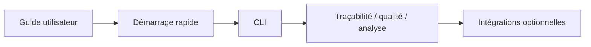
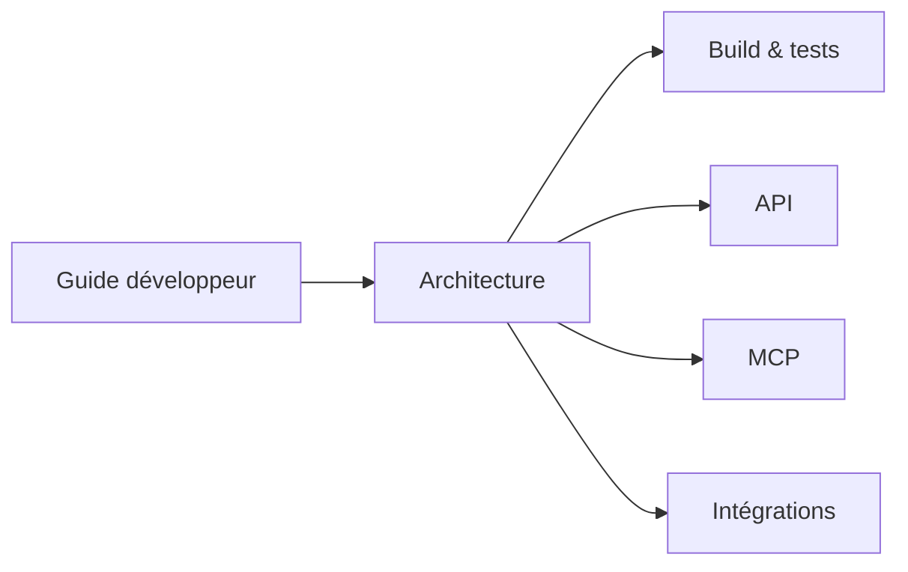
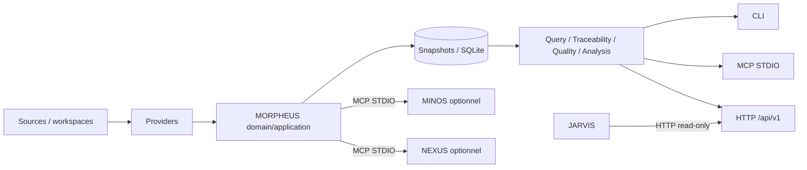

# Documentation MORPHEUS

Cette page est le point d’entrée de la documentation active de MORPHEUS.

MORPHEUS est un **Specification & Intent Intelligence Engine** local-first. Il normalise des spécifications, publie des snapshots versionnés, expose des requêtes et de la traçabilité, produit des diagnostics qualité, analyse les changements et fournit des contrats d’intégration optionnels pour MINOS, NEXUS et JARVIS.

La documentation utilisateur et développeur contient désormais des diagrammes Mermaid de type **UML class**, **state**, **sequence** et des vues de composants pour expliciter les workflows et les frontières d’architecture directement dans GitHub.

## Parcours utilisateur

| Besoin | Document |
|---|---|
| comprendre les concepts et garanties | [Guide utilisateur](user/README.md) |
| installer et exécuter un premier scénario | [Démarrage rapide](user/QUICKSTART.md) |
| trouver une commande et ses options | [Référence CLI](user/CLI.md) |
| configurer MINOS, NEXUS ou JARVIS | [Intégrations optionnelles](user/INTEGRATIONS.md) |

Parcours conseillé :



Les distributions portables Windows/Linux embarquent leur runtime Java. L’utilisateur final n’a pas besoin d’installer un JDK pour exécuter l’archive portable.

## Parcours développeur

| Besoin | Document |
|---|---|
| importer le projet et comprendre les modules | [Guide développeur](developer/README.md) |
| comprendre couches, domaine, temporalité et lifecycle | [Architecture](developer/ARCHITECTURE.md) |
| compiler, tester et packager | [Build, tests et validation](developer/BUILD_AND_TEST.md) |
| implémenter/consommer le contrat HTTP | [API HTTP](developer/API.md) |
| implémenter/consommer le serveur MCP | [Serveur MCP](developer/MCP.md) |
| comprendre les ports MINOS/NEXUS/JARVIS | [Intégrations cross-engine](developer/INTEGRATIONS.md) |

Parcours conseillé :



Baseline technique actuelle : Java 21, Maven Wrapper 3.9.16, SQLite, Java MCP SDK 2.0.0 et API HTTP basée sur `jdk.httpserver`.

## Vue rapide du système



## Produit et spécification

- [`product/CAHIER_DES_CHARGES.md`](product/CAHIER_DES_CHARGES.md) — cadrage fonctionnel et technique de haut niveau ;
- [`product/USE_CASES.md`](product/USE_CASES.md) — cas d’usage ;
- [`product/MVP.md`](product/MVP.md) — périmètre MVP historique ;
- [`domain/MODEL.md`](domain/MODEL.md) — modèle de domaine de cadrage et historique de conception.

## Gouvernance et preuves

- [`governance/README.md`](governance/README.md) — index de gouvernance ;
- [`governance/ROADMAP.md`](governance/ROADMAP.md) — état global des jalons ;
- [`governance/PLAN.md`](governance/PLAN.md) — plan de travail de cadrage ;
- [`governance/AUDIT_COHERENCE_C0.md`](governance/AUDIT_COHERENCE_C0.md) — audit C0 ;
- [`validation/`](validation/) — preuves de validation C0 et M0 à M14 ;
- [`roadmap/`](roadmap/) — plans d’exécution historiques par jalon ;
- [`adr/`](adr/) — Architecture Decision Records.

## Références machine

- [`reference/`](reference/) — index des contrats ;
- [`openapi/morpheus-v1.yaml`](openapi/morpheus-v1.yaml) — contrat OpenAPI machine-readable ;
- [`../distribution/README.md`](../distribution/README.md) — construction et packaging des distributions.

## État livré

```text
C0 → M14       ✅ validés
M3 → M14       ✅ intégrés
M14            ✅ 357/357 PASS
Architecture   ✅ 160/160 PASS
Packaging Win  ✅ PASS
JARVIS         ✅ 536 tests BUILD SUCCESS
```

M14 maintient la frontière suivante :

```text
MORPHEUS = specification facts + lifecycle rules + transition decisions
JARVIS   = sequencing + orchestration + action choice
```

## Conventions de lecture

Dans la documentation :

- `CURRENT`, `PROPOSED`, `HISTORICAL` désignent la temporalité des connaissances ;
- `BUILDING` à `RETIRED` désignent le lifecycle technique d’un `KnowledgeSnapshot` ;
- `DRAFT` à `ARCHIVED`/`ABANDONED` désignent le lifecycle métier d’un `ChangeProposal` ;
- `ALLOWED`, `BLOCKED`, `UNKNOWN`, `REQUIRES_INPUT` sont des décisions d’évaluation, pas des transitions appliquées ;
- `persisted=false` indique une vue/observation live ou calculée qui ne modifie pas l’historique publié.

## Règle de rangement

La racine `docs/` ne contient que ce portail. Les documents sont classés par usage (`user`, `developer`, `product`, `reference`) ou par gouvernance (`governance`, `validation`, `roadmap`, `adr`).
