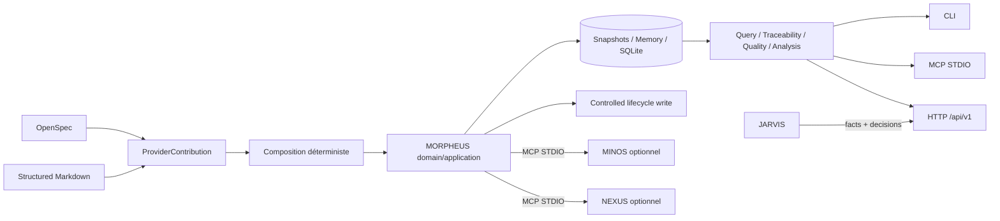

# Documentation MORPHEUS

Cette page est le point d’entrée de la documentation active de MORPHEUS.

MORPHEUS est un **Specification & Intent Intelligence Engine** local-first. Il normalise des spécifications, compose plusieurs providers réels sans effacer provenance ni conflits, publie des snapshots versionnés, expose des requêtes et de la traçabilité, produit des diagnostics qualité, analyse les changements, applique des mutations lifecycle explicitement contrôlées et fournit des contrats d’intégration optionnels pour MINOS, NEXUS et JARVIS.

La baseline active est **MORPHEUS 1.0.0**, officiellement publiée sous le tag stable `v1.0.0`.

## Baseline 1.0

```text
M20 issue       #92 CLOSED / completed
M20 PR          #93 MERGED
Code qualifié   9199ed43c4bd8596a97db055eeff17ae31399eb8
M20 merge       75d0b82ab0c960692db2fee1ced146fa6547fd4a
D1 merge        51f6a120f3461c8d8c24323f3db8211d28d6cb42
Release SHA     51f6a120f3461c8d8c24323f3db8211d28d6cb42
Tag stable      v1.0.0
GitHub Release  MORPHEUS 1.0.0 — 8/8 assets
Tests           454/454 PASS Windows + Linux
Architecture    182/182 PASS Windows + Linux
Reactor         14/14 SUCCESS
Setup Windows   PASS
Portable Win    PASS
Portable Linux  PASS
No-user-JDK     PASS Windows + Linux
```

Preuves :

- [`validation/VALIDATION_M20.md`](validation/VALIDATION_M20.md) — qualification technique M20 ;
- [`validation/VALIDATION_D1.md`](validation/VALIDATION_D1.md) — consolidation documentaire post-M20 ;
- [`validation/VALIDATION_R1.md`](validation/VALIDATION_R1.md) — publication officielle `v1.0.0`.

## Parcours utilisateur

| Besoin | Document |
|---|---|
| installer / mettre à jour / désinstaller | [Installation 1.0](user/INSTALLATION.md) |
| comprendre les concepts et garanties | [Guide utilisateur](user/README.md) |
| exécuter un premier scénario | [Démarrage rapide](user/QUICKSTART.md) |
| trouver une commande et ses options | [Référence CLI](user/CLI.md) |
| configurer MINOS, NEXUS ou JARVIS | [Intégrations optionnelles](user/INTEGRATIONS.md) |

Les distributions Windows/Linux embarquent leur runtime Java. L’utilisateur final n’a pas besoin d’installer un JDK.

## Parcours développeur

| Besoin | Document |
|---|---|
| comprendre les modules | [Guide développeur](developer/README.md) |
| comprendre les couches et invariants | [Architecture](developer/ARCHITECTURE.md) |
| compiler, tester et packager | [Build, tests et validation](developer/BUILD_AND_TEST.md) |
| contrat HTTP | [API HTTP](developer/API.md) |
| serveur MCP | [Serveur MCP](developer/MCP.md) |
| ports MINOS/NEXUS/JARVIS | [Intégrations cross-engine](developer/INTEGRATIONS.md) |

Baseline technique : Java 21, Maven Wrapper 3.9.16, SQLite, Java MCP SDK 2.0.0, API locale `jdk.httpserver`, distribution `jpackage` + setup Windows Inno Setup.

## Vue rapide du système



## Produit et spécification

- [`product/CAHIER_DES_CHARGES.md`](product/CAHIER_DES_CHARGES.md) — baseline fonctionnelle de cadrage ;
- [`product/USE_CASES.md`](product/USE_CASES.md) — cas d’usage ;
- [`product/MVP.md`](product/MVP.md) — périmètre MVP historique ;
- [`domain/MODEL.md`](domain/MODEL.md) — historique du modèle.

Ces documents expliquent l’intention fondatrice. L’état courant est porté par le code, les ADR acceptées, les références machine et les roadmaps actives.

## Gouvernance et preuves

- [`governance/ROADMAP.md`](governance/ROADMAP.md) — roadmap globale courante ;
- [`roadmap/POST_M20_EVOLUTION.md`](roadmap/POST_M20_EVOLUTION.md) — trajectoire active MORPHEUS 1.x ;
- [`roadmap/POST_M14_EXECUTION.md`](roadmap/POST_M14_EXECUTION.md) — trajectoire historique D0 + M15→M20 ;
- [`roadmap/D1_EXECUTION.md`](roadmap/D1_EXECUTION.md) — consolidation post-M20 intégrée ;
- [`validation/VALIDATION_M20.md`](validation/VALIDATION_M20.md) — preuve M20 Windows + Linux ;
- [`validation/VALIDATION_D1.md`](validation/VALIDATION_D1.md) — preuve D1 ;
- [`validation/VALIDATION_R1.md`](validation/VALIDATION_R1.md) — preuve de publication officielle 1.0.0 ;
- [`adr/`](adr/) — Architecture Decision Records ;
- [`governance/DOCUMENTATION_STATUS.md`](governance/DOCUMENTATION_STATUS.md) — autorité documentaire.

## Références machine

- [`reference/`](reference/) — index des contrats ;
- [`openapi/morpheus-v1.yaml`](openapi/morpheus-v1.yaml) — contrat OpenAPI machine-readable ;
- [`../distribution/README.md`](../distribution/README.md) — release et distributions 1.0.

## État livré et suite

```text
C0 → M20       ✅ VALIDÉS / INTÉGRÉS
D1             ✅ VALIDÉ / INTÉGRÉ
R1             ✅ v1.0.0 + GitHub Release publiées
M21            ⏭ Production Integrity & Surface Convergence
M22 → M24      NEXT
M25 → M27      LATER
```

Détail : [`roadmap/POST_M20_EVOLUTION.md`](roadmap/POST_M20_EVOLUTION.md).

## Frontières

```text
MORPHEUS = specification facts + intent + lifecycle rules
           + controlled state invariants + provider composition facts
MINOS    = code intelligence
NEXUS    = context selection / ranking / fusion / compression
JARVIS   = sequencing + orchestration + action choice
```

MORPHEUS 1.x conserve notamment :

```text
DomainIdentity != EntityVersionId != SourceLocator != ExternalReference
PROPOSED never leaks into CURRENT
APPLY != PROMOTE != ACTIVATE
READ_CHANGES != WRITE_CHANGE
ALLOWED != applied
UNKNOWN != BLOCKED
precedence != provenance erasure
conflict != silent last-write-wins
```

## Conventions de lecture

Les preuves `VALIDATION_*.md` conservent le SHA et le gate réellement exécutés. Les roadmaps actives reflètent l’état GitHub courant. Une preuve historique n’est jamais réécrite pour simuler un état postérieur au gate.
