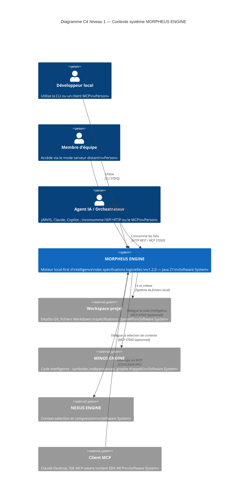

# §3 — Contexte et périmètre

> **Sources** : `docs/ECOSYSTEME.md`, `docs/developer/ARCHITECTURE.md`,
> `docs/openapi/morpheus-v1.yaml`, `docs/developer/MCP.md`,
> ADR-0007, ADR-0027, ADR-0062, ADR-0094.

---

## 3.1 Frontière du système

MORPHEUS ENGINE est un processus unique (JVM) fonctionnant sur la machine de
l'utilisateur (ou en mode remote sur un serveur d'équipe). Il lit des
workspaces de projets locaux et expose les faits produits via trois surfaces :

- **CLI** — commandes interactives sur stdout/stderr ;
- **MCP STDIO** — JSON-RPC sur stdin/stdout pour clients IA ;
- **HTTP API** — REST local (`127.0.0.1:8765`) ou HTTPS distant (opt-in).

Le système **ne gère pas** : le stockage des sources (il les lit), l'exécution
des LLM, la gestion des utilisateurs d'entreprise (hors RBAC du mode remote
minimal), ni le déploiement cloud.

---

## 3.2 Diagramme C4 Context

---

## 3.3 Acteurs et systèmes externes

### Acteurs humains

| Acteur | Rôle | Interface principale |
|--------|------|---------------------|
| Développeur local | Utilisateur quotidien, sync et query | CLI |
| Membre d'équipe | Utilisateur multi-projets partagé | HTTP REST (remote) |
| Agent IA orchestrateur (JARVIS) | Consommateur read-only d'API | HTTP REST local |

### Systèmes externes

| Système | Rôle | Protocole | Obligatoire |
|---------|------|-----------|-------------|
| Workspace projet (Git/fichiers) | Source de vérité des spécifications | Filesystem | **Oui** |
| MINOS ENGINE | Analyse statique de code (symboles, callers, callees) | MCP STDIO | Non — adapter absence != MORPHEUS failure |
| NEXUS ENGINE | Sélection et compression de contexte IA | MCP STDIO | Non — même garantie |
| Client MCP (Claude Desktop, IDE) | Consommateur de tools MCP | MCP STDIO | Non |
| Agent IA / JARVIS | Orchestration de workflows | HTTP REST | Non — consomme l'API en read-only |

### Interfaces

| Interface | Direction | Protocole | Port / Transport | Remarques |
|-----------|-----------|-----------|-----------------|-----------|
| CLI | entrant | STDIO (terminal) | — | `morpheus-cli` ; commandes verbales |
| MCP STDIO | entrant | JSON-RPC sur stdin/stdout | — | `morpheus-mcp` ; lancé par le client MCP |
| HTTP local | entrant | HTTP/1.1 | `127.0.0.1:8765` | `jdk.httpserver` ; API v1.8.0 |
| HTTP remote | entrant | HTTPS/TLS 1.3 | Configurable | Mode optionnel ; Bearer auth, RBAC |
| Filesystem | sortant | Appels OS | — | Lecture des workspaces projet |
| MINOS | sortant | MCP STDIO | Sous-processus | `MinosMcpCodeGateway` ; optionnel |
| NEXUS | sortant | MCP STDIO | Sous-processus | `NexusMcpContextGateway` ; optionnel |

---

## 3.4 Périmètre hors-frontière (explicitement exclu)

- Exécution de LLM ou d'inférence IA dans le processus MORPHEUS.
- Stockage cloud ou base de données distante.
- Authentification entreprise (SSO, LDAP) — hors scope actuel.
- Gestion du code source (MORPHEUS lit, n'écrit pas les fichiers source).
- Pipeline CI/CD des projets cibles (MORPHEUS peut être appelé depuis un pipeline mais ne le pilote pas).
