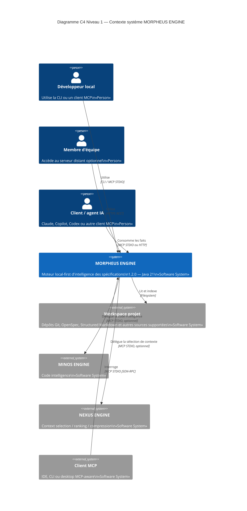

# §3 — Contexte et périmètre

> **Sources actives** : `docs/ECOSYSTEME.md`, `docs/openapi/`,
> `docs/developer/MCP.md`, ADR-0007, ADR-0062, ADR-0094, ADR-0096 et code
> du HEAD `develop`.

---

## 3.1 Frontière du système

MORPHEUS ENGINE est une application Java 21 local-first. Elle lit des
workspaces de projets, normalise les spécifications au moyen de providers et
expose les faits produits via trois surfaces principales :

- **CLI** — commandes locales scriptables ;
- **MCP STDIO** — JSON-RPC sur stdin/stdout pour les clients MCP ;
- **HTTP API** — `/api/v1`, en local ou via le mode serveur d'équipe HTTPS opt-in.

MORPHEUS ne gère pas l'hébergement des dépôts sources, n'exécute aucun LLM dans
son cœur et ne dépend d'aucun service cloud obligatoire. Le mode remote fournit
son propre périmètre d'authentification Bearer/RBAC ; il ne remplace pas un IAM
d'entreprise complet.

---

## 3.2 Diagramme C4 Context

---

## 3.3 Acteurs et systèmes externes

### Acteurs humains

| Acteur | Rôle | Interface principale |
|--------|------|---------------------|
| Développeur local | Sync, requêtes, gouvernance, administration locale | CLI / MCP |
| Membre d'équipe | Consommation partagée en mode remote | HTTPS REST |
| Mainteneur | Qualification, migrations, releases et configuration | CLI / scripts / GitHub |

### Systèmes externes

| Système | Rôle | Protocole | Obligatoire |
|---------|------|-----------|-------------|
| Workspace projet | Source de spécifications | Filesystem | Oui pour l'ingestion |
| MINOS ENGINE | Code intelligence | MCP STDIO | Non |
| NEXUS ENGINE | Sélection et compression de contexte | MCP STDIO | Non |
| Client MCP | Consommateur des tools MORPHEUS | MCP STDIO | Non |
| Client HTTP | Consommateur de `/api/v1` | HTTP/HTTPS | Non |

L'indisponibilité d'une intégration optionnelle ne doit pas rendre les faits
locaux MORPHEUS indisponibles.

### Interfaces

| Interface | Direction | Protocole | Transport | Remarques |
|-----------|-----------|-----------|-----------|-----------|
| CLI | entrant | Commandes locales | terminal | `morpheus-cli` |
| MCP | entrant | JSON-RPC / MCP | STDIO | `morpheus-mcp` ; configuration client opt-in |
| HTTP local | entrant | HTTP | loopback | Surface `/api/v1` |
| HTTP remote | entrant | HTTPS/TLS | configurable | Bearer auth, RBAC, concurrence bornée |
| Filesystem | sortant | appels OS | local | Lecture de workspaces dans les racines autorisées |
| MINOS | sortant | MCP | STDIO sous-processus | optionnel |
| NEXUS | sortant | MCP | STDIO sous-processus | optionnel |

---

## 3.4 Hors périmètre explicite

- Exécution d'un LLM dans le processus MORPHEUS.
- Dépendance obligatoire à une base cloud ou à un service SaaS.
- Gestion IAM d'entreprise complète (SSO/LDAP) dans la baseline 1.2.0.
- Modification implicite du code ou des spécifications sources.
- Orchestration du pipeline CI/CD des projets cibles.
- Écrasement automatique d'une configuration MCP étrangère existante.
