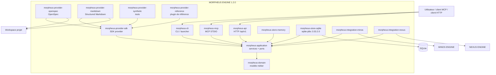
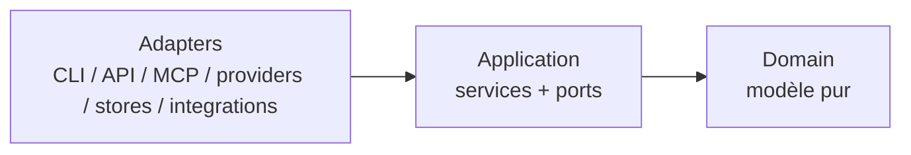
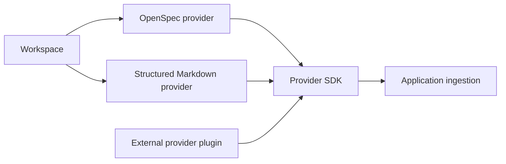
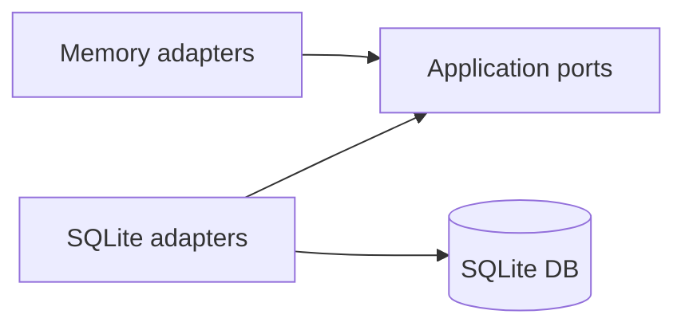

# §5 — Vue des blocs (structure statique)

> **Sources actives** : reactor `pom.xml`, POM des modules, contrats publics,
> tests d'architecture et code du HEAD `develop`.

---

## 5.1 Vue conteneurs



Le diagramme exprime les dépendances logiques, pas un ordre de démarrage. Les
providers **OpenSpec** et **Structured Markdown** lisent les formats qu'ils
supportent ; OpenSpec ne doit pas être confondu avec OpenAPI.

---

## 5.2 Reactor Maven

Le parent `morpheus-engine` agrège 16 modules :

| Famille | Modules | Responsabilité |
|---------|---------|----------------|
| Domaine | `morpheus-domain` | Modèle métier, value objects, invariants et state machines |
| Application | `morpheus-application` | Use cases, orchestration et ports possédés par MORPHEUS |
| Provider SDK | `morpheus-provider-sdk`, `morpheus-provider-testkit`, `morpheus-provider-reference` | Contrats d'extension, qualification et plugin de référence |
| Providers | `morpheus-provider-openspec`, `morpheus-provider-markdown`, `morpheus-provider-synthetic` | Adaptation des sources vers les contrats MORPHEUS |
| Stores | `morpheus-store-memory`, `morpheus-store-sqlite` | Persistance derrière les ports applicatifs |
| Intégrations | `morpheus-integration-minos`, `morpheus-integration-nexus` | Passerelles optionnelles vers les moteurs externes |
| Surfaces | `morpheus-cli`, `morpheus-mcp`, `morpheus-api` | CLI, MCP STDIO et HTTP |
| Qualification | `morpheus-architecture-tests` | Invariants et gates d'architecture |

Les nombres de classes, paquetages et endpoints ne sont volontairement pas
figés ici : ce sont des métriques volatiles et non des propriétés
architecturales.

---

## 5.3 Règle de dépendance



Invariants :

```text
domain -X-> application infrastructure
application -X-> adapters
provider-specific types -X-> public domain contracts
store implementation details -X-> domain
optional integration failure != local fact loss
```

Le module `morpheus-architecture-tests` vérifie ces frontières de manière
exécutable.

---

## 5.4 Providers



Le Provider SDK permet l'ajout de plugins sans exposer des types provider dans
le domaine. L'activation d'un JAR externe reste explicite et sa provenance / son
intégrité sont contrôlées par la baseline de hardening.

---

## 5.5 Stores



`morpheus-store-memory` et `morpheus-store-sqlite` implémentent les mêmes
frontières applicatives lorsque leur capacité le requiert. SQLite est le
backend persistant de la baseline 1.2.0 ; il reste encapsulé derrière des ports.

---

## 5.6 Surfaces publiques

Les trois surfaces principales sont :

```text
CLI
MCP STDIO
HTTP /api/v1
```

`contracts/public-surfaces.tsv` est la source de suivi de convergence. La
convergence signifie que les capacités métier restent cohérentes entre les
transports ; elle n'impose pas une représentation protocolaire identique.

---

## 5.7 Intégrations cross-engine

MINOS et NEXUS sont des dépendances **optionnelles** accessibles derrière des
adaptateurs. MORPHEUS conserve sa responsabilité : faits de spécification,
intentions, lifecycle, gouvernance et provenance. Une intégration externe ne
peut pas devenir implicitement la source de vérité des faits publiés.
