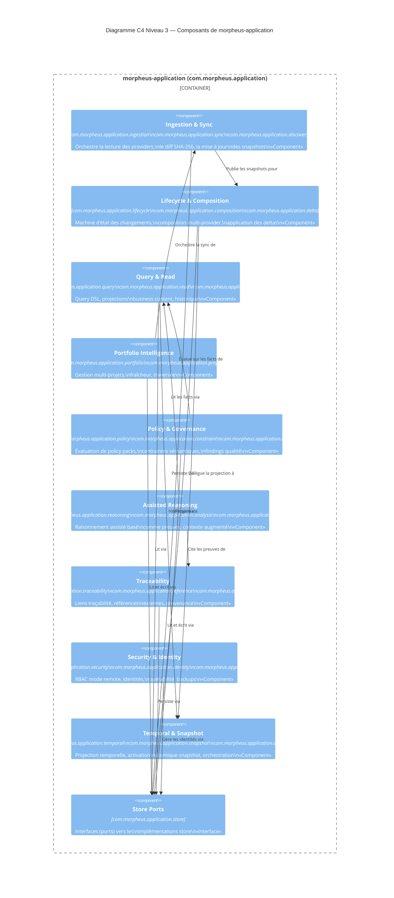
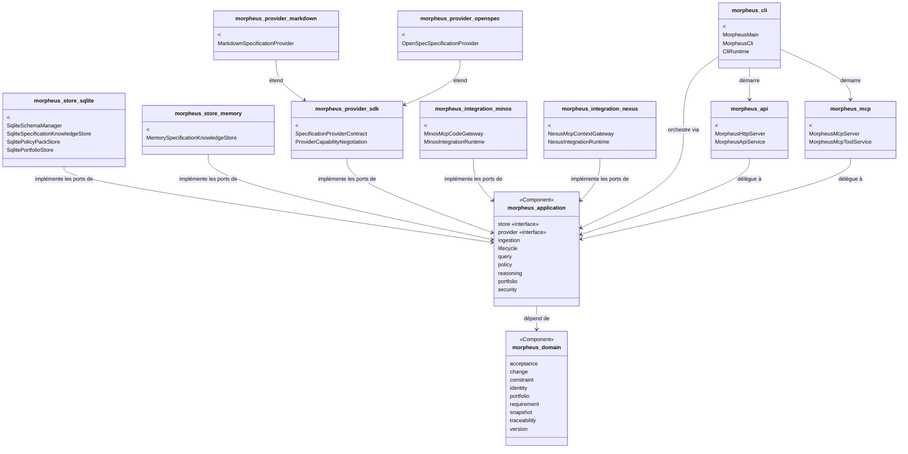

# §5 — Vue des blocs (structure statique)

> **Sources** : `pom.xml` (modules), `docs/developer/ARCHITECTURE.md`,
> structure des packages Java explorée, `morpheus-architecture-tests/`,
> `contracts/public-surfaces.tsv`, `docs/developer/PROVIDER_SDK.md`.

---

## 5.1 Diagramme C4 Container

```mermaid
C4Container
  title Diagramme C4 Niveau 2 — Conteneurs MORPHEUS ENGINE

  Person(utilisateur, "Utilisateur / Agent IA", "Développeur, agent orchestrateur\n«Person»")

  System_Boundary(morpheus, "MORPHEUS ENGINE — processus JVM unique") {
    Container(cli, "CLI Runtime", "Java 21\nmorpheus-cli", "Interface ligne de commande ;\ncommandes verbales sur stdout/stderr\n«interface»")
    Container(mcp, "MCP STDIO Server", "Java 21, MCP SDK 2.0.0\nmorpheus-mcp", "Serveur MCP STDIO ;\n13 familles de tools JSON-RPC\n«adapter»")
    Container(api, "HTTP API Server", "Java 21, jdk.httpserver\nmorpheus-api", "REST local 127.0.0.1:8765\net optionnel HTTPS distant\n«adapter»")
    Container(application, "Couche Application", "Java 21\nmorpheus-application", "Services, orchestration, ports\n28 sous-paquetages\n«Component»")
    Container(domain, "Domaine", "Java 21 pur\nmorpheus-domain", "Modèle métier pur, value objects,\nstate machines — 22 sous-paquetages\n«Component»")
    Container(storeDb, "SQLite Store", "Java 21, sqlite-jdbc 3.53.1.0\nmorpheus-store-sqlite", "Implémentation persistante des ports store ;\n15 migrations versionnées\n«database»")
    Container(storeMem, "Memory Store", "Java 21\nmorpheus-store-memory", "Implémentation mémoire des ports store\n(tests, démarrage rapide)\n«Component»")
    Container(providerSdk, "Provider SDK", "Java 21\nmorpheus-provider-sdk", "Contrats pour providers externes ;\ncapability negotiation\n«interface»")
    Container(providerMd, "Provider Markdown", "Java 21\nmorpheus-provider-markdown", "Ingestion Structured Markdown\n«adapter»")
    Container(providerOs, "Provider OpenSpec", "Java 21\nmorpheus-provider-openspec", "Ingestion specs OpenAPI\n«adapter»")
    Container(integMinos, "Adaptateur MINOS", "Java 21\nmorpheus-integration-minos", "Passerelle MCP STDIO vers MINOS\n«adapter»")
    Container(integNexus, "Adaptateur NEXUS", "Java 21\nmorpheus-integration-nexus", "Passerelle MCP STDIO vers NEXUS\n«adapter»")
  }

  ContainerDb(sqlite, "Fichier SQLite", "SQLite 3.x\n%LOCALAPPDATA%\\MORPHEUS\\data", "Base locale persistante\n«database»")

  System_Ext(workspace, "Workspace Projet", "Fichiers Markdown, OpenAPI, Git\n«Software System»")
  System_Ext(minos, "MINOS ENGINE", "Code intelligence\n«Software System»")
  System_Ext(nexus, "NEXUS ENGINE", "Context selection\n«Software System»")

  Rel(utilisateur, cli, "Utilise", "STDIO terminal")
  Rel(utilisateur, api, "Interroge", "HTTP/HTTPS REST")
  Rel(utilisateur, mcp, "Interroge via tools", "MCP STDIO JSON-RPC")

  Rel(cli, application, "Délègue les usecases", "appel Java direct")
  Rel(mcp, application, "Délègue les usecases", "appel Java direct")
  Rel(api, application, "Délègue les usecases", "appel Java direct")

  Rel(application, domain, "Opère sur le modèle", "appel Java direct")
  Rel(application, storeDb, "Persiste via port store", "port Java")
  Rel(application, storeMem, "Utilise (tests/démarrage)", "port Java")
  Rel(application, providerMd, "Ingère via port provider", "port Java")
  Rel(application, providerOs, "Ingère via port provider", "port Java")
  Rel(application, integMinos, "Délègue la code intelligence", "port Java")
  Rel(application, integNexus, "Délègue la sélection de contexte", "port Java")

  Rel(storeDb, sqlite, "Lit et écrit", "JDBC SQLite WAL")
  Rel(providerMd, workspace, "Lit les fichiers source", "Filesystem")
  Rel(providerOs, workspace, "Lit les specs OpenAPI", "Filesystem")
  Rel(integMinos, minos, "Appelle via MCP", "MCP STDIO sous-processus")
  Rel(integNexus, nexus, "Appelle via MCP", "MCP STDIO sous-processus")

  UpdateLayoutConfig($c4ShapeInRow="4", $c4BoundaryInRow="1")
```

---

## 5.2 Diagramme C4 Component — Couche Application

Le module `morpheus-application` est le seul conteneur complexe justifiant un
détail Component. Les 28 sous-paquetages sont regroupés par domaine fonctionnel.

---

## 5.3 Détail des modules Maven

### Modules de domaine et d'application

| Module | Package racine | Responsabilité | Dépendances directes |
|--------|---------------|----------------|---------------------|
| `morpheus-domain` | `com.morpheus.domain` | Modèle métier pur : entités, value objects, state machines (22 paquetages) | Aucune dépendance interne |
| `morpheus-application` | `com.morpheus.application` | Services applicatifs, orchestration, ports store et provider (28 paquetages) | `morpheus-domain` |

### Modules adaptateurs — surfaces

| Module | Package racine | Responsabilité | Dépendances directes |
|--------|---------------|----------------|---------------------|
| `morpheus-cli` | `com.morpheus.cli` | Launcher JVM, dispatcher CLI, 24 classes | `morpheus-application`, `morpheus-api`, `morpheus-mcp` |
| `morpheus-api` | `com.morpheus.api` | Serveur HTTP `jdk.httpserver`, 25 classes, 50+ endpoints | `morpheus-application` |
| `morpheus-mcp` | `com.morpheus.mcp` | Serveur MCP STDIO, 13 familles de tools (16 classes) | `morpheus-application`, MCP SDK |

### Modules adaptateurs — stores

| Module | Package racine | Responsabilité | Dépendances directes |
|--------|---------------|----------------|---------------------|
| `morpheus-store-sqlite` | `com.morpheus.store.sqlite` | Implémentation SQLite des ports store ; 17 classes ; runner de migrations SHA-256 | `morpheus-application`, `sqlite-jdbc` |
| `morpheus-store-memory` | `com.morpheus.store.memory` | Implémentation mémoire des mêmes ports ; 11 classes | `morpheus-application` |

### Modules adaptateurs — providers

| Module | Package racine | Responsabilité | Dépendances directes |
|--------|---------------|----------------|---------------------|
| `morpheus-provider-sdk` | `com.morpheus.provider.sdk` | Contrats et base SDK pour plugins externes | `morpheus-application` |
| `morpheus-provider-markdown` | `com.morpheus.provider.markdown` | Ingestion Structured Markdown | `morpheus-provider-sdk` |
| `morpheus-provider-openspec` | `com.morpheus.provider.openspec` | Ingestion specs OpenAPI/YAML | `morpheus-provider-sdk` |
| `morpheus-provider-synthetic` | `com.morpheus.provider.synthetic` | Provider de données synthétiques (tests) | `morpheus-provider-sdk` |
| `morpheus-provider-reference` | `com.morpheus.provider.reference` | Plugin de référence — template pour SDK externe | `morpheus-provider-sdk` |
| `morpheus-provider-testkit` | `com.morpheus.provider.testkit` | Testkit JUnit pour providers | `morpheus-provider-sdk` |

### Modules adaptateurs — intégrations externes

| Module | Package racine | Responsabilité | Dépendances directes |
|--------|---------------|----------------|---------------------|
| `morpheus-integration-minos` | `com.morpheus.integration.minos` | Passerelle MCP STDIO vers MINOS ENGINE (7 classes) | `morpheus-application`, MCP SDK |
| `morpheus-integration-nexus` | `com.morpheus.integration.nexus` | Passerelle MCP STDIO vers NEXUS ENGINE (7 classes, symétrique) | `morpheus-application`, MCP SDK |

### Module de tests d'architecture

| Module | Responsabilité |
|--------|----------------|
| `morpheus-architecture-tests` | ArchUnit — règles d'isolation des couches ; contrats store memory/SQLite ; gates M19 à M28 (~65 classes) |

---

## 5.4 Diagramme UML des couches (dépendances inter-modules)

---

## 5.5 Surfaces publiques (résumé)

Le manifeste `contracts/public-surfaces.tsv` liste pour chaque capacité son
exposition sur les trois surfaces. Garantie : **surface parity** — toute
capacité accessible via CLI est accessible via MCP et HTTP.

Familles de capacités exposées :
- Product (sync, version, health)
- Provider plugins (discover, probe)
- Portfolio Intelligence
- Query DSL + Saved Views + Exports
- Policy Packs + Governance
- Lifecycle controlé (transitions, mutations)
- Traceability + External References
- Assisted Reasoning
- Remote server (mode équipe)
- Composition multi-provider
- Contexte augmenté (Jarvis/orchestration)
