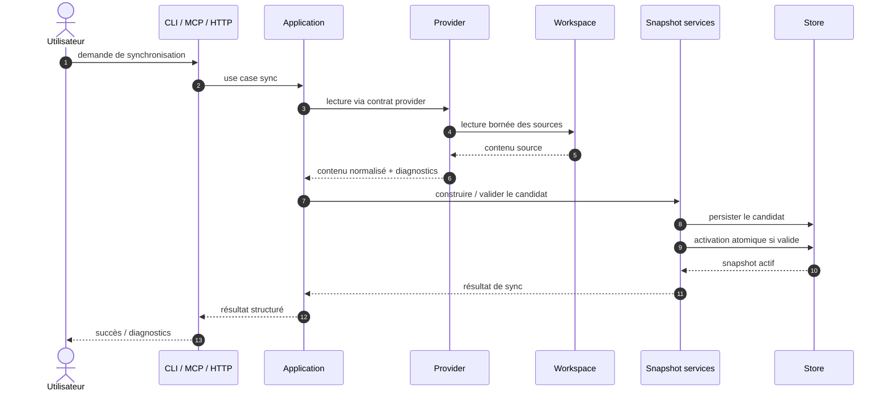
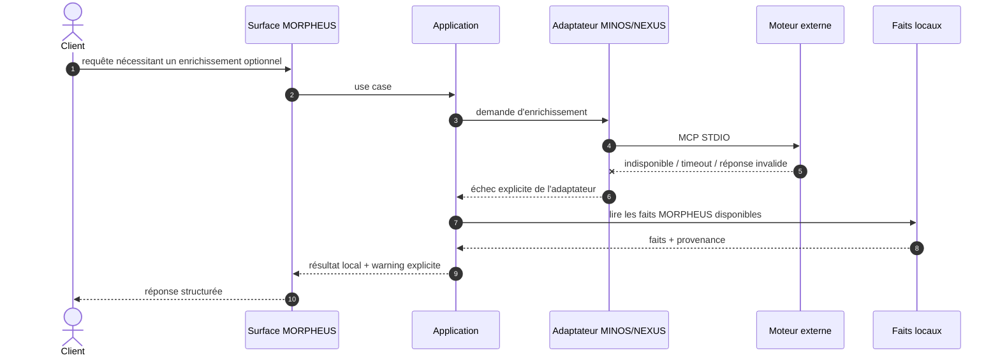
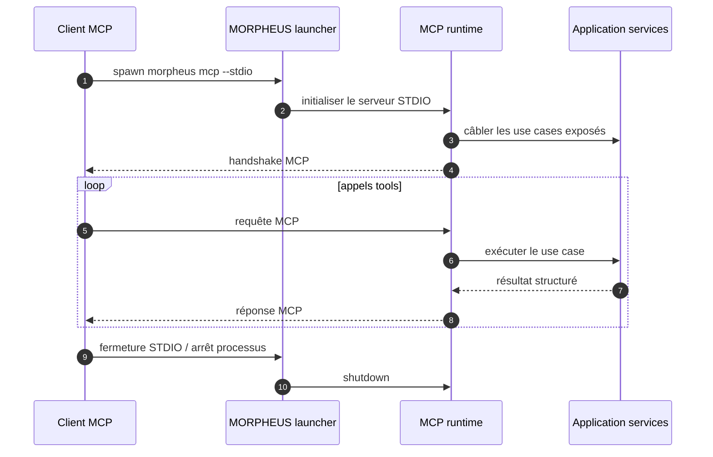
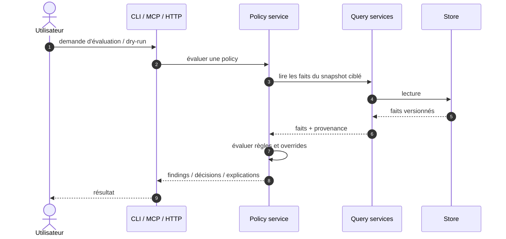
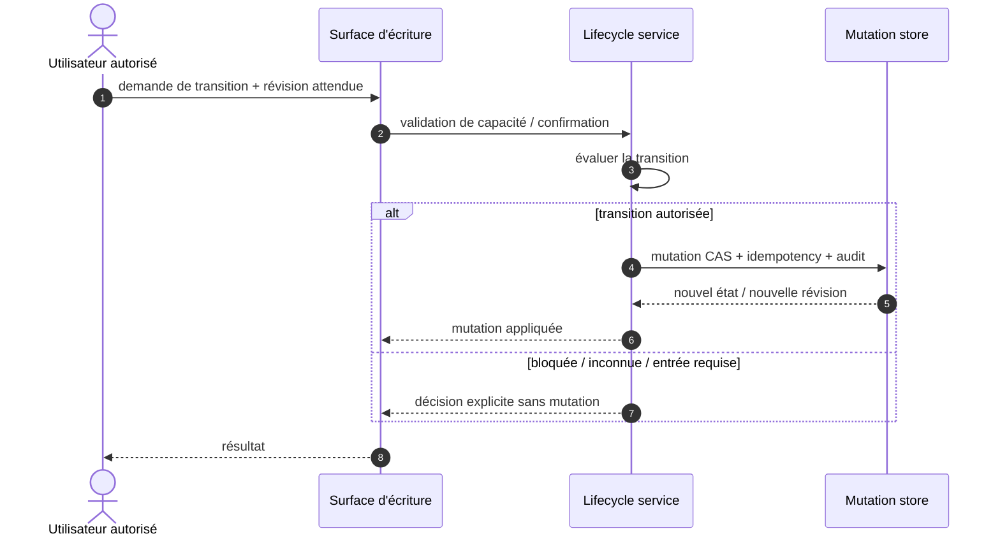

# §6 — Vue d'exécution (scénarios runtime)

> Cette section décrit les interactions architecturales stables. Les noms de
> commandes, endpoints, classes et tools détaillés restent autoritatifs dans les
> contrats et le code ; ils ne sont pas dupliqués ici lorsqu'ils sont volatils.

---

## 6.1 Synchronisation d'un projet



Invariants :

```text
provider input != published fact until validation
candidate failure != partial ACTIVE exposure
PROPOSED never leaks into CURRENT
activation == atomic
```

---

## 6.2 Défaillance d'une intégration externe



```text
adapter failure != fact loss
external enrichment != published local fact
optional integration != startup dependency
```

---

## 6.3 Démarrage MCP natif

Le mode MCP public de la baseline M28 est lancé en STDIO, par exemple via :

```text
morpheus mcp --stdio
```



La version **2.0.0** mentionnée dans le build est la version du **SDK Java MCP**,
pas un numéro de version du protocole à afficher comme contrat produit.

---

## 6.4 Évaluation de gouvernance en lecture



Invariants :

```text
dry-run != mutation
policy recommendation != domain fact
warning != blocker unless policy says so
```

---

## 6.5 Mutation lifecycle contrôlée



```text
ALLOWED != applied
stale revision != overwrite
idempotent retry != duplicate mutation
transition evaluation != lifecycle mutation
```
