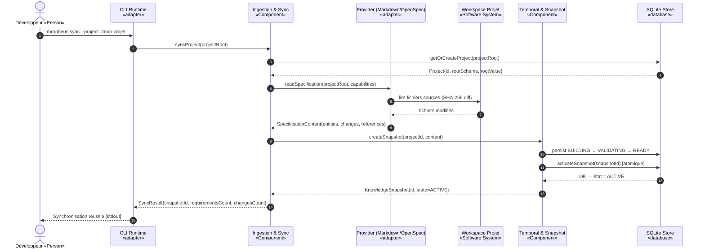
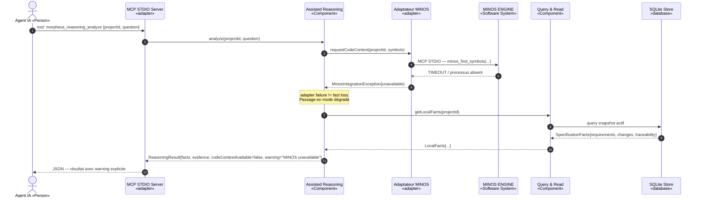
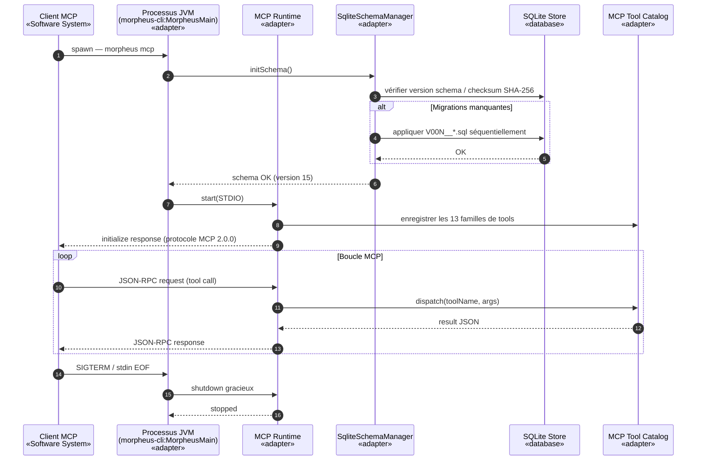
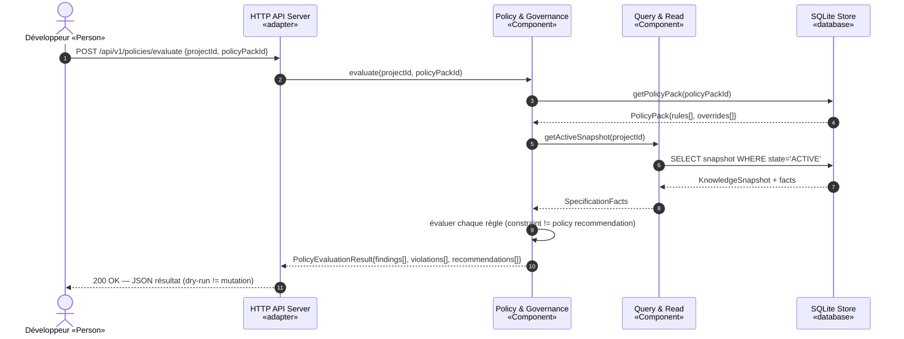

# §6 — Vue d'exécution (scénarios runtime)

> **Sources** : `docs/developer/ARCHITECTURE.md`, `docs/developer/MCP.md`,
> `docs/developer/API.md`, `docs/openapi/morpheus-v1.yaml`,
> `morpheus-application/`, `morpheus-store-sqlite/`.
>
> Les noms sont strictement cohérents avec la §5.

---

## 6.1 Scénario nominal — Synchronisation d'un projet

**Description** : un développeur demande la synchronisation d'un projet via
la CLI. MORPHEUS lit le workspace, construit un snapshot, le valide et l'active.

---

## 6.2 Scénario d'erreur — Défaillance d'un adaptateur externe (MINOS)

**Description** : un agent IA demande une analyse de code intelligence ; MINOS
est indisponible. MORPHEUS répond avec les faits locaux disponibles et signale
explicitement l'absence de contexte code.

---

## 6.3 Scénario d'exploitation — Démarrage en mode MCP STDIO

**Description** : un client MCP (ex. Claude Desktop) lance MORPHEUS comme
sous-processus. MORPHEUS initialise le store SQLite (migrations si nécessaire),
enregistre les tools et entre en boucle d'écoute.

---

## 6.4 Scénario d'exploitation — Évaluation d'une policy pack

**Description** : un développeur évalue une policy pack active sur l'état
courant d'un projet via l'API HTTP.

