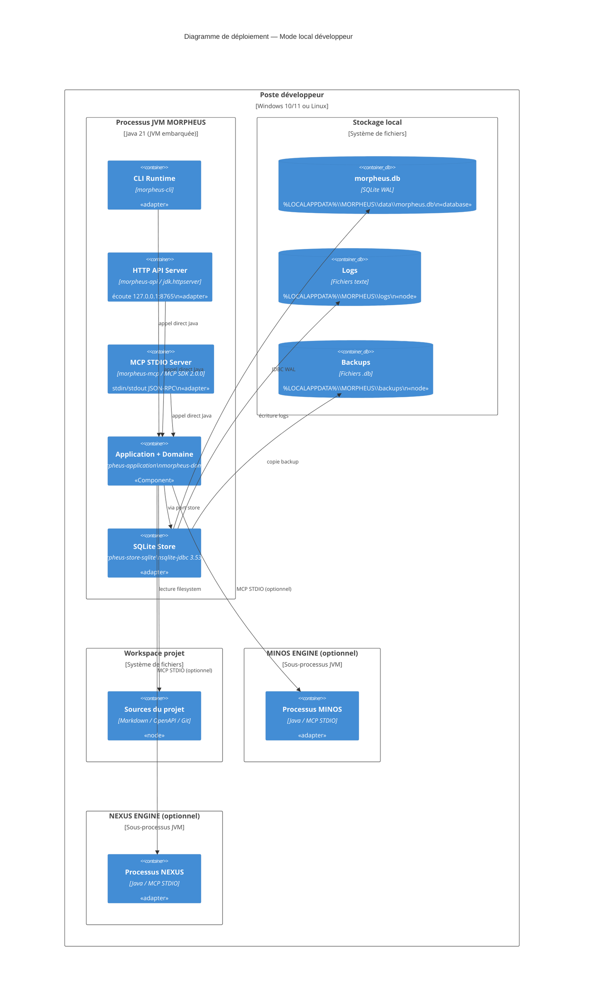
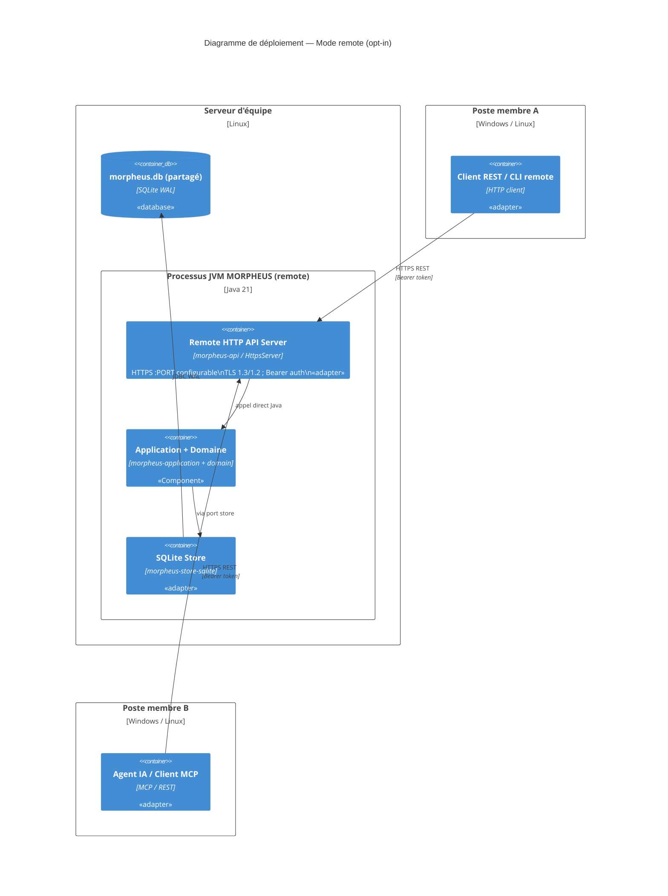

# §7 — Vue de déploiement

> **Sources** : `distribution/build-portable.ps1`, `distribution/build-portable.sh`,
> `distribution/windows/MORPHEUS.iss`, `distribution/build-release.ps1`,
> `.github/workflows/ci.yml`, `docs/user/INSTALLATION.md`,
> `docs/developer/BUILD_AND_TEST.md`, ADR-0027, ADR-0061.

---

## 7.1 Environnements

| Environnement | Description | Configuration |
|--------------|-------------|---------------|
| **Développement local** | Poste Windows ou Linux du développeur | Maven + JDK 21 ; SQLite local |
| **CI GitHub Actions** | Matrix Ubuntu + Windows | Runners `ubuntu-latest` + `windows-latest` ; Java 21 Temurin |
| **Distribution portable** | Archive `.zip` (Windows) ou `.tar.gz` (Linux) | JVM embarquée via jpackage ; pas de JDK requis |
| **Installation Windows** | Installateur `.exe` via Inno Setup | `%LOCALAPPDATA%\Programs\MORPHEUS` ; sans droits admin |
| **Mode remote (opt-in)** | Serveur d'équipe sur machine Linux | HTTPS, TLS 1.3, RBAC, backups |

---

## 7.2 Diagramme de déploiement — Mode local (nominal)

---

## 7.3 Diagramme de déploiement — Mode remote (opt-in équipe)

---

## 7.4 Artefacts de distribution

| Artefact | Format | Cible | Script de build |
|----------|--------|-------|-----------------|
| `morpheus-<v>-windows-x64.zip` | Archive ZIP | Windows — extraction directe | `distribution/build-portable.ps1` |
| `morpheus-<v>-linux-x64.tar.gz` | Archive tar.gz | Linux — extraction directe | `distribution/build-portable.sh` |
| `MORPHEUS-<v>-windows-x64-setup.exe` | Installateur Inno Setup | Windows — setup guidé, sans droits admin | `distribution/build-windows-installer.ps1` |
| SBOM CycloneDX | JSON (1.6) | Conformité, audit | `mvnw verify` (cyclonedx-maven-plugin) |
| SHA-256 checksums | `.sha256` | Vérification d'intégrité release | `distribution/build-release.ps1/.sh` |

---

## 7.5 Protocoles et zones réseau

| Flux | Source | Destination | Protocole | Port | Confidentialité |
|------|--------|-------------|-----------|------|-----------------|
| CLI | Terminal utilisateur | Processus JVM | STDIO | — | Locale |
| MCP | Client MCP (Claude Desktop) | Processus JVM | MCP STDIO JSON-RPC | — | Locale (sous-processus) |
| HTTP local | Navigateur / Agent IA | Processus JVM | HTTP/1.1 | 8765 (127.0.0.1) | Loopback uniquement |
| HTTP remote | Membres d'équipe / Agent IA | Serveur JVM | HTTPS / TLS 1.3 | Configurable | Réseau d'entreprise |
| MINOS | Processus JVM | Sous-processus MINOS | MCP STDIO | — | Locale |
| NEXUS | Processus JVM | Sous-processus NEXUS | MCP STDIO | — | Locale |
| SQLite | Processus JVM | Fichier local | JDBC (sqlite-jdbc) | — | Locale |

---

## 7.6 Variables d'environnement de déploiement

| Variable | Rôle | Par défaut |
|----------|------|-----------|
| `MORPHEUS_DATA_DIR` | Répertoire base de données | `%LOCALAPPDATA%\MORPHEUS\data` (Windows) / `$XDG_DATA_HOME/morpheus` (Linux) |
| `MORPHEUS_CONFIG_DIR` | Configuration | `%LOCALAPPDATA%\MORPHEUS\config` |
| `MORPHEUS_LOGS_DIR` | Logs | `%LOCALAPPDATA%\MORPHEUS\logs` |
| `MORPHEUS_BACKUPS_DIR` | Backups SQLite | `%LOCALAPPDATA%\MORPHEUS\backups` |
| `MORPHEUS_DB` | Chemin explicite du fichier SQLite | — (calculé depuis `MORPHEUS_DATA_DIR`) |
| `MORPHEUS_MINOS_JAR` | Chemin du JAR MINOS | — (MINOS désactivé si absent) |
| `MORPHEUS_MINOS_HOME` | Répertoire racine MINOS | — |
| `MORPHEUS_NEXUS_JAR` | Chemin du JAR NEXUS | — (NEXUS désactivé si absent) |
| `MORPHEUS_NEXUS_HOME` | Répertoire racine NEXUS | — |
