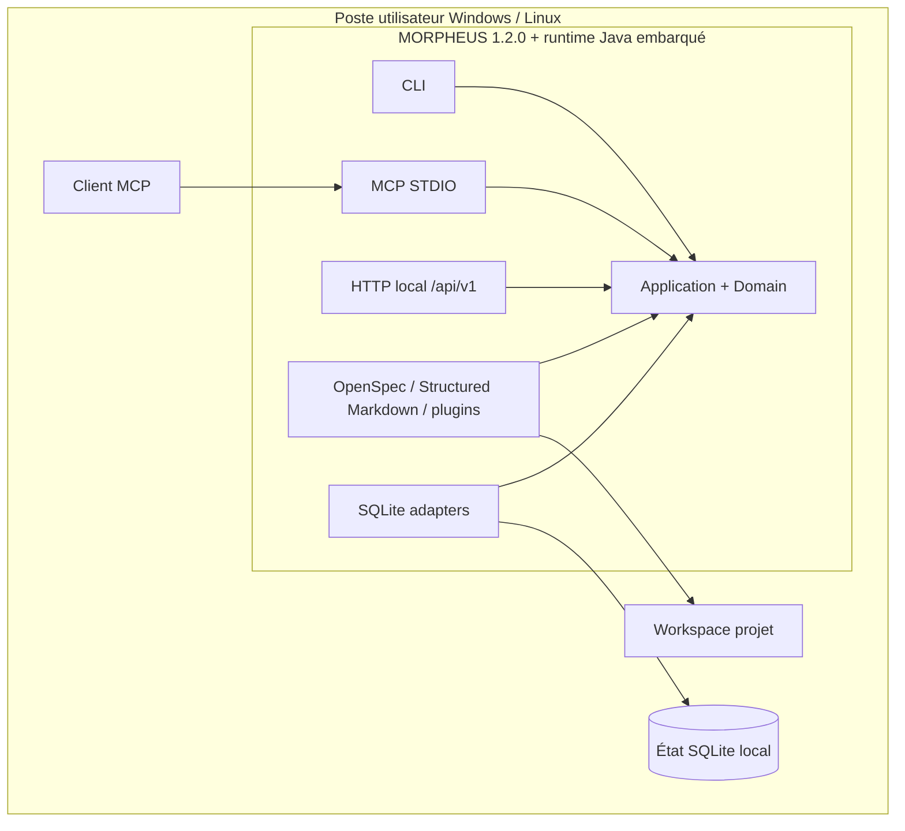
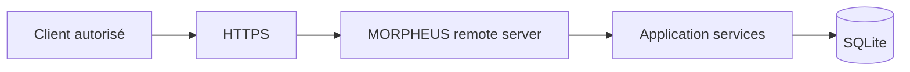

# §7 — Vue de déploiement

> **Sources actives** : `distribution/`, `docs/user/INSTALLATION.md`,
> `docs/developer/BUILD_AND_TEST.md`, `.github/workflows/ci.yml`, ADR-0027,
> ADR-0061, ADR-0094 et preuves R3.

---

## 7.1 Environnements

| Environnement | Description | Baseline |
|---------------|-------------|----------|
| Développement | Poste Windows ou Linux | JDK 21 + Maven Wrapper |
| Qualification publique | GitHub Actions exact-head | Ubuntu + Windows, Java 21 Temurin |
| Distribution Windows | Archive portable + installateur per-user | Runtime Java embarqué |
| Distribution Linux | Archive portable | Runtime Java embarqué |
| Serveur d'équipe opt-in | Exécution du mode remote | HTTPS, Bearer auth, RBAC, concurrence bornée |

Docker n'est pas requis pour l'exécution locale, le serveur MCP natif ou la
distribution MORPHEUS 1.2.0.

---

## 7.2 Déploiement local



Les workspaces peuvent contenir des sources **OpenSpec**, Structured Markdown
ou d'autres formats pris en charge par un provider. OpenSpec ne désigne pas
OpenAPI.

---

## 7.3 État persistant

Le programme et l'état utilisateur sont séparés : une mise à niveau de
l'application ne doit pas réinitialiser implicitement la connaissance locale.

Sur Windows, la distribution per-user utilise notamment :

```text
%LOCALAPPDATA%\Programs\MORPHEUS   # programme
%LOCALAPPDATA%\MORPHEUS\data       # données
%LOCALAPPDATA%\MORPHEUS\config     # configuration
%LOCALAPPDATA%\MORPHEUS\backups    # sauvegardes
```

Sous Linux, l'état suit les conventions XDG définies par la distribution.

---

## 7.4 Mode serveur d'équipe



Le mode remote est explicitement activé. Il ajoute une frontière réseau et
applique TLS, authentification Bearer, RBAC et bornes de concurrence. Il ne
transforme pas les intégrations MINOS/NEXUS en dépendances obligatoires.

---

## 7.5 Clients MCP

Le serveur MCP est lancé nativement en STDIO. Les intégrations clients livrées
avec M28 restent **opt-in** : MORPHEUS peut préparer ou modifier une entrée qu'il
possède, mais ne doit pas écraser une configuration `morpheus` étrangère.

Clients ciblés par la baseline M28 :

- GitHub Copilot dans JetBrains ;
- GitHub Copilot CLI ;
- Claude Code ;
- Claude Desktop ;
- OpenAI Codex.

---

## 7.6 Distribution et release

La release stable documentée est **1.2.0** (`v1.2.0`). Les artefacts publiés
sont qualifiés à partir de la release exacte et accompagnés de leurs preuves
d'intégrité. Les noms précis d'artefacts et checksums restent documentés dans
`docs/validation/VALIDATION_R3.md` et `docs/release/RELEASE_NOTES_1.2.0.md`.

---

## 7.7 Contraintes de déploiement

```text
runtime Java embarqué
program != persistent state
upgrade != reset knowledge store
local MCP != network service
remote mode == explicit opt-in
foreign MCP config != overwrite
release tag == immutable release reference
```
