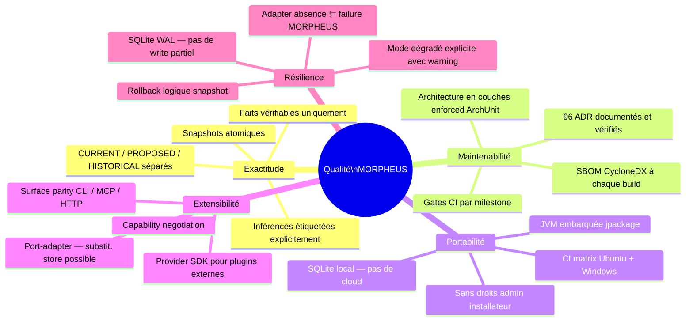

# §10 — Exigences de qualité

> **Sources** : `docs/architecture/overview.md` (§2 objectifs architecturaux),
> `docs/adr/README.md` (invariants), `docs/developer/ARCHITECTURE.md`,
> `.github/workflows/ci.yml`, `morpheus-architecture-tests/`,
> `docs/validation/` (preuves de gate M19–M28).

---

## 10.1 Arbre de qualité

---

## 10.2 Scénarios de qualité

### Format de chaque scénario

| Champ | Description |
|-------|-------------|
| **Stimulus** | Événement déclencheur |
| **Environnement** | Contexte d'exécution |
| **Réponse attendue** | Comportement observable |
| **Mesure** | Indicateur objectif |
| **Seuil** | Valeur cible |
| **Vérification** | Méthode de validation |
| **Propriétaire** | Responsable de la qualité |

---

### Q-EX-01 — Exactitude : aucun fait inventé

| Champ | Valeur |
|-------|--------|
| **Qualité** | Exactitude |
| **Stimulus** | Un développeur interroge l'état CURRENT d'un requirement dont le workspace source n'a pas été modifié depuis la dernière sync |
| **Environnement** | Mode local, snapshot ACTIVE |
| **Réponse attendue** | MORPHEUS retourne exactement les faits du snapshot actif, sans interpolation ni complétion |
| **Mesure** | Correspondance bit-à-bit entre la sortie MORPHEUS et les fichiers source |
| **Seuil** | 0 divergence tolérée |
| **Vérification** | Tests de contrat `MorpheusApiContractTest` ; invariant « heuristic != published fact » |
| **Propriétaire** | Architecte système |

---

### Q-EX-02 — Exactitude : PROPOSED ne fuit pas dans CURRENT

| Champ | Valeur |
|-------|--------|
| **Qualité** | Exactitude |
| **Stimulus** | Un snapshot BUILDING contenant des changements PROPOSED est en cours de construction |
| **Environnement** | Snapshot ACTIVE en parallèle |
| **Réponse attendue** | Les queries sur le snapshot ACTIVE ne voient aucune donnée PROPOSED |
| **Mesure** | Résultat de la query CURRENT != résultat PROPOSED |
| **Seuil** | 0 fuite tolérée |
| **Vérification** | Tests d'isolation snapshot `morpheus-store-sqlite` + `ChangeLifecycleTest` |
| **Propriétaire** | Architecte système |

---

### Q-MA-01 — Maintenabilité : isolation des couches

| Champ | Valeur |
|-------|--------|
| **Qualité** | Maintenabilité |
| **Stimulus** | Un développeur ajoute une dépendance d'un module `domain` vers un module `adapter` |
| **Environnement** | Build Maven `mvnw verify` |
| **Réponse attendue** | Le build échoue avec une violation ArchUnit |
| **Mesure** | Nombre de violations ArchUnit = 0 en branche principale |
| **Seuil** | 0 violation |
| **Vérification** | `LayerDependencyTest` dans `morpheus-architecture-tests` |
| **Propriétaire** | CI / Architecte |

---

### Q-MA-02 — Maintenabilité : gate de milestone

| Champ | Valeur |
|-------|--------|
| **Qualité** | Maintenabilité |
| **Stimulus** | Une PR est soumise sur `main` avec des changements fonctionnels |
| **Environnement** | GitHub Actions CI (ubuntu + windows) |
| **Réponse attendue** | Le pipeline `ci.yml` exécute `validate-m21.sh/.cmd` et bloque la fusion si un test échoue |
| **Mesure** | Taux de réussite des gates CI = 100 % sur `main` |
| **Seuil** | 100 % |
| **Vérification** | `.github/workflows/ci.yml` ; historique des runs |
| **Propriétaire** | CI |

---

### Q-PO-01 — Portabilité : démarrage sans JDK

| Champ | Valeur |
|-------|--------|
| **Qualité** | Portabilité |
| **Stimulus** | Un utilisateur installe MORPHEUS depuis l'archive ZIP sur une machine Windows sans JDK |
| **Environnement** | Windows 10 ; aucun JDK dans `PATH` |
| **Réponse attendue** | `morpheus --version` fonctionne |
| **Mesure** | Commande exécutée avec succès (code de sortie 0) |
| **Seuil** | 100 % des distributions portables |
| **Vérification** | `distribution/build-portable.ps1` (jpackage) ; test manuel ou automatisé |
| **Propriétaire** | Équipe distribution |

---

### Q-PO-02 — Portabilité : CI cross-platform

| Champ | Valeur |
|-------|--------|
| **Qualité** | Portabilité |
| **Stimulus** | Un build est déclenché sur GitHub Actions |
| **Environnement** | Matrix `ubuntu-latest` + `windows-latest` |
| **Réponse attendue** | Tous les tests passent sur les deux plateformes |
| **Mesure** | Nombre de tests en échec = 0 sur chaque plateforme |
| **Seuil** | 0 échec |
| **Vérification** | `.github/workflows/ci.yml` |
| **Propriétaire** | CI |

---

### Q-EX-01 (changement) — Extensibilité : ajout de provider sans modification du cœur

| Champ | Valeur |
|-------|--------|
| **Qualité** | Extensibilité |
| **Stimulus** | Un développeur tiers crée un nouveau provider (ex. provider Confluence) en utilisant le SDK |
| **Environnement** | `morpheus-provider-sdk` ; aucune modification de `morpheus-domain` ou `morpheus-application` |
| **Réponse attendue** | Le provider est découvert et utilisable via CLI/MCP/HTTP |
| **Mesure** | Aucune ligne modifiée dans `morpheus-domain` ou `morpheus-application` |
| **Seuil** | 0 modification des couches internes |
| **Vérification** | `morpheus-provider-testkit` ; ADR-0090 ; `morpheus-provider-reference` comme référence |
| **Propriétaire** | Architecte SDK |

---

### Q-RE-01 (défaillance) — Résilience : MINOS indisponible

| Champ | Valeur |
|-------|--------|
| **Qualité** | Résilience |
| **Stimulus** | Un agent IA demande une analyse de code intelligence ; MINOS est indisponible (timeout) |
| **Environnement** | Mode local ; `MORPHEUS_MINOS_JAR` configuré mais processus MINOS absent |
| **Réponse attendue** | MORPHEUS retourne les faits locaux disponibles avec un warning explicite `codeContextAvailable=false` |
| **Mesure** | Aucun crash du processus MORPHEUS ; réponse structurée avec warning |
| **Seuil** | 100 % des appels en mode dégradé doivent retourner une réponse structurée |
| **Vérification** | `MinosIntegrationException` ; tests dans `morpheus-integration-minos` |
| **Propriétaire** | Architecte intégrations |

---

### Q-RE-02 (défaillance) — Résilience : crash du processus pendant une sync

| Champ | Valeur |
|-------|--------|
| **Qualité** | Résilience |
| **Stimulus** | Le processus JVM est tué pendant l'écriture d'un snapshot en état BUILDING |
| **Environnement** | Mode local ; SQLite WAL |
| **Réponse attendue** | Au redémarrage, le snapshot ACTIVE précédent est intact ; le snapshot BUILDING est en état FAILED ou absent |
| **Mesure** | Base de données cohérente ; pas de snapshot ACTIVE corrompu |
| **Seuil** | 0 corruption de snapshot ACTIVE |
| **Vérification** | `SqliteConcurrencyHardeningTest` ; mode WAL SQLite |
| **Propriétaire** | Architecte stockage |

---

## 10.3 Scénarios manquants — à compléter

Les scénarios suivants sont identifiés comme manquants et doivent être ajoutés :

| ID | Qualité | Sujet | Priorité |
|----|---------|-------|----------|
| Q-MA-03 | Maintenabilité | Durée de build < N minutes sur CI — seuil non documenté | Haute |
| Q-EX-03 | Exactitude | Cohérence des sorties CLI / MCP / HTTP pour la même requête | Haute |
| Q-PO-03 | Portabilité | Fonctionnement sur macOS — non couvert en CI actuellement | Moyenne |
| Q-SE-01 | Sécurité | Isolation filesystem — MORPHEUS ne lit que le workspace déclaré | Haute |
| Q-PE-01 | Performance | Latence de sync pour un projet de N fichiers — seuil non documenté | Moyenne |
| Q-PE-02 | Performance | Latence de démarrage JVM < X ms | Moyenne |

> **Hypothèse à valider** : les seuils de performance (latence sync, taille de
> base de données, démarrage) ne sont pas documentés de manière formelle dans
> le dépôt — à déduire des gates M19.
