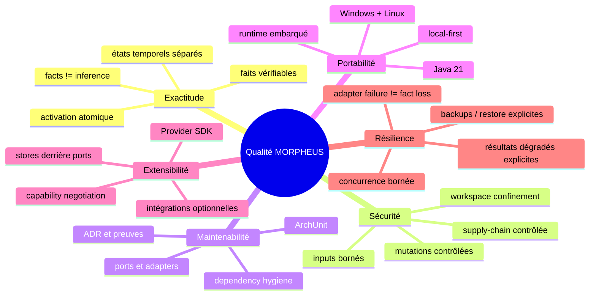

# §10 — Exigences de qualité

> **Sources actives** : ADR, `morpheus-architecture-tests/`, tests de modules,
> `.github/workflows/ci.yml`, preuves `docs/validation/` et scénarios détaillés
> [`../quality/scenarios.md`](../quality/scenarios.md).

---

## 10.1 Arbre de qualité



---

## 10.2 Scénarios prioritaires

### Q-AC-01 — Exactitude des faits publiés

| Champ | Valeur |
|-------|--------|
| Stimulus | Une requête lit un snapshot publié |
| Environnement | Même projet, même snapshot, mêmes paramètres |
| Réponse attendue | Résultat déterministe construit uniquement à partir des faits et preuves applicables |
| Mesure | Écart avec la fixture / projection attendue |
| Seuil | 0 divergence sémantique |
| Vérification | Tests domaine/application/store et contrats de surfaces |

### Q-AC-02 — Isolation CURRENT / PROPOSED

| Champ | Valeur |
|-------|--------|
| Stimulus | Un candidat PROPOSED est construit pendant qu'un snapshot CURRENT est servi |
| Réponse attendue | Aucun fait PROPOSED ne fuit dans la lecture CURRENT |
| Mesure | Nombre de fuites observées |
| Seuil | 0 |
| Vérification | Tests temporal/snapshot et stores |

### Q-SE-01 — Confinement filesystem

| Champ | Valeur |
|-------|--------|
| Stimulus | Une entrée tente de résoudre un fichier hors des racines autorisées |
| Réponse attendue | Refus avant lecture du contenu |
| Mesure | Accès hors racine |
| Seuil | 0 |
| Vérification | `AllowedWorkspaceRootsTest`, `SafeWorkspaceFileResolverTest` et régressions providers |

### Q-SE-02 — Entrées externes bornées

| Champ | Valeur |
|-------|--------|
| Stimulus | Un provider ou payload externe dépasse un budget défini |
| Réponse attendue | Rejet explicite et borné, sans épuisement non contrôlé des ressources |
| Mesure | Acceptation au-delà de la limite |
| Seuil | 0 |
| Vérification | `ProviderIngestionBudgetTest`, tests JSON et providers |

### Q-MA-01 — Isolation des couches

| Champ | Valeur |
|-------|--------|
| Stimulus | Une modification introduit une dépendance interdite |
| Environnement | Build / tests d'architecture |
| Réponse attendue | La qualification échoue |
| Mesure | Violations d'architecture |
| Seuil | 0 |
| Vérification | `morpheus-architecture-tests` / ArchUnit |

### Q-MA-02 — Qualification exact-head

| Champ | Valeur |
|-------|--------|
| Stimulus | Une pull request déclenche `MORPHEUS CI` |
| Environnement | Ubuntu + Windows |
| Réponse attendue | Le même head de PR est qualifié par le gate public d'intégrité |
| Mesure | Jobs en échec / head différent |
| Seuil | 0 |
| Vérification | `.github/workflows/ci.yml` et metadata du run |

Le workflow actuel appelle le gate **M21** avec la version **1.2.0**. Ce nom est
intentionnel et ne doit pas être remplacé automatiquement par le dernier numéro
de milestone fonctionnel.

### Q-PO-01 — Distribution sans JDK utilisateur

| Champ | Valeur |
|-------|--------|
| Stimulus | Lancement d'une distribution publiée sur une machine sans JDK utilisateur |
| Réponse attendue | MORPHEUS démarre avec son runtime embarqué |
| Mesure | Smoke test de l'artefact |
| Seuil | PASS pour les plateformes publiées |
| Vérification | Preuves R3 / scripts de distribution |

### Q-EX-01 — Provider externe sans contamination du cœur

| Champ | Valeur |
|-------|--------|
| Stimulus | Un provider compatible est développé avec le Provider SDK |
| Réponse attendue | Il s'intègre derrière les contrats SDK sans introduire de types spécifiques dans domain/application |
| Mesure | Violations de frontière |
| Seuil | 0 |
| Vérification | Provider testkit + tests d'architecture |

### Q-RE-01 — Intégration optionnelle indisponible

| Champ | Valeur |
|-------|--------|
| Stimulus | MINOS ou NEXUS est indisponible |
| Réponse attendue | Les faits locaux restent accessibles ; l'absence d'enrichissement est explicite |
| Mesure | Perte de disponibilité des faits locaux |
| Seuil | 0 |
| Vérification | Tests des intégrations et services consommateurs |

---

## 10.3 Performance

Les budgets de performance introduits au milestone M19 sont des preuves
exécutables et doivent rester reliés à leurs fixtures/tests. Cette documentation
n'invente pas de seuil de latence ou de démarrage non présent dans une preuve.

Règle :

```text
measured budget > undocumented expectation
fixture + threshold + test > prose estimate
```

Si un nouveau SLO produit est requis, il doit être mesurable, versionné et
qualifié avant d'être présenté comme garanti.

---

## 10.4 Portabilité

Plateformes qualifiées par la baseline actuelle :

```text
Windows
Linux
```

macOS n'est pas déclaré supporté par simple analogie avec Linux. Son ajout doit
être une décision produit accompagnée de packaging et de qualification dédiés.

---

## 10.5 Traçabilité de la qualité

Chaque exigence de qualité significative doit pointer vers au moins une preuve
exécutable ou une validation de release :

```text
quality scenario
  -> ADR / invariant
  -> test / architecture test / gate
  -> validation exact-head
  -> release evidence when applicable
```

Le nombre de tests, de classes ou d'ADR est une métrique d'inventaire, pas un
objectif qualité en soi.
