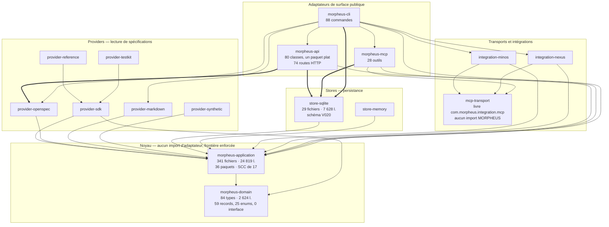

# Architecture observée

Découpage **réellement observé** à la révision `20cf2e0`, reconstruit à la main depuis les `import` en tête de fichier, module par module. Ce document décrit ce que le code fait, pas ce que la documentation annonce ; les écarts entre les deux sont des constats (`AUD-ARC-*`, `AUD-TRV-05`).

**Méthode et limite** — pas de graphe d'appels, pas de bytecode : aucun build n'a pu tourner (voir « Angles morts » dans `README.md`). Les arêtes ci-dessous viennent de `grep -rhoP '(?<=^import )com\.morpheus\.[a-z0-9_.]+'` par module, confronté aux `<dependency>` de chaque `pom.xml`. Contrôle effectué : aucune référence pleinement qualifiée inter-module n'est inlinée hors ligne d'`import` (0 résultat). Reste aveugle aux constantes inlinées par `javac`, aux dépendances par génériques et annotations, et aux dépendances transitives.

## Vue d'ensemble

18 modules déclarés dans le `pom.xml` racine, 16 avec des sources principales (`morpheus-architecture-tests` et `morpheus-coverage-report` n'ont que du test). L'intention est hexagonale et **elle est tenue au niveau des modules** : `domain` et `application` n'importent aucun adaptateur, et la règle ArchUnit qui l'enforce existe (`LayerDependencyTest`).

Les arêtes épaissies sont les **exceptions bornées** par ADR-0109 : un adaptateur de transport atteint directement `store-sqlite`, et `api` atteint directement `provider-openspec`. Les arêtes vers `domain` depuis les providers, les stores et les adaptateurs existent aussi ; elles sont omises du diagramme pour la lisibilité.

## Ce qui tient

- **La frontière du noyau.** `domain` n'importe que `com.morpheus.domain` ; `application` n'importe que `domain`. Aucun cycle inter-module.
- **`mcp-transport` est réellement isolé** : zéro import d'un autre paquet MORPHEUS, ce qui en fait un socle réutilisable par MINOS, NEXUS et `mcp`.
- **Les invariants de construction sont dans le domaine**, pas dans les services : `ConstraintBlockingPolicy` porte son prédicat, les 59 records valident à la construction.
- **Les racines de composition sont nommées** (ADR-0109, 32 noms) et la liste ne fait que rétrécir.
- **`provider-sdk` respecte sa frontière de fait** : son POM ne déclare que `domain` et `application`, ses imports s'y limitent — même si aucune règle ArchUnit ne le prend pour sujet (`AUD-ARC-08`).

## Ce qui ne tient pas

**Le découpage est tenu entre modules, pas à l'intérieur.** Quatre modules — `api` (80 classes), `cli` (28), `store-sqlite` (29), `mcp` (20) — n'ont **qu'un seul paquet, plat**. Conséquence directe : aucune frontière intra-module n'est exprimable par une règle de tranches ArchUnit, et les gates maintiennent à la place des **listes de noms de classes** (`AdapterCompositionRootArchitectureTest` énumère 32 noms ; `HttpRoutesTransportBoundaryArchitectureTest` classe les routeurs en trois groupes nommés). La maintenance devient proportionnelle au nombre de classes, pas au nombre de règles (`AUD-ARC-06`).

**`morpheus-application` contient une composante fortement connexe de 17 paquets sur 36.** `composition`, `context`, `ingestion`, `operability`, `orchestration`, `policy`, `quality`, `query`, `query.dsl`, `query.saved`, `read`, `reference`, `security`, `snapshot`, `store`, `sync`, `traceability` sont mutuellement atteignables. Six paires mutuelles directes. La cause est unique et identifiable : `application.store` est à la fois le paquet des ports (10 interfaces) **et** le vocabulaire d'exception de toute la couche (`EntityNotFoundException`, `EntityStateException`, `KnowledgeStoreException`), ce qui referme la plupart des cycles. ADR-0109 mesure 167 cycles et reporte explicitement la règle (`AUD-ARC-03`).

**Le cœur n'est pas neutre technologiquement.** `morpheus-application` — la couche qui définit les ports — fait du `java.nio.file` direct dans 10 fichiers et du HTTP sortant dans `UpdateDiscoveryService`. Aucun port d'infrastructure (`FileSystemPort`, `Clock`, `HttpPort`) n'existe. L'interdit textuel sur `java.net.http` / `java.sql` / `ProcessBuilder` ne couvre que 2 des 36 paquets (`AUD-ARC-01`).

**Le domaine est un vocabulaire, pas un modèle de comportement.** 59 records et 25 enums, **zéro interface**, pour 9,4 fois moins de lignes que l'application. Aucune stratégie ni variation de comportement ne peut y vivre : toute règle métier devient une méthode d'un service applicatif — ce qui alimente directement la SCC ci-dessus (`AUD-ARC-13`).

**Le chemin d'ingestion principal n'a aucun port.** `OpenSpecProjectContentReader` est une classe concrète sans interface, instanciée en dur par `api` et `cli`, avec le nom de répertoire `Path.of("openspec")` écrit dans le service d'API. La capacité d'écriture centrale est verrouillée sur un seul provider, et `ProviderAntiLockInTest` ne voit pas ce chemin (`AUD-ARC-02`).

**La politique de ressource est une propriété du site d'appel.** 12 sites de composition SQLite dans `api` et `mcp`, 3 ouvertures de `SqliteConnectionScope` dans tout `src/main`. `MorpheusMcpRuntime` ouvre 7 connexions physiques là où `ApiRuntime` en partage une seule, et le scope — ambiant, par `ThreadLocal` — refuse l'imbrication : deux runtimes du même adaptateur ne peuvent pas coexister sur un thread (`AUD-TRV-05`).

**Deux conventions de découpage coexistent dans le même module.** Les capacités livrées depuis M22 ont leur classe (`17 *HttpRoutes`, `19 *ApiService`, `12 Morpheus*Cli`, `11 *McpTools`) ; les capacités historiques restent dans un monolithe à côté — `MorpheusCli` (908 lignes, 14 commandes, 15 records de vue privée) et `MorpheusMcpToolService` (412 lignes, 15 handlers, 12 projections). Une évolution transverse doit être appliquée à deux endroits de forme différente, par adaptateur (`AUD-ARC-09`).

**Le nom de module et le nom de paquet désignent deux découpages différents.** `morpheus-mcp-transport` livre `com.morpheus.integration.mcp`, donc il tombe sous tous les interdits visant `com.morpheus.integration..` — écrits pour MINOS et NEXUS, alors qu'il en est le socle partagé (`AUD-ARC-07`).

## Enforcement : ce qui est réellement vérifié

`morpheus-architecture-tests` est le module le plus volumineux du dépôt en lignes de test : 147 fichiers, 31 256 lignes, 605 méthodes `@Test`, pour 65 181 lignes de `src/main`. Sa composition mesurée :

| Nature | Fichiers | Lignes | Méthodes `@Test` |
|---|---|---|---|
| Règles ArchUnit (bytecode) | 15 | 3 707 | 94 |
| Assertions textuelles sur artefacts non-Java (`docs/`, `scripts/`, `.github/`, `contracts/`, `config/`) | 68 | 12 802 | 275 |
| Reste (contrats, parité, gates de couverture) | 64 | 14 747 | 236 |

Constructeurs de règles de bytecode comptés : 31 `noClasses()` + 5 `classes()` + 3 `slices()` + 1 `fields()`. En face : **1 668 assertions `contains`** (498 `assertFalse`, 1 170 `assertTrue`) et 356 `Files.readString`. Soit environ **une règle de bytecode pour 35 assertions textuelles**.

Le choix est assumé et documenté (ADR-0103 et son amendement du 11/09/2026), et `.claude/rules/architecture.md` avertit lui-même que ces lignes « ont menti d'une révision entière » après DT-16. Le constat `AUD-TRV-03` ne dit pas que le choix est faux : il dit que sa proportion a franchi le point où la machinerie coûte plus que la propriété protégée, avec deux conséquences mesurables — toute reformulation de prose casse le build sans qu'un invariant de code ait changé, et un invariant ainsi enforcé est satisfait en écrivant la bonne chaîne, pas en ayant le bon comportement.

Sujets réellement couverts par une règle de bytecode : `domain`, `application`, `api`, `integration.minos`, `integration.nexus`, `integration.mcp`, les providers, les stores, `mcp`, `application.policy`, `application.reasoning`. **Absent de la liste : `com.morpheus.sdk`**, alors que le javadoc du test qui nomme les sujets l'annonce comme couvert (`AUD-ARC-08`).

## Cycles mesurés

| Portée | Cycles | Statut |
|---|---|---|
| Entre modules | 0 | — |
| Paquets de `morpheus-domain` | 2 SCC de 2 paquets (`provider`↔`source`, `requirement`↔`scenario`) | nommés par ADR-0109 |
| Paquets de `morpheus-application` | 1 SCC de 17 paquets, 167 cycles, 16 tranches | règle **reportée** par ADR-0109 |
| Paquets de `api`, `mcp`, `cli`, `store-sqlite` | sans objet | un seul paquet par module |

L'entrée « sans objet » n'est pas un satisfecit : c'est `AUD-ARC-06`. Un module à un seul paquet ne peut pas avoir de cycle interne, et ne peut pas non plus avoir de frontière interne.
