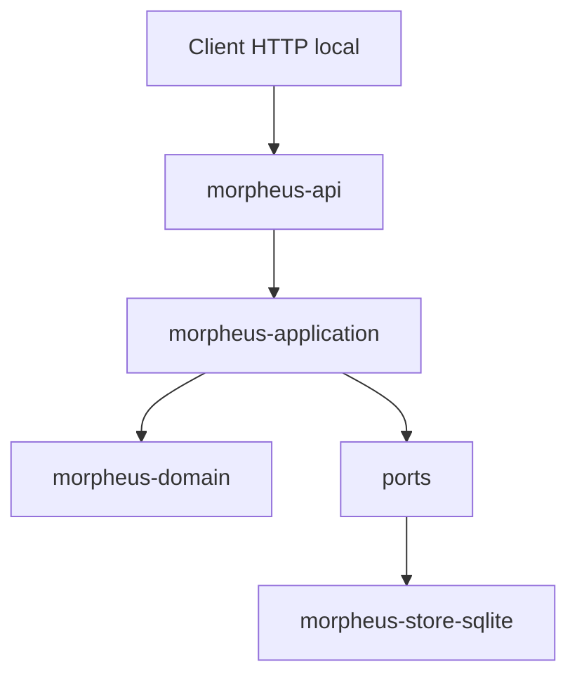
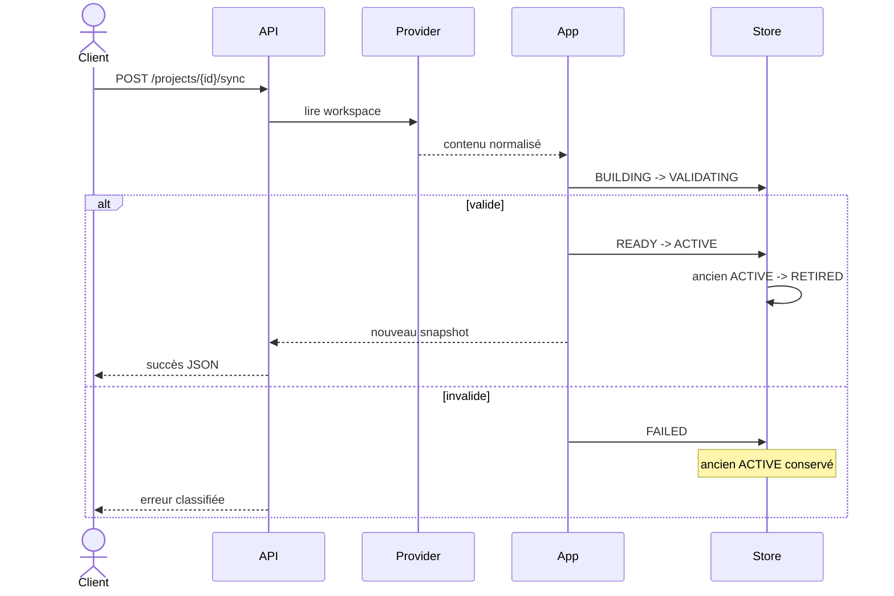
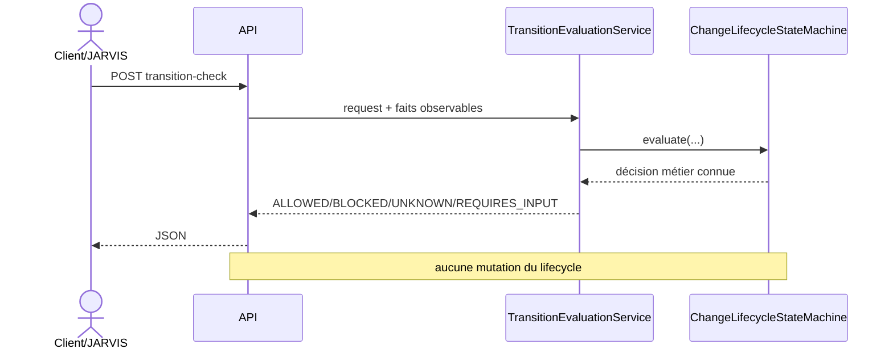
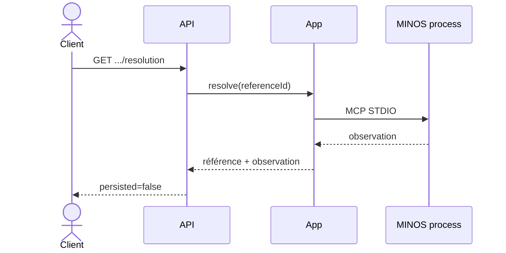

# API HTTP MORPHEUS

MORPHEUS expose une API JSON locale versionnée. Cette page documente la surface humaine du contrat ; le contrat machine complet reste [`../openapi/morpheus-v1.yaml`](../openapi/morpheus-v1.yaml).

```text
OpenAPI 3.1.0
API version 1.3.0
base /api/v1
server par défaut http://127.0.0.1:8765/api/v1
```

## 1. Démarrage

```bash
morpheus api
morpheus api --host 127.0.0.1 --port 8765
morpheus --db /path/to/morpheus.db api
```

La CLI, MCP et l’API utilisent les mêmes données lorsqu’ils reçoivent le même layout ou le même `--db`.

Vérification minimale :

```bash
curl http://127.0.0.1:8765/api/v1/health
curl http://127.0.0.1:8765/api/v1/version
```

## 2. Position dans l’architecture

`morpheus-api` est un adapter sibling de CLI/MCP.



L’API ne dépend ni de `morpheus-cli`, ni de `morpheus-mcp`, ni des implémentations externes MINOS/NEXUS/JARVIS.

## 3. Cycle d’une requête


La surface HTTP traduit le protocole et les erreurs ; elle ne doit pas réimplémenter les règles métier.

## 4. Enveloppes JSON

Succès :

```json
{
  "apiVersion": "v1",
  "data": {}
}
```

Erreur :

```json
{
  "apiVersion": "v1",
  "error": {
    "code": "NOT_FOUND",
    "message": "...",
    "details": {}
  }
}
```

Réponses JSON :

```text
encoding                 UTF-8
Cache-Control            no-store
X-Content-Type-Options   nosniff
```

Un client doit dépendre de `apiVersion`, des champs documentés et des codes d’erreur, pas du texte libre du message.

## 5. Endpoints système

```text
GET /api/v1/
GET /api/v1/health
GET /api/v1/version
```

Utilisation typique : healthcheck local, détection de version et vérification préalable d’un client.

## 6. Projets et synchronisation

```text
GET  /api/v1/projects
POST /api/v1/projects
GET  /api/v1/projects/{projectId}
POST /api/v1/projects/{projectId}/sync
GET  /api/v1/projects/{projectId}/sync-status
```

Les mutations opérationnelles HTTP exposées restent limitées à l’enregistrement projet et à la synchronisation.

### Séquence de synchronisation



## 7. Spécifications et requirements

```text
GET /api/v1/projects/{projectId}/specifications
GET /api/v1/projects/{projectId}/specifications/{specificationId}
GET /api/v1/projects/{projectId}/specifications/{specificationId}/context
GET /api/v1/projects/{projectId}/requirements
GET /api/v1/projects/{projectId}/requirements/{requirementId}
GET /api/v1/projects/{projectId}/requirements/{requirementId}/trace
```

Contexte NEXUS live :

```text
POST /api/v1/projects/{projectId}/requirements/{requirementId}/augmented-context
```

Les requêtes lisent l’état persisté/snapshot-scoped ; elles ne rescannent pas le workspace.

## 8. Changements

```text
GET /api/v1/projects/{projectId}/changes
GET /api/v1/projects/{projectId}/changes/{changeId}
GET /api/v1/projects/{projectId}/changes/{changeId}/constraints
GET /api/v1/projects/{projectId}/changes/{changeId}/acceptance-criteria
GET /api/v1/projects/{projectId}/changes/{changeId}/design-decisions
GET /api/v1/projects/{projectId}/changes/{changeId}/implementation-tasks
GET /api/v1/projects/{projectId}/changes/{changeId}/context
GET /api/v1/projects/{projectId}/changes/{changeId}/status
GET /api/v1/projects/{projectId}/changes/{changeId}/blocking-conditions
```

Contexte NEXUS live :

```text
POST /api/v1/projects/{projectId}/changes/{changeId}/augmented-context
```

`Scenario` et `AcceptanceCriterion` restent deux concepts distincts. Une route de critères d’acceptation ne synthétise pas des critères à partir de scénarios.

## 9. Orchestration JARVIS read-only

### 9.1 État observable

```text
GET /api/v1/projects/{projectId}/changes/{changeId}/orchestration
```

Query optionnelle :

```text
lifecycleState=<DRAFT|PROPOSED|SPECIFIED|DESIGNED|PLANNED|IMPLEMENTING|VERIFYING|COMPLETED|ARCHIVED|ABANDONED>
abandonmentReason=<reason>
```

Sans lifecycle explicite :

```text
lifecycle.state  = absent
lifecycle.source = UNAVAILABLE
```

MORPHEUS ne déduit pas le lifecycle depuis les tâches, timestamps ou findings qualité.

### 9.2 Évaluation d’une transition

```text
POST /api/v1/projects/{projectId}/changes/{changeId}/transition-check
```

Body :

```json
{
  "fromState": "PROPOSED",
  "fromAbandonmentReason": null,
  "targetState": "SPECIFIED",
  "abandonmentReason": null,
  "allowBackwardTransitions": false,
  "allowCompletedReopen": false
}
```

Résultats :

```text
ALLOWED
BLOCKED
UNKNOWN
REQUIRES_INPUT
```



Le POST est une évaluation pure : aucune transition, aucun provider et aucun snapshot ne sont mutés.

## 10. Versions, historique et diagnostics

```text
GET /api/v1/projects/{projectId}/versions
GET /api/v1/projects/{projectId}/versions/{snapshotId}/requirements
GET /api/v1/projects/{projectId}/versions/compare
GET /api/v1/projects/{projectId}/diagnostics
```

La comparaison porte sur des versions/snapshots publiés. L’historique est conservé ; il n’est pas réécrit pour refléter une observation plus récente.

## 11. MINOS

```text
GET /api/v1/integrations/minos/status
GET /api/v1/projects/{projectId}/external-references?ownerId=<domainIdentity>
GET /api/v1/projects/{projectId}/external-references/{referenceId}/resolution
```

La résolution live expose une observation avec `persisted=false` et ne réécrit pas l’historique publié.



## 12. NEXUS

```text
GET  /api/v1/integrations/nexus/status
POST /api/v1/projects/{projectId}/requirements/{requirementId}/augmented-context
POST /api/v1/projects/{projectId}/changes/{changeId}/augmented-context
```

Le `ContextBundle` NEXUS reste live et non persisté. MORPHEUS transmet une intention structurée mais ne réimplémente pas le ranking/fusion/compression de NEXUS.

## 13. Validation des bodies

Les POST JSON imposent :

```text
Content-Type: application/json
body <= 65536 octets
JSON valide
champs connus uniquement
aucun token supplémentaire
```

Les bodies sont volontairement stricts pour éviter qu’un client pense qu’un champ ignoré a été pris en compte.

## 14. Frontière d’écriture

L’API n’expose pas de mutation pour :

```text
RequirementDelta APPLY
PROMOTE
ACTIVATE direct
rollback mutation
write requirement/change
apply lifecycle transition
persist external-reference live resolution
persist NEXUS ContextBundle
NEXUS project add/index/rebuild
JARVIS orchestration action
```

Cette frontière est centrale : l’API peut **évaluer**, **observer** et **synchroniser**, mais elle ne transforme pas les contrats read-only en mutations implicites.

## 15. Erreurs côté client

Un client doit traiter distinctement :

| Catégorie | Interprétation |
|---|---|
| argument/body invalide | corriger la requête |
| `NOT_FOUND` | identité inexistante dans la base/snapshot ciblé |
| état incompatible | opération impossible dans l’état courant |
| intégration indisponible | capacité optionnelle non disponible, pas panne globale |
| erreur interne | conserver réponse + logs pour diagnostic |

Ne pas convertir `UNAVAILABLE` ou `UNKNOWN` en `false` dans un client métier.

## 16. Exemple de client local

Health :

```bash
curl -s http://127.0.0.1:8765/api/v1/health
```

Liste des projets :

```bash
curl -s http://127.0.0.1:8765/api/v1/projects
```

État d’un changement :

```bash
curl -s \
  http://127.0.0.1:8765/api/v1/projects/<projectId>/changes/<changeId>/orchestration
```

Pour les bodies exacts, statuts HTTP et schémas de réponse, le fichier OpenAPI est la source de vérité machine.

## 17. Tests de contrat

La preuve M14 inclut `morpheus-api` **9/9 PASS**, dont le contrat d’orchestration JARVIS. Le nombre est une preuve historique du jalon ; les tests futurs peuvent augmenter.

## 18. Voir aussi

- [Architecture](ARCHITECTURE.md)
- [Serveur MCP](MCP.md)
- [Intégrations](INTEGRATIONS.md)
- [OpenAPI](../openapi/morpheus-v1.yaml)
- [Guide utilisateur](../user/README.md)
