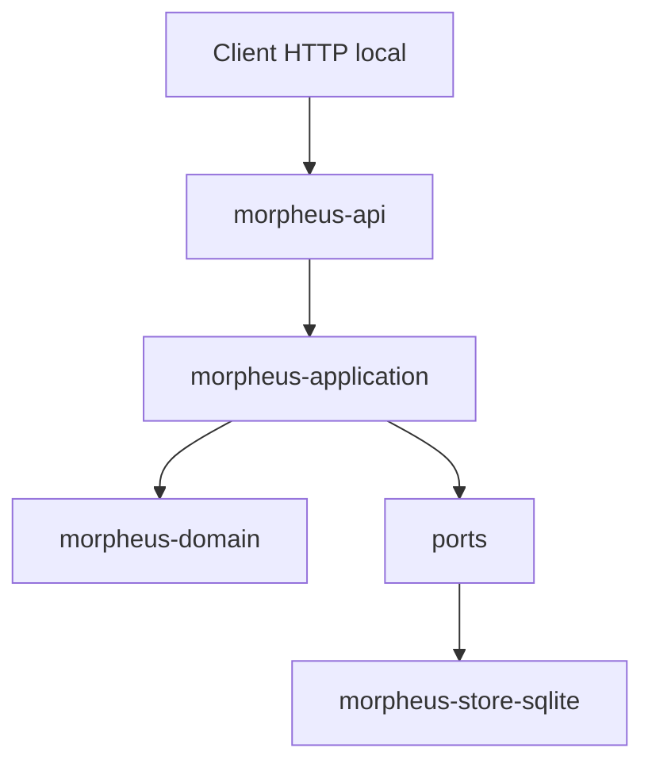
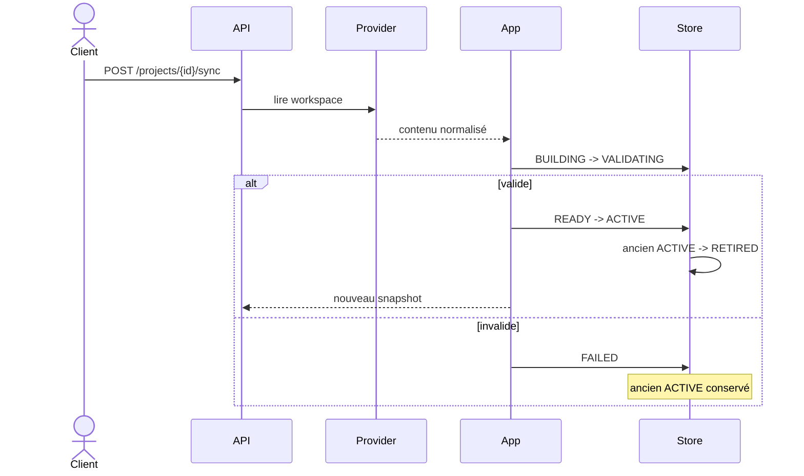

# API HTTP MORPHEUS

MORPHEUS expose une API JSON locale versionnée. Cette page documente la surface humaine du contrat ; le contrat machine complet reste [`../openapi/morpheus-v1.yaml`](../openapi/morpheus-v1.yaml).

```text
OpenAPI 3.1.0
API contract version 1.8.0
base /api/v1
server par défaut http://127.0.0.1:8765/api/v1
```

La version d’URL reste `/api/v1` : les évolutions M12→M19 sont additives et versionnées dans le document OpenAPI.

## 1. Démarrage

```bash
morpheus api
morpheus api --host 127.0.0.1 --port 8765
morpheus --db /path/to/morpheus.db api
```

La CLI, MCP et l’API utilisent les mêmes données lorsqu’ils reçoivent le même layout ou le même `--db`.

Vérification minimale :

```bash
curl http://127.0.0.1:8765/api/v1/health
curl http://127.0.0.1:8765/api/v1/readiness
curl http://127.0.0.1:8765/api/v1/metrics
curl http://127.0.0.1:8765/api/v1/version
```

## 2. Position dans l’architecture

`morpheus-api` est un adapter sibling de CLI/MCP.



L’API ne dépend ni de `morpheus-cli`, ni de `morpheus-mcp`, ni des implémentations externes MINOS/NEXUS/JARVIS. Les providers ne fuient pas dans les contrats domaine/application.

## 3. Enveloppes JSON

Succès :

```json
{
  "apiVersion": "v1",
  "data": {}
}
```

Erreur transport/protocole :

```json
{
  "apiVersion": "v1",
  "error": {
    "code": "NOT_FOUND",
    "message": "...",
    "details": {}
  }
}
```

Réponses :

```text
encoding                 UTF-8
Cache-Control            no-store
X-Content-Type-Options   nosniff
```

Un client dépend de `apiVersion`, des champs documentés et des codes d’erreur, pas du texte libre du message.

## 4. Endpoints système

```text
GET /api/v1/
GET /api/v1/health
GET /api/v1/readiness
GET /api/v1/metrics
GET /api/v1/version
```

`health` prouve seulement la liveness. `readiness` sonde réellement SQLite et répond HTTP `503` avec `NOT_READY` si cette dépendance locale est indisponible. `metrics` expose uniquement des compteurs et agrégats de durée process-local, sans télémétrie réseau obligatoire.

## 5. Projets et synchronisation

```text
GET  /api/v1/projects
POST /api/v1/projects
GET  /api/v1/projects/{projectId}
POST /api/v1/projects/{projectId}/sync
GET  /api/v1/projects/{projectId}/sync-status
```

La synchronisation publie des snapshots. Un candidat ne devient `ACTIVE` qu’après validation et activation atomique.



`failure != partial ACTIVE exposure`.

## 6. Spécifications et requirements

```text
GET /api/v1/projects/{projectId}/specifications
GET /api/v1/projects/{projectId}/specifications/{specificationId}
GET /api/v1/projects/{projectId}/specifications/{specificationId}/context
GET /api/v1/projects/{projectId}/requirements
GET /api/v1/projects/{projectId}/requirements/{requirementId}
GET /api/v1/projects/{projectId}/requirements/{requirementId}/trace
```

Contexte NEXUS live :

```text
POST /api/v1/projects/{projectId}/requirements/{requirementId}/augmented-context
```

## 7. Changements et artefacts

```text
GET /api/v1/projects/{projectId}/changes
GET /api/v1/projects/{projectId}/changes/{changeId}
GET /api/v1/projects/{projectId}/changes/{changeId}/constraints
GET /api/v1/projects/{projectId}/changes/{changeId}/acceptance-criteria
GET /api/v1/projects/{projectId}/changes/{changeId}/design-decisions
GET /api/v1/projects/{projectId}/changes/{changeId}/implementation-tasks
GET /api/v1/projects/{projectId}/changes/{changeId}/context
GET /api/v1/projects/{projectId}/changes/{changeId}/status
GET /api/v1/projects/{projectId}/changes/{changeId}/blocking-conditions
```

Contexte NEXUS live :

```text
POST /api/v1/projects/{projectId}/changes/{changeId}/augmented-context
```

`Scenario != AcceptanceCriterion`. `Test existence != VERIFIED`. La sévérité d’une contrainte n’est pas une politique de blocage implicite.

## 8. Orchestration JARVIS read-only

État observable :

```text
GET /api/v1/projects/{projectId}/changes/{changeId}/orchestration
```

Évaluation pure :

```text
POST /api/v1/projects/{projectId}/changes/{changeId}/transition-check
```

Résultats :

```text
ALLOWED
BLOCKED
UNKNOWN
REQUIRES_INPUT
```

`ALLOWED != applied`. MORPHEUS ne déduit pas le lifecycle depuis les tâches, timestamps ou findings qualité.

## 9. M17 — mutation lifecycle contrôlée

Endpoint distinct :

```text
POST /api/v1/projects/{projectId}/changes/{changeId}/lifecycle-transitions
```

Body :

```json
{
  "mutationId": null,
  "idempotencyKey": "release-42-change-7-proposed",
  "expectedRevision": 0,
  "targetState": "PROPOSED",
  "abandonmentReason": null,
  "actor": "jarvis",
  "confirmed": true
}
```

Garde-fous :

```text
idempotency
  ↓
WRITE_CHANGE capability
  ↓
confirmation explicite
  ↓
expectedRevision / CAS
  ↓
transition evaluation M14-M16
  ↓
state + audit atomiques
```

Résultats métier :

```text
APPLIED
ALREADY_APPLIED
CONFLICT
NOT_AUTHORIZED
REQUIRES_CONFIRMATION
REJECTED
```

L’état lifecycle mutable est séparé de `KnowledgeSnapshot`.

## 10. M18 — composition multi-provider

Endpoints read-only :

```text
GET /api/v1/projects/{projectId}/composition
GET /api/v1/projects/{projectId}/composition/conflicts
```

Ils exposent des projections **provider-neutral** et JSON-safe.

Le premier endpoint expose l’état de composition : providers observés, priorités, snapshot scope et informations de composition disponibles.

Le second expose les conflits explicites et leurs candidats/provenances.

Invariants :

```text
provider identifier != DomainIdentity
source path != identity
provider ownership is explicit
same logical entity may have multiple provider observations
precedence != provenance erasure
ambiguous continuity must be surfaced
conflict != silent last-write-wins
optional provider absence != project failure when optional
```

Providers réels validés ensemble : **OpenSpec + Structured Markdown**.

Persistance : **Memory + SQLite V012**.

## 11. Versions, historique et diagnostics

```text
GET /api/v1/projects/{projectId}/versions
GET /api/v1/projects/{projectId}/versions/{snapshotId}/requirements
GET /api/v1/projects/{projectId}/versions/compare
GET /api/v1/projects/{projectId}/diagnostics
```

L’historique publié n’est réécrit ni par une mutation lifecycle opérationnelle ni par une observation live externe.

## 12. MINOS

```text
GET /api/v1/integrations/minos/status
GET /api/v1/projects/{projectId}/external-references?ownerId=<domainIdentity>
GET /api/v1/projects/{projectId}/external-references/{referenceId}/resolution
```

La résolution live expose une observation avec `persisted=false` et ne réécrit pas l’historique publié.

## 13. NEXUS

```text
GET  /api/v1/integrations/nexus/status
POST /api/v1/projects/{projectId}/requirements/{requirementId}/augmented-context
POST /api/v1/projects/{projectId}/changes/{changeId}/augmented-context
```

Le `ContextBundle` NEXUS reste live et non persisté. MORPHEUS ne réimplémente pas le ranking/fusion/compression de NEXUS.

## 14. Validation des bodies

Les POST JSON imposent :

```text
Content-Type: application/json
body <= 65536 octets
JSON valide
champs connus uniquement
aucun token supplémentaire
```

Un `expectedRevision`, `confirmed` ou autre garde-fou mal orthographié ne doit jamais être silencieusement ignoré.

## 15. Frontière d’écriture

M17 ajoute uniquement la transition lifecycle opérationnelle contrôlée. L’API n’expose pas de mutation implicite pour :

```text
RequirementDelta APPLY
PROMOTE
ACTIVATE direct
rollback mutation
write requirement/change content
persist external-reference live resolution
persist NEXUS ContextBundle
NEXUS project add/index/rebuild
JARVIS orchestration action
composition conflict silent resolution
```

La frontière reste :

```text
JARVIS chooses/sequences
MORPHEUS validates state invariants and may apply an explicit authorized command
```

## 16. Erreurs côté client

| Catégorie | Interprétation |
|---|---|
| argument/body invalide | corriger la requête |
| `NOT_FOUND` | identité inexistante dans la base/snapshot ciblé |
| erreur HTTP `STATE_CONFLICT` | précondition de lecture/runtime non satisfaisable |
| `data.state=CONFLICT` | conflit métier/CAS/idempotency d’une commande valide |
| `data.state=NOT_AUTHORIZED` | aucun provider n’expose explicitement `WRITE_CHANGE` |
| `data.state=REQUIRES_CONFIRMATION` | confirmer explicitement avant retry |
| intégration/provider optionnel indisponible | capacité optionnelle absente, pas panne globale |
| erreur interne | conserver réponse + logs pour diagnostic |

Ne pas convertir `UNAVAILABLE` ou `UNKNOWN` en `false`, ni `ALLOWED` en mutation implicite.

## 17. Validation M18

Gate réel :

```text
API tests          12/12 PASS
TOTAL              418/418 PASS
Architecture       170/170 PASS
Packaging/smokes   PASS
API health smoke   PASS
```

Code testé : `7e8caacff567f51354fcb88bd7505a6d135071c0`.  
OpenAPI M18 : **1.7.0**. Le candidat M19 ajoute séparément le contrat **1.8.0** et reste pré-gate jusqu'à sa qualification.
Preuve : [`../validation/VALIDATION_M18.md`](../validation/VALIDATION_M18.md).

## 18. Voir aussi

- [Architecture](ARCHITECTURE.md)
- [Serveur MCP](MCP.md)
- [Intégrations](INTEGRATIONS.md)
- [OpenAPI](../openapi/morpheus-v1.yaml)
- [Référence CLI](../user/CLI.md)
- [ADR-0083](../adr/0083-controlled-lifecycle-write-operations.md)
- [ADR-0084](../adr/0084-provider-neutral-multi-provider-composition.md)
