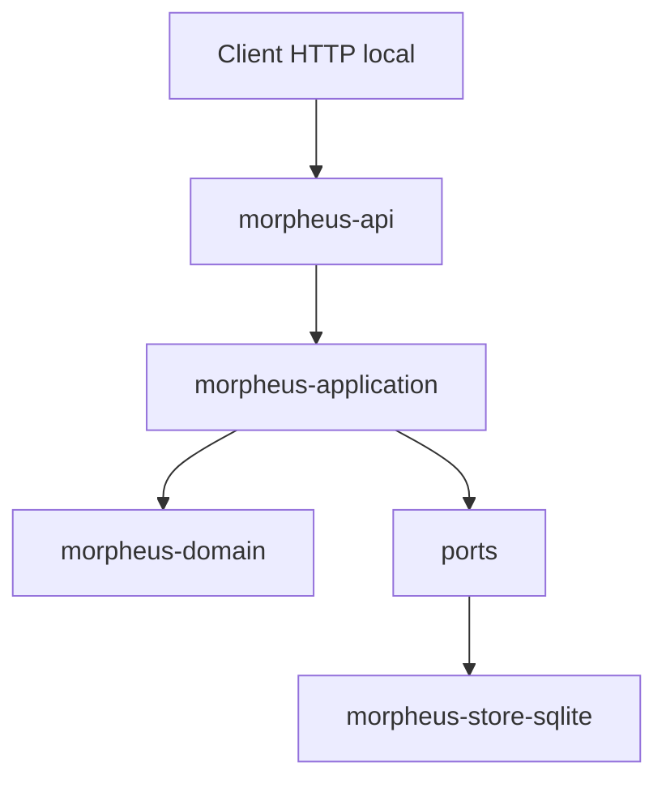

# API HTTP MORPHEUS

MORPHEUS expose une API JSON locale versionnée. Cette page documente la surface humaine du contrat ; le contrat machine complet reste [`../openapi/morpheus-v1.yaml`](../openapi/morpheus-v1.yaml).

```text
OpenAPI 3.1.0
API contract version 1.7.0
base /api/v1
server par défaut http://127.0.0.1:8765/api/v1
```

La version d’URL reste `/api/v1` : les évolutions M12→M18 sont additives et versionnées dans le document OpenAPI.

## 1. Démarrage

```bash
morpheus api
morpheus api --host 127.0.0.1 --port 8765
morpheus --db /path/to/morpheus.db api
```

La CLI, MCP et l’API utilisent les mêmes données lorsqu’ils reçoivent le même layout ou le même `--db`.

Vérification minimale :

```bash
curl http://127.0.0.1:8765/api/v1/health
curl http://127.0.0.1:8765/api/v1/version
```

## 2. Position dans l’architecture

`morpheus-api` est un adapter sibling de CLI/MCP.



L’API ne dépend ni de `morpheus-cli`, ni de `morpheus-mcp`, ni des implémentations externes MINOS/NEXUS/JARVIS. Les règles métier, composition, autorisation write, CAS et idempotency restent dans l’application/domain/store.

## 3. Enveloppes JSON

Succès :

```json
{
  "apiVersion": "v1",
  "data": {}
}
```

Erreur transport/protocole :

```json
{
  "apiVersion": "v1",
  "error": {
    "code": "NOT_FOUND",
    "message": "...",
    "details": {}
  }
}
```

Réponses JSON :

```text
encoding                 UTF-8
Cache-Control            no-store
X-Content-Type-Options   nosniff
```

Un client doit dépendre de `apiVersion`, des champs documentés et des codes d’erreur, pas du texte libre du message.

Les résultats métier d’une mutation (`CONFLICT`, `NOT_AUTHORIZED`, etc.) sont retournés dans `data.state` : ils ne sont pas transformés artificiellement en erreur HTTP tant que la requête est valide et que le service a pu l’évaluer.

## 4. Endpoints système

```text
GET /api/v1/
GET /api/v1/health
GET /api/v1/version
```

## 5. Projets et synchronisation

```text
GET  /api/v1/projects
POST /api/v1/projects
GET  /api/v1/projects/{projectId}
POST /api/v1/projects/{projectId}/sync
GET  /api/v1/projects/{projectId}/sync-status
```

La synchronisation publie des snapshots. Elle reste distincte de l’état lifecycle opérationnel M17 et de l’état de composition snapshot-scoped M18.

Invariant : un candidat invalide ou failed ne doit pas remplacer silencieusement le dernier `ACTIVE` valide.

## 6. Spécifications et requirements

```text
GET /api/v1/projects/{projectId}/specifications
GET /api/v1/projects/{projectId}/specifications/{specificationId}
GET /api/v1/projects/{projectId}/specifications/{specificationId}/context
GET /api/v1/projects/{projectId}/requirements
GET /api/v1/projects/{projectId}/requirements/{requirementId}
GET /api/v1/projects/{projectId}/requirements/{requirementId}/trace
```

Contexte NEXUS live :

```text
POST /api/v1/projects/{projectId}/requirements/{requirementId}/augmented-context
```

Les requêtes lisent l’état persisté/snapshot-scoped ; elles ne rescannent pas le workspace.

## 7. Changements

```text
GET /api/v1/projects/{projectId}/changes
GET /api/v1/projects/{projectId}/changes/{changeId}
GET /api/v1/projects/{projectId}/changes/{changeId}/constraints
GET /api/v1/projects/{projectId}/changes/{changeId}/acceptance-criteria
GET /api/v1/projects/{projectId}/changes/{changeId}/design-decisions
GET /api/v1/projects/{projectId}/changes/{changeId}/implementation-tasks
GET /api/v1/projects/{projectId}/changes/{changeId}/context
GET /api/v1/projects/{projectId}/changes/{changeId}/status
GET /api/v1/projects/{projectId}/changes/{changeId}/blocking-conditions
```

Contexte NEXUS live :

```text
POST /api/v1/projects/{projectId}/changes/{changeId}/augmented-context
```

`Scenario` et `AcceptanceCriterion` restent deux concepts distincts. Les contraintes M16 exposent leur sémantique explicite ; aucun texte ou niveau de sévérité n’est transformé implicitement en blocker.

## 8. Orchestration JARVIS read-only

État observable :

```text
GET /api/v1/projects/{projectId}/changes/{changeId}/orchestration
```

Évaluation :

```text
POST /api/v1/projects/{projectId}/changes/{changeId}/transition-check
```

Résultats :

```text
ALLOWED
BLOCKED
UNKNOWN
REQUIRES_INPUT
```

Le POST `transition-check` reste une évaluation pure. **`ALLOWED != applied`.**

## 9. M17 — mutation lifecycle contrôlée

Endpoint distinct :

```text
POST /api/v1/projects/{projectId}/changes/{changeId}/lifecycle-transitions
```

Body conceptuel :

```json
{
  "mutationId": null,
  "idempotencyKey": "release-42-change-7-proposed",
  "expectedRevision": 0,
  "targetState": "PROPOSED",
  "abandonmentReason": null,
  "actor": "jarvis",
  "confirmed": true
}
```

Garde-fous applicatifs :

```text
idempotency
  ↓
WRITE_CHANGE capability
  ↓
confirmation explicite
  ↓
expectedRevision / CAS
  ↓
transition evaluation M14-M16
  ↓
state + audit atomiques
```

Résultats métier :

```text
APPLIED
ALREADY_APPLIED
CONFLICT
NOT_AUTHORIZED
REQUIRES_CONFIRMATION
REJECTED
```

```text
published snapshot                  immutable
ChangeLifecycleOperationalState     mutable / CAS-controlled
```

`READ_CHANGES != WRITE_CHANGE` et `published snapshot != operational lifecycle state`.

## 10. M18 — composition multi-provider

M18 ajoute deux endpoints read-only :

```text
GET /api/v1/projects/{projectId}/composition
GET /api/v1/projects/{projectId}/composition/conflicts
```

Leur source applicative est provider-neutral :

```text
OpenSpec + Structured Markdown
        ↓
ProviderContribution
        ↓
MultiProviderCompositionService
        ↓
composition state + conflicts
        ↓
HTTP projection
```

Le contrat conserve :

```text
provider identifier != DomainIdentity
source path != identity
precedence != provenance erasure
conflict != silent last-write-wins
ambiguous continuity must be surfaced
optional provider absence != project failure when optional
```

### 10.1 Composition status

`GET /composition` expose l’état de composition snapshot-scoped : providers observés, priorité effective, provenance, diagnostics et résultat de composition.

L’ordre de provider ne constitue pas une mutation métier implicite. La priorité sélectionne un candidat principal lorsque nécessaire sans effacer les observations non sélectionnées.

### 10.2 Composition conflicts

`GET /composition/conflicts` expose les conflits explicitement persistés, notamment :

```text
content
ownership
type / identity
absent vs present
```

Les candidats et leur provenance restent requêtables. Aucun last-write-wins silencieux n’est autorisé.

## 11. Versions, historique et diagnostics

```text
GET /api/v1/projects/{projectId}/versions
GET /api/v1/projects/{projectId}/versions/{snapshotId}/requirements
GET /api/v1/projects/{projectId}/versions/compare
GET /api/v1/projects/{projectId}/diagnostics
```

L’historique publié n’est réécrit ni par une mutation lifecycle opérationnelle ni par une observation d’intégration live.

## 12. MINOS

```text
GET /api/v1/integrations/minos/status
GET /api/v1/projects/{projectId}/external-references?ownerId=<domainIdentity>
GET /api/v1/projects/{projectId}/external-references/{referenceId}/resolution
```

La résolution live expose une observation avec `persisted=false` et ne réécrit pas l’historique publié.

## 13. NEXUS

```text
GET  /api/v1/integrations/nexus/status
POST /api/v1/projects/{projectId}/requirements/{requirementId}/augmented-context
POST /api/v1/projects/{projectId}/changes/{changeId}/augmented-context
```

Le `ContextBundle` NEXUS reste live et non persisté. MORPHEUS transmet une intention structurée mais ne réimplémente pas le ranking/fusion/compression de NEXUS.

## 14. Validation des bodies

Les POST JSON imposent :

```text
Content-Type: application/json
body <= 65536 octets
JSON valide
champs connus uniquement
aucun token supplémentaire
```

Cette règle est essentielle aux mutations : un client ne doit jamais penser qu’un `expectedRevision`, `confirmed` ou autre garde-fou mal orthographié a été pris en compte.

## 15. Frontière d’écriture

M17 ajoute **uniquement** la transition lifecycle opérationnelle contrôlée. M18 n’ajoute aucune nouvelle surface d’écriture.

L’API n’expose toujours pas de mutation pour :

```text
RequirementDelta APPLY
PROMOTE
ACTIVATE direct
rollback mutation
write requirement/change content
persist external-reference live resolution
persist NEXUS ContextBundle
NEXUS project add/index/rebuild
JARVIS orchestration action
composition conflict auto-resolution by silent overwrite
```

La frontière reste :

```text
JARVIS chooses/sequences
MORPHEUS validates state invariants and may apply an explicit authorized command
```

## 16. Erreurs côté client

| Catégorie | Interprétation |
|---|---|
| argument/body invalide | corriger la requête |
| `NOT_FOUND` | identité inexistante dans la base/snapshot ciblé |
| erreur HTTP `STATE_CONFLICT` | précondition de lecture/runtime non satisfaisable |
| `data.state=CONFLICT` | conflit métier/CAS/idempotency d’une commande valide |
| `data.state=NOT_AUTHORIZED` | aucun provider n’expose explicitement `WRITE_CHANGE` |
| `data.state=REQUIRES_CONFIRMATION` | confirmer explicitement avant retry |
| intégration indisponible | capacité optionnelle non disponible, pas panne globale |
| composition conflict | fait explicite à lire, jamais résolution silencieuse |
| erreur interne | conserver réponse + logs pour diagnostic |

Ne pas convertir `UNAVAILABLE` ou `UNKNOWN` en `false`, ni `ALLOWED` en mutation implicite.

## 17. Tests de contrat et baseline

Dernier gate intégré : M18.

```text
API tests       12/12 PASS
TOTAL           418/418 PASS
Architecture    170/170 PASS
OpenAPI         1.7.0
Packaging       Windows + smokes + API health PASS
Code validé     7e8caacff567f51354fcb88bd7505a6d135071c0
Merge M18       30f11ac3ffc522bcc0c71e31216a3fb70f0631d7
```

Preuve : [`../validation/VALIDATION_M18.md`](../validation/VALIDATION_M18.md).

## 18. Voir aussi

- [Architecture](ARCHITECTURE.md)
- [Serveur MCP](MCP.md)
- [Intégrations](INTEGRATIONS.md)
- [OpenAPI](../openapi/morpheus-v1.yaml)
- [Référence CLI](../user/CLI.md)
- [ADR-0083](../adr/0083-controlled-lifecycle-write-operations.md)
- [ADR-0084](../adr/0084-provider-neutral-multi-provider-composition.md)
