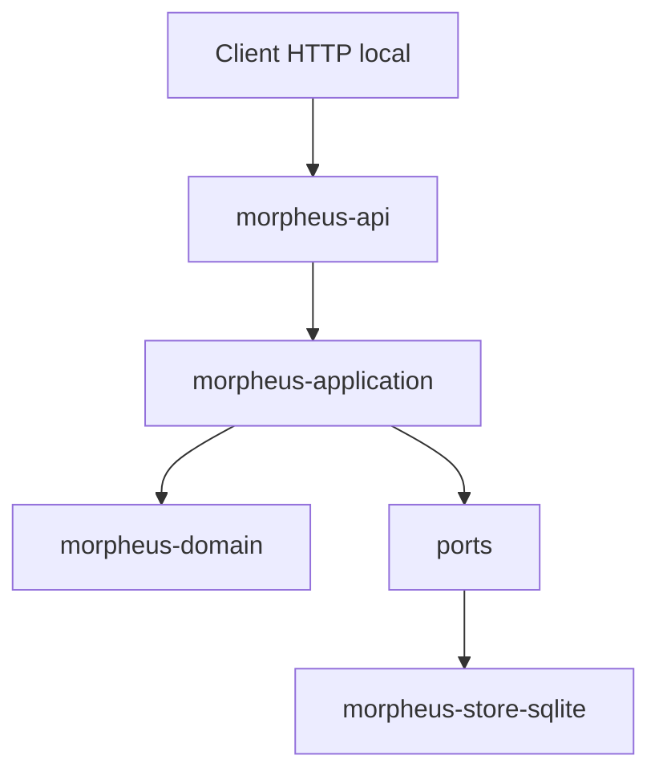
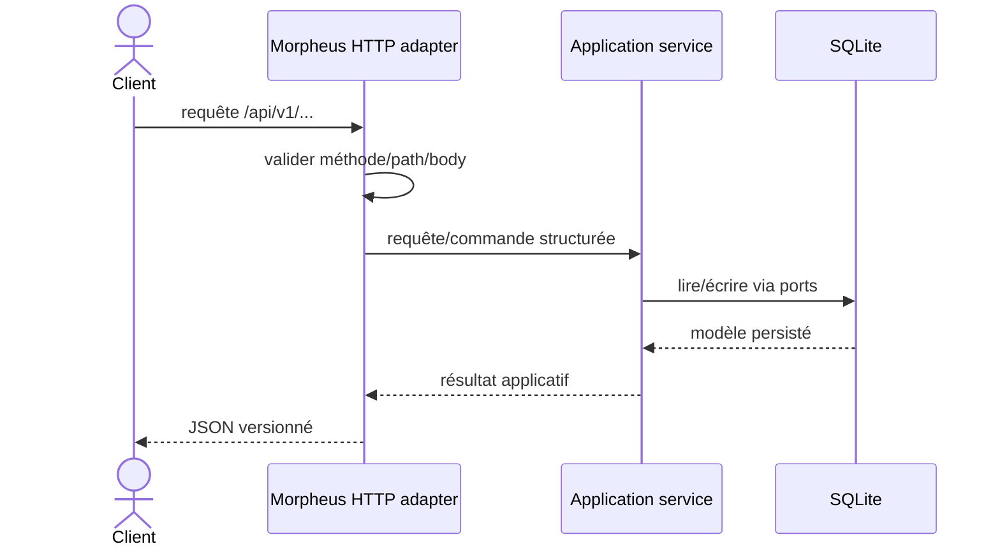
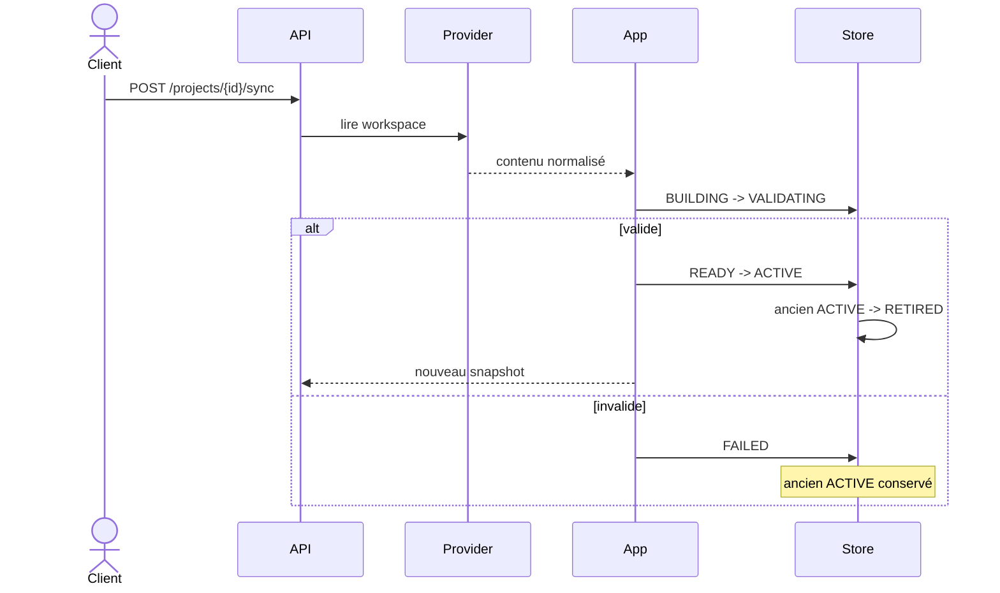
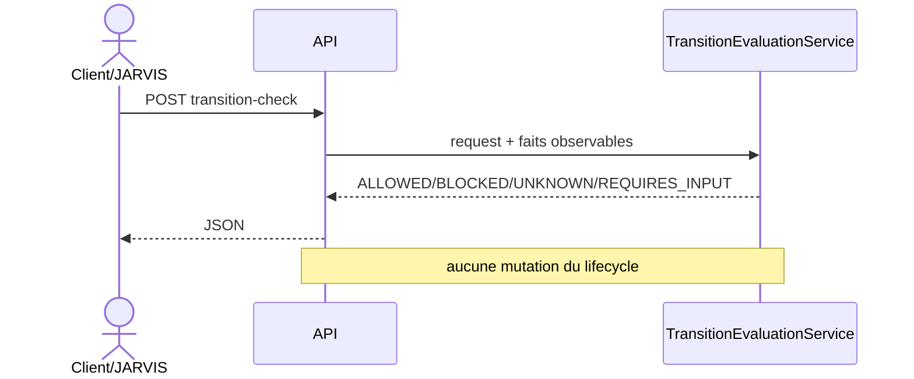

# API HTTP MORPHEUS

MORPHEUS expose une API JSON locale versionnée. Cette page documente la surface humaine du contrat ; le contrat machine complet reste [`../openapi/morpheus-v1.yaml`](../openapi/morpheus-v1.yaml).

```text
OpenAPI 3.1.0
API contract version 1.6.0
base /api/v1
server par défaut http://127.0.0.1:8765/api/v1
```

La version d’URL reste `/api/v1` : les évolutions M12→M17 sont additives et versionnées dans le document OpenAPI.

## 1. Démarrage

```bash
morpheus api
morpheus api --host 127.0.0.1 --port 8765
morpheus --db /path/to/morpheus.db api
```

La CLI, MCP et l’API utilisent les mêmes données lorsqu’ils reçoivent le même layout ou le même `--db`.

Vérification minimale :

```bash
curl http://127.0.0.1:8765/api/v1/health
curl http://127.0.0.1:8765/api/v1/version
```

## 2. Position dans l’architecture

`morpheus-api` est un adapter sibling de CLI/MCP.



L’API ne dépend ni de `morpheus-cli`, ni de `morpheus-mcp`, ni des implémentations externes MINOS/NEXUS/JARVIS. Le resolver de capacité write est injecté par le composition root.

## 3. Cycle d’une requête



La surface HTTP traduit le protocole et les erreurs ; elle ne réimplémente pas les règles métier.

## 4. Enveloppes JSON

Succès :

```json
{
  "apiVersion": "v1",
  "data": {}
}
```

Erreur transport/protocole :

```json
{
  "apiVersion": "v1",
  "error": {
    "code": "NOT_FOUND",
    "message": "...",
    "details": {}
  }
}
```

Réponses JSON :

```text
encoding                 UTF-8
Cache-Control            no-store
X-Content-Type-Options   nosniff
```

Un client doit dépendre de `apiVersion`, des champs documentés et des codes d’erreur, pas du texte libre du message.

Les résultats métier d’une mutation (`CONFLICT`, `NOT_AUTHORIZED`, etc.) sont retournés dans `data.state` : ils ne sont pas artificiellement transformés en erreur HTTP tant que la requête est valide et que le service a pu l’évaluer.

## 5. Endpoints système

```text
GET /api/v1/
GET /api/v1/health
GET /api/v1/version
```

## 6. Projets et synchronisation

```text
GET  /api/v1/projects
POST /api/v1/projects
GET  /api/v1/projects/{projectId}
POST /api/v1/projects/{projectId}/sync
GET  /api/v1/projects/{projectId}/sync-status
```

La synchronisation publie des snapshots. Elle est distincte de l’état lifecycle opérationnel M17.



## 7. Spécifications et requirements

```text
GET /api/v1/projects/{projectId}/specifications
GET /api/v1/projects/{projectId}/specifications/{specificationId}
GET /api/v1/projects/{projectId}/specifications/{specificationId}/context
GET /api/v1/projects/{projectId}/requirements
GET /api/v1/projects/{projectId}/requirements/{requirementId}
GET /api/v1/projects/{projectId}/requirements/{requirementId}/trace
```

Contexte NEXUS live :

```text
POST /api/v1/projects/{projectId}/requirements/{requirementId}/augmented-context
```

Les requêtes lisent l’état persisté/snapshot-scoped ; elles ne rescannent pas le workspace.

## 8. Changements

```text
GET /api/v1/projects/{projectId}/changes
GET /api/v1/projects/{projectId}/changes/{changeId}
GET /api/v1/projects/{projectId}/changes/{changeId}/constraints
GET /api/v1/projects/{projectId}/changes/{changeId}/acceptance-criteria
GET /api/v1/projects/{projectId}/changes/{changeId}/design-decisions
GET /api/v1/projects/{projectId}/changes/{changeId}/implementation-tasks
GET /api/v1/projects/{projectId}/changes/{changeId}/context
GET /api/v1/projects/{projectId}/changes/{changeId}/status
GET /api/v1/projects/{projectId}/changes/{changeId}/blocking-conditions
```

Contexte NEXUS live :

```text
POST /api/v1/projects/{projectId}/changes/{changeId}/augmented-context
```

`Scenario` et `AcceptanceCriterion` restent deux concepts distincts. Les contraintes M16 exposent leur sémantique explicite ; aucun texte ou niveau de sévérité n’est transformé implicitement en blocker.

## 9. Orchestration JARVIS read-only

### 9.1 État observable

```text
GET /api/v1/projects/{projectId}/changes/{changeId}/orchestration
```

Query optionnelle :

```text
lifecycleState=<DRAFT|PROPOSED|SPECIFIED|DESIGNED|PLANNED|IMPLEMENTING|VERIFYING|COMPLETED|ARCHIVED|ABANDONED>
abandonmentReason=<reason>
```

Sans lifecycle explicite :

```text
lifecycle.state  = absent
lifecycle.source = UNAVAILABLE
```

MORPHEUS ne déduit pas le lifecycle depuis les tâches, timestamps ou findings qualité.

### 9.2 Évaluation d’une transition

```text
POST /api/v1/projects/{projectId}/changes/{changeId}/transition-check
```

Body :

```json
{
  "fromState": "PROPOSED",
  "fromAbandonmentReason": null,
  "targetState": "SPECIFIED",
  "abandonmentReason": null,
  "allowBackwardTransitions": false,
  "allowCompletedReopen": false
}
```

Résultats :

```text
ALLOWED
BLOCKED
UNKNOWN
REQUIRES_INPUT
```



Le POST `transition-check` reste une évaluation pure. **`ALLOWED != applied`.**

## 10. M17 — mutation lifecycle contrôlée

Endpoint distinct :

```text
POST /api/v1/projects/{projectId}/changes/{changeId}/lifecycle-transitions
```

Exemple de body :

```json
{
  "mutationId": null,
  "idempotencyKey": "release-42-change-7-proposed",
  "expectedRevision": 0,
  "targetState": "PROPOSED",
  "abandonmentReason": null,
  "actor": "jarvis",
  "confirmed": true
}
```

Required :

```text
idempotencyKey
expectedRevision
targetState
actor
confirmed
```

`mutationId` est optionnel ; MORPHEUS en génère un lorsqu’il est absent.

### 10.1 Garde-fous

L’ordre applicatif est :

```text
idempotency
  ↓
WRITE_CHANGE capability
  ↓
confirmation explicite
  ↓
expectedRevision / CAS
  ↓
transition evaluation M14-M16
  ↓
state + audit atomiques
```

Une décision `ALLOWED` ne contourne aucun de ces contrôles.

### 10.2 État opérationnel

L’état lifecycle mutable n’est pas stocké dans `KnowledgeSnapshot` :

```text
published snapshot                  immutable
ChangeLifecycleOperationalState     mutable / CAS-controlled
```

État initial virtuel :

```text
state    DRAFT
revision 0
```

Après première mutation réussie : révision `1`. Chaque mutation suivante incrémente exactement une fois.

### 10.3 Résultats

```text
APPLIED               mutation appliquée + audit
ALREADY_APPLIED       retry idempotente, aucun second audit
CONFLICT              revision stale ou idempotency incohérente
NOT_AUTHORIZED        WRITE_CHANGE indisponible
REQUIRES_CONFIRMATION confirmation explicite absente
REJECTED              décision lifecycle/contraintes non ALLOWED
```

Exemple de réponse :

```json
{
  "apiVersion": "v1",
  "data": {
    "state": "APPLIED",
    "lifecycleState": {
      "projectId": "...",
      "changeId": "...",
      "lifecycleState": "PROPOSED",
      "abandonmentReason": null,
      "revision": 1,
      "updatedAt": "2026-07-26T15:00:00Z",
      "lastMutationId": "..."
    },
    "audit": {
      "mutationId": "...",
      "idempotencyKey": "release-42-change-7-proposed",
      "projectId": "...",
      "changeId": "...",
      "fromState": "DRAFT",
      "targetState": "PROPOSED",
      "targetAbandonmentReason": null,
      "fromRevision": 0,
      "toRevision": 1,
      "actor": "jarvis",
      "providerId": "...",
      "reason": "...",
      "appliedAt": "..."
    },
    "reason": "Lifecycle mutation applied"
  }
}
```

### 10.4 Capability provider

```text
READ_CHANGES != WRITE_CHANGE
```

Le resolver doit observer explicitement `WRITE_CHANGE`. Les overloads API historiques sont deny-by-default. Le launcher officiel injecte la découverte des providers embarqués ; en l’absence de provider write-capable la requête est valide mais retourne `NOT_AUTHORIZED`, sans mutation ni audit.

## 11. Versions, historique et diagnostics

```text
GET /api/v1/projects/{projectId}/versions
GET /api/v1/projects/{projectId}/versions/{snapshotId}/requirements
GET /api/v1/projects/{projectId}/versions/compare
GET /api/v1/projects/{projectId}/diagnostics
```

L’historique publié n’est pas réécrit par une mutation lifecycle opérationnelle.

## 12. MINOS

```text
GET /api/v1/integrations/minos/status
GET /api/v1/projects/{projectId}/external-references?ownerId=<domainIdentity>
GET /api/v1/projects/{projectId}/external-references/{referenceId}/resolution
```

La résolution live expose une observation avec `persisted=false` et ne réécrit pas l’historique publié.

## 13. NEXUS

```text
GET  /api/v1/integrations/nexus/status
POST /api/v1/projects/{projectId}/requirements/{requirementId}/augmented-context
POST /api/v1/projects/{projectId}/changes/{changeId}/augmented-context
```

Le `ContextBundle` NEXUS reste live et non persisté. MORPHEUS transmet une intention structurée mais ne réimplémente pas le ranking/fusion/compression de NEXUS.

## 14. Validation des bodies

Les POST JSON imposent :

```text
Content-Type: application/json
body <= 65536 octets
JSON valide
champs connus uniquement
aucun token supplémentaire
```

Cette règle est essentielle aux mutations : un client ne doit jamais penser qu’un `expectedRevision`, `confirmed` ou autre garde-fou mal orthographié a été pris en compte.

## 15. Frontière d’écriture

M17 ajoute **uniquement** la transition lifecycle opérationnelle contrôlée. L’API n’expose toujours pas de mutation pour :

```text
RequirementDelta APPLY
PROMOTE
ACTIVATE direct
rollback mutation
write requirement/change content
persist external-reference live resolution
persist NEXUS ContextBundle
NEXUS project add/index/rebuild
JARVIS orchestration action
```

La frontière reste :

```text
JARVIS chooses/sequences
MORPHEUS validates state invariants and may apply an explicit authorized command
```

## 16. Erreurs côté client

Un client doit traiter distinctement :

| Catégorie | Interprétation |
|---|---|
| argument/body invalide | corriger la requête |
| `NOT_FOUND` | identité inexistante dans la base/snapshot ciblé |
| erreur HTTP `STATE_CONFLICT` | précondition de lecture/runtime non satisfaisable |
| `data.state=CONFLICT` | conflit métier/CAS/idempotency d’une commande valide |
| `data.state=NOT_AUTHORIZED` | aucun provider n’expose explicitement `WRITE_CHANGE` |
| `data.state=REQUIRES_CONFIRMATION` | confirmer explicitement avant retry |
| intégration indisponible | capacité optionnelle non disponible, pas panne globale |
| erreur interne | conserver réponse + logs pour diagnostic |

Ne pas convertir `UNAVAILABLE` ou `UNKNOWN` en `false`, ni `ALLOWED` en mutation implicite.

## 17. Exemple de client local

Health :

```bash
curl -s http://127.0.0.1:8765/api/v1/health
```

Évaluation read-only :

```bash
curl -s -X POST \
  -H 'Content-Type: application/json' \
  -d '{"fromState":"DRAFT","targetState":"PROPOSED"}' \
  http://127.0.0.1:8765/api/v1/projects/<projectId>/changes/<changeId>/transition-check
```

Mutation explicite :

```bash
curl -s -X POST \
  -H 'Content-Type: application/json' \
  -d '{"idempotencyKey":"demo-1","expectedRevision":0,"targetState":"PROPOSED","actor":"user","confirmed":true}' \
  http://127.0.0.1:8765/api/v1/projects/<projectId>/changes/<changeId>/lifecycle-transitions
```

Pour les bodies exacts, statuts HTTP et schémas de réponse, le fichier OpenAPI est la source de vérité machine.

## 18. Tests de contrat

Les comptes de tests historiques restent documentés dans `docs/validation/`. Le gate M17 ajoutera la preuve de séparation evaluation/write, capability, confirmation, CAS, idempotency, reopen SQLite et transport HTTP réel.

## 19. Voir aussi

- [Architecture](ARCHITECTURE.md)
- [Serveur MCP](MCP.md)
- [Intégrations](INTEGRATIONS.md)
- [OpenAPI](../openapi/morpheus-v1.yaml)
- [Référence CLI](../user/CLI.md)
- [ADR-0083](../adr/0083-controlled-lifecycle-write-operations.md)
