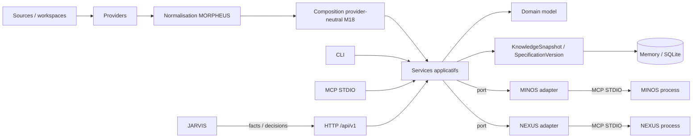
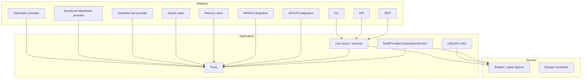
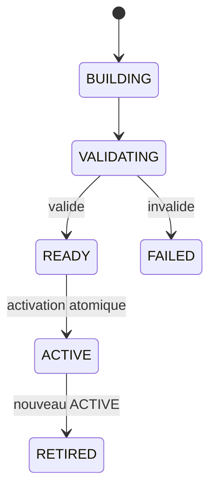
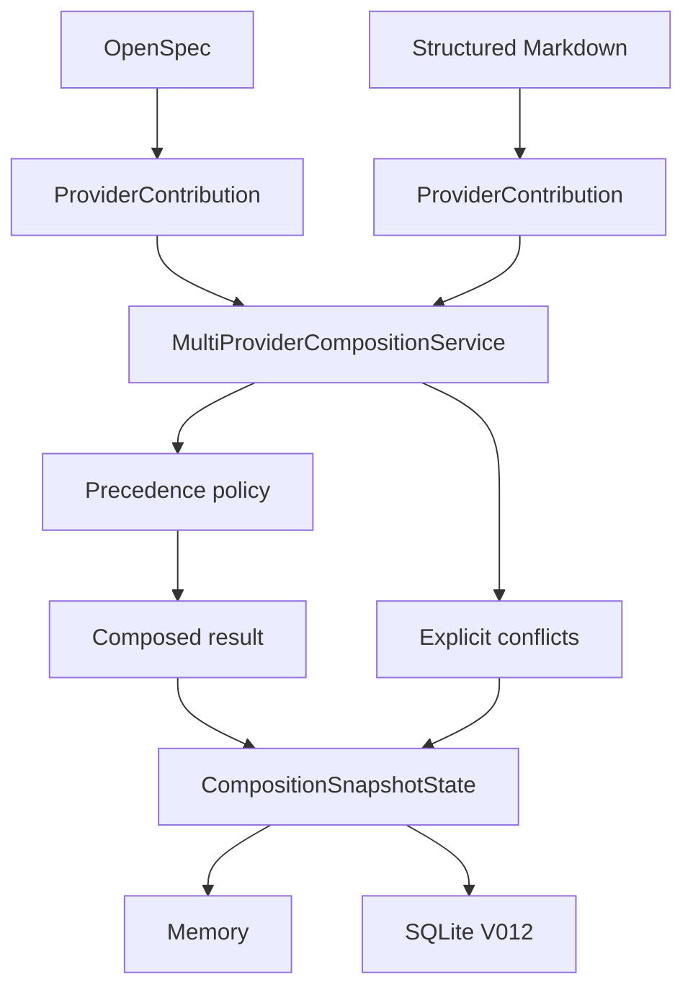
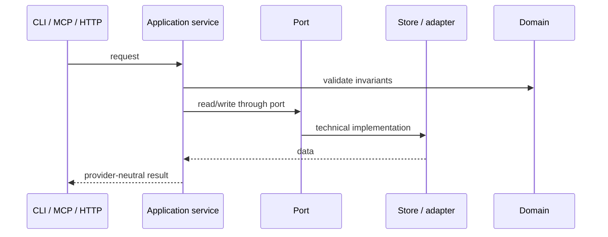

# Architecture MORPHEUS

Cette page décrit l’architecture logique et technique active après **M18** : dépendances, identité, temporalité, lifecycle, controlled write, composition multi-provider et frontières MINOS/NEXUS/JARVIS.

## 1. Vue système

MORPHEUS reçoit des sources de spécification, les normalise dans un modèle indépendant des providers, compose plusieurs contributions lorsque nécessaire, publie des snapshots versionnés et expose des services de requête, traçabilité, qualité, analyse et lifecycle contrôlé.



Providers réels M18 : **OpenSpec + Structured Markdown**. Synthetic reste un provider de test.

## 2. Architecture en couches

```text
adapters -> application -> domain
```



Règles exécutables :

```text
domain -X-> adapters
application -X-> adapters
provider-specific types -X-> domain/application contracts
API -X-> CLI/MCP/integration
MORPHEUS -X-> com.jarvis.*
MINOS integration -X-> com.minos.*
NEXUS integration -X-> com.nexus.*
```

Ces frontières sont couvertes par `morpheus-architecture-tests` : **170/170 PASS** au gate M18.

## 3. Modules Maven M18

```text
morpheus-domain
morpheus-application
morpheus-provider-openspec
morpheus-provider-markdown
morpheus-provider-synthetic
morpheus-store-memory
morpheus-store-sqlite
morpheus-integration-minos
morpheus-integration-nexus
morpheus-mcp
morpheus-api
morpheus-cli
morpheus-architecture-tests
```

Le gate M18 rapporte **14/14 modules SUCCESS** dans le reactor, parent compris.

## 4. Identité

```text
DomainIdentity != EntityVersionId != SourceLocator != ExternalReference
provider identifier != DomainIdentity
source path != identity
```

- `DomainIdentity` : identité logique stable MORPHEUS ;
- `EntityVersionId` : occurrence/version ;
- `SourceLocator` : emplacement source ;
- `ExternalReference` : lien vers une ressource externe ;
- provider identifier : identité/ownership dans l’espace du provider, jamais identité métier MORPHEUS.

## 5. Temporalité et snapshot

```text
TemporalState = CURRENT | PROPOSED | HISTORICAL
SpecificationVersion != KnowledgeSnapshot
```

Snapshot lifecycle :



Invariant :

```text
failed candidate != partial ACTIVE exposure
published history = RETIRED* -> ACTIVE
```

## 6. Lifecycle métier et état opérationnel

`ChangeLifecycleState` est distinct du snapshot :

```text
DRAFT
PROPOSED
SPECIFIED
DESIGNED
PLANNED
IMPLEMENTING
VERIFYING
COMPLETED
ARCHIVED
ABANDONED
```

L’évaluation est pure :

```text
ALLOWED | BLOCKED | UNKNOWN | REQUIRES_INPUT
```

La mutation M17 est une commande séparée, contrôlée par :

```text
WRITE_CHANGE
confirmation
expectedRevision / CAS
idempotencyKey
transition evaluation
audit append-only
```

```text
transition evaluation != lifecycle mutation
READ_CHANGES != WRITE_CHANGE
ALLOWED != applied
published snapshot != operational lifecycle state
stale revision != overwrite
idempotent retry != duplicate mutation/audit
```

## 7. Acceptance et contraintes

```text
Scenario != AcceptanceCriterion
AcceptanceCriterion != Test
Test existence != VERIFIED
Evidence != assertion
```

Contraintes :

```text
UNKNOWN != FAILED
UNKNOWN != BLOCKED
applicable != blocking
warning != blocker
severity != blocking policy
constraint text != executable policy
```

## 8. Composition multi-provider M18



La composition intervient **après normalisation**. Aucun provider n’a besoin de connaître les autres providers.

### Propriétés obligatoires

```text
provider ownership explicit
same logical entity may have multiple provider observations
precedence explicit
provenance preserved
non-selected candidates preserved
conflicts queryable
optional provider absence non-fatal
required provider absence explicit failure
```

### Conflits

```text
content
ownership
type / identity
absence vs value
ambiguous continuity
```

Un conflit n’est jamais résolu par last-write-wins silencieux.

## 9. Persistance M18

L’état de composition est snapshot-scoped et distinct du contenu provider.

```text
MemoryCompositionStateStore
SqliteCompositionStateStore
SQLite V012
```

Les contrats M18 valident :

```text
Memory == SQLite
providers/priorities/conflicts persisted
candidate provenance persisted
SQLite close/reopen exact
auto-commit restored after save failure
```

## 10. Surfaces publiques

### CLI

```text
composition sync
composition status
composition conflicts
lifecycle apply
```

### MCP

```text
22 read-only tools
+ 1 write tool

M18:
get_composition_status
list_composition_conflicts
```

### HTTP

```text
OpenAPI 3.1.0
contract 1.7.0
GET /api/v1/projects/{projectId}/composition
GET /api/v1/projects/{projectId}/composition/conflicts
```

Les surfaces exposent des projections provider-neutral.

## 11. Frontières cross-engine

```text
MORPHEUS = specification facts + intent + lifecycle rules
           + controlled state invariants + provider composition facts
MINOS    = code intelligence
NEXUS    = context selection / ranking / fusion / compression
JARVIS   = sequencing / orchestration / action choice
```

MINOS/NEXUS sont optionnels. Leur absence ne devient pas une panne globale MORPHEUS.

JARVIS peut choisir une action ; MORPHEUS reste responsable des invariants de l’état qu’il accepte éventuellement de muter.

## 12. Chemin d’une requête



## 13. Gate M18

```text
code testé       7e8caacff567f51354fcb88bd7505a6d135071c0
TOTAL            418/418 PASS
Architecture     170/170 PASS
Failures         0
Errors           0
Skipped          0
Packaging Win    PASS
Packaged smokes  PASS
API health       PASS
```

Merge ultérieur : `30f11ac3ffc522bcc0c71e31216a3fb70f0631d7`.

## 14. Suite M19

M19 doit prouver que ces invariants restent vrais à l’échelle et sous défaillance : performances mesurées, atomicité sous interruption, concurrence, locked DB, migrations, observabilité locale et sécurité locale.

Les budgets doivent être fixés **avant** optimisation.

## 15. Références

- [Guide développeur](README.md)
- [Build & tests](BUILD_AND_TEST.md)
- [API](API.md)
- [MCP](MCP.md)
- [ADR-0084](../adr/0084-provider-neutral-multi-provider-composition.md)
- [Validation M18](../validation/VALIDATION_M18.md)
- [Roadmap](../governance/ROADMAP.md)