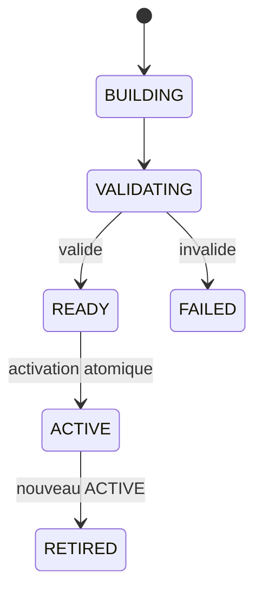
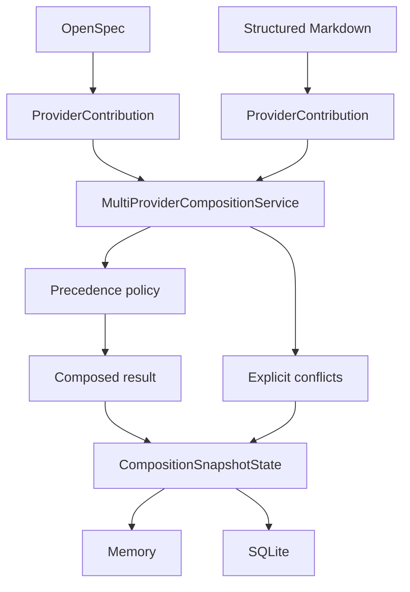

# Architecture MORPHEUS

Cette page décrit l’architecture logique et technique active après **M20 / MORPHEUS 1.0.0**.

## 1. Vue système

MORPHEUS reçoit des sources de spécification, les normalise dans un modèle indépendant des providers, compose plusieurs contributions, publie des snapshots versionnés et expose requêtes, traçabilité, qualité, analyse et lifecycle contrôlé.


Providers réels qualifiés : **OpenSpec + Structured Markdown**. Synthetic reste un provider de test.

## 2. Architecture en couches

```text
adapters -> application -> domain
```

Règles exécutables :

```text
domain -X-> adapters
application -X-> adapters
provider-specific types -X-> domain/application contracts
API -X-> CLI/MCP/integration
MORPHEUS -X-> com.jarvis.*
MINOS integration -X-> com.minos.*
NEXUS integration -X-> com.nexus.*
```

Ces frontières sont couvertes par `morpheus-architecture-tests` : **182/182 PASS** au gate M20 sur Windows et Linux.

## 3. Modules Maven

```text
morpheus-domain
morpheus-application
morpheus-provider-openspec
morpheus-provider-markdown
morpheus-provider-synthetic
morpheus-store-memory
morpheus-store-sqlite
morpheus-integration-minos
morpheus-integration-nexus
morpheus-mcp
morpheus-api
morpheus-cli
morpheus-architecture-tests
```

Le gate M20 rapporte **14/14 modules SUCCESS**, parent inclus.

## 4. Identité

```text
DomainIdentity != EntityVersionId != SourceLocator != ExternalReference
provider identifier != DomainIdentity
source path != identity
```

- `DomainIdentity` : identité logique stable MORPHEUS ;
- `EntityVersionId` : occurrence/version ;
- `SourceLocator` : emplacement source ;
- `ExternalReference` : lien vers une ressource externe ;
- provider identifier : identité dans l’espace du provider, jamais identité métier MORPHEUS.

## 5. Temporalité et snapshots

```text
TemporalState = CURRENT | PROPOSED | HISTORICAL
SpecificationVersion != KnowledgeSnapshot
```

Lifecycle snapshot :



Invariants :

```text
PROPOSED never leaks into CURRENT
failed candidate != partial ACTIVE exposure
published history = RETIRED* -> ACTIVE
APPLY != PROMOTE != ACTIVATE
```

## 6. Lifecycle métier et controlled write

États métier :

```text
DRAFT
PROPOSED
SPECIFIED
DESIGNED
PLANNED
IMPLEMENTING
VERIFYING
COMPLETED
ARCHIVED
ABANDONED
```

Évaluation :

```text
ALLOWED | BLOCKED | UNKNOWN | REQUIRES_INPUT
```

Mutation contrôlée :

```text
WRITE_CHANGE
confirmation
expectedRevision / CAS
idempotencyKey
transition evaluation
audit append-only
```

Invariants :

```text
transition evaluation != lifecycle mutation
READ_CHANGES != WRITE_CHANGE
ALLOWED != applied
published snapshot != operational lifecycle state
stale revision != overwrite
idempotent retry != duplicate mutation/audit
```

## 7. Acceptance et contraintes

```text
Scenario != AcceptanceCriterion
AcceptanceCriterion != Test
Test existence != VERIFIED
Evidence != assertion
UNKNOWN != FAILED
UNKNOWN != BLOCKED
applicable != blocking
warning != blocker
severity != blocking policy
constraint text != executable policy
```

## 8. Composition multi-provider



Propriétés obligatoires :

```text
provider ownership explicit
same logical entity may have multiple provider observations
precedence explicit
provenance preserved
non-selected candidates preserved
conflicts queryable
optional provider absence non-fatal
required provider absence explicit failure
```

```text
precedence != provenance erasure
conflict != silent last-write-wins
ambiguous continuity must be surfaced
```

## 9. Intégrations cross-engine

```text
MORPHEUS = specification facts + intent + lifecycle rules
           + controlled state invariants + provider composition facts
MINOS    = code intelligence
NEXUS    = context selection / ranking / fusion / compression
JARVIS   = sequencing / orchestration / action choice
```

MINOS et NEXUS sont optionnels et consommés via adapters. JARVIS n’est jamais embarqué et reste propriétaire du choix/séquencement d’actions.

## 10. Surfaces

MORPHEUS expose trois surfaces principales :

```text
CLI
MCP STDIO
HTTP /api/v1
```

La roadmap M21 introduit explicitement un objectif de **surface convergence** : les mêmes capacités métier doivent rester cohérentes entre transports sans imposer la même forme technique à chaque transport.

```text
surface parity != same transport shape
read surface != write capability
```

## 11. Persistance

Backends :

```text
Memory
SQLite
```

La persistance reste derrière les ports applicatifs. Les observations live externes ne mutent jamais implicitement les snapshots publiés.

## 12. Distribution MORPHEUS 1.0

M20 ajoute une séparation produit/état persistante.

Windows programme :

```text
%LOCALAPPDATA%\Programs\MORPHEUS
```

Windows état :

```text
%LOCALAPPDATA%\MORPHEUS\data
%LOCALAPPDATA%\MORPHEUS\config
%LOCALAPPDATA%\MORPHEUS\logs
%LOCALAPPDATA%\MORPHEUS\backups
```

Linux utilise XDG data/config/state.

Artefacts :

```text
MORPHEUS-1.0.0-windows-x64-setup.exe
morpheus-1.0.0-windows-x64.zip
morpheus-1.0.0-linux-x64.tar.gz
+ SHA-256 companions + release manifests
```

Le runtime Java est embarqué. Aucun JDK utilisateur n’est requis.

```text
program != persistent state
upgrade != reset knowledge store
uninstall != delete knowledge store
```

## 13. Baseline de preuve

```text
Code qualifié   9199ed43c4bd8596a97db055eeff17ae31399eb8
Merge M20       75d0b82ab0c960692db2fee1ced146fa6547fd4a
Tests           454/454 PASS Windows + Linux
Architecture    182/182 PASS Windows + Linux
Reactor         14/14 SUCCESS
Packaging       PASS Windows + Linux
```

Preuve autoritative : [`../validation/VALIDATION_M20.md`](../validation/VALIDATION_M20.md).

## 14. Direction post-M20

La trajectoire active est [`../roadmap/POST_M20_EVOLUTION.md`](../roadmap/POST_M20_EVOLUTION.md).

Le prochain jalon est **M21 — Production Integrity & Surface Convergence**. Les évolutions ultérieures doivent préserver toutes les frontières ci-dessus.