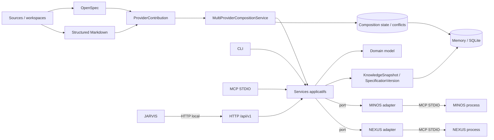

# Architecture MORPHEUS

Cette page décrit l’architecture logique et technique active après **M18**. Elle précise le sens des dépendances, la temporalité, les lifecycles, la composition multi-provider et les frontières MINOS/NEXUS/JARVIS.

## 1. Vue système

MORPHEUS reçoit des sources de spécification, les normalise dans un modèle indépendant des providers, compose les contributions compatibles, publie des snapshots versionnés puis expose requêtes, traçabilité, qualité, analyse, orchestration read-only et mutation lifecycle contrôlée.



OpenSpec et Structured Markdown sont deux providers réels validés en M18. Aucun format provider ne définit le domaine MORPHEUS.

## 2. Architecture en couches

```text
adapters -> application -> domain
```

Règles exécutables :

```text
domain -X-> providers/stores/CLI/MCP/API/integrations
application -X-> provider/store/transport implementations
provider-specific types -X-> domain/application
API -X-> CLI/MCP/integrations
MORPHEUS -X-> com.jarvis.*
MINOS adapter -X-> com.minos.*
NEXUS adapter -X-> com.nexus.*
```

Les règles sont contrôlées par `morpheus-architecture-tests` ; dernière preuve M18 : **170/170 PASS**.

## 3. Modules Maven

```text
morpheus-domain
morpheus-application
morpheus-provider-openspec
morpheus-provider-markdown
morpheus-provider-synthetic
morpheus-store-memory
morpheus-store-sqlite
morpheus-integration-minos
morpheus-integration-nexus
morpheus-mcp
morpheus-api
morpheus-cli
morpheus-architecture-tests
```

Le reactor M18 a validé **14/14 modules SUCCESS**. `morpheus-cli` reste le composition root du launcher officiel.

## 4. Identités

```text
DomainIdentity != EntityVersionId != SourceLocator != ExternalReference
SpecificationVersion != KnowledgeSnapshot
provider identifier != DomainIdentity
source path != identity
```

L’identité logique ne se déduit ni de l’ordre de lecture, ni du chemin, ni d’une similarité textuelle.

## 5. Temporalité

```text
CURRENT | PROPOSED | HISTORICAL
```

```text
PROPOSED never leaks into CURRENT
published history = RETIRED* -> ACTIVE
APPLY != PROMOTE != ACTIVATE
```

Une analyse, une requête, une résolution externe ou une évaluation lifecycle ne déclenche aucune promotion implicite.

## 6. KnowledgeSnapshot lifecycle

```text
BUILDING -> VALIDATING -> READY -> ACTIVE -> RETIRED
                     \-> FAILED
```

Propriété conservatrice : un candidat échoué ne détrône jamais l’ancien `ACTIVE`. M19 renforcera cette propriété sous interruption, corruption, verrouillage et concurrence.

## 7. Composition multi-provider — M18

Architecture validée :

```text
OpenSpec                 Structured Markdown
   \                         /
    -> normalized ProviderContribution
                |
    MultiProviderCompositionService
                |
     explicit precedence policy
                |
 composed content + CompositionConflict*
                |
      Memory / SQLite V012
```

Invariants :

```text
provider ownership is explicit
same logical entity may have multiple provider observations
precedence != provenance erasure
conflict != silent last-write-wins
ambiguous continuity must be surfaced
optional provider absence != project failure when optional
provider-specific types never leak into domain/application
```

La priorité choisit un candidat principal lorsque nécessaire ; elle ne supprime jamais les observations non sélectionnées. Les conflits de contenu, ownership, type/identité et absence-vs-présence sont des faits explicites.

## 8. RequirementDelta

```text
APPLY != PROMOTE != ACTIVATE
```

Les opérations restent distinctes : appliquer un delta sur une projection proposée, promouvoir explicitement, puis publier/activer selon les invariants de snapshot.

## 9. Change lifecycle et mutation contrôlée — M14→M17

Évaluation read-only :

```text
ALLOWED | BLOCKED | UNKNOWN | REQUIRES_INPUT
```

Mutation M17 distincte :

```text
WRITE_CHANGE capability
+ confirmation
+ expectedRevision / CAS
+ idempotency
+ transition réellement ALLOWED
+ audit append-only
```

```text
transition evaluation != lifecycle mutation
READ_CHANGES != WRITE_CHANGE
ALLOWED != applied
published snapshot != operational lifecycle state
stale revision != overwrite
idempotent retry != duplicate mutation/audit
```

JARVIS choisit et séquence l’action ; MORPHEUS évalue les règles et peut appliquer une commande explicite autorisée.

## 10. Acceptance, evidence et contraintes — M15/M16

```text
Scenario != AcceptanceCriterion
AcceptanceCriterion != Test
Test existence != VERIFIED
Evidence != assertion
UNKNOWN != FAILED
UNKNOWN != BLOCKED
applicable != blocking
warning != blocker
severity != blocking policy
```

## 11. MINOS

MINOS possède l’intelligence de code. MORPHEUS ne dépend pas de `com.minos.*` et traduit les observations MCP STDIO en résultats provider-neutral de référence externe.

```text
live external observation != published snapshot mutation
```

## 12. NEXUS

NEXUS possède sélection, ranking, fusion, compression et budget du contexte technique.

```text
MORPHEUS intent != NEXUS ContextBundle
NEXUS ContextBundle != KnowledgeSnapshot persistence
```

## 13. JARVIS

```text
MORPHEUS = specification facts
           + intent
           + lifecycle rules
           + controlled state invariants
           + provider composition facts
JARVIS   = sequencing + orchestration + action choice
```

Routes d’orchestration read-only :

```text
GET  /api/v1/projects/{projectId}/changes/{changeId}/orchestration
POST /api/v1/projects/{projectId}/changes/{changeId}/transition-check
```

Mutation contrôlée distincte :

```text
POST /api/v1/projects/{projectId}/changes/{changeId}/lifecycle-transitions
```

`MORPHEUS rules != JARVIS action sequencing`.

## 14. Surfaces M18

```text
CLI  composition sync | status | conflicts
MCP  get_composition_status | list_composition_conflicts
HTTP GET /api/v1/projects/{projectId}/composition
HTTP GET /api/v1/projects/{projectId}/composition/conflicts
OpenAPI 1.7.0
SQLite V012
```

## 15. Baseline validée

```text
M18             ✅ VALIDÉ / INTÉGRÉ — PR #86
Code validé     7e8caacff567f51354fcb88bd7505a6d135071c0
Merge           30f11ac3ffc522bcc0c71e31216a3fb70f0631d7
Tests           418/418 PASS
Architecture    170/170 PASS
Packaging       Windows + smokes + API health PASS
```

M19 — **Production Hardening, Scale & Operability** — est le prochain jalon. Sa porte de sortie porte sur le déterminisme, l’observabilité et l’exploitabilité à l’échelle avec budgets mesurés.