# Architecture MORPHEUS

Cette page décrit l’architecture logique et technique active après M14. Elle précise le sens des dépendances, le modèle temporel, le lifecycle des snapshots et des changements, le chemin des requêtes ainsi que les frontières MINOS/NEXUS/JARVIS.

## 1. Vue système

MORPHEUS reçoit des sources de spécification, les normalise dans un modèle indépendant du provider, publie des snapshots versionnés, puis expose des services de requête, traçabilité, qualité, analyse et orchestration read-only.

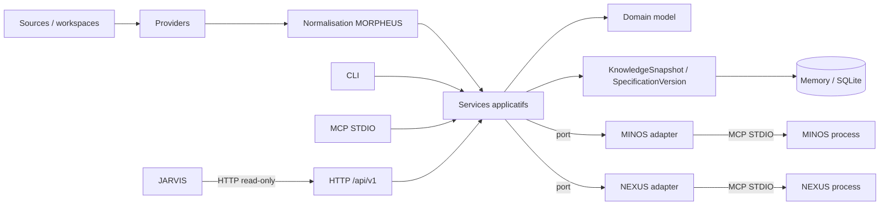

OpenSpec est le provider de référence initial, mais il ne définit pas le domaine MORPHEUS.

## 2. Architecture en couches

Le cœur suit une architecture hexagonale/ports-adapters simple :

```text
adapters -> application -> domain
```

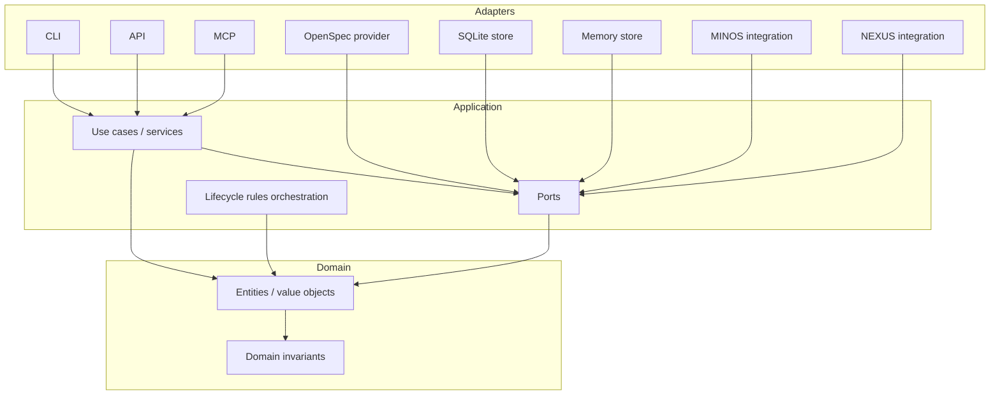

### Règles exécutables principales

- `com.morpheus.domain..` ne dépend d’aucun provider, store, CLI, MCP, API, intégration ou implémentation externe ;
- `com.morpheus.application..` définit use cases et ports sans dépendre des adapters ;
- l’API HTTP reste un sibling de CLI/MCP ;
- les intégrations MINOS/NEXUS implémentent des ports applicatifs ;
- aucune classe MORPHEUS ne dépend de `com.jarvis.*` ;
- les adapters externes ne doivent pas déplacer dans leur couche des règles qui changent le sens métier.

Ces règles sont contrôlées dans `morpheus-architecture-tests` avec ArchUnit.

## 3. Modules Maven

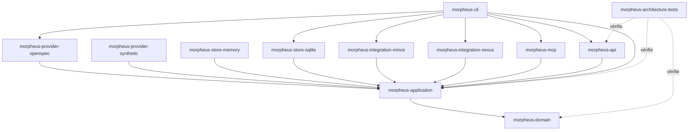

Le parent Maven agrège les modules ; `morpheus-cli` joue le rôle de composition root pour le launcher officiel.

## 4. Domaine : identités et objets principaux

MORPHEUS distingue systématiquement identité logique, version, emplacement source et référence externe.

```text
DomainIdentity != EntityVersionId != SourceLocator != ExternalReference
```

Vue UML conceptuelle :

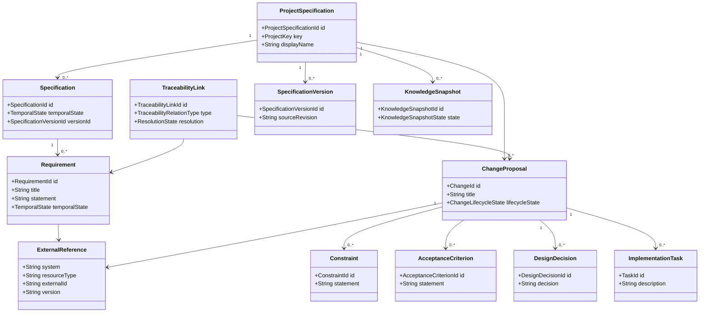

Ce diagramme exprime les responsabilités conceptuelles ; il ne remplace pas les types Java ni les ADR.

## 5. Temporalité : CURRENT / PROPOSED / HISTORICAL

L’état temporel décrit la position d’une information par rapport à la référence publiée.

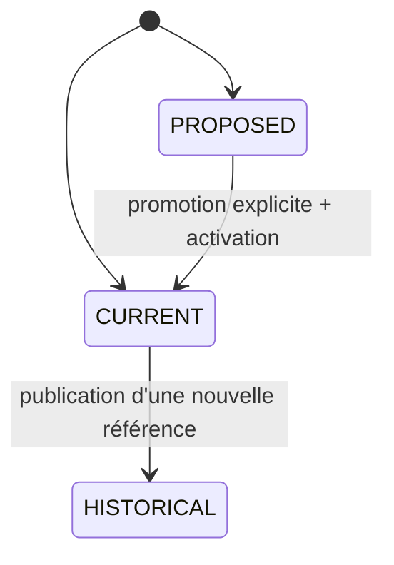

Règles :

- une proposition ne fuit jamais implicitement dans `CURRENT` ;
- une lecture de changement proposé ne modifie pas la référence ;
- une analyse n’est pas une promotion ;
- l’historique publié n’est pas réécrit.

## 6. SpecificationVersion et KnowledgeSnapshot

Ces concepts répondent à des questions différentes :

- `SpecificationVersion` : identité/version logique de la spécification ;
- `KnowledgeSnapshot` : ensemble cohérent de connaissances persistées avec un lifecycle technique.

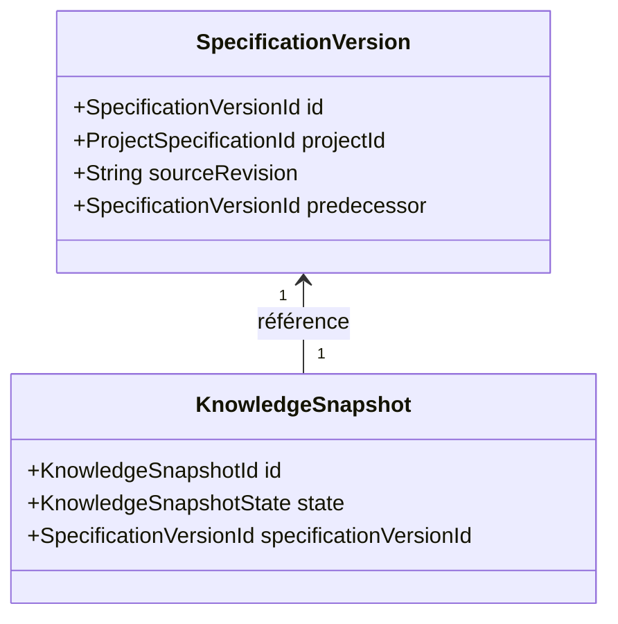

`SpecificationVersion != KnowledgeSnapshot` reste un invariant explicite.

## 7. Lifecycle d’un KnowledgeSnapshot

États réels du domaine snapshot :

```text
BUILDING | VALIDATING | READY | ACTIVE | FAILED | RETIRED
```

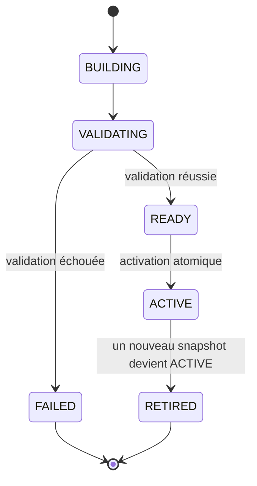

La publication doit respecter une propriété conservatrice : un candidat échoué ne détrône jamais l’ancien `ACTIVE`.

## 8. Synchronisation publiée

La synchronisation officielle suit une reconstruction complète conservatrice.

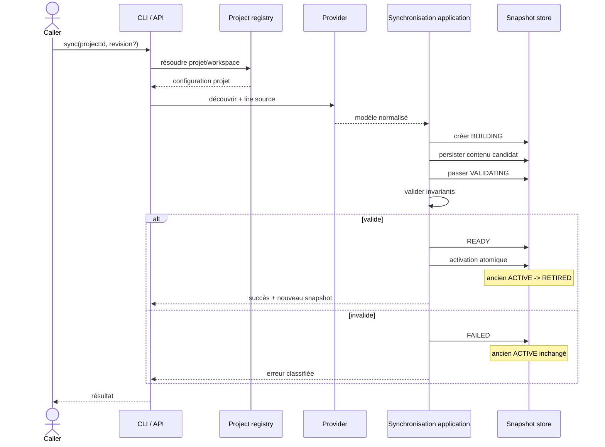

Une synchronisation n’est pas une simple copie de fichiers : elle reconstruit un modèle normalisé cohérent avant publication.

## 9. RequirementDelta : APPLY, PROMOTE, ACTIVATE

La chaîne de mutation est explicitement séparée :

```text
APPLY != PROMOTE != ACTIVATE
```

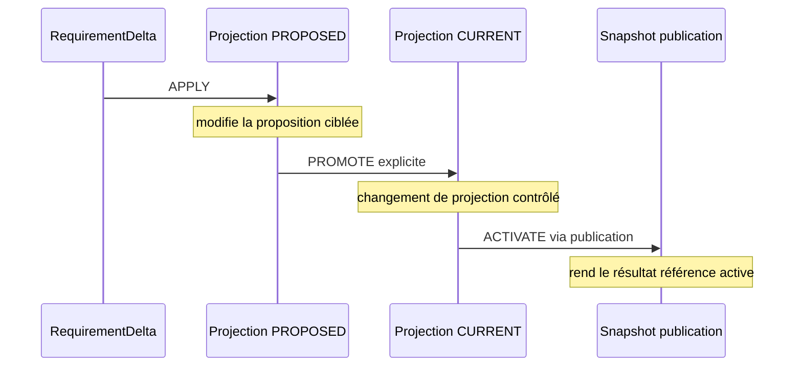

Une analyse, requête, résolution externe ou évaluation lifecycle ne déclenche implicitement aucune de ces étapes.

## 10. Lifecycle d’un ChangeProposal

La machine déterministe est `ChangeLifecycleStateMachine`.

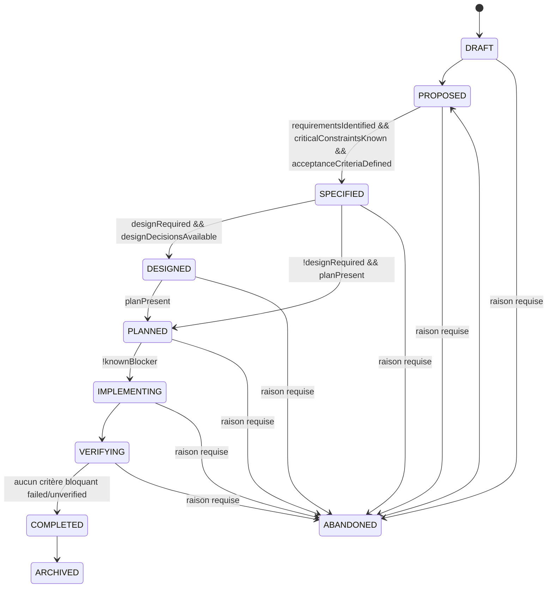

Transitions arrière canoniques possibles sous politique explicite :

```text
SPECIFIED     -> PROPOSED
DESIGNED      -> SPECIFIED
PLANNED       -> DESIGNED
IMPLEMENTING  -> PLANNED
VERIFYING     -> IMPLEMENTING
COMPLETED     -> VERIFYING
```

Elles exigent `allowBackwardTransitions=true`. `COMPLETED -> VERIFYING` exige en plus `allowCompletedReopen=true`.

`ARCHIVED` ne peut pas être rouvert par cette machine.

## 11. Évaluation de transition vs mutation

Le contrat M14 expose seulement une décision read-only :

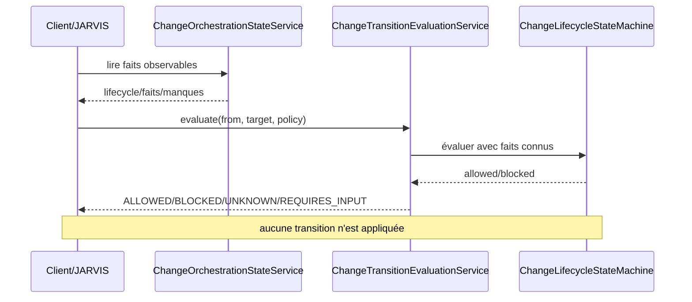

`UNKNOWN` est important : un fait indisponible ne doit jamais être converti en `false` pour fabriquer une décision.

## 12. Traçabilité

`TraceabilityLink` est un concept de premier ordre. MORPHEUS conserve des liens observables, persistés ou déterministement dérivables selon les contrats validés.

```text
absence de lien != lien inventé
DETERMINISTIC != HEURISTIC
Scenario != AcceptanceCriterion
```

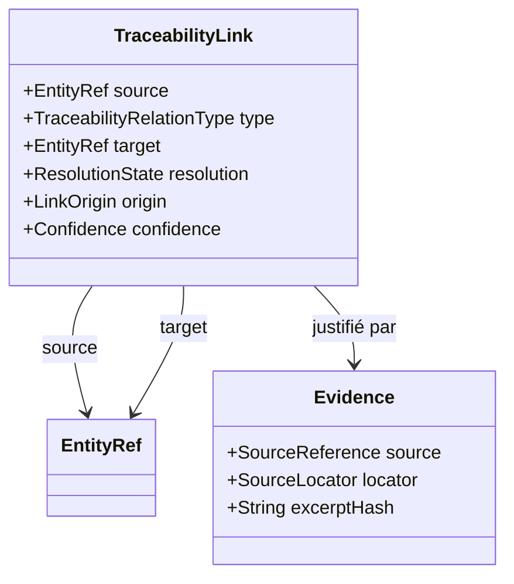

Les diagnostics qualité et vues de contexte dérivent de ces faits ; ils ne mutent pas les snapshots.

## 13. Chemin d’une query

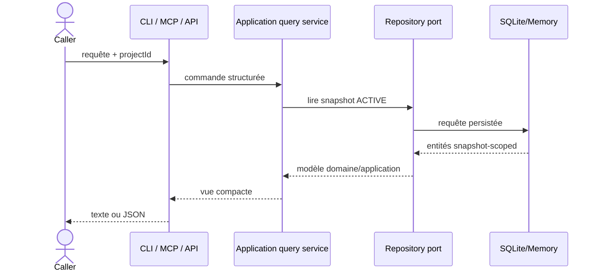

Les queries sont snapshot-scoped ; elles ne lisent pas directement le workspace source.

## 14. MINOS

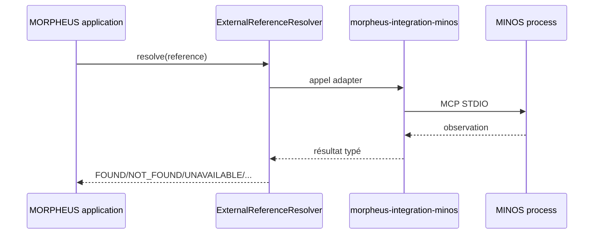

Contraintes :

- aucune dépendance `com.minos.*` ;
- MINOS n’est pas embarqué ;
- matching d’identité exact sur `symbolKey` ;
- observation live séparée de la référence persistée ;
- `persisted=false` pour la résolution live.

## 15. NEXUS

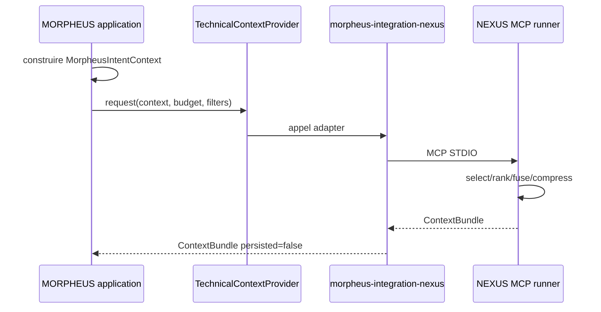

Frontière :

```text
MORPHEUS = intention structurée
NEXUS    = sélection / ranking / fusion / compression / budget
```

MORPHEUS ne reranke pas le bundle et ne le persiste pas dans `KnowledgeSnapshot`.

## 16. JARVIS

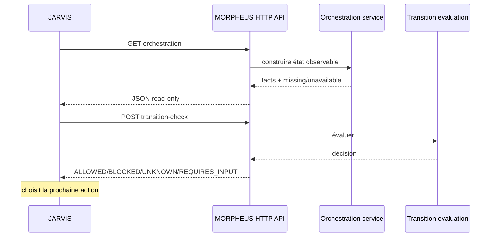

Frontière :

```text
MORPHEUS = specification facts + lifecycle rules + transition decisions
JARVIS   = sequencing + orchestration + action choice
```

MORPHEUS n’applique pas de transition à la demande de ce contrat et ne choisit pas l’action suivante.

## 17. Composition root

`morpheus-cli` porte le launcher officiel `MorpheusMain`. Il compose :

- SQLite ;
- providers ;
- intégrations MINOS/NEXUS optionnelles ;
- serveur MCP ;
- serveur HTTP ;
- surfaces CLI.

La composition root peut connaître les implémentations concrètes pour les assembler, mais ne doit pas héberger de nouvelle règle métier.

## 18. Comment décider où ajouter du code ?

| Besoin | Couche/module |
|---|---|
| nouvelle valeur/invariant métier pur | `morpheus-domain` |
| nouveau use case ou règle d’orchestration métier | `morpheus-application` |
| lire un nouveau format source | nouveau/ancien `morpheus-provider-*` |
| nouvelle persistance | `morpheus-store-*` via port applicatif |
| nouvelle surface HTTP | `morpheus-api` |
| nouveau tool MCP | `morpheus-mcp` |
| nouvelle commande et wiring | `morpheus-cli` |
| appel à un moteur externe | `morpheus-integration-*` via port |
| interdiction de dépendance | `morpheus-architecture-tests` |

## 19. Décisions d’architecture

Voir [`../adr/README.md`](../adr/README.md). Les ADR restent la source de vérité pour le **pourquoi** des choix ; cette page décrit leur architecture résultante.
