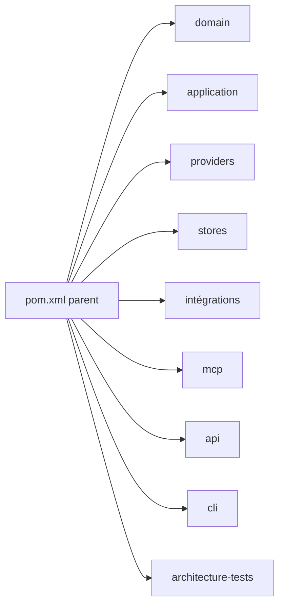
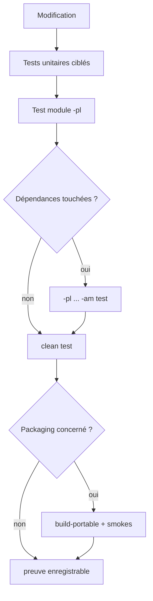
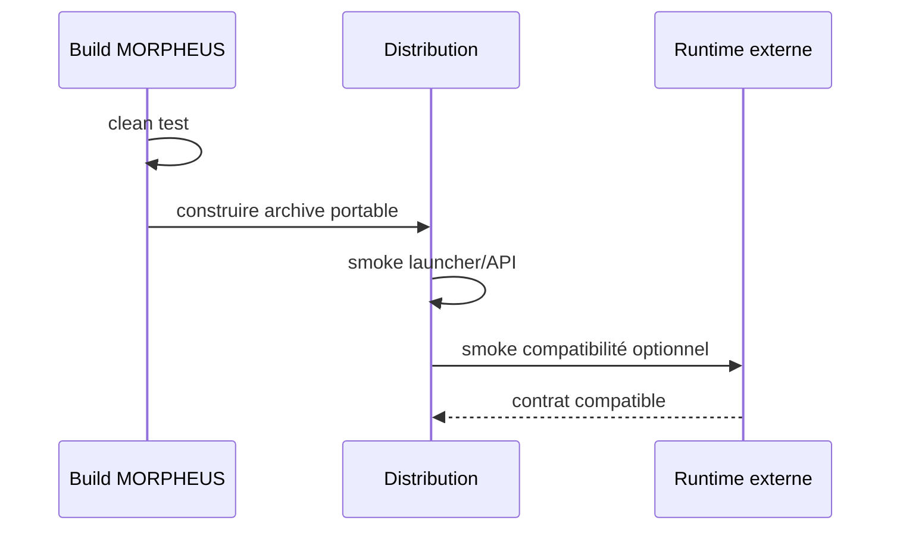
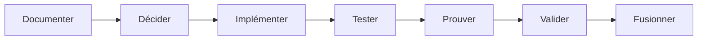

# Build, tests et validation

Ce guide décrit l’environnement de développement, le reactor Maven, les tests ciblés, le gate autoritatif, le packaging portable et la manière de diagnostiquer un build local.

## 1. Toolchain

Le parent Maven impose :

```text
Java >= 21
Maven >= 3.9.16 et < 4.0.0
compiler release = 21
```

Le dépôt fournit un Maven Wrapper configuré sur Maven 3.9.16. Utiliser le wrapper plutôt qu’un Maven système.

### Vérification Windows

```powershell
java -version
.\mvnw.cmd --version
```

### Vérification Unix/Linux

```bash
java -version
./mvnw --version
```

Le JDK qui exécute Maven doit satisfaire la règle Enforcer Java.

## 2. Import IntelliJ IDEA

MORPHEUS est un projet Maven multi-module. Après ouverture du dépôt, le `pom.xml` racine doit être chargé comme projet Maven.

Symptôme d’un mauvais import :

```text
Project Structure > Modules
└── morpheus-engine
```

alors que les répertoires `morpheus-domain`, `morpheus-api`, etc. apparaissent comme de simples dossiers.

Correction :

1. clic droit sur `pom.xml` racine ;
2. **Add as Maven Project** / **Load Maven Project** ;
3. recharger le projet Maven.

Résultat attendu : les modules du reactor apparaissent individuellement dans IntelliJ et leurs `src/main/java` / `src/test/java` sont reconnus comme source roots.

## 3. Reactor Maven

Le parent agrège :

```text
morpheus-domain
morpheus-application
morpheus-provider-openspec
morpheus-provider-synthetic
morpheus-store-memory
morpheus-store-sqlite
morpheus-integration-minos
morpheus-integration-nexus
morpheus-mcp
morpheus-api
morpheus-cli
morpheus-architecture-tests
```



## 4. Gate local autoritatif

### Windows

```powershell
.\mvnw.cmd clean test
```

### Unix / Linux

```bash
./mvnw clean test
```

Ce gate repart d’un `target/` propre et exécute le reactor complet. Il doit être lancé avant de déclarer une modification technique validée.

## 5. Gate M14 de référence

Le dernier gate fonctionnel complet validé avant intégration de M14 a produit :

```text
Domain              21/21 PASS
Application         87/87 PASS
OpenSpec             26/26 PASS
Synthetic             7/7 PASS
SQLite                7/7 PASS
MINOS Integration     8/8 PASS
NEXUS Integration     7/7 PASS
MCP                    5/5 PASS
API                    9/9 PASS
CLI                  20/20 PASS
Architecture       160/160 PASS
--------------------------------
TOTAL              357/357 PASS
Failures                 0
Errors                   0
Skipped                  0
BUILD SUCCESS
```

Cette valeur est une preuve historique M14. Le nombre total de tests peut évoluer ; le critère courant est l’absence d’échec sur le gate réellement exécuté.

## 6. Tests ciblés

### Un module seul

```powershell
.\mvnw.cmd -pl morpheus-domain test
.\mvnw.cmd -pl morpheus-application test
.\mvnw.cmd -pl morpheus-api test
.\mvnw.cmd -pl morpheus-mcp test
.\mvnw.cmd -pl morpheus-architecture-tests test
```

### Module + dépendances nécessaires

```powershell
.\mvnw.cmd -pl morpheus-api -am test
```

`-am` signifie *also make* : Maven construit les dépendances du reactor requises par le module sélectionné.

### Plusieurs modules

```powershell
.\mvnw.cmd -pl morpheus-domain,morpheus-application,morpheus-api -am test
```

Les tests ciblés accélèrent la boucle locale, mais ne remplacent pas `clean test` avant validation finale.

## 7. Ordre de test recommandé selon le changement



Exemples :

| Changement | Tests minimaux avant gate complet |
|---|---|
| value object domaine | `-pl morpheus-domain test` |
| lifecycle/application | `-pl morpheus-application -am test` |
| endpoint HTTP | `-pl morpheus-api -am test` |
| tool MCP | `-pl morpheus-mcp -am test` |
| intégration MINOS | `-pl morpheus-integration-minos -am test` |
| frontière de dépendance | `-pl morpheus-architecture-tests -am test` |

## 8. Compilation sans tests

Pour diagnostiquer rapidement un problème de compilation :

```powershell
.\mvnw.cmd -DskipTests compile
```

Pour un module :

```powershell
.\mvnw.cmd -pl morpheus-api -am -DskipTests compile
```

Ne pas utiliser cette commande comme preuve de validation fonctionnelle.

## 9. Packaging Maven

Le packaging Maven standard peut être exécuté avec :

```powershell
.\mvnw.cmd clean package
```

Le launcher développeur peut ensuite utiliser l’uber-JAR produit par `morpheus-cli` lorsque le profil/build correspondant l’a généré.

## 10. Packaging portable Windows

```powershell
.\distribution\build-portable.ps1
```

Artefact :

```text
dist/morpheus-<version>-windows-x64.zip
```

Le script :

1. construit le projet ;
2. produit l’uber-JAR ;
3. construit un `jpackage app-image` ;
4. embarque le runtime Java ;
5. construit l’archive portable ;
6. exécute les smokes prévus par le packaging.

L’utilisateur final n’a donc pas besoin d’installer un JDK.

## 11. Packaging portable Linux

```bash
chmod +x mvnw distribution/build-portable.sh
./distribution/build-portable.sh
```

Artefact :

```text
dist/morpheus-<version>-linux-x64.tar.gz
```

## 12. Contraintes de packaging

La distribution MORPHEUS peut embarquer les **adapters clients** MINOS/NEXUS, mais jamais leurs implémentations ni JARVIS.

Le packaging vérifie notamment l’absence de :

```text
com/minos/*
com/nexus/*
com/jarvis/*
```

Cette règle protège l’autonomie des moteurs et évite qu’une intégration optionnelle devienne une dépendance cachée.

## 13. Smokes cross-repo complémentaires

```text
distribution/test-minos-compatibility.ps1
distribution/test-nexus-compatibility.ps1
```

Ils servent à prouver la compatibilité avec de vrais runtimes externes. Ils ne remplacent pas le gate autonome MORPHEUS.



## 14. Tests d’architecture

`morpheus-architecture-tests` utilise ArchUnit pour transformer certaines frontières en règles exécutables.

Il protège notamment :

```text
domain -X-> adapters
application -X-> adapters
api -X-> cli/mcp/integration
MORPHEUS -X-> com.jarvis.*
MINOS adapter -X-> com.minos.*
NEXUS adapter -X-> com.nexus.*
```

Un échec ArchUnit n’est pas un problème cosmétique : il indique qu’une frontière décidée a été traversée.

## 15. Diagnostiquer un build qui échoue

### Enforcer Java/Maven

Symptôme : échec avant compilation.

Vérifier :

```powershell
java -version
.\mvnw.cmd --version
```

### Un module compile dans IntelliJ mais pas Maven

Maven est la source de vérité du build. Vérifier que l’IDE a bien importé le `pom.xml` racine comme projet Maven et que le JDK du Maven Runner correspond au JDK attendu.

### Une dépendance inter-module est introuvable

Utiliser `-am` pendant le test ciblé :

```powershell
.\mvnw.cmd -pl morpheus-api -am test
```

### Tests passants ciblés mais gate complet rouge

Le changement a probablement un impact cross-module ou architectural. Corriger le gate complet ; ne pas valider sur la seule base des tests ciblés.

## 16. Warnings connus

Les validations M12-M14 ont observé des warnings non bloquants liés notamment à l’accès natif SQLite et à l’absence de provider SLF4J dans certains tests.

Règle : un warning nouveau doit être évalué. Il ne doit jamais être classé automatiquement comme « historique » sans comparaison.

## 17. Règle de preuve

Pour une modification technique :

1. documenter l’invariant ou la décision ;
2. implémenter ;
3. exécuter les tests ciblés utiles ;
4. exécuter le gate complet ;
5. enregistrer le SHA réellement testé ;
6. accepter l’ADR seulement après preuve lorsqu’elle dépend d’une hypothèse ;
7. mettre à jour roadmap/validation lorsque la gouvernance le demande ;
8. fusionner uniquement selon la gouvernance du dépôt.



Historique des preuves : [`../governance/ROADMAP.md`](../governance/ROADMAP.md) et [`../validation/`](../validation/).
