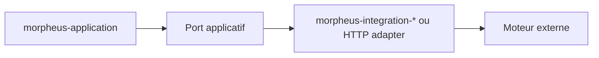
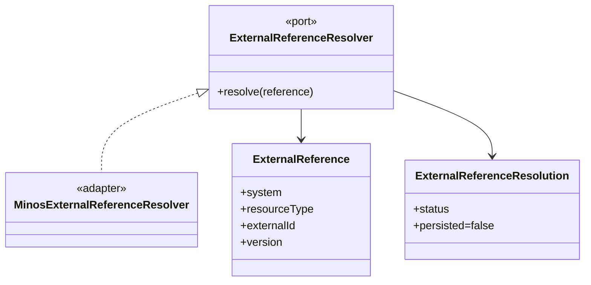
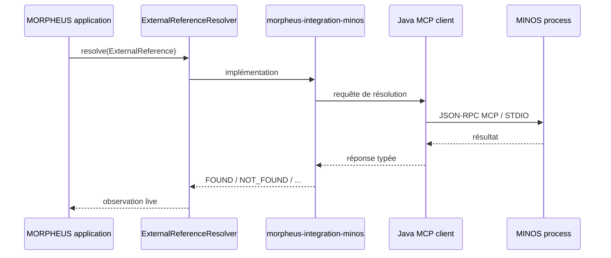
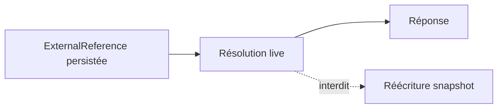
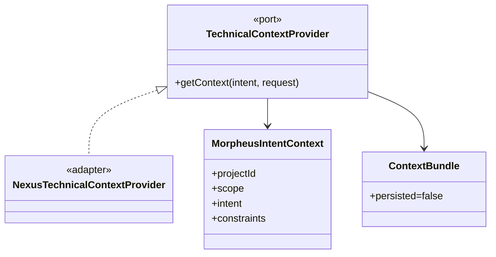
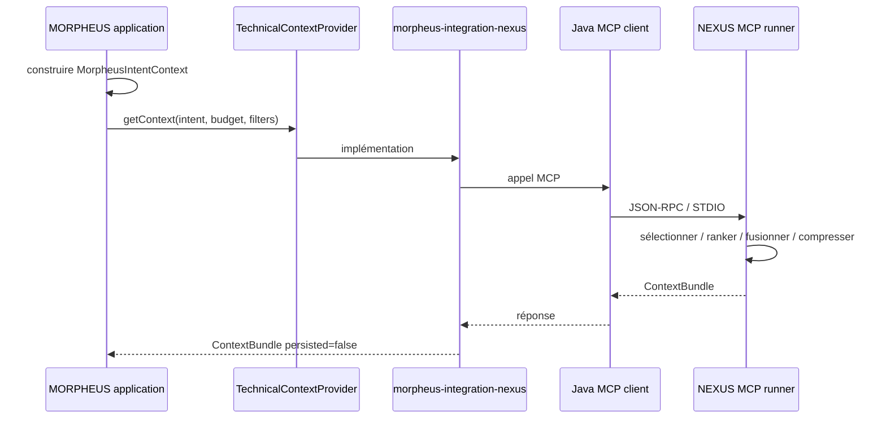
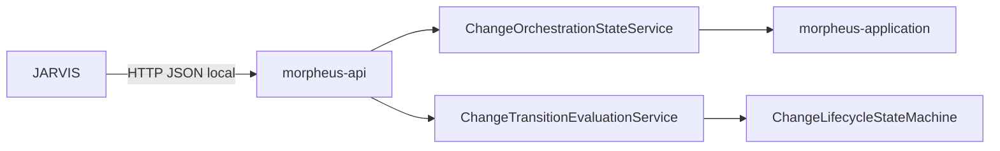
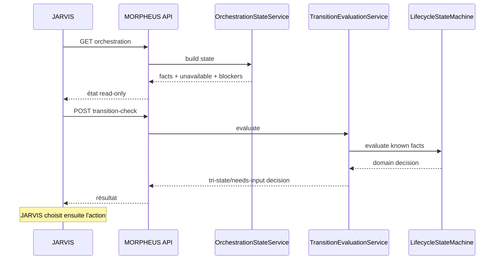
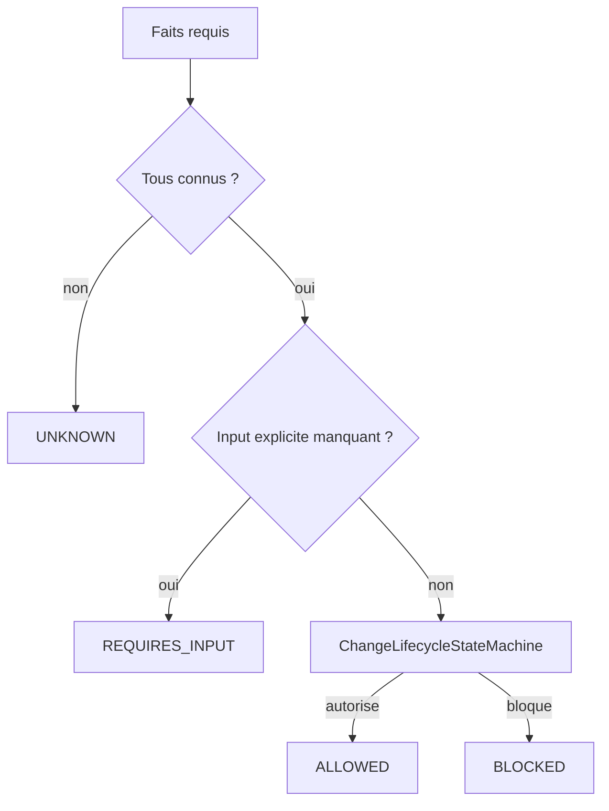
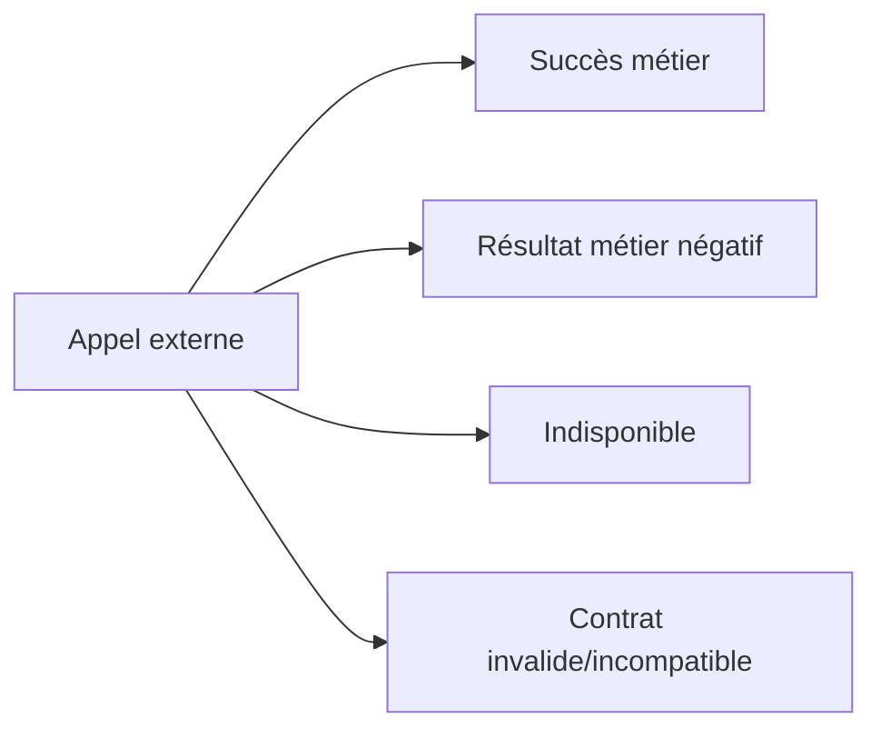

# Intégrations cross-engine

MORPHEUS reste autonome. Les intégrations externes implémentent des ports explicites et ne transfèrent pas la propriété du domaine.

```text
MORPHEUS = specification / intent / lifecycle rules
MINOS    = code intelligence
NEXUS    = context selection / ranking / fusion / compression
JARVIS   = orchestration / sequencing
```

## 1. Règle d’architecture commune

Une intégration suit le même patron :



Le domaine et l’application ne doivent pas dépendre des classes du moteur externe. Le contrat est traduit à la frontière de l’adapter.

Conséquences :

- les modèles `com.minos.*`, `com.nexus.*` et `com.jarvis.*` ne deviennent pas des types du domaine MORPHEUS ;
- l’indisponibilité d’un moteur externe reste un état explicite ;
- une observation live ne devient pas silencieusement une donnée persistée ;
- les adapters ne réimplémentent pas les responsabilités du moteur distant.

# 2. MINOS

## 2.1 Responsabilité

MINOS résout une référence de code MORPHEUS vers l’état observé du code indexé.



## 2.2 Flux runtime



## 2.3 Contraintes

```text
aucune dépendance com.minos.*
MINOS non embarqué
matching exact sur symbolKey
révision optionnelle comparée à activeSnapshotId MINOS
observation live séparée de la référence persistée
persisted=false pour la résolution live
```

Configuration :

```text
MORPHEUS_MINOS_JAR
MORPHEUS_MINOS_JAVA
MORPHEUS_MINOS_HOME
MORPHEUS_MINOS_TIMEOUT_SECONDS
```

## 2.4 Résultats resolver

```text
FOUND
NOT_FOUND
UNAVAILABLE
AMBIGUOUS
REVISION_MISMATCH
UNSUPPORTED
```

Sémantique :

| Statut | Sens |
|---|---|
| `FOUND` | identité externe résolue sans ambiguïté |
| `NOT_FOUND` | moteur disponible, symbole absent |
| `UNAVAILABLE` | résolution impossible à obtenir |
| `AMBIGUOUS` | plusieurs candidats incompatibles avec une résolution sûre |
| `REVISION_MISMATCH` | révision attendue et snapshot MINOS incompatibles |
| `UNSUPPORTED` | type/système de référence non géré par cet adapter |

`NOT_FOUND != UNAVAILABLE` est une distinction fonctionnelle, pas seulement technique.

## 2.5 Persistance



MORPHEUS traduit les états MINOS sans réécrire rétroactivement les snapshots publiés.

# 3. NEXUS

## 3.1 Responsabilité

MORPHEUS produit une intention structurée ; NEXUS choisit le contexte technique sous contraintes et budget.



## 3.2 Flux runtime



## 3.3 Frontière de responsabilité

```text
MORPHEUS = construction de l’intention déterministe
NEXUS    = sélection / ranking / fusion / compression / budget technique
```

MORPHEUS ne doit pas :

- reranker le `ContextBundle` ;
- réappliquer un budget technique déjà traité par NEXUS ;
- fusionner une seconde fois les résultats ;
- persister le bundle dans `KnowledgeSnapshot` ;
- administrer implicitement les projets NEXUS.

Configuration :

```text
MORPHEUS_NEXUS_JAR
MORPHEUS_NEXUS_JAVA
MORPHEUS_NEXUS_HOME
MORPHEUS_NEXUS_TIMEOUT_SECONDS
```

## 3.4 Mapping projet explicite

Chaque requête exige :

```text
nexusProject = UUID ou nom unique du projet NEXUS
```

Pas d’inférence depuis un chemin local. MORPHEUS ne lance pas `project add`, index ou rebuild côté NEXUS.

Cette décision évite de confondre l’identité d’un `ProjectSpecification` MORPHEUS avec l’identité d’un projet NEXUS.

# 4. JARVIS

## 4.1 Direction de dépendance

Contrairement à MINOS/NEXUS, MORPHEUS ne lance pas JARVIS. C’est JARVIS qui consomme l’API HTTP MORPHEUS.



Il n’existe aucune dépendance `com.jarvis.*` côté MORPHEUS.

## 4.2 Frontière métier

```text
MORPHEUS = facts + lifecycle rules + transition decisions
JARVIS   = sequencing + orchestration + action choice
```

MORPHEUS répond à :

- quels faits sont observables ?
- quels artefacts sont manquants ?
- quelles contraintes sont bloquantes ?
- quelles transitions seraient autorisées ?
- quelle est la décision d’évaluation ?

JARVIS décide :

- quelle action exécuter ;
- dans quel ordre ;
- quel agent/outillage mobiliser ;
- quand réinterroger MORPHEUS.

## 4.3 API d’orchestration

```text
GET  /api/v1/projects/{projectId}/changes/{changeId}/orchestration
POST /api/v1/projects/{projectId}/changes/{changeId}/transition-check
```

Le POST calcule une décision mais n’applique aucune transition.



## 4.4 Lifecycle explicite

```text
lifecycle absent  -> source=UNAVAILABLE
lifecycle fourni  -> source=CALLER_SUPPLIED
```

Un état n’est jamais inféré depuis :

```text
tasks
timestamps
chemins d’archive
quality findings
présence d’un test
```

Cette règle évite de transformer des indices en faits.

## 4.5 Décisions

```text
ALLOWED
BLOCKED
UNKNOWN
REQUIRES_INPUT
```

Le pipeline logique est :



`UNAVAILABLE` n’est jamais converti en `false` pour fabriquer une décision.

## 4.6 Raisons d’abandon

Les raisons d’abandon observation/source/cible sont distinctes :

```text
abandonmentReason
fromAbandonmentReason
target abandonmentReason
```

Une transition vers `ABANDONED` exige une raison explicite. Une reprise depuis `ABANDONED` retourne vers `PROPOSED` selon la machine actuelle.

## 4.7 Client JARVIS validé

Configuration :

```text
jarvis.morpheus.enabled=${MORPHEUS_ENABLED:false}
jarvis.morpheus.url=${MORPHEUS_URL:http://127.0.0.1:8765}
jarvis.morpheus.project-id=${MORPHEUS_PROJECT_ID:}
jarvis.morpheus.timeout-seconds=${MORPHEUS_TIMEOUT_SECONDS:3}
```

Le client est fail-open et retourne une absence de contexte si MORPHEUS est désactivé, mal configuré, indisponible ou répond avec un contrat incompatible.

# 5. Matrice de propriété des données

| Donnée/capacité | Propriétaire | MORPHEUS persiste ? |
|---|---|---:|
| requirement normalisé | MORPHEUS | oui |
| traceability link MORPHEUS | MORPHEUS | oui |
| ExternalReference | MORPHEUS | oui |
| observation actuelle d’un symbole MINOS | MINOS | non |
| ContextBundle NEXUS | NEXUS | non |
| décision de transition MORPHEUS | MORPHEUS (calcul) | non via contrat M14 |
| choix de l’action suivante | JARVIS | non |

# 6. Failure semantics

Une intégration robuste doit préserver quatre catégories :



Exemples :

- MINOS `NOT_FOUND` = résultat métier négatif ;
- MINOS `UNAVAILABLE` = moteur/résolution indisponible ;
- NEXUS absent = contexte technique indisponible seulement ;
- client JARVIS incompatible = absence de contexte côté JARVIS en mode fail-open.

Ne jamais écraser ces catégories en simple booléen.

# 7. Règles d’architecture exécutables

Les tests ArchUnit imposent notamment :

```text
domain -X-> provider/store/cli/mcp/api/integration
application -X-> provider/store/cli/mcp/api/integration
api -X-> cli/mcp/integration
MINOS adapter -X-> com.minos.*
NEXUS adapter -X-> com.nexus.*
MORPHEUS -X-> com.jarvis.*
```

Lors de l’ajout d’une nouvelle intégration, ajouter aussi les règles empêchant les dépendances inverses non souhaitées.

# 8. Ajouter une nouvelle intégration

Checklist :

1. définir précisément la responsabilité du moteur externe ;
2. définir un port applicatif en termes MORPHEUS ;
3. garder le modèle externe dans l’adapter ;
4. définir les statuts d’indisponibilité/ambiguïté ;
5. décider explicitement ce qui est persisté ou live ;
6. implémenter l’adapter ;
7. ajouter tests unitaires et contrat/subprocess si pertinent ;
8. ajouter règle ArchUnit ;
9. documenter configuration et failure semantics ;
10. ajouter smoke cross-repo seulement en complément du gate autonome.

# 9. Tests et smokes

M14 a validé :

```text
MINOS Integration 8/8 PASS
NEXUS Integration 7/7 PASS
Architecture 160/160 PASS
JARVIS MorpheusOrchestrationClientTest 6/6 PASS
```

Smokes complémentaires :

```text
distribution/test-minos-compatibility.ps1
distribution/test-nexus-compatibility.ps1
```

Ils prouvent une compatibilité réelle avec les runtimes externes sans transformer ces runtimes en prérequis du gate autonome MORPHEUS.

# 10. Voir aussi

- [Architecture](ARCHITECTURE.md)
- [API HTTP](API.md)
- [MCP](MCP.md)
- [Guide utilisateur des intégrations](../user/INTEGRATIONS.md)
