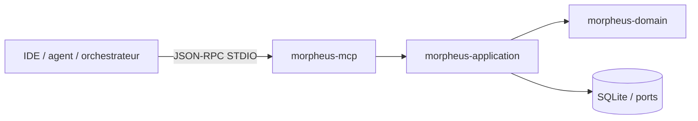
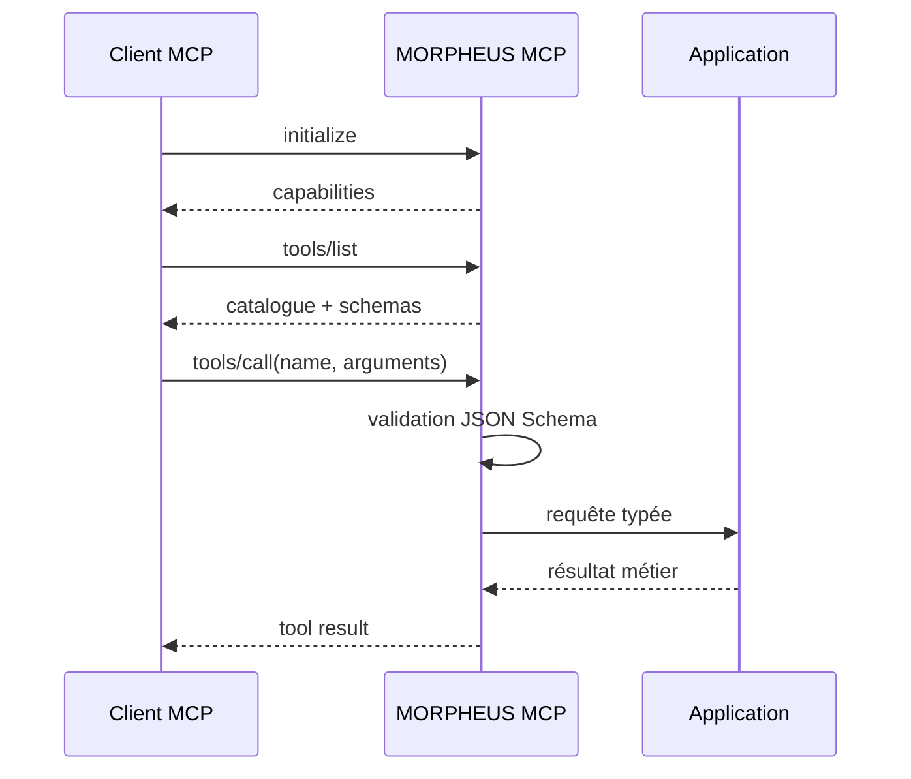
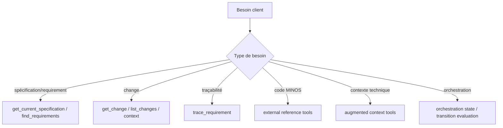
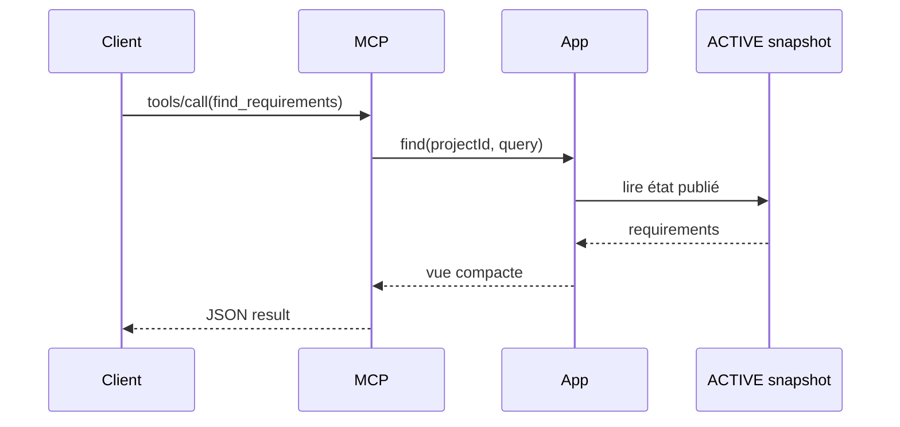
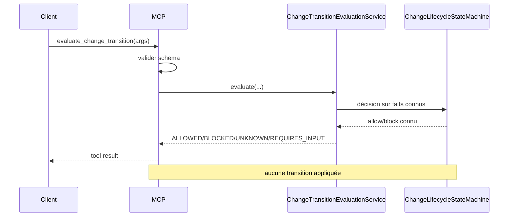
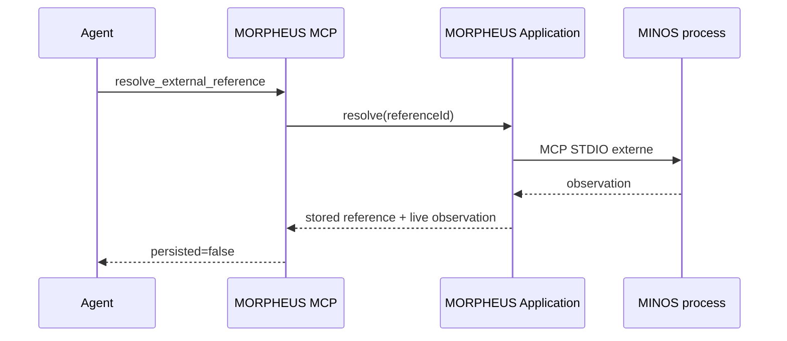

# Serveur MCP MORPHEUS

MORPHEUS expose un serveur Model Context Protocol natif sur STDIO pour IDE, agents et orchestrateurs locaux. Le catalogue MCP expose des **lectures métier et évaluations read-only** : il ne fournit pas de mutation cachée du domaine.

## 1. Lancement

```bash
morpheus mcp --stdio
morpheus --db /path/to/morpheus.db mcp --stdio
```

Contrat transport :

```text
SDK        Java MCP SDK 2.0.0
transport  STDIO
stdout     JSON-RPC MCP uniquement
stderr     diagnostics
inputs     JSON Schemas stricts
```

`--json` n’est pas utilisé en mode MCP : `stdout` appartient au protocole.

## 2. Position dans l’architecture



Le module MCP adapte des appels JSON-RPC vers les mêmes services applicatifs que la CLI et l’API.

## 3. Cycle d’une session



Les erreurs de schéma doivent être rejetées avant d’appeler le service métier.

## 4. Catalogue actuel — 20 tools read-only

### Spécification et requêtes

| Tool | Rôle |
|---|---|
| `get_current_specification` | lire la spécification courante |
| `find_requirements` | rechercher des requirements |
| `get_change` | lire un changement |
| `list_changes` | lister les changements |
| `get_constraints` | lire les contraintes d’un changement |
| `get_acceptance_criteria` | lire les critères d’acceptation |
| `get_design_decisions` | lire les décisions de conception |
| `get_implementation_tasks` | lire les tâches d’implémentation |
| `trace_requirement` | développer la traçabilité d’un requirement |
| `get_change_context` | produire une vue de contexte d’un change |
| `get_specification_context` | produire une vue de contexte de spécification |
| `get_change_status` | lire le statut dérivé disponible |
| `get_blocking_conditions` | lire les conditions bloquantes |
| `get_sync_status` | lire l’état de synchronisation |

### MINOS

```text
list_external_references
resolve_external_reference
```

### NEXUS

```text
get_augmented_requirement_context
get_augmented_change_context
```

### JARVIS / orchestration

```text
get_change_orchestration_state
evaluate_change_transition
```

## 5. Comment choisir un tool



Le client doit choisir le tool le plus spécifique plutôt que reconstruire localement une règle métier à partir de plusieurs réponses lorsque MORPHEUS expose déjà cette vue.

## 6. Sémantique conservatrice

```text
Scenario != AcceptanceCriterion
acceptance absente -> UNAVAILABLE_IN_NORMALIZED_MODEL
lifecycle absent -> indisponible, jamais inféré
queries snapshot-scoped / CURRENT
read-only
```

Un fait non observable reste `UNAVAILABLE`. Un handler MCP ne doit pas transformer cette absence en faux fait métier.

## 7. Snapshot-scoping

Les tools lisent les connaissances publiées via les services applicatifs. Ils ne rescannent pas directement le workspace à chaque appel.



Pour obtenir un état plus récent du workspace, la synchronisation doit être réalisée par une surface qui l’expose explicitement, typiquement la CLI ou l’API.

## 8. `get_change_orchestration_state`

Input :

```json
{
  "projectId": "<morpheus-project-uuid>",
  "changeId": "<change-uuid>",
  "lifecycleState": "DRAFT",
  "abandonmentReason": null
}
```

Required :

```text
projectId
changeId
```

`lifecycleState` est optionnel. Sans valeur :

```text
lifecycle.state  = absent
lifecycle.source = UNAVAILABLE
```

La réponse expose notamment :

```text
snapshot
change
lifecycle
observableFacts
missingArtifacts
unavailableFacts
acceptanceCriteria
applicableConstraints
blockingConstraints
unresolvedLinks
qualityFindings
nextAllowedTransitions
transitionEvaluations
persisted=false
```

Le `persisted=false` rappelle que cette vue d’orchestration est calculée et n’est pas un nouvel état métier persisté.

## 9. `evaluate_change_transition`

Input :

```json
{
  "projectId": "<morpheus-project-uuid>",
  "changeId": "<change-uuid>",
  "fromState": "PROPOSED",
  "fromAbandonmentReason": null,
  "targetState": "SPECIFIED",
  "abandonmentReason": null,
  "allowBackwardTransitions": false,
  "allowCompletedReopen": false
}
```

Résultat :

```text
ALLOWED         faits requis connus + transition autorisée
BLOCKED         faits requis connus + transition bloquée
UNKNOWN         au moins un fait requis indisponible
REQUIRES_INPUT  information explicite manquante
```



La décision connue réutilise `ChangeLifecycleStateMachine`. Le tool n’applique jamais la transition.

## 10. JSON Schemas

Les inputs du catalogue sont des objets stricts :

```text
type = object
additionalProperties = false
required = explicite
```

Cette politique évite un comportement dangereux où un client enverrait un champ mal orthographié ou inconnu en pensant qu’il influence le résultat.

Exemple conceptuel :

```json
{
  "type": "object",
  "additionalProperties": false,
  "required": ["projectId", "changeId"],
  "properties": {
    "projectId": {"type": "string"},
    "changeId": {"type": "string"}
  }
}
```

Le schéma exact de chaque tool est celui déclaré par le serveur.

## 11. Erreurs et indisponibilités

Un client doit distinguer :

| Situation | Interprétation |
|---|---|
| schéma invalide | appel client invalide |
| projet/entité absent | identité non trouvée |
| fait `UNAVAILABLE` | le fait n’est pas observable, ne pas le convertir en `false` |
| MINOS/NEXUS indisponible | capacité optionnelle indisponible seulement |
| erreur protocole/process | diagnostiquer transport/STDIO |

Les diagnostics opérationnels doivent aller sur `stderr`, jamais contaminer le flux JSON-RPC de `stdout`.

## 12. MINOS via MCP MORPHEUS

`resolve_external_reference` déclenche une observation live via l’intégration MINOS lorsque celle-ci est configurée.



L’appel ne transforme jamais l’observation live en mutation de snapshot.

## 13. NEXUS via MCP MORPHEUS

Les tools augmentés construisent une intention MORPHEUS puis délèguent la sélection technique à NEXUS.

```text
MORPHEUS = intention
NEXUS    = selection/ranking/fusion/compression/budget
```

Le bundle retourné reste live et non persisté.

## 14. Absence de write tools

Le catalogue ne fournit pas de tool pour :

```text
sync mutation
RequirementDelta apply
PROMOTE
ACTIVATE
rollback
apply lifecycle transition
persist external live resolution
persist NEXUS ContextBundle
index/rebuild NEXUS
orchestrate JARVIS actions
```

La synchronisation n’est donc pas cachée dans un tool de lecture. Le client doit utiliser une surface autorisée lorsqu’une mutation opérationnelle est réellement nécessaire.

## 15. Sécurité locale du transport

Le transport STDIO signifie qu’aucun port réseau MCP n’est ouvert par MORPHEUS. Le processus client lance ou pilote le processus MORPHEUS et échange via ses flux standards.

Conséquences :

- protéger les arguments et variables d’environnement utilisés pour lancer le processus ;
- ne pas écrire de logs arbitraires sur `stdout` ;
- contrôler la base `--db` utilisée par le processus ;
- considérer le client parent comme responsable du cycle de vie du subprocess.

## 16. Tests

La validation M14 inclut un vrai subprocess MCP STDIO qui :

1. initialise le serveur ;
2. liste les tools ;
3. valide la disponibilité du catalogue ;
4. appelle le contrat d’orchestration ;
5. vérifie la séparation protocole/diagnostics.

Le module MCP est vert dans le gate complet M14.

## 17. Voir aussi

- [Architecture](ARCHITECTURE.md)
- [API HTTP](API.md)
- [Intégrations](INTEGRATIONS.md)
- [Guide CLI](../user/CLI.md)
