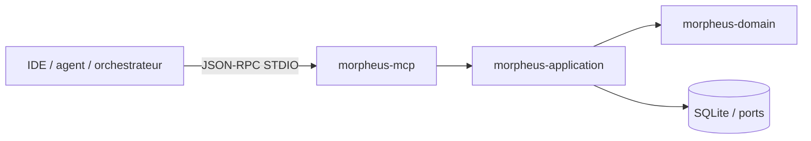
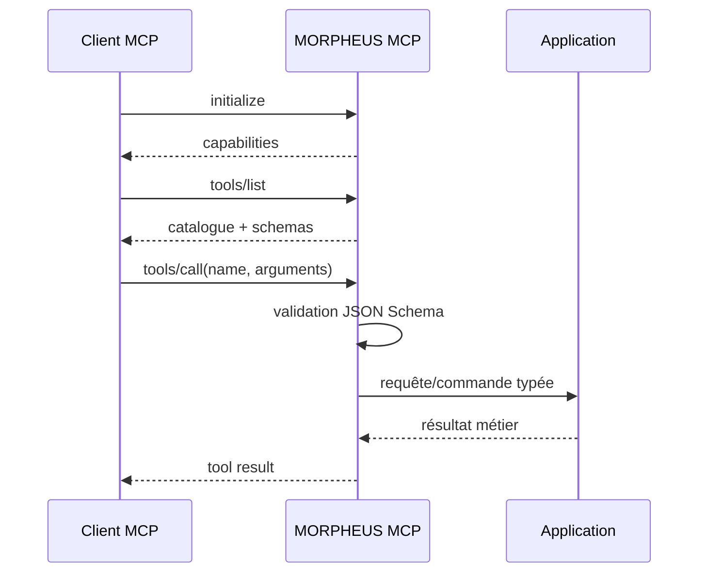
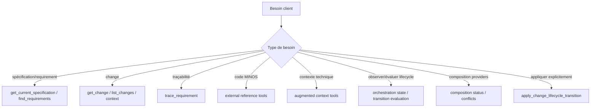

# Serveur MCP MORPHEUS

MORPHEUS expose un serveur Model Context Protocol natif sur STDIO pour IDE, agents et orchestrateurs locaux.

Baseline M18 :

```text
22 tools read-only
+ 1 tool write explicite
```

M18 ajoute deux tools read-only de composition :

```text
get_composition_status
list_composition_conflicts
```

Le seul tool write reste `apply_change_lifecycle_transition`. Une lecture ou une décision `ALLOWED` ne devient jamais une mutation implicite.

## 1. Lancement

```bash
morpheus mcp --stdio
morpheus --db /path/to/morpheus.db mcp --stdio
```

Contrat transport :

```text
SDK        Java MCP SDK 2.0.0
transport  STDIO
stdout     JSON-RPC MCP uniquement
stderr     diagnostics
inputs     JSON Schemas stricts
```

`--json` n’est pas utilisé en mode MCP : `stdout` appartient au protocole.

## 2. Position dans l’architecture



Le module MCP adapte des appels JSON-RPC vers les mêmes services applicatifs que la CLI et l’API. Les règles d’autorisation, CAS, idempotency, lifecycle et composition restent dans l’application/store, jamais dans le transport MCP.

## 3. Cycle d’une session



Les erreurs de schéma sont rejetées avant d’appeler le service métier.

## 4. Catalogue read-only — 22 tools

### Spécification et requêtes

| Tool | Rôle |
|---|---|
| `get_current_specification` | lire la spécification courante |
| `find_requirements` | rechercher des requirements |
| `get_change` | lire un changement |
| `list_changes` | lister les changements |
| `get_constraints` | lire les contraintes d’un changement |
| `get_acceptance_criteria` | lire les critères d’acceptation |
| `get_design_decisions` | lire les décisions de conception |
| `get_implementation_tasks` | lire les tâches d’implémentation |
| `trace_requirement` | développer la traçabilité d’un requirement |
| `get_change_context` | produire une vue de contexte d’un change |
| `get_specification_context` | produire une vue de contexte de spécification |
| `get_change_status` | lire le statut dérivé disponible |
| `get_blocking_conditions` | lire les conditions bloquantes |
| `get_sync_status` | lire l’état de synchronisation |

### MINOS

```text
list_external_references
resolve_external_reference
```

### NEXUS

```text
get_augmented_requirement_context
get_augmented_change_context
```

### JARVIS / orchestration read-only

```text
get_change_orchestration_state
evaluate_change_transition
```

### M18 / composition multi-provider

```text
get_composition_status
list_composition_conflicts
```

Ces 22 tools sont read-only.

## 5. M18 — `get_composition_status`

Ce tool expose l’état de composition provider-neutral du projet et du snapshot publié concerné.

Input conceptuel :

```json
{
  "projectId": "<morpheus-project-uuid>"
}
```

La projection conserve notamment :

```text
providers observés
provider identifiers
priorités explicites
snapshot scope
état de composition
provenance disponible
compte de conflits
```

Le client ne doit jamais utiliser un chemin source comme `DomainIdentity`.

## 6. M18 — `list_composition_conflicts`

Input conceptuel :

```json
{
  "projectId": "<morpheus-project-uuid>"
}
```

Les conflits restent explicites et requêtables :

```text
content conflict
ownership conflict
type / identity conflict
absence vs value conflict
ambiguous continuity
```

Pour chaque candidat, MORPHEUS conserve la provenance et la priorité pertinentes. La résolution ne signifie jamais effacement silencieux des candidats non retenus.

Invariants :

```text
provider identifier != DomainIdentity
source path != identity
precedence != provenance erasure
conflict != silent last-write-wins
ambiguous continuity must be surfaced
optional provider absence != project failure when optional
```

## 7. Tool write — `apply_change_lifecycle_transition`

Ce tool reste volontairement séparé du catalogue read-only :

```text
evaluate_change_transition        = décision, aucun effet
apply_change_lifecycle_transition = commande explicite avec effet potentiel
```

Input :

```json
{
  "projectId": "<morpheus-project-uuid>",
  "changeId": "<change-uuid>",
  "mutationId": "<uuid-optionnel>",
  "idempotencyKey": "caller-stable-key",
  "expectedRevision": 0,
  "targetState": "PROPOSED",
  "abandonmentReason": null,
  "actor": "jarvis-or-user",
  "confirmed": true
}
```

Required :

```text
projectId
changeId
idempotencyKey
expectedRevision
targetState
actor
confirmed
```

Garde-fous applicatifs :

```text
1. idempotency
2. WRITE_CHANGE capability explicite
3. confirmation
4. expectedRevision / CAS
5. transition evaluation M14-M16
6. state + audit atomiques
```

Résultats métier :

```text
APPLIED
ALREADY_APPLIED
CONFLICT
NOT_AUTHORIZED
REQUIRES_CONFIRMATION
REJECTED
```

`READ_CHANGES != WRITE_CHANGE`. Les overloads historiques utilisent un resolver deny-by-default. Sans provider write-capable, la commande retourne `NOT_AUTHORIZED` et n’écrit ni état ni audit.

### CAS et idempotency

L’absence d’état opérationnel correspond à :

```text
state    = DRAFT
revision = 0
```

La première mutation réussie produit la révision `1`. Une révision attendue obsolète retourne `CONFLICT`.

Une même `idempotencyKey` avec la même empreinte logique retourne `ALREADY_APPLIED` sans seconde mutation ni second audit. Réutiliser la même clé pour une autre commande logique produit `CONFLICT`.

## 8. Comment choisir un tool



JARVIS reste propriétaire du sequencing et du choix d’action. MORPHEUS applique uniquement une commande explicitement autorisée.

## 9. Snapshot-scoping et composition

Les tools read-only lisent les connaissances publiées via les services applicatifs ; ils ne rescannent pas implicitement le workspace à chaque appel.

```text
KnowledgeSnapshot                    published knowledge
CompositionState                     snapshot-scoped provider facts
ChangeLifecycleOperationalState      mutable CAS-controlled state
```

Ces trois notions sont distinctes.

M18 persiste l’état de composition via Memory et SQLite V012 ; le reopen SQLite conserve providers, priorités, conflits, candidats et provenance.

## 10. Sémantique conservatrice

```text
DomainIdentity != EntityVersionId != SourceLocator != ExternalReference
SpecificationVersion != KnowledgeSnapshot
Scenario != AcceptanceCriterion
AcceptanceCriterion != Test
Test existence != VERIFIED
Evidence != assertion
UNKNOWN != FAILED
UNKNOWN != BLOCKED
lifecycle absent -> indisponible, jamais inféré
constraint text != executable policy
transition evaluation != lifecycle mutation
READ_CHANGES != WRITE_CHANGE
ALLOWED != applied
provider identifier != DomainIdentity
precedence != provenance erasure
conflict != silent last-write-wins
```

Un fait non observable reste `UNAVAILABLE`/`UNKNOWN`. Un handler MCP ne synthétise jamais un fait métier pour combler une absence.

## 11. JSON Schemas

Les inputs sont stricts :

```text
type = object
additionalProperties = false
required = explicite
```

Cette politique est particulièrement importante pour les writes : un champ mal orthographié ne doit jamais être ignoré en donnant l’illusion qu’un contrôle de concurrence ou de confirmation a été appliqué.

## 12. Validation M18

Le gate M18 réellement exécuté a validé :

```text
MCP tests          6/6 PASS
TOTAL              418/418 PASS
Architecture       170/170 PASS
Packaging/smokes   PASS
```

Code testé : `7e8caacff567f51354fcb88bd7505a6d135071c0`.  
Preuve : [`../validation/VALIDATION_M18.md`](../validation/VALIDATION_M18.md).

## 13. Voir aussi

- [API HTTP](API.md)
- [Architecture](ARCHITECTURE.md)
- [Intégrations](INTEGRATIONS.md)
- [Référence CLI](../user/CLI.md)
- [OpenAPI](../openapi/morpheus-v1.yaml)
- [ADR-0083 — controlled lifecycle write](../adr/0083-controlled-lifecycle-write-operations.md)
- [ADR-0084 — multi-provider composition](../adr/0084-provider-neutral-multi-provider-composition.md)