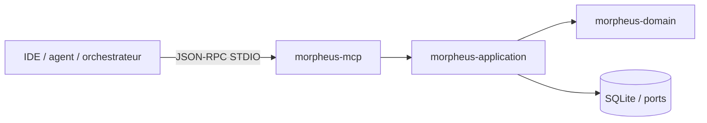
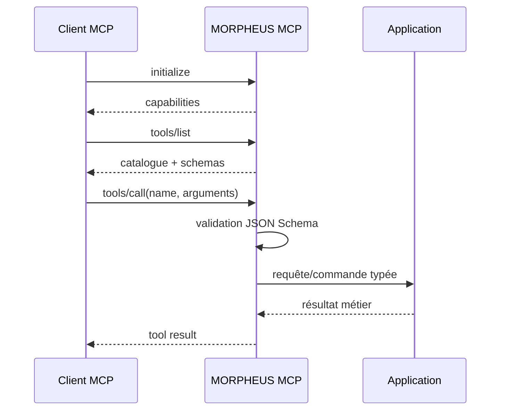
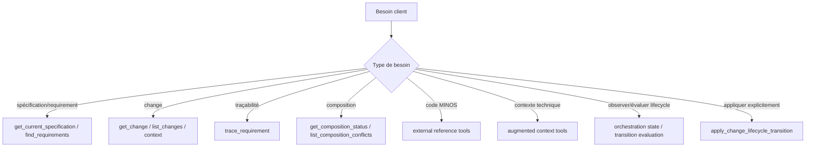
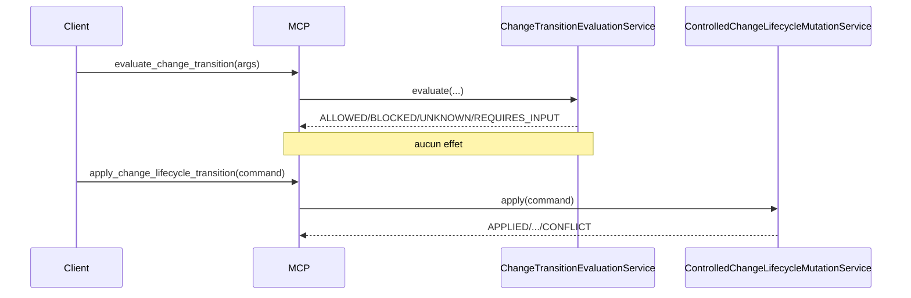

# Serveur MCP MORPHEUS

MORPHEUS expose un serveur Model Context Protocol natif sur STDIO pour IDE, agents et orchestrateurs locaux.

La surface actuelle sépare explicitement :

```text
22 tools read-only
+ 1 tool write M17 explicite
```

M18 ajoute deux tools read-only de composition : `get_composition_status` et `list_composition_conflicts`. Le tool write ne transforme jamais une lecture ou une décision `ALLOWED` en mutation implicite.

## 1. Lancement

```bash
morpheus mcp --stdio
morpheus --db /path/to/morpheus.db mcp --stdio
```

Contrat transport :

```text
SDK        Java MCP SDK 2.0.0
transport  STDIO
stdout     JSON-RPC MCP uniquement
stderr     diagnostics
inputs     JSON Schemas stricts
```

`--json` n’est pas utilisé en mode MCP : `stdout` appartient au protocole.

## 2. Position dans l’architecture



Le module MCP adapte des appels JSON-RPC vers les mêmes services applicatifs que la CLI et l’API. Les règles de composition, autorisation, CAS, idempotency et lifecycle restent dans l’application/store, jamais dans le transport MCP.

## 3. Cycle d’une session



Les erreurs de schéma doivent être rejetées avant d’appeler le service métier.

## 4. Catalogue read-only — 22 tools

### Spécification et requêtes

| Tool | Rôle |
|---|---|
| `get_current_specification` | lire la spécification courante |
| `find_requirements` | rechercher des requirements |
| `get_change` | lire un changement |
| `list_changes` | lister les changements |
| `get_constraints` | lire les contraintes d’un changement |
| `get_acceptance_criteria` | lire les critères d’acceptation |
| `get_design_decisions` | lire les décisions de conception |
| `get_implementation_tasks` | lire les tâches d’implémentation |
| `trace_requirement` | développer la traçabilité d’un requirement |
| `get_change_context` | produire une vue de contexte d’un change |
| `get_specification_context` | produire une vue de contexte de spécification |
| `get_change_status` | lire le statut dérivé disponible |
| `get_blocking_conditions` | lire les conditions bloquantes |
| `get_sync_status` | lire l’état de synchronisation |

### MINOS

```text
list_external_references
resolve_external_reference
```

### NEXUS

```text
get_augmented_requirement_context
get_augmented_change_context
```

### JARVIS / orchestration read-only

```text
get_change_orchestration_state
evaluate_change_transition
```

### M18 / composition read-only

```text
get_composition_status
list_composition_conflicts
```

Ces 22 tools sont read-only.

## 5. M17 — tool write `apply_change_lifecycle_transition`

Ce tool est volontairement séparé du catalogue read-only :

```text
evaluate_change_transition        = décision, aucun effet
apply_change_lifecycle_transition = commande explicite avec effet potentiel
```

Input conceptuel :

```json
{
  "projectId": "<morpheus-project-uuid>",
  "changeId": "<change-uuid>",
  "mutationId": "<uuid-optionnel>",
  "idempotencyKey": "caller-stable-key",
  "expectedRevision": 0,
  "targetState": "PROPOSED",
  "abandonmentReason": null,
  "actor": "jarvis-or-user",
  "confirmed": true
}
```

Garde-fous applicatifs :

```text
1. idempotency
2. WRITE_CHANGE capability explicite
3. confirmation
4. expectedRevision / CAS
5. transition evaluation M14-M16
6. state + audit atomiques
```

Résultats métier :

```text
APPLIED
ALREADY_APPLIED
CONFLICT
NOT_AUTHORIZED
REQUIRES_CONFIRMATION
REJECTED
```

Ces états sont des résultats métier et ne sont pas transformés artificiellement en panne JSON-RPC.

### Capability write

```text
READ_CHANGES != WRITE_CHANGE
```

Le serveur n’autorise pas une mutation parce qu’un provider sait lire les changements. Un `ChangeWriteCapabilityResolver` doit observer explicitement `WRITE_CHANGE` pour le projet.

### CAS

L’absence d’état opérationnel correspond à :

```text
state    = DRAFT
revision = 0
```

La première mutation réussie produit la révision `1`, puis chaque application incrémente la révision exactement une fois. Une commande avec une révision attendue obsolète retourne `CONFLICT`.

### Idempotency

Une même `idempotencyKey` et la même empreinte logique retournent `ALREADY_APPLIED`, avec l’audit initial et sans seconde mutation. Réutiliser la même clé pour une commande logique différente produit `CONFLICT`.

## 6. M18 — tools de composition

### `get_composition_status`

Rôle : exposer l’état de composition provider-neutral du snapshot/projet ciblé.

La réponse conserve conceptuellement :

```text
providers observed
required / optional state
explicit precedence
provenance
provider diagnostics
composition result
snapshot scope
```

Les types internes OpenSpec/Markdown ne sont pas exposés comme contrat métier.

### `list_composition_conflicts`

Rôle : exposer les conflits explicites produits par la composition.

Catégories couvertes :

```text
content
ownership
type / identity
absent vs present
```

Chaque conflit conserve ses candidats, leur priorité et leur provenance. Le résultat ne doit jamais simuler une résolution par last-write-wins silencieux.

Invariants :

```text
provider identifier != DomainIdentity
source path != identity
precedence != provenance erasure
conflict != silent last-write-wins
ambiguous continuity must be surfaced
optional provider absence != project failure when optional
```

## 7. Comment choisir un tool



Un client ne doit appeler le tool write qu’après avoir choisi l’action. MORPHEUS valide et applique l’état ; JARVIS reste propriétaire du sequencing et du choix d’action.

## 8. Sémantique conservatrice

```text
Scenario != AcceptanceCriterion
AcceptanceCriterion != Test
Test existence != VERIFIED
Evidence != assertion
UNKNOWN != FAILED
UNKNOWN != BLOCKED
lifecycle absent -> indisponible, jamais inféré
constraint text != executable policy
queries snapshot-scoped / CURRENT
transition evaluation != lifecycle mutation
read capability != write capability
ALLOWED != applied
published snapshot != operational lifecycle state
provider precedence != provenance erasure
composition conflict != implicit write
```

Un fait non observable reste `UNAVAILABLE`/`UNKNOWN`. Un handler MCP ne doit pas transformer cette absence en faux fait métier.

## 9. Snapshot-scoping et états distincts

Les tools read-only lisent les connaissances publiées via les services applicatifs. Ils ne rescannent pas directement le workspace à chaque appel.

```text
KnowledgeSnapshot / SnapshotBusinessContent  immutable published knowledge
CompositionState                             snapshot-scoped provider facts
ChangeLifecycleOperationalState              mutable CAS-controlled state
```

Une mutation lifecycle ne réécrit donc pas l’historique publié. La composition M18 conserve provenance et conflits sans devenir une mutation lifecycle.

## 10. `get_change_orchestration_state`

Sans lifecycle explicite :

```text
lifecycle.state  = absent
lifecycle.source = UNAVAILABLE
```

La réponse expose notamment :

```text
snapshot
change
lifecycle
observableFacts
missingArtifacts
unavailableFacts
acceptanceCriteria
applicableConstraints
blockingConstraints
unresolvedLinks
qualityFindings
nextAllowedTransitions
transitionEvaluations
persisted=false
```

Cette vue reste read-only.

## 11. `evaluate_change_transition`

Résultat :

```text
ALLOWED         faits requis connus + transition autorisée
BLOCKED         faits requis connus + transition bloquée
UNKNOWN         au moins un fait requis indisponible
REQUIRES_INPUT  information explicite manquante
```



## 12. JSON Schemas

Les inputs sont stricts :

```text
type = object
additionalProperties = false
required = explicite
```

Cette politique est particulièrement importante pour les writes : un champ mal orthographié ne doit jamais être ignoré en donnant l’illusion qu’un contrôle de concurrence ou de confirmation a été appliqué.

## 13. Baseline validée

Dernier gate intégré : M18.

```text
MCP tests       6/6 PASS
TOTAL           418/418 PASS
Architecture    170/170 PASS
Packaging       Windows + smokes PASS
Code validé     7e8caacff567f51354fcb88bd7505a6d135071c0
Merge M18       30f11ac3ffc522bcc0c71e31216a3fb70f0631d7
```

Preuve : [`../validation/VALIDATION_M18.md`](../validation/VALIDATION_M18.md).

## 14. Frontières

```text
MCP transport != business policy
MORPHEUS lifecycle invariants != JARVIS sequencing
published snapshot != operational lifecycle state
ALLOWED != applied
idempotent retry != second audit
provider identifier != DomainIdentity
precedence != provenance erasure
conflict != silent last-write-wins
```

## 15. Voir aussi

- [API HTTP](API.md)
- [Architecture](ARCHITECTURE.md)
- [Intégrations](INTEGRATIONS.md)
- [Référence CLI](../user/CLI.md)
- [OpenAPI](../openapi/morpheus-v1.yaml)
- [ADR-0083](../adr/0083-controlled-lifecycle-write-operations.md)
- [ADR-0084](../adr/0084-provider-neutral-multi-provider-composition.md)
