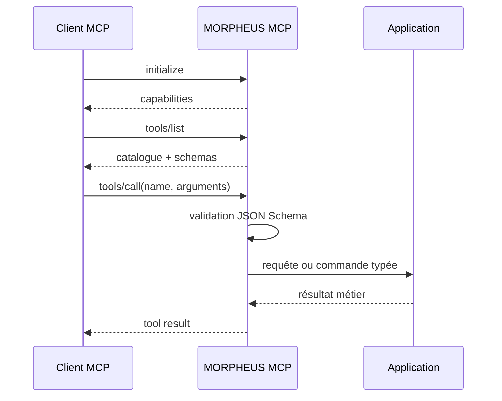

# Serveur MCP MORPHEUS

MORPHEUS expose un serveur **Model Context Protocol natif sur STDIO** pour IDE, agents et orchestrateurs locaux. M28 ajoute le câblage opt-in vers Copilot, Claude et Codex sans introduire Docker, serveur web ou logique métier dans la couche d’intégration.

```text
client MCP
   |
   | JSON-RPC over stdin/stdout
   v
morpheus mcp --stdio
   |
   v
morpheus-mcp -> application -> domain / stores / providers
```

## 1. Lancement

```bash
morpheus mcp --stdio
morpheus --db /path/to/morpheus.db mcp --stdio
```

Contrat transport :

```text
SDK        Java MCP SDK 2.0.1
transport  STDIO
stdout     JSON-RPC MCP uniquement
stderr     diagnostics uniquement
inputs     JSON Schemas stricts
server     morpheus
```

`--json` n’est pas utilisé en mode MCP : stdout appartient exclusivement au protocole.

## 2. Composition du serveur

`MorpheusMcpServer` assemble les familles de tools suivantes :

```text
MorpheusMcpToolCatalog                 spécification / requirements / changes
MorpheusProductMcpTools                version et informations produit
MorpheusProviderPluginMcpTools         découverte et inspection plugins
MorpheusPortfolioMcpTools              portfolios et références inter-projets
MorpheusQueryMcpTools                  Query DSL / saved views / exports
MorpheusPolicyMcpTools                 évaluations et dry-run policies
MorpheusPolicyMcpManagementTools       gestion explicite des Policy Packs
MorpheusReasoningMcpTools              reasoning fondé sur preuves
MorpheusExternalReferenceMcpTools      résolution MINOS optionnelle
MorpheusAugmentedContextMcpTools       contexte NEXUS optionnel
MorpheusJarvisOrchestrationMcpTools    état et évaluation orchestration
MorpheusCompositionMcpTools            composition multi-provider
MorpheusControlledLifecycleMcpTools    mutation lifecycle contrôlée
```

Le serveur publie la capability `tools`, active `validateToolInputs=true` et construit les handlers sur les mêmes services applicatifs que la CLI et l’API.

## 3. Cycle d’une session



Les erreurs de schéma sont rejetées avant l’appel applicatif. Les erreurs métier attendues deviennent des résultats MCP en erreur sans exposer de stack trace sur stdout.

## 4. Lecture, gestion et mutation

La majorité des tools sont read-only. Certaines surfaces administratives ou lifecycle sont explicitement mutantes, mais aucune lecture ne se transforme implicitement en écriture.

```text
READ != WRITE
ALLOWED != applied
policy evaluation != policy mutation
reasoning != lifecycle mutation
saved view query != materialized truth
export != mutation
```

Le tool `apply_change_lifecycle_transition` conserve les garde-fous :

```text
WRITE_CHANGE capability explicite
confirmation requise
expectedRevision / CAS
idempotencyKey
validation lifecycle
state + audit atomiques
```

Sans resolver `WRITE_CHANGE`, le serveur utilise une politique deny-by-default.

## 5. Frontières d’architecture

```text
transport MCP  -> adapter seulement
application    -> use cases et autorisations
store          -> atomicité, CAS, idempotence, audit
provider       -> faits et capabilities
core métier    -> indépendant du packaging et du client MCP
```

Invariants :

```text
MCP request type -X-> domain model
client config type -X-> application model
stdout diagnostics -X-> MCP transport
provider-specific type -X-> domain identity
transport choice -X-> business rule
```

## 6. Câblage clients M28

M28 fournit dans les distributions :

```text
integration/configure-mcp-clients.ps1
integration/configure-mcp-clients-setup.ps1
integration/README.md
```

Clients Windows pris en charge :

```text
GitHub Copilot — JetBrains / IntelliJ
GitHub Copilot CLI
Claude Code
Claude Desktop
OpenAI Codex
```

Définition commune :

```json
{
  "command": "<install-root>\\morpheus.exe",
  "args": ["mcp", "--stdio"],
  "env": {
    "MORPHEUS_DATA_DIR": "<persistent-data-root>",
    "MORPHEUS_CONFIG_DIR": "<persistent-config-root>"
  }
}
```

Le gestionnaire est **Windows-only** pour les mutations automatiques de profils. La distribution Linux embarque le guide et le gestionnaire pour parité documentaire, mais la configuration des clients Linux reste manuelle.

## 7. Clients JSON

### Copilot JetBrains

```text
path       %LOCALAPPDATA%\github-copilot\intellij\mcp.json
container  servers
entry      morpheus
```

### Claude Desktop

```text
path       %APPDATA%\Claude\claude_desktop_config.json
container  mcpServers
entry      morpheus
```

Le merge :

- préserve les propriétés racine ;
- préserve les autres serveurs ;
- écrit en UTF-8 sans BOM ;
- utilise une indentation stable de deux espaces ;
- sauvegarde le fichier existant avant modification ;
- rejette un JSON invalide avant toute écriture.

## 8. Clients CLI

Les clients sont pilotés par leurs commandes officielles `mcp add`, `mcp get` et `mcp remove`.

```text
Copilot CLI  copilot mcp ...
Claude Code  claude mcp ... --scope user
Codex        codex mcp ...
```

Chaque invocation :

- s’exécute dans un processus non interactif distinct ;
- possède un timeout borné ;
- capture stdout et stderr ;
- termine l’arbre de processus en cas de timeout ;
- route un launcher `.ps1` via `pwsh` pour éviter les incompatibilités Windows PowerShell 5.1.

## 9. Propriété des entrées

Le registre persistant est :

```text
%LOCALAPPDATA%\MORPHEUS\mcp-client-integrations.json
```

Deux propriétés sont distinguées :

```text
managed      entrée créée par MORPHEUS
preexisting  entrée déjà présente et exactement compatible
```

La configuration stocke notamment :

```text
client id
kind json|cli
ownership
command
persistent roots
config path ou CLI
arguments de probe/remove
horodatage
```

Ce registre est une preuve de propriété technique, pas une source de vérité métier.

## 10. Installation conservatrice

Règles d’upsert :

```text
entrée absente                    création + ownership=managed
entrée compatible préexistante   suivi ownership=preexisting
entrée étrangère incompatible    aucune écriture
entrée managed inchangée         idempotence
entrée managed modifiée          conservation utilisateur
JSON invalide                    échec avant écriture
client CLI absent                warning ou échec strict
```

Le mode `-Strict` transforme les avertissements en échecs, notamment pour les tests et le wrapper setup.

## 11. Désinstallation conservatrice

La désinstallation est exclusivement pilotée par le registre :

```text
ownership=preexisting        jamais supprimé
managed + forme identique    supprimé
managed + forme modifiée     préservé
entrée déjà absente          état nettoyé
client CLI indisponible      aucune suppression aveugle
```

L’installateur appelle le gestionnaire avec `-Action Uninstall` avant de supprimer les fichiers de programme.

Les données MORPHEUS, la base SQLite, les backups et le registre vivent hors du répertoire d’installation.

## 12. Installer Windows

Les cinq tâches Inno Setup sont opt-in et décochées :

```text
mcp_copilot_jetbrains
mcp_copilot_cli
mcp_claude_code
mcp_claude_desktop
mcp_codex
```

Après copie des fichiers, `configure-mcp-clients-setup.ps1` :

1. appelle le gestionnaire ;
2. relit le registre ;
3. vérifie que chaque intégration sélectionnée est présente ;
4. échoue explicitement si une sélection n’a pas été configurée.

Un échec de câblage n’altère pas le binaire MORPHEUS : la CLI et le serveur MCP natif restent lançables directement.

## 13. Packaging

Windows :

```text
<app-image>/morpheus.exe
<app-image>/integration/configure-mcp-clients.ps1
<app-image>/integration/configure-mcp-clients-setup.ps1
<app-image>/integration/README.md
```

Linux :

```text
<app-image>/bin/morpheus
<app-image>/integration/*
```

Les builders vérifient explicitement la présence de la couche M28 avant de produire les archives.

## 14. Qualification

Windows :

```powershell
.\validate-m28.cmd -Version 1.1.0 -BaseRef origin/develop
```

Le gate couvre notamment :

```text
cinq faux clients
merge JSON
arguments et environnement CLI
UTF-8 sans BOM
idempotence
backups
protection entrée étrangère
protection entrée modifiée
uninstall state-driven
JSON invalide
portable Windows
setup Windows
```

Linux/WSL :

```bash
MORPHEUS_M28_BASE_REF=origin/develop bash ./scripts/validate-m28.sh 1.1.0
```

Le gate Linux couvre les contrats statiques, la non-régression reactor et le packaging Linux. Les écritures de profils Windows ne sont pas simulées comme une preuve Linux équivalente.

## 15. Sécurité

```text
client integration is opt-in
no secret in MCP schemas
no token added by M28
no Docker requirement
no network listener added
stdout remains JSON-RPC only
third-party config is backed up
foreign entry is not overwritten
manual user changes are preserved
write capability is not escalated
```

## 16. Références

- [Guide utilisateurs MCP](../user/MCP_CLIENTS.md)
- [Plan M28](../roadmap/M28_EXECUTION.md)
- [Validation M28](../validation/VALIDATION_M28.md)
- [ADR-0062 — MCP SDK et STDIO](../adr/0062-official-java-mcp-sdk-and-native-stdio.md)
- [CLI](../user/CLI.md)
- [Intégrations](../user/INTEGRATIONS.md)
