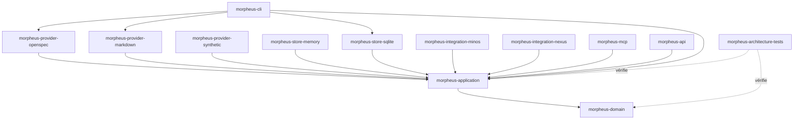
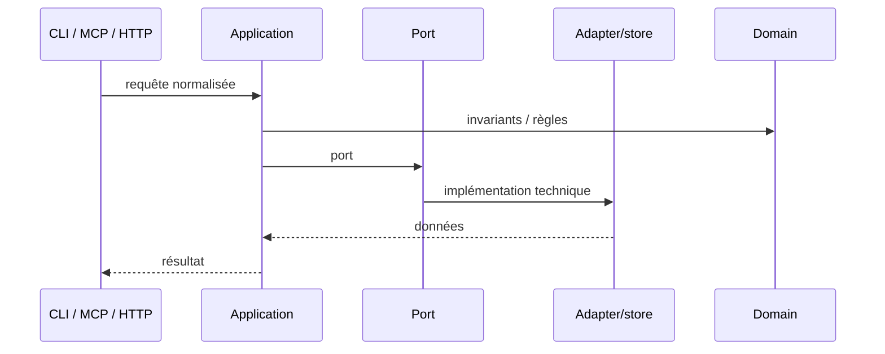

# Guide développeur MORPHEUS

Cette documentation décrit la baseline **M18 intégrée** et le candidat **M19 en cours de qualification**. Elle sert de point d’entrée pour importer le projet, comprendre le découpage Maven, préserver les frontières d’architecture et exécuter les gates de validation.

## 1. Prérequis

```text
Java   >= 21
Maven  3.9.16+ via Maven Wrapper
Git
```

Le build parent compile avec `release=21`.

### Windows

```powershell
.\mvnw.cmd --version
```

### Linux/macOS

```bash
./mvnw --version
```

## 2. Import IntelliJ IDEA

MORPHEUS est un projet Maven multi-module. Le `pom.xml` racine doit être chargé comme projet Maven.

Ne pas créer les sous-modules manuellement : ils sont définis par le reactor Maven.

## 3. Vue du dépôt M18

```text
morpheus-engine/
├── morpheus-domain/
├── morpheus-application/
├── morpheus-provider-openspec/
├── morpheus-provider-markdown/
├── morpheus-provider-synthetic/
├── morpheus-store-memory/
├── morpheus-store-sqlite/
├── morpheus-integration-minos/
├── morpheus-integration-nexus/
├── morpheus-mcp/
├── morpheus-api/
├── morpheus-cli/
├── morpheus-architecture-tests/
├── distribution/
├── docs/
├── experiments/
└── pom.xml
```

Le reactor M18 compte **14 modules Maven SUCCESS** au gate final.

## 4. Architecture des modules



Principe :

```text
adapters -> application -> domain
```

Le domaine ne connaît aucun adapter ni type spécifique à OpenSpec/Markdown.

## 5. Responsabilités

| Module | Responsabilité | À ne pas y mettre |
|---|---|---|
| `morpheus-domain` | modèle métier, value objects, invariants purs | SQLite, HTTP, CLI, MCP, provider-specific |
| `morpheus-application` | use cases, ports, lifecycle, composition provider-neutral | dépendances vers adapters |
| `morpheus-provider-openspec` | découverte/lecture/normalisation OpenSpec | règles métier provider-neutral |
| `morpheus-provider-markdown` | discovery/lecture Markdown structuré réel | types Markdown dans domain/application |
| `morpheus-provider-synthetic` | provider contrôlé pour tests | preuve de deuxième provider réel production |
| `morpheus-store-memory` | implémentation mémoire des ports | règles métier |
| `morpheus-store-sqlite` | persistance versionnée, V012 M18 | logique de décision métier |
| `morpheus-integration-minos` | client MINOS via MCP STDIO | dépendance `com.minos.*` |
| `morpheus-integration-nexus` | client NEXUS via MCP STDIO | ranking/fusion/compression NEXUS |
| `morpheus-mcp` | adapter serveur MCP, 22 read-only + 1 write | politique métier cachée |
| `morpheus-api` | adapter HTTP `/api/v1`, OpenAPI candidat 1.8.0 | dépendance CLI/MCP |
| `morpheus-cli` | composition root, launcher et UX | règles métier nouvelles |
| `morpheus-architecture-tests` | contrats ArchUnit/cross-module | code de production |

## 6. Chemin d’une requête



Une règle qui change le sens métier appartient au domaine/application, pas à la surface.

## 7. Composition multi-provider M18

```text
OpenSpec                 Structured Markdown
   |                              |
   +------ normalized reads ------+
                  |
        ProviderContribution
                  |
   MultiProviderCompositionService
                  |
      precedence + provenance
        + explicit conflicts
                  |
        Memory / SQLite V012
```

Invariants :

```text
provider identifier != DomainIdentity
source path != identity
provider ownership is explicit
precedence != provenance erasure
conflict != silent last-write-wins
ambiguous continuity must be surfaced
optional provider absence != project failure when optional
provider-specific types never leak into domain/application contracts
```

## 8. Invariants globaux

```text
DomainIdentity != EntityVersionId != SourceLocator != ExternalReference
SpecificationVersion != KnowledgeSnapshot
CURRENT / PROPOSED / HISTORICAL explicites
PROPOSED never leaks into CURRENT
published history = RETIRED* -> ACTIVE
APPLY != PROMOTE != ACTIVATE
Scenario != AcceptanceCriterion
AcceptanceCriterion != Test
Test existence != VERIFIED
Evidence != assertion
UNKNOWN != FAILED
UNKNOWN != BLOCKED
applicable != blocking
warning != blocker
severity != blocking policy
transition evaluation != lifecycle mutation
READ_CHANGES != WRITE_CHANGE
ALLOWED != applied
published snapshot != operational lifecycle state
stale revision != overwrite
idempotent retry != duplicate mutation/audit
optional engine absence != MORPHEUS failure
MORPHEUS facts/rules != JARVIS action sequencing
```

## 9. Temporalité, snapshot et lifecycle

```text
TemporalState             CURRENT | PROPOSED | HISTORICAL
KnowledgeSnapshot         BUILDING -> VALIDATING -> READY -> ACTIVE -> RETIRED
ChangeLifecycleState      DRAFT ... COMPLETED / ARCHIVED / ABANDONED
Operational lifecycle     mutable, revisioned, CAS-controlled
```

Ces dimensions restent distinctes.

Un candidat de snapshot échoué ne remplace jamais un `ACTIVE` valide.

## 10. Workflow de contribution

```text
1. identifier l’invariant et la source de vérité
2. documenter/ADR si nécessaire
3. implémenter le vertical slice
4. ajouter les tests ciblés
5. exécuter les tests module + dépendances
6. exécuter le reactor complet
7. packager/smoker lorsque concerné
8. enregistrer le SHA réellement testé
9. accepter l’ADR seulement après preuve
10. merger uniquement après autorisation explicite
```

## 11. Commandes essentielles

Gate développeur :

```powershell
.\mvnw.cmd clean test
```

Module ciblé :

```powershell
.\mvnw.cmd -pl morpheus-api -am test
```

Packaging Windows :

```powershell
.\distribution\build-portable.ps1
```

Dernier validateur de jalon intégré :

```powershell
.\validate-m18.cmd
```

Validateur canonique du candidat M19 :

```powershell
.\validate-m19.cmd
```

## 12. Gate M18 de référence

```text
TOTAL              418/418 PASS
Architecture       170/170 PASS
Failures                 0
Errors                   0
Skipped                  0
Reactor            14/14 modules SUCCESS
Packaging Windows        PASS
Packaged smokes          PASS
API health smoke         PASS
```

Code testé : `7e8caacff567f51354fcb88bd7505a6d135071c0`.  
Merge : `30f11ac3ffc522bcc0c71e31216a3fb70f0631d7`.

## 13. Où documenter une modification ?

| Modification | Documentation attendue |
|---|---|
| invariant métier | architecture + tests + éventuellement ADR |
| nouveau provider | architecture + provider contract + tests + ADR si nécessaire |
| nouveau contrat HTTP | `API.md` + OpenAPI + tests de contrat |
| nouveau tool MCP | `MCP.md` + JSON Schema + tests subprocess |
| nouvelle intégration | `INTEGRATIONS.md` + frontière + smoke |
| packaging | `BUILD_AND_TEST.md` + `distribution/README.md` |
| nouveau jalon | roadmap + validation + ADR/index |

## 14. Sources de vérité

- [`../governance/ROADMAP.md`](../governance/ROADMAP.md) — état courant ;
- [`../roadmap/POST_M14_EXECUTION.md`](../roadmap/POST_M14_EXECUTION.md) — trajectoire M15→M20 ;
- [`../adr/`](../adr/) — décisions ;
- [`../validation/`](../validation/) — preuves C0→M18 ;
- [`../openapi/morpheus-v1.yaml`](../openapi/morpheus-v1.yaml) — contrat API machine ;
- tests d’architecture — frontières exécutables.

## 15. Lire ensuite

- [Architecture détaillée](ARCHITECTURE.md)
- [Build, tests et validation](BUILD_AND_TEST.md)
- [API HTTP](API.md)
- [Serveur MCP](MCP.md)
- [Intégrations cross-engine](INTEGRATIONS.md)
- [Guide utilisateur](../user/README.md)
