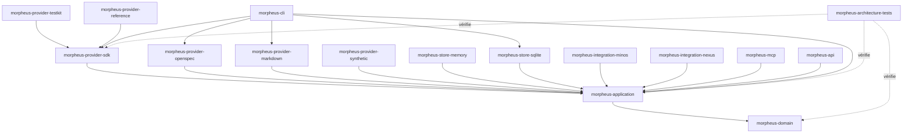
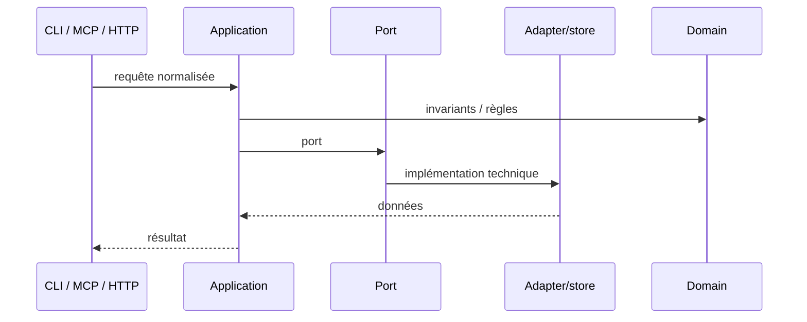

# Guide développeur MORPHEUS

Cette documentation décrit la baseline **M22 techniquement qualifiée Windows + Linux** de MORPHEUS `1.0.0`. Elle sert de point d’entrée pour importer le projet, comprendre le découpage Maven, préserver les frontières d’architecture et exécuter les gates de validation.

## 1. Prérequis

```text
Java   >= 21
Maven  3.9.16+ via Maven Wrapper
Git
```

Le build parent compile avec `release=21`.

### Windows

```powershell
.\mvnw.cmd --version
```

### Linux/macOS

```bash
./mvnw --version
```

## 2. Import IntelliJ IDEA

MORPHEUS est un projet Maven multi-module. Le `pom.xml` racine doit être chargé comme projet Maven.

Ne pas créer les sous-modules manuellement : ils sont définis par le reactor Maven.

## 3. Vue du dépôt M22

```text
morpheus-engine/
├── morpheus-domain/
├── morpheus-application/
├── morpheus-provider-sdk/
├── morpheus-provider-testkit/
├── morpheus-provider-reference/
├── morpheus-provider-openspec/
├── morpheus-provider-markdown/
├── morpheus-provider-synthetic/
├── morpheus-store-memory/
├── morpheus-store-sqlite/
├── morpheus-integration-minos/
├── morpheus-integration-nexus/
├── morpheus-mcp/
├── morpheus-api/
├── morpheus-cli/
├── morpheus-architecture-tests/
├── distribution/
├── docs/
├── experiments/
└── pom.xml
```

Le reactor M22 compte **17 modules Maven SUCCESS** au gate final.

## 4. Architecture des modules



Principe :

```text
adapters / sdk -> application -> domain
```

Le domaine et l’application ne connaissent aucun type provider-specific ni aucun plugin externe.

## 5. Responsabilités

| Module | Responsabilité | À ne pas y mettre |
|---|---|---|
| `morpheus-domain` | modèle métier, value objects, invariants purs | SQLite, HTTP, CLI, MCP, provider-specific |
| `morpheus-application` | use cases, ports, lifecycle, composition provider-neutral | dépendances vers adapters ou SDK |
| `morpheus-provider-sdk` | SPI public plugin, metadata, discovery, compatibility, activation | logique provider-specific |
| `morpheus-provider-testkit` | assertions contractuelles réutilisables pour auteurs de plugins | règles métier produit |
| `morpheus-provider-reference` | vrai plugin externe de référence M22 | dépendance runtime du launcher |
| `morpheus-provider-openspec` | découverte/lecture/normalisation OpenSpec | règles métier provider-neutral |
| `morpheus-provider-markdown` | discovery/lecture Markdown structuré réel | types Markdown dans domain/application |
| `morpheus-provider-synthetic` | provider contrôlé pour tests | preuve de deuxième provider réel production |
| `morpheus-store-memory` | implémentation mémoire des ports | règles métier |
| `morpheus-store-sqlite` | persistance versionnée | logique de décision métier |
| `morpheus-integration-minos` | client MINOS via MCP STDIO | dépendance `com.minos.*` |
| `morpheus-integration-nexus` | client NEXUS via MCP STDIO | ranking/fusion/compression NEXUS |
| `morpheus-mcp` | adapter serveur MCP | politique métier cachée |
| `morpheus-api` | adapter HTTP `/api/v1` | dépendance CLI/MCP |
| `morpheus-cli` | composition root, launcher et UX | règles métier nouvelles |
| `morpheus-architecture-tests` | contrats ArchUnit/cross-module | code de production |

## 6. Provider SDK M22

Le contrat plugin est :

```java
public interface MorpheusProviderPlugin {
    ProviderPluginMetadata metadata();
    SpecificationProvider createProvider();
    SpecificationContentReader createContentReader();
}
```

Les trois étapes restent séparées :

```text
metadata discovery
      ↓
compatibility
      ↓
explicit activation
      ↓
SpecificationProvider.probe()
      ↓
SpecificationContentReader.read()
```

Invariants :

```text
provider plugin != domain dependency
plugin discovery != plugin activation
metadata != executable trust
capability declaration != capability implementation proof
probe != read
classloader isolation != security sandbox
```

La découverte lit uniquement `META-INF/morpheus-provider.properties` via `JarFile`. L’activation utilise un `URLClassLoader` dédié par JAR puis `ServiceLoader<MorpheusProviderPlugin>`.

Le provider de référence démontre réellement `DISCOVER_PROJECT + READ_CURRENT_SPECIFICATIONS` et produit une `Specification`, une `Evidence` et une `Provenance` normalisées.

Voir [Provider SDK](PROVIDER_SDK.md).

## 7. Chemin d’une requête



Une règle qui change le sens métier appartient au domaine/application, pas à la surface.

## 8. Invariants globaux

```text
DomainIdentity != EntityVersionId != SourceLocator != ExternalReference
SpecificationVersion != KnowledgeSnapshot
CURRENT / PROPOSED / HISTORICAL explicites
PROPOSED never leaks into CURRENT
published history = RETIRED* -> ACTIVE
APPLY != PROMOTE != ACTIVATE
Scenario != AcceptanceCriterion
AcceptanceCriterion != Test
Test existence != VERIFIED
Evidence != assertion
UNKNOWN != FAILED
UNKNOWN != BLOCKED
applicable != blocking
warning != blocker
severity != blocking policy
transition evaluation != lifecycle mutation
READ_CHANGES != WRITE_CHANGE
ALLOWED != applied
published snapshot != operational lifecycle state
stale revision != overwrite
idempotent retry != duplicate mutation/audit
precedence != provenance erasure
conflict != silent last-write-wins
provider plugin != domain dependency
plugin discovery != plugin activation
probe != read
optional engine absence != MORPHEUS failure
MORPHEUS facts/rules != JARVIS action sequencing
```

## 9. Workflow de contribution

```text
1. identifier l’invariant et la source de vérité
2. documenter/ADR si nécessaire
3. implémenter le vertical slice
4. ajouter les tests ciblés
5. exécuter les tests module + dépendances
6. exécuter le reactor complet
7. packager/smoker lorsque concerné
8. enregistrer le SHA réellement testé
9. accepter l’ADR seulement après preuve
10. merger uniquement après autorisation explicite et respect des gates actifs
```

## 10. Commandes essentielles

Gate développeur :

```powershell
.\mvnw.cmd clean test
```

Gate M22 Windows :

```powershell
.\validate-m22.cmd -Version 1.0.0
```

Gate M22 Linux :

```bash
bash ./scripts/validate-m22.sh 1.0.0
```

## 11. Gate M22 de référence

```text
Head exécutable     e42bc31384831e56592b11a3509b49a3fdf61773
Windows             PASS
Linux WSL2          PASS
TOTAL               494 PASS
Architecture        190 PASS
SDK API             1
External provider   PASS
Packaging Windows   PASS
Packaging Linux     PASS
SBOM/provenance     PASS Windows + Linux
Executable delta    NONE Windows + Linux
```

## 12. Où documenter une modification ?

| Modification | Documentation attendue |
|---|---|
| invariant métier | architecture + tests + éventuellement ADR |
| nouveau provider intégré | architecture + provider contract + tests + ADR si nécessaire |
| nouveau plugin provider | `PROVIDER_SDK.md` + test kit + manifest/service + tests externes |
| nouveau contrat HTTP | `API.md` + OpenAPI + tests de contrat |
| nouveau tool MCP | `MCP.md` + JSON Schema + tests subprocess |
| nouvelle intégration | `INTEGRATIONS.md` + frontière + smoke |
| packaging | `BUILD_AND_TEST.md` + `distribution/README.md` |
| nouveau jalon | roadmap + validation + ADR/index |

## 13. Sources de vérité

- [`../governance/ROADMAP.md`](../governance/ROADMAP.md) — état courant ;
- [`../roadmap/POST_M20_EVOLUTION.md`](../roadmap/POST_M20_EVOLUTION.md) — trajectoire active 1.x ;
- [`../roadmap/M22_EXECUTION.md`](../roadmap/M22_EXECUTION.md) — plan M22 ;
- [`../adr/`](../adr/) — décisions ;
- [`../validation/VALIDATION_M22.md`](../validation/VALIDATION_M22.md) — preuve M22 ;
- [`../openapi/morpheus-v1.yaml`](../openapi/morpheus-v1.yaml) — contrat API machine ;
- tests d’architecture — frontières exécutables.

## 14. Lire ensuite

- [Architecture détaillée](ARCHITECTURE.md)
- [Provider SDK](PROVIDER_SDK.md)
- [Build, tests et validation](BUILD_AND_TEST.md)
- [API HTTP](API.md)
- [Serveur MCP](MCP.md)
- [Intégrations cross-engine](INTEGRATIONS.md)
- [Guide utilisateur](../user/README.md)
- [Plugins provider — utilisateur](../user/PROVIDER_PLUGINS.md)