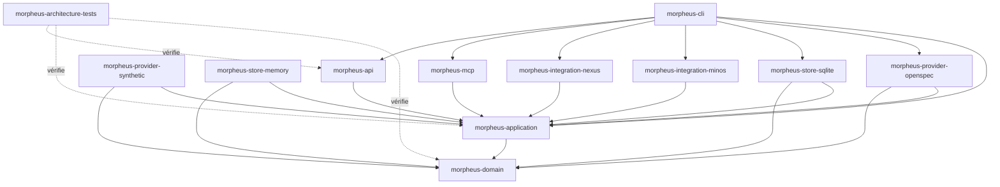
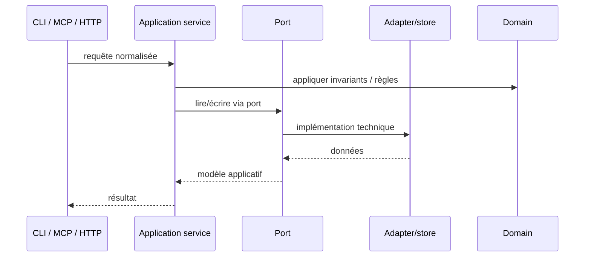
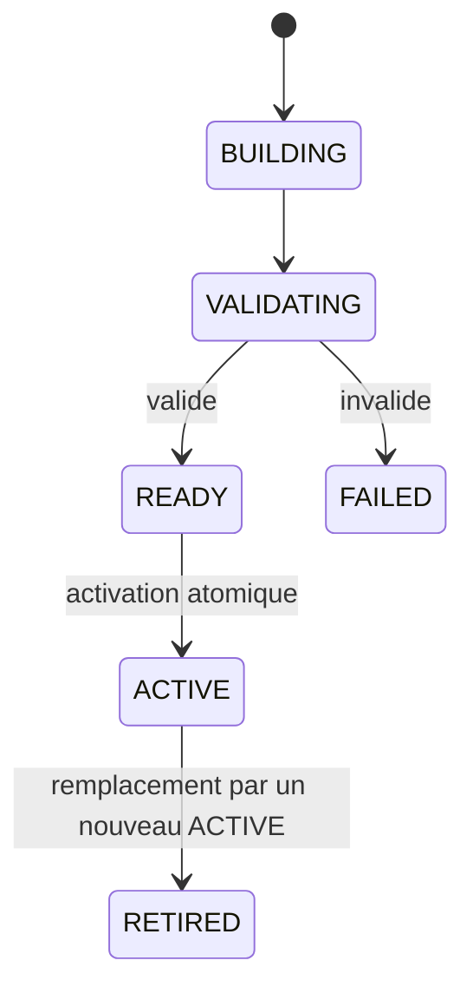
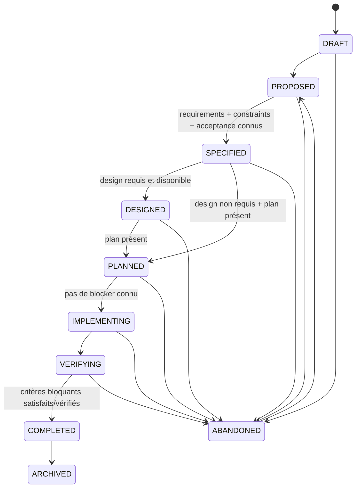

# Guide développeur MORPHEUS

Cette documentation décrit l’état du code après intégration de M14. Elle sert de point d’entrée pour importer le projet, comprendre le découpage Maven, modifier le domaine sans casser les frontières d’architecture et exécuter les gates de validation.

## 1. Prérequis

```text
Java   >= 21
Maven  3.9.16+ via Maven Wrapper
Git
```

Le build parent compile avec `release=21`. Utiliser le wrapper du dépôt afin d’éviter les écarts de version Maven.

### Windows

```powershell
.\mvnw.cmd --version
```

### Linux/macOS

```bash
./mvnw --version
```

## 2. Importer correctement le projet dans IntelliJ IDEA

MORPHEUS est un **projet Maven multi-module**. Le `pom.xml` racine doit être reconnu comme projet Maven par l’IDE.

Si IntelliJ ouvre le dépôt comme un simple projet Java et n’affiche qu’un module `morpheus-engine` :

1. clic droit sur le `pom.xml` racine ;
2. choisir **Add as Maven Project** / **Load Maven Project** selon la version de l’IDE ;
3. recharger Maven.

Ne pas créer les sous-modules manuellement dans `Project Structure` : ils sont déclarés par le reactor Maven et doivent être importés depuis ce modèle.

Résultat attendu dans l’IDE : `morpheus-domain`, `morpheus-application`, `morpheus-api`, `morpheus-cli`, etc. apparaissent comme modules distincts avec leurs source roots Maven.

## 3. Vue du dépôt

```text
morpheus-engine/
├── morpheus-domain/
├── morpheus-application/
├── morpheus-provider-openspec/
├── morpheus-provider-synthetic/
├── morpheus-store-memory/
├── morpheus-store-sqlite/
├── morpheus-integration-minos/
├── morpheus-integration-nexus/
├── morpheus-mcp/
├── morpheus-api/
├── morpheus-cli/
├── morpheus-architecture-tests/
├── distribution/
├── docs/
├── experiments/
└── pom.xml
```

## 4. Architecture des modules



Le principe directeur est :

```text
adapters -> application -> domain
```

Le domaine ne connaît aucun adapter.

## 5. Responsabilité de chaque module

| Module | Responsabilité | À ne pas y mettre |
|---|---|---|
| `morpheus-domain` | modèle métier, value objects, invariants purs | SQLite, HTTP, CLI, MCP, provider-specific |
| `morpheus-application` | use cases, ports, services applicatifs, lifecycle | dépendances vers adapters |
| `morpheus-provider-openspec` | découverte/lecture/normalisation OpenSpec | règles métier MORPHEUS spécifiques au transport |
| `morpheus-provider-synthetic` | provider contrôlé pour tests/scénarios | comportement production implicite |
| `morpheus-store-memory` | implémentation en mémoire des ports de persistance | règles métier |
| `morpheus-store-sqlite` | persistance SQLite versionnée | logique de décision métier |
| `morpheus-integration-minos` | client MINOS via MCP STDIO | dépendance compile-time à `com.minos.*` |
| `morpheus-integration-nexus` | client NEXUS via MCP STDIO | ranking/fusion/budget NEXUS réimplémentés |
| `morpheus-mcp` | adapter serveur MCP read-only | mutation métier cachée |
| `morpheus-api` | adapter HTTP `/api/v1` | dépendance vers CLI/MCP |
| `morpheus-cli` | composition root, launcher et UX CLI | règles métier nouvelles |
| `morpheus-architecture-tests` | contrats ArchUnit et cross-module | code de production |

## 6. Chemin d’une requête

Une commande, un tool MCP et un endpoint HTTP doivent converger vers les mêmes services applicatifs.



Une règle qui change le sens métier d’une opération appartient au domaine ou à l’application, pas à la surface qui l’expose.

## 7. Lire le code dans le bon ordre

Pour comprendre le système sans parcourir tout le dépôt :

1. `morpheus-domain` — identités, temporalité, snapshot, change lifecycle ;
2. `morpheus-application` — services de synchronisation, query, traceability, quality, orchestration ;
3. un store (`memory` puis `sqlite`) ;
4. `morpheus-cli` pour voir la composition ;
5. `morpheus-api` ou `morpheus-mcp` pour les adapters publics ;
6. intégrations MINOS/NEXUS ;
7. `morpheus-architecture-tests` pour les frontières exécutables.

## 8. Invariants à préserver

```text
DomainIdentity != EntityVersionId != SourceLocator != ExternalReference
SpecificationVersion != KnowledgeSnapshot
CURRENT / PROPOSED / HISTORICAL explicites
PROPOSED never leaks into CURRENT
published history = RETIRED* -> ACTIVE
APPLY != PROMOTE != ACTIVATE
Scenario != AcceptanceCriterion
optional engine absence != MORPHEUS failure
live external observation != snapshot mutation
lifecycle unavailable != lifecycle inferred
transition evaluation != lifecycle mutation
MORPHEUS facts/rules != JARVIS action sequencing
```

Ces invariants sont plus importants qu’un choix local d’implémentation. Un changement qui semble pratique mais les brouille doit être reconsidéré ou documenté par ADR.

## 9. Temporalité et lifecycle : ne pas les mélanger

`TemporalState` répond à **où se situe cette information dans l’histoire publiée/proposée ?**

```text
CURRENT | PROPOSED | HISTORICAL
```

`ChangeLifecycleState` répond à **où en est ce changement dans son processus métier ?**

```text
DRAFT | PROPOSED | SPECIFIED | DESIGNED | PLANNED
IMPLEMENTING | VERIFYING | COMPLETED | ARCHIVED | ABANDONED
```

Ces dimensions sont orthogonales.

## 10. Snapshot lifecycle

Le lifecycle technique d’un snapshot est distinct du lifecycle d’un changement.



Une publication ne doit jamais laisser le projet sans snapshot `ACTIVE` valide à cause d’un candidat échoué.

## 11. Change lifecycle

La machine déterministe est portée par `ChangeLifecycleStateMachine` dans l’application.



Les transitions arrière existent uniquement sous politique explicite. La réouverture de `COMPLETED` possède en plus son propre contrôle.

## 12. Workflow de contribution

```text
document first
then decide
then implement
prove before validate
merge after explicit authorization
```

Pratiquement :

1. identifier l’invariant et la source de vérité ;
2. créer/mettre à jour l’ADR si une décision d’architecture est nécessaire ;
3. modifier le domaine/application avant les adapters lorsque la règle est métier ;
4. ajouter les tests ciblés ;
5. exécuter le module concerné ;
6. exécuter le reactor complet ;
7. mettre à jour documentation et preuves ;
8. ne déclarer le travail validé qu’après le gate réellement exécuté.

Lorsqu’une décision dépend d’une hypothèse technique, l’ADR reste proposée jusqu’à obtention d’une preuve reproductible.

## 13. Commandes de développement essentielles

Gate complet :

```powershell
.\mvnw.cmd clean test
```

Module ciblé avec dépendances :

```powershell
.\mvnw.cmd -pl morpheus-api -am test
```

Packaging portable Windows :

```powershell
.\distribution\build-portable.ps1
```

Détails : [Build, tests et validation](BUILD_AND_TEST.md).

## 14. Où documenter une modification ?

| Modification | Documentation attendue |
|---|---|
| invariant métier | guide d’architecture + tests + éventuellement ADR |
| nouveau contrat HTTP | `API.md` + OpenAPI + tests de contrat |
| nouveau tool MCP | `MCP.md` + JSON Schema + tests subprocess |
| nouvelle intégration | `INTEGRATIONS.md` + frontière de responsabilité + smoke |
| changement de packaging | `BUILD_AND_TEST.md` + `distribution/README.md` |
| nouveau jalon | roadmap/validation selon gouvernance |

## 15. Sources de vérité

- [`docs/governance/ROADMAP.md`](../governance/ROADMAP.md) : état des jalons ;
- [`docs/adr/`](../adr/) : décisions d’architecture ;
- [`docs/validation/`](../validation/) : preuves de gate C0 et M0 à M14 ;
- [`docs/openapi/morpheus-v1.yaml`](../openapi/morpheus-v1.yaml) : contrat API machine-readable ;
- tests d’architecture : règles exécutables de dépendance.

## 16. Lire ensuite

- [Architecture détaillée](ARCHITECTURE.md)
- [Build, tests et validation](BUILD_AND_TEST.md)
- [API HTTP](API.md)
- [Serveur MCP](MCP.md)
- [Intégrations cross-engine](INTEGRATIONS.md)
- [Guide utilisateur](../user/README.md)
