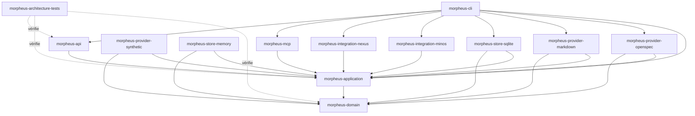
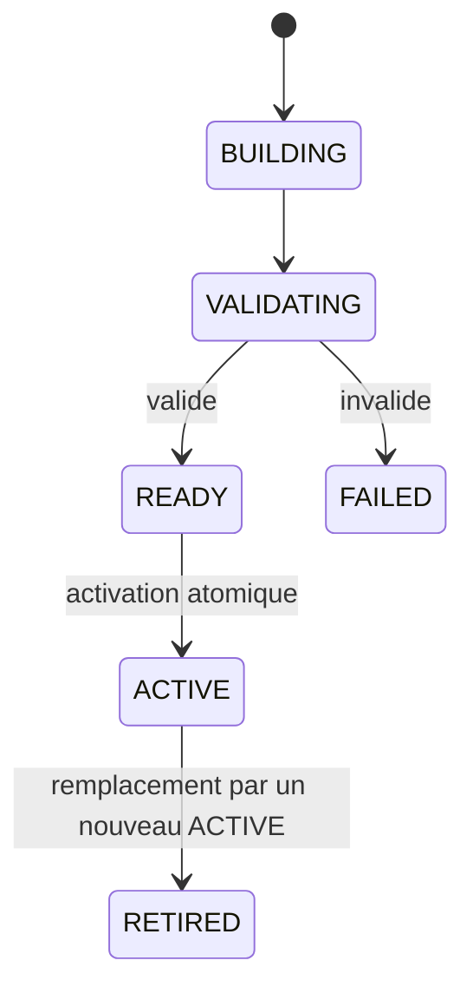

# Guide développeur MORPHEUS

Cette documentation décrit l’état du code après intégration de **M18**. Elle sert de point d’entrée pour importer le projet, comprendre le découpage Maven, modifier le domaine sans casser les frontières d’architecture et exécuter les gates de validation.

## 1. Prérequis

```text
Java   >= 21
Maven  3.9.16+ via Maven Wrapper
Git
```

Le build parent compile avec `release=21`. Utiliser le wrapper du dépôt afin d’éviter les écarts de version Maven.

### Windows

```powershell
.\mvnw.cmd --version
```

### Linux/macOS

```bash
./mvnw --version
```

## 2. Importer correctement le projet dans IntelliJ IDEA

MORPHEUS est un **projet Maven multi-module**. Le `pom.xml` racine doit être reconnu comme projet Maven par l’IDE.

Si IntelliJ ouvre le dépôt comme un simple projet Java et n’affiche qu’un module `morpheus-engine` :

1. clic droit sur le `pom.xml` racine ;
2. choisir **Add as Maven Project** / **Load Maven Project** selon la version de l’IDE ;
3. recharger Maven.

Ne pas créer les sous-modules manuellement dans `Project Structure` : ils sont déclarés par le reactor Maven.

## 3. Vue du dépôt

```text
morpheus-engine/
├── morpheus-domain/
├── morpheus-application/
├── morpheus-provider-openspec/
├── morpheus-provider-markdown/
├── morpheus-provider-synthetic/
├── morpheus-store-memory/
├── morpheus-store-sqlite/
├── morpheus-integration-minos/
├── morpheus-integration-nexus/
├── morpheus-mcp/
├── morpheus-api/
├── morpheus-cli/
├── morpheus-architecture-tests/
├── distribution/
├── docs/
├── experiments/
└── pom.xml
```

Le gate M18 confirme **14/14 modules Maven SUCCESS**.

## 4. Architecture des modules



Principe directeur :

```text
adapters -> application -> domain
```

Le domaine ne connaît aucun adapter ni format provider.

## 5. Responsabilité de chaque module

| Module | Responsabilité | À ne pas y mettre |
|---|---|---|
| `morpheus-domain` | modèle métier, value objects, invariants purs | SQLite, HTTP, CLI, MCP, provider-specific |
| `morpheus-application` | use cases, ports, lifecycle, composition provider-neutral | dépendances vers adapters |
| `morpheus-provider-openspec` | découverte/lecture/normalisation OpenSpec | règles métier cross-provider |
| `morpheus-provider-markdown` | découverte/lecture/normalisation Structured Markdown | types Markdown dans domaine/application |
| `morpheus-provider-synthetic` | provider contrôlé pour tests/scénarios | comportement production implicite |
| `morpheus-store-memory` | implémentation en mémoire des ports de persistance | règles métier |
| `morpheus-store-sqlite` | persistance SQLite versionnée, V012 incluse | logique de décision métier |
| `morpheus-integration-minos` | client MINOS via MCP STDIO | dépendance compile-time à `com.minos.*` |
| `morpheus-integration-nexus` | client NEXUS via MCP STDIO | ranking/fusion/budget NEXUS réimplémentés |
| `morpheus-mcp` | adapter serveur MCP, 22 read-only + 1 write explicite | mutation métier cachée |
| `morpheus-api` | adapter HTTP `/api/v1`, OpenAPI 1.7.0 | dépendance vers CLI/MCP |
| `morpheus-cli` | composition root, launcher et UX CLI | règles métier nouvelles |
| `morpheus-architecture-tests` | contrats ArchUnit et cross-module | code de production |

## 6. Chemins applicatifs

Une commande, un tool MCP et un endpoint HTTP doivent converger vers les mêmes services applicatifs.

Composition M18 :

```text
provider adapter
  -> normalized ProviderContribution
  -> MultiProviderCompositionService
  -> composed content + explicit conflicts
  -> composition state Memory / SQLite V012
  -> CLI / MCP / HTTP
```

Lifecycle M17 :

```text
read-only transition evaluation
  !=
explicit controlled mutation
```

## 7. Lire le code dans le bon ordre

1. `morpheus-domain` — identités, temporalité, snapshots, lifecycle, facts ;
2. `morpheus-application` — sync, query, traceability, quality, orchestration, composition ;
3. providers OpenSpec puis Markdown ;
4. stores Memory puis SQLite ;
5. `morpheus-cli` pour voir le composition root ;
6. `morpheus-api` et `morpheus-mcp` ;
7. intégrations MINOS/NEXUS ;
8. `morpheus-architecture-tests`.

## 8. Invariants à préserver

```text
DomainIdentity != EntityVersionId != SourceLocator != ExternalReference
SpecificationVersion != KnowledgeSnapshot
CURRENT / PROPOSED / HISTORICAL explicites
PROPOSED never leaks into CURRENT
published history = RETIRED* -> ACTIVE
APPLY != PROMOTE != ACTIVATE
Scenario != AcceptanceCriterion
AcceptanceCriterion != Test
Test existence != VERIFIED
Evidence != assertion
UNKNOWN != FAILED
UNKNOWN != BLOCKED
applicable != blocking
warning != blocker
severity != blocking policy
optional engine absence != MORPHEUS failure
optional provider absence != project failure when optional
live external observation != snapshot mutation
lifecycle unavailable != lifecycle inferred
transition evaluation != lifecycle mutation
READ_CHANGES != WRITE_CHANGE
ALLOWED != applied
published snapshot != operational lifecycle state
stale revision != overwrite
idempotent retry != duplicate mutation/audit
provider identifier != DomainIdentity
source path != identity
precedence != provenance erasure
conflict != silent last-write-wins
ambiguous continuity must be surfaced
MORPHEUS facts/rules != JARVIS action sequencing
```

## 9. Snapshot lifecycle



Une publication ne doit jamais laisser le projet sans snapshot `ACTIVE` valide à cause d’un candidat échoué.

## 10. Workflow de contribution

```text
document first
then decide
then implement
prove before validate
merge after explicit authorization
reconcile active documentation immediately after merge
```

Pratiquement :

1. identifier l’invariant et la source de vérité ;
2. créer/mettre à jour l’ADR si nécessaire ;
3. définir le contrat ;
4. modifier domaine/application avant les adapters lorsque la règle est métier ;
5. ajouter les tests ciblés ;
6. auditer les dépendances Maven et migrations ;
7. exécuter le reactor complet et packaging/smokes requis ;
8. enregistrer le SHA réellement testé ;
9. ne déclarer le travail validé qu’après le gate réellement exécuté.

## 11. Commandes essentielles

Gate Maven :

```powershell
.\mvnw.cmd clean test
```

Module ciblé avec dépendances :

```powershell
.\mvnw.cmd -pl morpheus-api -am test
```

Packaging portable Windows :

```powershell
.\distribution\build-portable.ps1
```

Dernier validateur de jalon intégré :

```powershell
.\validate-m18.cmd
```

Détails : [Build, tests et validation](BUILD_AND_TEST.md).

## 12. Baseline validée

```text
M18             ✅ VALIDÉ / INTÉGRÉ — PR #86
Code validé     7e8caacff567f51354fcb88bd7505a6d135071c0
Merge           30f11ac3ffc522bcc0c71e31216a3fb70f0631d7
Tests           418/418 PASS
Architecture    170/170 PASS
Packaging       Windows + smokes + API health PASS
OpenAPI         1.7.0
SQLite          V012
```

Jalon suivant : **M19 — Production Hardening, Scale & Operability**.

## 13. Où documenter une modification ?

| Modification | Documentation attendue |
|---|---|
| invariant métier | guide d’architecture + tests + éventuellement ADR |
| nouveau contrat HTTP | `API.md` + OpenAPI + tests de contrat |
| nouveau tool MCP | `MCP.md` + JSON Schema + tests subprocess |
| nouveau provider | guide développeur + ADR/contrats + architecture tests |
| nouvelle intégration | `INTEGRATIONS.md` + frontière de responsabilité + smoke |
| changement de packaging | `BUILD_AND_TEST.md` + `distribution/README.md` |
| nouveau jalon | roadmap/validation selon gouvernance |

## 14. Sources de vérité

- [`docs/governance/ROADMAP.md`](../governance/ROADMAP.md) : état des jalons ;
- [`docs/roadmap/POST_M14_EXECUTION.md`](../roadmap/POST_M14_EXECUTION.md) : trajectoire D0→M20 ;
- [`docs/adr/`](../adr/) : décisions d’architecture ;
- [`docs/validation/`](../validation/) : preuves historiques jusqu’à M18 ;
- [`docs/openapi/morpheus-v1.yaml`](../openapi/morpheus-v1.yaml) : contrat API machine-readable ;
- tests d’architecture : règles exécutables de dépendance.

## 15. Lire ensuite

- [Architecture détaillée](ARCHITECTURE.md)
- [Build, tests et validation](BUILD_AND_TEST.md)
- [API HTTP](API.md)
- [Serveur MCP](MCP.md)
- [Intégrations cross-engine](INTEGRATIONS.md)
- [Guide utilisateur](../user/README.md)
