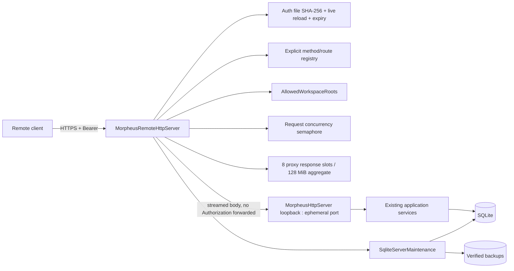

# M26 — Remote Server Platform

M26 ajoute une frontière réseau optionnelle sans modifier l’autorité du domaine MORPHEUS ni imposer un service distant au mode local.

## Architecture



La façade remote est un adapter. Domain/application ne dépendent ni de TLS, ni des rôles réseau, ni des fichiers d’identités.

## Pourquoi une façade devant l’API locale

L’API locale M11-M25 possède déjà les routes métier, validation JSON, CAS, budgets et règles de mutation. M26 évite de dupliquer ou réécrire cette surface :

1. le frontal `HttpsServer` termine TLS ;
2. il authentifie le Bearer à partir du fichier d'identités courant ;
3. il résout le rôle minimum depuis une table exhaustive `(méthode HTTP, route)` ;
4. il applique les limites de concurrence et de réponse agrégée ;
5. il intercepte uniquement les endpoints serveur M26 ;
6. il proxy les autres requêtes vers un `MorpheusHttpServer` interne sur `127.0.0.1:0` en streaming ;
7. `Authorization` n’est jamais relayé vers l’inner server.

Cette composition préserve les contrats M11-M25 et rend la sécurité remote vérifiable à une frontière unique.

## Modes

### LOCAL

`LoopbackHostPolicy` est appliquée à la fois par `ApiLaunchOptions` et directement par
`MorpheusHttpServer.start()`. Chaque adresse résolue doit être loopback, puis le serveur lie le socket à
l’adresse déjà validée sans seconde résolution DNS. Un caller Java direct ne peut donc pas contourner
l’invariant. Seule la façade `MorpheusRemoteHttpServer`, avec TLS et authentification, peut écouter sur une
adresse non-loopback.

### REMOTE

`RemoteApiLaunchOptions` n’est sélectionné qu’en présence de `api --remote`.

Le démarrage exige :

- auth file valide et non symbolique ;
- au moins une identité `ADMIN` **active à l'instant du démarrage** ;
- keystore PKCS12 valide, confiné et borné ;
- mot de passe TLS via environnement/propriété ;
- limite de concurrence 1..512 ;
- au moins une racine workspace serveur existante et canonique.

Un record `ADMIN` déjà expiré ne satisfait pas le prérequis de démarrage. Un `ADMIN` non expirant reste actif tant qu'il n'est ni révoqué ni rétrogradé.

## Authentication

`MorpheusRemoteIdentityFile` est le provider local de référence.

Format :

```text
principal|role|sha256(token)[|expiresAt]
```

Le quatrième champ est optionnel et contient un `Instant` ISO-8601. Les entrées historiques à trois champs restent compatibles et sont interprétées comme non expirantes. Une échéance absente signifie donc `NEVER`; une échéance malformée est rejetée fail-closed au chargement du store. Une identité dont `expiresAt <= now` ne peut plus s'authentifier.

Contraintes :

```text
identities        <= 256
auth file         <= 256 KiB
audit retained    <= 512 secret-free records
principal         [A-Za-z0-9._@-]{1,128}
token             32 random bytes / 256 bits
expiresAt         optional ISO-8601 Instant
persisted token   never
comparison        MessageDigest.isEqual
```

Cycle de vie CLI de l'expiration :

```text
create sans --expires-at        -> credential permanent
create --expires-at <instant>   -> credential borné dans le temps
rotate sans --expires-at        -> conserve l'échéance actuelle
rotate --expires-at <instant>   -> remplace l'échéance
rotate --expires-at never       -> rend explicitement permanent
```

Les mutations `create`, `revoke`, `rotate` et `role` utilisent :

```text
JVM mutation lock
    -> owner-hardened <auth-file>.lock
    -> FileChannel/FileLock inter-processus
    -> read current snapshot
    -> validate invariants, dont dernier ADMIN actif
    -> retain only the latest 512 audit records
    -> temp file owner-only
    -> atomic move/replace
```

Deux processus administratifs coopérants ne peuvent donc plus effectuer simultanément un read-modify-write qui perdrait une mutation. L'audit est secret-free et borné à une fenêtre roulante de 512 événements ; sa croissance ne peut pas remplir indéfiniment le fichier de 256 KiB et empêcher une rotation/révocation urgente.

Le serveur ne conserve pas un snapshot d'identités comme autorité d'authentification. Il recharge le fichier courant à chaque requête avant la comparaison du Bearer. Une rotation/révocation/changement de rôle est effective dès l'authentification suivante, sans redémarrage serveur ; l'expiration est elle aussi évaluée à chaque authentification. Une erreur de lecture/validation du store d'authentification produit un refus fail-closed plutôt qu'un fallback sur une ancienne copie en mémoire.

Les répertoires locaux sensibles nouvellement créés sont durcis. Sur POSIX, un répertoire préexistant modifiable par groupe/autres est refusé ; sur les filesystems ACL-only, les ACL natives du profil/administrateur restent l'autorité de plateforme et les fichiers créés par MORPHEUS sont durcis quand la vue ACL est disponible.

## Authorization

Ordre :

```text
READ < WRITE < ADMIN
```

`MorpheusRemoteRoutePolicy` porte une table exhaustive `(méthode HTTP, route) -> rôle minimum`. Il n'existe aucun fallback générique du type `GET/HEAD => READ` ou `mutation => WRITE`.

Sémantique fail-closed :

```text
route inconnue                 -> 404 NOT_FOUND
route connue, méthode inconnue -> 405 METHOD_NOT_ALLOWED
route + méthode connues        -> rôle minimum déclaré explicitement
```

Les routes sensibles sont également déclarées explicitement :

- `GET /metrics` : ADMIN ;
- `POST /provider-plugins/probe` : ADMIN ;
- `POST /server/backups` : ADMIN ;
- `GET /server/status` : READ.

Les POST read-only sont des exceptions **déclarées dans le registre**, notamment Query DSL (`queries/execute`), exports, policy evaluate/dry-run, reasoning analyze, augmented context, transition-check et saved-view execute/export. La résolution d'une external reference est un `GET` explicitement déclaré READ.

L'ajout futur d'un endpoint, y compris un GET, ne lui confère donc aucune autorisation distante tant que sa méthode et son template de route ne sont pas enregistrés. Une route inconnue n'obtient jamais implicitement READ, WRITE ou ADMIN.

### Provider plugins en remote

La discovery reste une opération metadata-only et n’effectue aucun classloading. Elle refuse un répertoire de plugins symbolique, ignore/refuse les candidats JAR symboliques et contrôle leurs attributs avec `NOFOLLOW_LINKS` avant l’inspection. La sélection des candidats est bornée à 256 chemins avant le tri final, puis l’inspection utilise `JarFile` pour accéder directement aux métadonnées et refuse les archives dépassant 10 000 entrées. L’exécution du plugin reste une frontière distincte et plus stricte.

Le probe exécutable remote :

- est réservé à ADMIN ;
- utilise uniquement le répertoire de plugins configuré côté serveur ;
- réapplique `AllowedWorkspaceRoots` au workspace demandé ;
- exige un paramètre `sha256` de 64 hex ;
- refuse un probe sans pin avec `PLUGIN_SHA256_REQUIRED`.

Pour un plugin épinglé, `ExternalJarIntegrity` copie d'abord le JAR dans un fichier de staging privé, vérifie le SHA-256 de **cette copie**, puis `URLClassLoader` charge exclusivement cette copie. Le chemin original peut changer après le staging sans modifier le code réellement exécuté. Le staging est supprimé après fermeture du classloader.

Le même principe de staging vérifié est utilisé pour les JARs MINOS/NEXUS lorsqu'un pin d'intégrité est configuré ; les clients MCP déjà démarrés sont fermés si `initialize()` ou `listTools()` échoue. Les réponses MCP sont également bornées avant désérialisation : 4 MiB maximum de `TextContent`, avec contrôle des cardinalités retournées côté MORPHEUS.

Ces contrôles apportent intégrité, confinement de chemins et isolation de cycle de vie, mais **ne constituent pas une sandbox du système d'exploitation**. Un plugin ou serveur MCP explicitement approuvé s'exécute avec les permissions OS du compte MORPHEUS ; le déploiement doit donc appliquer le moindre privilège au compte de service et ne charger que du code tiers de confiance et épinglé lorsque l'intégrité est configurable.

## Autorité filesystem des workspaces

`AllowedWorkspaceRoots` sépare le rôle métier `WRITE` des droits OS du compte
serveur. La configuration vient de `--workspace-root` (répétable),
`MORPHEUS_SERVER_WORKSPACE_ROOTS` ou `morpheus.server.workspaceRoots`; aucune
requête ne peut modifier cette allowlist.

L’enregistrement canonicalise et persiste le real path autorisé. Les opérations
ultérieures, notamment `sync`, réappliquent la politique au chemin persisté afin
qu’un ancien projet hors racine ou un répertoire remplacé par un lien soit
refusé. La décision exige à la fois confinement lexical, absence de composant
symbolique et confinement du real path. Le mode local conserve son comportement
historique sans politique remote.

Les lectures provider passent par `SafeWorkspaceFileResolver`, qui applique un décodage UTF-8 strict (`REPORT`) : un flux malformé est rejeté et n'est jamais normalisé silencieusement avec le caractère de remplacement Unicode. La même primitive expose une lecture binaire bornée qui revalide l’identité, les métadonnées et le contenu après lecture afin de détecter un remplacement concurrent.

### Budget du scan d'inventaire

Le scan source qui précède l'ingestion est lui aussi borné **avant** le fingerprint SHA-256 des fichiers. `SourceScanPolicy.safeDefaults()` limite :

```text
profondeur             128 segments
répertoires traversés  50 000
fichiers                50 000
taille d'un fichier     64 MiB
volume agrégé           2 GiB
```

Le dépassement produit un `SourceInventoryScanResult` incomplet ; la synchronisation ne publie pas cette observation comme nouvelle baseline. Le compteur de répertoires empêche également une arborescence composée de très nombreux répertoires vides de contourner le budget. `LocalSourceWatcher` applique désormais les mêmes limites de profondeur et de répertoires pendant l’enregistrement récursif et n’utilise plus de matérialisation non bornée de l’arbre. Les budgets provider plus fins continuent ensuite de s'appliquer à l'ingestion métier.

## TLS

Implémentation JDK uniquement :

```text
HttpsServer
KeyStore PKCS12
KeyManagerFactory
SSLContext TLS
protocols TLSv1.3 + TLSv1.2
```

Le parent du keystore doit appartenir à une frontière d’écriture protégée. Le PKCS12 est lu par `SafeWorkspaceFileResolver.readBytes()` avec un plafond de **4 MiB**, refus des symlinks et revalidation anti-TOCTOU. Le mot de passe du keystore est cloné pour l’initialisation puis effacé ; le buffer binaire contenant le PKCS12 est lui aussi écrasé après chargement.

## Concurrence et timeout proxy

Le frontal utilise deux budgets indépendants et fail-closed :

```text
requêtes simultanées configurables   1..512
réponse proxy individuelle           <= 16 MiB
réponses proxy simultanées           <= 8
budget agrégé de réponses in-flight  <= 128 MiB
```

Le `Semaphore` de requêtes est équitable. `tryAcquire()` est non bloquant : lorsque le budget de requêtes est atteint, la requête reçoit `429`. Un second `Semaphore` réserve au maximum huit slots pour les réponses du proxy ; une saturation de ce budget produit également `429 RESPONSE_BUDGET_EXHAUSTED`.

Le hop loopback utilise `HttpResponse.BodyHandlers.ofInputStream()` : le body n’est plus matérialisé intégralement dans un `byte[]`. Le frontal exige un `Content-Length` borné pour les réponses avec body, refuse toute valeur supérieure à 16 MiB et relaie le flux par blocs de 8 KiB en vérifiant que le nombre réel d’octets correspond exactement à la longueur annoncée. Ainsi, augmenter `maxConcurrentRequests` jusqu’à 512 n’augmente pas proportionnellement la mémoire allouable aux bodies de réponses.

Le modèle n’ajoute pas une queue applicative non bornée. Les invariants SQLite/CAS existants restent responsables des conflits métier.

Les opérations read-only dont l'exécution est entièrement contrôlée par MORPHEUS utilisent un timeout amont de 60 secondes et retournent `504 UPSTREAM_TIMEOUT` en cas de dépassement. Les mutations POST/PUT/PATCH/DELETE ne reçoivent pas cette deadline proxy arbitraire : le slot de concurrence reste détenu jusqu'à la réponse réelle de l'API loopback.

`provider-plugins/probe` constitue une exception explicite au timeout read-only. Le probe exécute du code tiers approuvé par ADMIN et le SDK ne garantit pas que ce code respecte une interruption/cancellation. Retourner `504` puis libérer le semaphore alors que le plugin continue serait donc une fausse garantie. Le frontal attend la fin réelle du probe et conserve le slot pendant toute son exécution.

Une coupure réseau côté client reste un résultat distribué potentiellement ambigu ; le client doit réconcilier l'état avant un retry d'une opération non idempotente.

### Sessions SQLite par opération

Chaque opération locale ou remote qui construit `ApiRuntime` possède un `SqliteConnectionScope` thread-confined. Les neuf stores du runtime empruntent neuf connexions logiques, mais partagent exactement une connexion physique. La vérification/migration du schéma est exécutée une seule fois dans ce scope ; la fermeture des stores ne ferme que leurs handles logiques, puis `ApiRuntime.close()` ferme la connexion physique propriétaire.

Le runtime Query HTTP utilise désormais le même principe : ses cinq stores (`snapshots`, `requirements`, `content`, `portfolios`, `saved`) partagent une seule connexion physique et le constructeur nettoie tous les handles déjà ouverts si une initialisation ultérieure échoue.

Une invocation CLI ouvre elle aussi un seul `SqliteConnectionScope` partagé par ses stores. La récupération des snapshots, les lectures et les mutations d'une commande restent donc dans une pression d'une seule connexion physique, avec fermeture du scope en dernier.

`SqliteConnectionScope.diagnostics()` expose les compteurs process `opened`, `closed`, `active` et `peak` sans chemin de base ni donnée métier. Un scope ne peut pas être imbriqué, changer de base/timeout, traverser un thread ou survivre à l’opération qui le possède. Un appel `close()` depuis le mauvais thread est rejeté **avant** de modifier l'état du scope afin que le thread propriétaire puisse encore effectuer le cleanup réel.

Les blocs transactionnels des stores et du gestionnaire de schéma délèguent à `SqliteTransactionRunner`. Le runner emprunte la connexion sans jamais la fermer, possède la transition d’auto-commit, le commit/rollback et la restauration du mode précédent. Il exige `autoCommit=true` à l'entrée : une transaction déjà ouverte appartient au caller et est refusée sans `commit()` ni `rollback()` afin d'interdire les transactions imbriquées implicites.

Une erreur métier, SQL **ou `Error`** quittant le work avant commit provoque un rollback best-effort. La défaillance primaire est réémise ; les échecs de rollback et de restauration sont rattachés comme exceptions `suppressed`.

Si le `commit()` réussit mais que la restauration du mode auto-commit échoue ensuite, le runner lève un `SqliteCommittedTransactionException`. Cette exception signifie explicitement que **la mutation est déjà commitée et ne doit pas être rejouée comme si elle avait rollbacké**.

### Réconciliation du sync après publication

La publication d'un snapshot et la persistance de la baseline de synchronisation restent deux transactions distinctes ; MORPHEUS ne prétend pas les transformer artificiellement en transaction distribuée atomique.

`IncrementalSyncService.complete()` applique une réconciliation bornée :

1. tente la persistance de la baseline ;
2. en cas d'exception, relit état + inventaire et accepte un commit déjà visible ;
3. sinon tente **un seul retry idempotent** ;
4. relit à nouveau après le retry ;
5. si une publication a pu avoir lieu mais que la baseline reste impossible à persister, enregistre `BASELINE_INCONSISTENT` plutôt que `EXECUTION_FAILED` ;
6. le plan suivant force alors un full rebuild conservateur.

`fail()` ne dégrade pas un commit déjà visible. Un scan incomplet conserve sa cause `SCAN_INCOMPLETE` et n'est plus reclassé comme échec d'exécution générique.

## Schéma SQLite

Le gestionnaire de migrations connaît la version maximale supportée par le runtime : **V016** sur cette baseline. Après création/lecture du ledger et **avant toute migration connue**, une base dont `MAX(schema_migrations.version) > 16` est refusée. `SqliteServerMaintenance` dérive sa propre limite directement de `SqliteSchemaManager.SUPPORTED_SCHEMA_VERSION`, ce qui empêche le backup/restore de diverger du gestionnaire de schéma.

V016 répare d’éventuels doublons historiques de `SpecificationVersion.sequence` par projet, puis impose un index unique partiel `(project_id, sequence)` pour toute séquence non nulle. Une candidate de publication FAILED reste durable pour l’audit et consomme sa séquence ; un retry alloue donc la suivante au lieu de produire un doublon logique.

Le runtime utilise `journal_mode=PERSIST` avec busy timeout et refuse les sidecars WAL/SHM dans ce mode. La mitigation de concurrence ne repose donc pas sur WAL.

## Runtime status

`/api/v1/server/status` expose :

```text
mode
transport
host
port
startedAt
uptimeSeconds
activeRequests
maxConcurrentRequests
requestBodyReadTimeoutMillis
maxProxyResponseBytes
maxProxyInFlightBytes
maxConcurrentBufferedProxyResponses
totalRequests
authenticationFailures
authorizationFailures
throttledRequests
requestTimeouts
```

Aucun header, token, token hash, keystore password ou payload métier.

## Backup

`SqliteServerMaintenance.createBackup` :

1. ouvre le store pour confirmer/migrer normalement le schéma courant ;
2. crée une destination sous le répertoire explicitement fourni ;
3. rejette symlink et path escape ;
4. exécute `VACUUM INTO` ;
5. durcit les permissions ;
6. exécute `integrity_check` ;
7. lit `schema_migrations` ;
8. calcule SHA-256.

V016 est une migration générale d’intégrité du schéma MORPHEUS, pas une nouvelle table de configuration remote. Les identités remote, secrets TLS et paramètres de façade restent de la configuration externe/opérationnelle et ne deviennent pas une vérité métier SQLite.

## Restore offline

`restoreOffline` :

```text
explicit --confirm
    -> verify backup
    -> acquire <db>.server.lock
    -> reject unsafe target/sidecars
    -> copy to staging file
    -> verify staging checksum
    -> replace target atomically when supported
    -> harden permissions
    -> verify final database
```

Le remote server garde le même file lock pendant toute sa durée de vie. Une restauration concurrente échoue donc avant remplacement.

`SUPPORTED_SCHEMA_VERSION` est dérivé de `SqliteSchemaManager.SUPPORTED_SCHEMA_VERSION` (**16** sur cette baseline). Un backup `> 16` est rejeté. Un backup `<= 16` est accepté ; les migrations normales restent l’unique mécanisme d’upgrade lors de l’ouverture suivante.

### Format des migrations SQLite

Les ressources `db/migration/VNNN__*.sql` peuvent contenir plusieurs instructions. Leur découpage reconnaît les
littéraux SQL, les identifiants quotés (`"..."`, `` `...` ``, `[...]`), les commentaires de ligne/bloc et les corps
`CREATE TRIGGER ... BEGIN ... END`. Un point-virgule dans l’une de ces constructions n’est donc jamais interprété
comme une fin d’instruction. Les expressions `CASE ... END` imbriquées dans un trigger sont également prises en
charge.

Une chaîne, un identifiant, un commentaire de bloc ou un corps de trigger non terminé est rejeté avec sa position
ligne/colonne. L’ensemble du script et l’écriture correspondante dans `schema_migrations` s’exécutent dans la même
transaction : toute erreur SQL annule les instructions précédentes et n’avance pas la version du schéma.

## Surface publique

M26 ajoute :

```text
server.status
server.identity.create
server.identity.list
server.identity.revoke
server.identity.rotate
server.identity.role
server.backup.create
server.backup.verify
server.restore
```

Expositions intentionnelles :

```text
server.status             HTTP remote
identity lifecycle        CLI local only
backup create             CLI local + HTTP POST ADMIN
backup verify             CLI local only
restore                   CLI offline only
provider plugin discover  HTTP GET READ
provider plugin probe     HTTP POST ADMIN + trusted SHA-256
MCP                       aucune surface control-plane M26
```

Voir `contracts/public-surfaces.tsv` et `docs/openapi/morpheus-v1-remote-m26.yaml`.

## Tests

- `MorpheusRemoteIdentityFileTest` / lifecycle tests : hash-only, auth, expiry rétrocompatible, malformed/duplicates, mutations, concurrence et compaction de l'audit ;
- `MorpheusRemoteHttpServerStartupPolicyTest` : store vide, ADMIN expiré, ADMIN actif et ADMIN permanent au démarrage ;
- `MorpheusRemoteHttpServerTest` : PKCS12 réel, HTTPS, 401/403, rôles, live revoke, pin plugin, timeout classification, headers, backup ADMIN, concurrence/429, budgets proxy, PKCS12 surdimensionné et secret non-disclosure ;
- `MorpheusRemoteRoutePolicyTest` : registre exhaustif, exceptions read-only, 404 sur route inconnue et 405 sur méthode non déclarée ;
- `ProviderPluginDiscoveryTest` : discovery metadata-only, sélection bornée, ordre déterministe et refus des symlinks ;
- `RemoteApiLaunchOptionsTest` : local loopback et startup remote fail-closed ;
- `MorpheusServerCliTest` : provisioning/lifecycle/expiry + backup/verify/restore ;
- `ApiRuntimeSqliteSessionTest` / `CliRuntimeSqliteSessionTest` : une connexion physique par runtime ;
- `SqliteConnectionScopeTest` / `SqliteTransactionRunnerTest` : confinement thread, transaction ownership, `Error`, cleanup et résultat post-commit explicite ;
- `SyncReliabilityFallbackTest` : commit visible, retry borné, `BASELINE_INCONSISTENT`, `SCAN_INCOMPLETE` ;
- `SqliteFutureSchemaCompatibilityTest` / `SqliteServerMaintenanceTest` : integrity/schema/lease/future-schema ;
- `FailedPublishRecoveryContractTest` : séquences durables `1 -> FAILED 2 -> retry 3` ;
- `RemoteServerArchitectureTest` / `RepositoryDocumentationCoherenceTest` : boundaries et contrats source/manifest/OpenAPI/documentation.

## Gates

Le gate durable exact-head est M21 sur Linux et Windows, avec la baseline active `1.2.1`. Sur pull request, Linux applique en plus un gate JaCoCo différentiel : au moins **80 % des lignes Java de production modifiées et exécutables** et **70 % des branches modifiées** doivent être couvertes ; l’évidence est conservée dans `validation-output/m21/diff-coverage.txt`.

Les gates milestone M26 restent des preuves historiques/spécialisées :

```text
Windows  .\validate-m26.cmd 1.0.0
Linux    bash ./scripts/validate-m26.sh 1.0.0
```

La CI canonique déclenche M21 sur les pull requests, `main` et `develop`. Le workflow `MORPHEUS Security` ajoute OWASP Dependency-Check à la frontière `main` et sur cadence hebdomadaire. Les actions GitHub sont épinglées par SHA immuable et le Maven Wrapper vérifie le SHA-256 de Maven 3.9.16.
