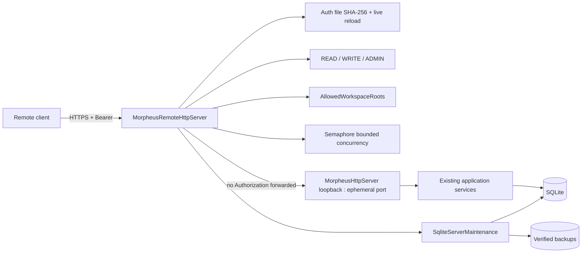

# M26 — Remote Server Platform

M26 ajoute une frontière réseau optionnelle sans modifier l’autorité du domaine MORPHEUS ni imposer un service distant au mode local.

## Architecture



La façade remote est un adapter. Domain/application ne dépendent ni de TLS, ni des rôles réseau, ni des fichiers d’identités.

## Pourquoi une façade devant l’API locale

L’API locale M11-M25 possède déjà les routes métier, validation JSON, CAS, budgets et règles de mutation. M26 évite de dupliquer ou réécrire cette surface :

1. le frontal `HttpsServer` termine TLS ;
2. il authentifie le Bearer à partir du fichier d'identités courant ;
3. il calcule le rôle requis ;
4. il applique la limite de concurrence ;
5. il intercepte uniquement les endpoints serveur M26 ;
6. il proxy les autres requêtes vers un `MorpheusHttpServer` interne sur `127.0.0.1:0` ;
7. `Authorization` n’est jamais relayé vers l’inner server.

Cette composition préserve les contrats M11-M25 et rend la sécurité remote vérifiable à une frontière unique.

## Modes

### LOCAL

`LoopbackHostPolicy` est appliquée à la fois par `ApiLaunchOptions` et directement par
`MorpheusHttpServer.start()`. Chaque adresse résolue doit être loopback, puis le serveur lie le socket à
l’adresse déjà validée sans seconde résolution DNS. Un caller Java direct ne peut donc pas contourner
l’invariant. Seule la façade `MorpheusRemoteHttpServer`, avec TLS et authentification, peut écouter sur une
adresse non-loopback.

### REMOTE

`RemoteApiLaunchOptions` n’est sélectionné qu’en présence de `api --remote`.

Le démarrage exige :

- auth file valide et non symbolique ;
- au moins une identité ADMIN ;
- keystore PKCS12 valide et non symbolique ;
- mot de passe TLS via environnement/propriété ;
- limite de concurrence 1..512 ;
- au moins une racine workspace serveur existante et canonique.

## Authentication

`MorpheusRemoteIdentityFile` est le provider local de référence.

Format :

```text
principal|role|sha256(token)
```

Contraintes :

```text
identities        <= 256
auth file         <= 256 KiB
principal         [A-Za-z0-9._@-]{1,128}
token             32 random bytes / 256 bits
persisted token   never
comparison        MessageDigest.isEqual
```

Les mutations `create`, `revoke`, `rotate` et `role` utilisent :

```text
JVM mutation lock
    -> owner-hardened <auth-file>.lock
    -> FileChannel/FileLock inter-processus
    -> read current snapshot
    -> validate invariants, dont dernier ADMIN
    -> temp file owner-only
    -> atomic move/replace
```

Deux processus administratifs coopérants ne peuvent donc plus effectuer simultanément un read-modify-write qui perdrait une mutation.

Le serveur ne conserve pas un snapshot d'identités comme autorité d'authentification. Il recharge le fichier courant à chaque requête avant la comparaison du Bearer. Une rotation/révocation/changement de rôle est effective dès l'authentification suivante, sans redémarrage serveur. Une erreur de lecture/validation du store d'authentification produit un refus fail-closed plutôt qu'un fallback sur une ancienne copie en mémoire.

Les répertoires locaux sensibles nouvellement créés sont durcis. Sur POSIX, un répertoire préexistant modifiable par groupe/autres est refusé ; sur les filesystems ACL-only, les ACL natives du profil/administrateur restent l'autorité de plateforme et les fichiers créés par MORPHEUS sont durcis quand la vue ACL est disponible.

## Authorization

Ordre :

```text
READ < WRITE < ADMIN
```

Classification remote :

- `GET`/`HEAD` : READ, sauf métriques ADMIN ;
- POST read-only explicitement listés : READ ;
- POST/PUT/PATCH/DELETE restants : WRITE ;
- `/provider-plugins/probe` : ADMIN et POST uniquement ;
- `/server/backups` : ADMIN ;
- `/server/status` : READ ;
- méthode non supportée : 405.

Les POST read-only incluent Query DSL, exports, policy evaluate/dry-run, transition-check, augmented context, saved-view execute/export et external-reference resolve.

Une route inconnue n’obtient jamais ADMIN.

### Provider plugins en remote

La discovery reste une opération metadata-only. Le probe exécutable remote :

- est réservé à ADMIN ;
- utilise uniquement le répertoire de plugins configuré côté serveur ;
- réapplique `AllowedWorkspaceRoots` au workspace demandé ;
- exige un paramètre `sha256` de 64 hex ;
- refuse un probe sans pin avec `PLUGIN_SHA256_REQUIRED`.

Pour un plugin épinglé, `ExternalJarIntegrity` copie d'abord le JAR dans un fichier de staging privé, vérifie le SHA-256 de **cette copie**, puis `URLClassLoader` charge exclusivement cette copie. Le chemin original peut changer après le staging sans modifier le code réellement exécuté. Le staging est supprimé après fermeture du classloader.

Le même principe de staging vérifié est utilisé pour les JARs MINOS/NEXUS lorsqu'un pin d'intégrité est configuré ; les clients MCP déjà démarrés sont fermés si `initialize()` ou `listTools()` échoue.

## Autorité filesystem des workspaces

`AllowedWorkspaceRoots` sépare le rôle métier `WRITE` des droits OS du compte
serveur. La configuration vient de `--workspace-root` (répétable),
`MORPHEUS_SERVER_WORKSPACE_ROOTS` ou `morpheus.server.workspaceRoots`; aucune
requête ne peut modifier cette allowlist.

L’enregistrement canonicalise et persiste le real path autorisé. Les opérations
ultérieures, notamment `sync`, réappliquent la politique au chemin persisté afin
qu’un ancien projet hors racine ou un répertoire remplacé par un lien soit
refusé. La décision exige à la fois confinement lexical, absence de composant
symbolique et confinement du real path. Le mode local conserve son comportement
historique sans politique remote.

Les lectures provider passent par `SafeWorkspaceFileResolver`, qui applique un décodage UTF-8 strict (`REPORT`) : un flux malformé est rejeté et n'est jamais normalisé silencieusement avec le caractère de remplacement Unicode.

### Budget du scan d'inventaire

Le scan source qui précède l'ingestion est lui aussi borné **avant** le fingerprint SHA-256 des fichiers. `SourceScanPolicy.safeDefaults()` limite :

```text
profondeur            128 segments
fichiers               50 000
taille d'un fichier    64 MiB
volume agrégé          2 GiB
```

Le dépassement produit un `SourceInventoryScanResult` incomplet ; la synchronisation ne publie pas cette observation comme nouvelle baseline. Les budgets provider plus fins continuent ensuite de s'appliquer à l'ingestion métier.

## TLS

Implémentation JDK uniquement :

```text
HttpsServer
KeyStore PKCS12
KeyManagerFactory
SSLContext TLS
protocols TLSv1.3 + TLSv1.2
```

Le mot de passe du keystore est cloné pour l’initialisation puis le tableau temporaire est effacé.

## Concurrence et timeout proxy

Le frontal utilise un `Semaphore` équitable. `tryAcquire()` est non bloquant : lorsque le budget est atteint, la requête reçoit `429`.

Le modèle n’ajoute pas une queue applicative non bornée. Les invariants SQLite/CAS existants restent responsables des conflits métier.

Les opérations read-only proxifiées utilisent un timeout amont de 60 secondes et retournent `504 UPSTREAM_TIMEOUT` en cas de dépassement. Les mutations POST/PUT/PATCH/DELETE ne reçoivent plus cette deadline proxy arbitraire : le slot de concurrence reste détenu jusqu'à la réponse réelle de l'API loopback. Cela évite que le frontal annonce un timeout tout en libérant le slot alors qu'une mutation continue en interne.

Une coupure réseau côté client reste un résultat distribué potentiellement ambigu ; le client doit réconcilier l'état avant un retry d'une opération non idempotente.

### Session SQLite par opération API

Chaque opération locale ou remote qui construit `ApiRuntime` possède un `SqliteConnectionScope` thread-confined.
Les neuf stores du runtime empruntent neuf connexions logiques, mais partagent exactement une connexion physique.
La vérification/migration du schéma est exécutée une seule fois dans ce scope ; la fermeture des stores ne ferme que
leurs handles logiques, puis `ApiRuntime.close()` ferme la connexion physique propriétaire. Hors scope, les stores
conservent leur cycle de vie historique autonome.

La pression est donc bornée à une connexion physique SQLite par opération API active, indépendamment du nombre de
stores consultés. `SqliteConnectionScope.diagnostics()` expose les compteurs process `opened`, `closed`, `active` et
`peak` sans chemin de base ni donnée métier. Un scope ne peut pas être imbriqué, changer de base/timeout, traverser un
thread ou survivre à l’opération qui le possède. Un appel `close()` depuis le mauvais thread est rejeté **avant** de modifier l'état du scope afin que le thread propriétaire puisse encore effectuer le cleanup réel.

Les blocs transactionnels des stores et du gestionnaire de schéma délèguent à `SqliteTransactionRunner`. Le runner
emprunte la connexion sans jamais la fermer, possède la transition d’auto-commit, le commit/rollback et la restauration
du mode précédent. Une erreur métier ou SQL reste toujours la cause primaire ; les échecs de rollback et de restauration
sont rattachés comme exceptions `suppressed`.

Si le `commit()` réussit mais que la restauration du mode auto-commit échoue ensuite, le runner lève un `SqliteCommittedTransactionException`. Cette exception signifie explicitement que **la mutation est déjà commitée et ne doit pas être rejouée comme si elle avait rollbacké**.

## Schéma SQLite

Le gestionnaire de migrations connaît la version maximale supportée par le runtime (`15` sur cette baseline). Après création/lecture du ledger et **avant toute migration connue**, une base dont `MAX(schema_migrations.version) > 15` est refusée. La règle de compatibilité utilisée à l'ouverture normale et celle du backup/restore sont ainsi cohérentes : aucun downgrade implicite d'une base future.

Le runtime utilise `journal_mode=PERSIST` avec busy timeout et refuse les sidecars WAL/SHM dans ce mode. La mitigation de concurrence ne repose donc pas sur WAL.

## Runtime status

`/api/v1/server/status` expose :

```text
mode
transport
host
port
startedAt
uptimeSeconds
activeRequests
maxConcurrentRequests
totalRequests
authenticationFailures
authorizationFailures
throttledRequests
```

Aucun header, token, token hash, keystore password ou payload métier.

## Backup

`SqliteServerMaintenance.createBackup` :

1. ouvre le store pour confirmer/migrer normalement le schéma courant ;
2. crée une destination sous le répertoire explicitement fourni ;
3. rejette symlink et path escape ;
4. exécute `VACUUM INTO` ;
5. durcit les permissions ;
6. exécute `integrity_check` ;
7. lit `schema_migrations` ;
8. calcule SHA-256.

M26 ne crée pas V016 : les données remote sont de la configuration externe/opérationnelle et non une nouvelle vérité métier en SQLite.

## Restore offline

`restoreOffline` :

```text
explicit --confirm
    -> verify backup
    -> acquire <db>.server.lock
    -> reject unsafe target/sidecars
    -> copy to staging file
    -> verify staging checksum
    -> replace target atomically when supported
    -> harden permissions
    -> verify final database
```

Le remote server garde le même file lock pendant toute sa durée de vie. Une restauration concurrente échoue donc avant remplacement.

`SUPPORTED_SCHEMA_VERSION = 15`. Un backup `> 15` est rejeté. Un backup `<= 15` est accepté ; les migrations normales restent l’unique mécanisme d’upgrade lors de l’ouverture suivante.

### Format des migrations SQLite

Les ressources `db/migration/VNNN__*.sql` peuvent contenir plusieurs instructions. Leur découpage reconnaît les
littéraux SQL, les identifiants quotés (`"..."`, `` `...` ``, `[...]`), les commentaires de ligne/bloc et les corps
`CREATE TRIGGER ... BEGIN ... END`. Un point-virgule dans l’une de ces constructions n’est donc jamais interprété
comme une fin d’instruction. Les expressions `CASE ... END` imbriquées dans un trigger sont également prises en
charge.

Une chaîne, un identifiant, un commentaire de bloc ou un corps de trigger non terminé est rejeté avec sa position
ligne/colonne. L’ensemble du script et l’écriture correspondante dans `schema_migrations` s’exécutent dans la même
transaction : toute erreur SQL annule les instructions précédentes et n’avance pas la version du schéma.

## Surface publique

M26 ajoute :

```text
server.status
server.identity.create
server.identity.list
server.identity.revoke
server.identity.rotate
server.identity.role
server.backup.create
server.backup.verify
server.restore
```

Expositions intentionnelles :

```text
server.status             HTTP remote
identity lifecycle        CLI local only
backup create             CLI local + HTTP ADMIN
backup verify             CLI local only
restore                   CLI offline only
provider plugin discover  HTTP READ
provider plugin probe     HTTP ADMIN + trusted SHA-256
MCP                       aucune surface control-plane M26
```

Voir `contracts/public-surfaces.tsv` et `docs/openapi/morpheus-v1-remote-m26.yaml`.

## Tests

- `MorpheusRemoteIdentityFileTest` / lifecycle tests : hash-only, auth, malformed/duplicates, mutations et concurrence ;
- `MorpheusRemoteHttpServerTest` : PKCS12 réel, HTTPS, 401/403, rôles, live revoke, pin plugin, timeout classification, headers, backup ADMIN, 429, secret non-disclosure ;
- `RemoteApiLaunchOptionsTest` : local loopback et startup remote fail-closed ;
- `MorpheusServerCliTest` : provisioning/lifecycle + backup/verify/restore ;
- `SqliteConnectionScopeTest` / `SqliteTransactionRunnerTest` : confinement thread, cleanup et résultat post-commit explicite ;
- `SqliteFutureSchemaCompatibilityTest` / `SqliteServerMaintenanceTest` : integrity/schema/lease/future-schema ;
- `RemoteServerArchitectureTest` : boundaries et contrats source/manifest/OpenAPI.

## Gates

Le gate durable exact-head est M21 sur Linux et Windows. Les gates milestone M26 restent des preuves historiques/spécialisées :

```text
Windows  .\validate-m26.cmd 1.0.0
Linux    bash ./scripts/validate-m26.sh 1.0.0
```

La CI canonique déclenche désormais M21 sur les pull requests, `main` et `develop`. Les actions GitHub sont épinglées par SHA immuable et le Maven Wrapper vérifie le SHA-256 de Maven 3.9.16.
