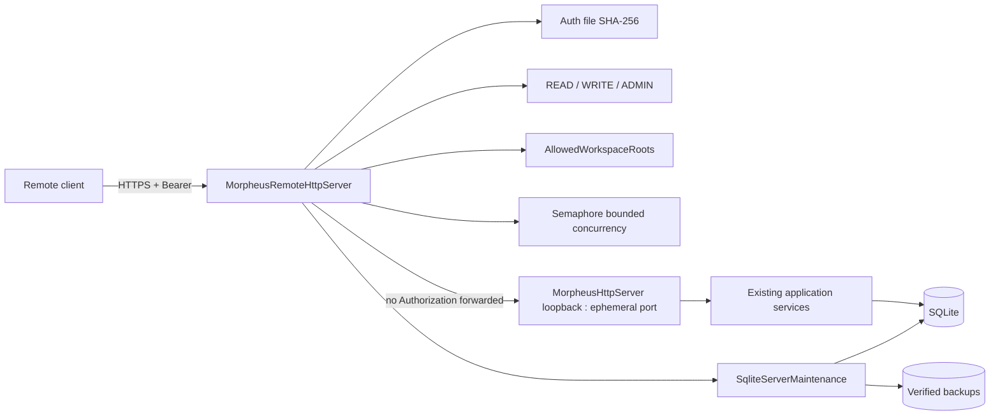

# M26 — Remote Server Platform

M26 ajoute une frontière réseau optionnelle sans modifier l’autorité du domaine MORPHEUS ni imposer un service distant au mode local.

## Architecture



La façade remote est un adapter. Domain/application ne dépendent ni de TLS, ni des rôles réseau, ni des fichiers d’identités.

## Pourquoi une façade devant l’API locale

L’API locale M11-M25 possède déjà les routes métier, validation JSON, CAS, budgets et règles de mutation. M26 évite de dupliquer ou réécrire cette surface :

1. le frontal `HttpsServer` termine TLS ;
2. il authentifie le Bearer ;
3. il calcule le rôle requis ;
4. il applique la limite de concurrence ;
5. il intercepte uniquement les endpoints serveur M26 ;
6. il proxy les autres requêtes vers un `MorpheusHttpServer` interne sur `127.0.0.1:0` ;
7. `Authorization` n’est jamais relayé vers l’inner server.

Cette composition préserve les contrats M11-M25 et rend la sécurité remote vérifiable à une frontière unique.

## Modes

### LOCAL

`LoopbackHostPolicy` est appliquée à la fois par `ApiLaunchOptions` et directement par
`MorpheusHttpServer.start()`. Chaque adresse résolue doit être loopback, puis le serveur lie le socket à
l’adresse déjà validée sans seconde résolution DNS. Un caller Java direct ne peut donc pas contourner
l’invariant. Seule la façade `MorpheusRemoteHttpServer`, avec TLS et authentification, peut écouter sur une
adresse non-loopback.

### REMOTE

`RemoteApiLaunchOptions` n’est sélectionné qu’en présence de `api --remote`.

Le démarrage exige :

- auth file valide et non symbolique ;
- au moins une identité ADMIN ;
- keystore PKCS12 valide et non symbolique ;
- mot de passe TLS via environnement/propriété ;
- limite de concurrence 1..512.
- au moins une racine workspace serveur existante et canonique.

## Authentication

`MorpheusRemoteIdentityFile` est le provider local de référence.

Format :

```text
principal|role|sha256(token)
```

Contraintes :

```text
identities        <= 256
auth file         <= 256 KiB
principal         [A-Za-z0-9._@-]{1,128}
token             32 random bytes / 256 bits
persisted token   never
comparison        MessageDigest.isEqual
```

Les créations utilisent temp + move atomique (fallback replace) et `LocalWritePermissionHardener`.

## Authorization

Ordre :

```text
READ < WRITE < ADMIN
```

Classification remote :

- `GET`/`HEAD` : READ, sauf métriques ADMIN ;
- POST read-only explicitement listés : READ ;
- POST/PUT/PATCH/DELETE restants : WRITE ;
- `/server/backups` : ADMIN ;
- `/server/status` : READ ;
- méthode non supportée : 405.

Les POST read-only incluent Query DSL, exports, policy evaluate/dry-run, transition-check, augmented context, saved-view execute/export et external-reference resolve.

Une route inconnue n’obtient jamais ADMIN.

## Autorité filesystem des workspaces

`AllowedWorkspaceRoots` sépare le rôle métier `WRITE` des droits OS du compte
serveur. La configuration vient de `--workspace-root` (répétable),
`MORPHEUS_SERVER_WORKSPACE_ROOTS` ou `morpheus.server.workspaceRoots`; aucune
requête ne peut modifier cette allowlist.

L’enregistrement canonicalise et persiste le real path autorisé. Les opérations
ultérieures, notamment `sync`, réappliquent la politique au chemin persisté afin
qu’un ancien projet hors racine ou un répertoire remplacé par un lien soit
refusé. La décision exige à la fois confinement lexical, absence de composant
symbolique et confinement du real path. Le mode local conserve son comportement
historique sans politique remote.

## TLS

Implémentation JDK uniquement :

```text
HttpsServer
KeyStore PKCS12
KeyManagerFactory
SSLContext TLS
protocols TLSv1.3 + TLSv1.2
```

Le mot de passe du keystore est cloné pour l’initialisation puis le tableau temporaire est effacé.

## Concurrence

Le frontal utilise un `Semaphore` équitable. `tryAcquire()` est non bloquant : lorsque le budget est atteint, la requête reçoit `429`.

Le modèle n’ajoute pas une queue applicative non bornée. Les invariants SQLite/CAS existants restent responsables des conflits métier.

### Session SQLite par opération API

Chaque opération locale ou remote qui construit `ApiRuntime` possède un `SqliteConnectionScope` thread-confined.
Les neuf stores du runtime empruntent neuf connexions logiques, mais partagent exactement une connexion physique.
La vérification/migration du schéma est exécutée une seule fois dans ce scope ; la fermeture des stores ne ferme que
leurs handles logiques, puis `ApiRuntime.close()` ferme la connexion physique propriétaire. Hors scope, les stores
conservent leur cycle de vie historique autonome.

La pression est donc bornée à une connexion physique SQLite par opération API active, indépendamment du nombre de
stores consultés. `SqliteConnectionScope.diagnostics()` expose les compteurs process `opened`, `closed`, `active` et
`peak` sans chemin de base ni donnée métier. Un scope ne peut pas être imbriqué, changer de base/timeout, traverser un
thread ou survivre à l’opération qui le possède.

Les blocs transactionnels des stores et du gestionnaire de schéma délèguent à `SqliteTransactionRunner`. Le runner
emprunte la connexion sans jamais la fermer, possède la transition d’auto-commit, le commit/rollback et la restauration
du mode précédent. Une erreur métier ou SQL reste toujours la cause primaire ; les échecs de rollback et de restauration
sont rattachés comme exceptions `suppressed`. Si le travail réussit mais que la restauration échoue, cette erreur de
cleanup est remontée explicitement.

## Runtime status

`/api/v1/server/status` expose :

```text
mode
transport
host
port
startedAt
uptimeSeconds
activeRequests
maxConcurrentRequests
totalRequests
authenticationFailures
authorizationFailures
throttledRequests
```

Aucun header, token, token hash, keystore password ou payload métier.

## Backup

`SqliteServerMaintenance.createBackup` :

1. ouvre le store pour confirmer/migrer normalement le schéma courant ;
2. crée une destination sous le répertoire explicitement fourni ;
3. rejette symlink et path escape ;
4. exécute `VACUUM INTO` ;
5. durcit les permissions ;
6. exécute `integrity_check` ;
7. lit `schema_migrations` ;
8. calcule SHA-256.

M26 ne crée pas V016 : les données remote sont de la configuration externe/opérationnelle et non une nouvelle vérité métier en SQLite.

## Restore offline

`restoreOffline` :

```text
explicit --confirm
    -> verify backup
    -> acquire <db>.server.lock
    -> reject unsafe target/sidecars
    -> copy to staging file
    -> verify staging checksum
    -> replace target atomically when supported
    -> harden permissions
    -> verify final database
```

Le remote server garde le même file lock pendant toute sa durée de vie. Une restauration concurrente échoue donc avant remplacement.

`SUPPORTED_SCHEMA_VERSION = 15`. Un backup `> 15` est rejeté. Un backup `<= 15` est accepté ; les migrations normales restent l’unique mécanisme d’upgrade lors de l’ouverture suivante.

## Surface publique

M26 ajoute :

```text
server.status
server.identity.create
server.backup.create
server.backup.verify
server.restore
```

Expositions intentionnelles :

```text
server.status          HTTP remote
identity create        CLI local only
backup create          CLI local + HTTP ADMIN
backup verify          CLI local only
restore                CLI offline only
MCP                    aucune surface control-plane M26
```

Voir `contracts/public-surfaces.tsv` et `docs/openapi/morpheus-v1-remote-m26.yaml`.

## Tests

- `MorpheusRemoteIdentityFileTest` : hash-only, auth, malformed/duplicates ;
- `MorpheusRemoteHttpServerTest` : PKCS12 réel, HTTPS, 401/403, rôles, headers, backup ADMIN, 429, secret non-disclosure ;
- `RemoteApiLaunchOptionsTest` : local loopback et startup remote fail-closed ;
- `MorpheusServerCliTest` : provisioning + backup/verify/restore ;
- `SqliteServerMaintenanceTest` : integrity/schema/lease/future-schema ;
- `RemoteServerArchitectureTest` : boundaries et contrats source/manifest/OpenAPI.

## Gates

```text
Windows  .\validate-m26.cmd 1.0.0
Linux    bash ./scripts/validate-m26.sh 1.0.0
```

Les deux gates doivent porter le même SHA exact. En juillet 2026, GitHub Actions n’est pas utilisé comme preuve.
