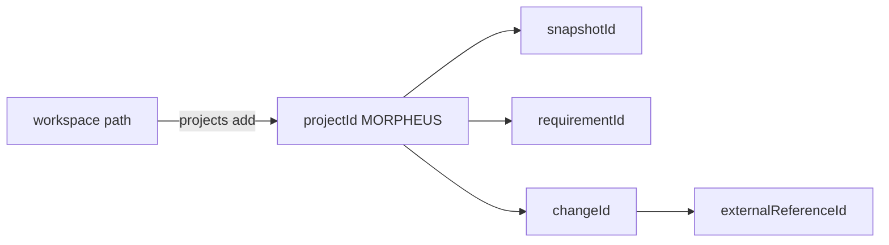
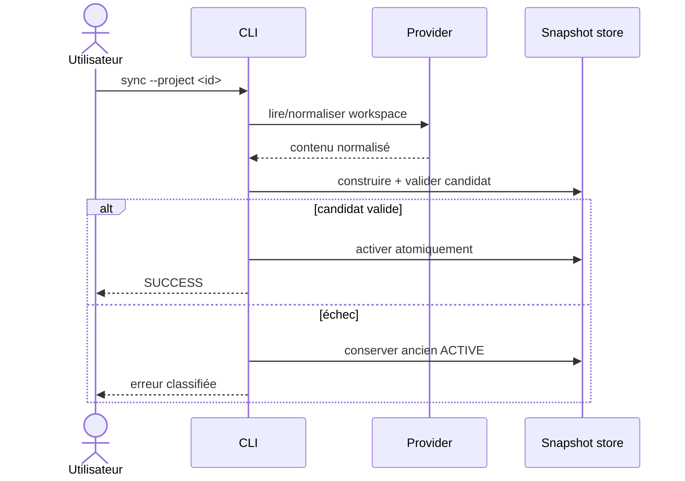

# Référence CLI MORPHEUS

Cette page décrit la CLI officielle de MORPHEUS après intégration de M14. Elle complète le [démarrage rapide](QUICKSTART.md) par une référence opérationnelle des commandes, options, identités et codes de sortie.

## 1. Invocation

Distribution portable :

```text
Windows  .\morpheus\morpheus.exe <commande>
Linux    ./morpheus/bin/morpheus <commande>
```

JAR autonome pour usage développeur :

```bash
java -jar morpheus-cli-0.1.0-SNAPSHOT-all.jar <commande>
```

Dans les exemples, `morpheus` désigne le launcher correspondant à la plateforme.

## 2. Forme générale

```text
morpheus [options-globales] <commande> [sous-commande] [options]
```

Exemples :

```bash
morpheus projects list
morpheus --json projects list
morpheus --db /tmp/demo.db sync --project <projectId>
```

Les options globales doivent être placées avant la commande pour éviter toute ambiguïté.

## 3. Options globales

| Option | Rôle |
|---|---|
| `--json` | sortie machine-readable sur stdout |
| `--data-dir PATH` | remplace le répertoire de données |
| `--config-dir PATH` | remplace le répertoire de configuration |
| `--db PATH` | sélectionne explicitement la base SQLite |

Variables équivalentes :

```text
MORPHEUS_DATA_DIR
MORPHEUS_CONFIG_DIR
MORPHEUS_DB
```

Priorité recommandée pour un script reproductible : utiliser explicitement `--db` ou fixer les variables d’environnement du processus.

`--json` rend `stdout` scriptable. Les erreurs et diagnostics restent sur `stderr` et le code de sortie reste contractuel.

## 4. Commandes utilitaires

```bash
morpheus help
morpheus version
morpheus --version
morpheus paths
morpheus --json version
```

`paths` permet de vérifier le layout réellement utilisé avant de diagnostiquer un `NOT_FOUND` ou une base apparemment vide.

## 5. Identités utilisées par la CLI

MORPHEUS ne confond pas chemin local et identité métier.



Après `projects add`, conserver le `projectId`. Les commandes métier utilisent les identifiants MORPHEUS retournés par les requêtes précédentes.

## 6. Projets

### Lister

```bash
morpheus projects list
morpheus --json projects list
```

### Enregistrer un workspace

```bash
morpheus projects add --workspace /path/to/project
```

L’enregistrement crée/résout l’identité locale du projet ; il ne publie pas encore de snapshot métier.

## 7. Synchronisation

```bash
morpheus sync --project <projectId>
morpheus sync --project <projectId> --revision <revision>
morpheus sync-status --project <projectId>
```

Le launcher officiel produit une reconstruction complète conservatrice lorsqu’une synchronisation publiée doit être produite.



Une requête suivante lit le snapshot publié ; elle ne rescannera pas implicitement le workspace.

## 8. Requirements

Recherche lexicale déterministe :

```bash
morpheus requirements find \
  --project <projectId> \
  --query "texte"
```

Version JSON :

```bash
morpheus --json requirements find \
  --project <projectId> \
  --query "session"
```

Lorsque la pagination est disponible :

```text
--offset N
--limit N   # 1..100
```

## 9. Changements et artefacts associés

```bash
morpheus changes list --project <projectId>

morpheus changes get \
  --project <projectId> \
  --change <changeId>

morpheus constraints list \
  --project <projectId> \
  --change <changeId>

morpheus decisions list \
  --project <projectId> \
  --change <changeId>

morpheus tasks list \
  --project <projectId> \
  --change <changeId>
```

Ne pas assimiler un `Scenario` à un `AcceptanceCriterion`. MORPHEUS expose seulement les critères d’acceptation réellement normalisés comme tels.

## 10. Traçabilité

```bash
morpheus trace-requirement \
  --project <projectId> \
  --requirement <requirementId> \
  --depth 2
```

La profondeur contrôle l’expansion des liens. Une absence de lien n’est pas remplacée par une relation supposée.

## 11. Contexte de changement

```bash
morpheus change-context \
  --project <projectId> \
  --change <changeId> \
  --depth 2
```

Cette commande construit une vue compacte du changement et de son voisinage de traçabilité dans le snapshot concerné.

## 12. Analyse de changement

```bash
morpheus analyze-change \
  --project <projectId> \
  --change <changeId> \
  --depth 2
```

L’analyse confronte le contenu `PROPOSED` au `CURRENT` sans promotion implicite.

```text
ANALYZE != APPLY
ANALYZE != PROMOTE
ANALYZE != ACTIVATE
```

## 13. Qualité

```bash
morpheus quality --project <projectId>
```

Les diagnostics sont dérivés et ne mutent pas le snapshot publié.

## 14. MINOS — références de code

### État de l’intégration

```bash
morpheus --json minos-status
```

Sans configuration, l’intégration est `DISABLED`.

### Lister les références externes d’une entité

```bash
morpheus --json external-references list \
  --project <projectId> \
  --owner <domainIdentity>
```

### Résoudre une référence

```bash
morpheus --json external-references resolve \
  --project <projectId> \
  --reference <externalReferenceId>
```

La résolution est live. L’observation retournée reste séparée de la référence persistée et ne réécrit pas l’historique publié.

## 15. NEXUS — contexte technique augmenté

### État

```bash
morpheus --json nexus-status
```

### Requirement

```bash
morpheus --json augmented-context requirement \
  --project <projectId> \
  --requirement <requirementId> \
  --nexus-project <id-or-name> \
  [--budget N] \
  [--source TYPE] \
  [--constraint k=v] \
  [--explain]
```

### Change

```bash
morpheus --json augmented-context change \
  --project <projectId> \
  --change <changeId> \
  --nexus-project <id-or-name> \
  [--budget N] \
  [--source TYPE] \
  [--constraint k=v] \
  [--explain]
```

Sources admises :

```text
FILE | SYMBOL | TEST | DOCUMENTATION | INSTRUCTION | SKILL | GIT
```

MORPHEUS construit l’intention ; NEXUS reste propriétaire de la sélection, du ranking, de la fusion, de la compression et du budget technique. Le `ContextBundle` retourné est live et `persisted=false`.

## 16. JARVIS — contrat d’orchestration read-only

### Observer un changement

```bash
morpheus --json change-orchestration state \
  --project <projectId> \
  --change <changeId> \
  [--lifecycle <state>] \
  [--abandonment-reason <reason>]
```

Si aucun lifecycle n’est fourni, MORPHEUS ne l’infère pas : sa source reste `UNAVAILABLE`.

### Évaluer une transition

```bash
morpheus --json change-orchestration transition-check \
  --project <projectId> \
  --change <changeId> \
  --from <state> \
  --to <state> \
  [--from-abandonment-reason <reason>] \
  [--abandonment-reason <reason>] \
  [--allow-backward] \
  [--allow-completed-reopen]
```

États lifecycle :

```text
DRAFT | PROPOSED | SPECIFIED | DESIGNED | PLANNED
IMPLEMENTING | VERIFYING | COMPLETED | ARCHIVED | ABANDONED
```

Décisions :

```text
ALLOWED         transition autorisée avec les faits connus
BLOCKED         transition interdite avec les faits connus
UNKNOWN         au moins un fait nécessaire est indisponible
REQUIRES_INPUT  donnée explicite requise absente
```

La commande **n’applique aucune transition**.

## 17. API HTTP et MCP

```bash
morpheus api [--host HOST] [--port PORT]
morpheus mcp --stdio
```

Defaults API : `127.0.0.1:8765`, base `/api/v1`.

En mode MCP, `--json` n’est pas applicable : `stdout` est réservé au protocole MCP.

## 18. Codes de sortie

| Code | Nom | Signification | Action typique |
|---:|---|---|---|
| 0 | `SUCCESS` | commande réussie | consommer la sortie |
| 2 | `USAGE` | option, identité ou argument invalide | corriger l’appel |
| 3 | `NOT_FOUND` | projet, snapshot ou entité absente | vérifier DB, projet, sync et identifiants |
| 4 | `STATE_ERROR` | état persisté ou synchronisation incompatible | inspecter `sync-status` et l’état publié |
| 5 | `IO_ERROR` | erreur d’I/O classifiée par l’adapter | vérifier chemins, droits, processus externe |
| 10 | `INTERNAL_ERROR` | erreur inattendue | conserver stderr et contexte pour diagnostic |

## 19. Patron de script robuste

Exemple PowerShell :

```powershell
$result = & morpheus --json requirements find --project $projectId --query "session"
$exitCode = $LASTEXITCODE

if ($exitCode -ne 0) {
    throw "MORPHEUS failed with exit code $exitCode"
}

$data = $result | ConvertFrom-Json
$data
```

Le contrat d’automatisation est : **code de sortie + JSON**, pas la formulation humaine des messages.

## 20. Scénarios complets

### Projet → sync → recherche

```bash
morpheus projects add --workspace /path/to/project
morpheus projects list
morpheus sync --project <projectId>
morpheus sync-status --project <projectId>
morpheus requirements find --project <projectId> --query "session"
```

### Changement → contexte → analyse → transition-check

```bash
morpheus changes list --project <projectId>
morpheus change-context --project <projectId> --change <changeId> --depth 2
morpheus analyze-change --project <projectId> --change <changeId> --depth 2
morpheus --json change-orchestration transition-check \
  --project <projectId> \
  --change <changeId> \
  --from PROPOSED \
  --to SPECIFIED
```

## 21. Voir aussi

- [Guide utilisateur](README.md)
- [Démarrage rapide](QUICKSTART.md)
- [Intégrations optionnelles](INTEGRATIONS.md)
- [API HTTP](../developer/API.md)
- [MCP](../developer/MCP.md)
