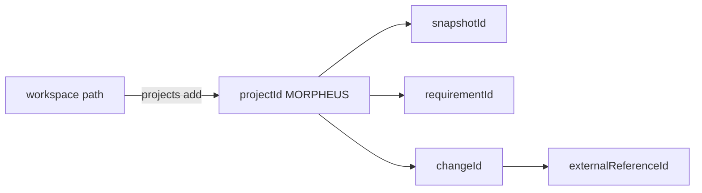

# Référence CLI MORPHEUS

Cette page décrit la CLI officielle de MORPHEUS dans la baseline post-M16 et la surface M17 en cours de validation. Elle complète le [démarrage rapide](QUICKSTART.md) par une référence opérationnelle des commandes, options, identités et codes de sortie.

## 1. Invocation

Distribution portable :

```text
Windows  .\morpheus\morpheus.exe <commande>
Linux    ./morpheus/bin/morpheus <commande>
```

JAR autonome pour usage développeur :

```bash
java -jar morpheus-cli-0.1.0-SNAPSHOT-all.jar <commande>
```

Dans les exemples, `morpheus` désigne le launcher correspondant à la plateforme.

## 2. Forme générale

```text
morpheus [options-globales] <commande> [sous-commande] [options]
```

Exemples :

```bash
morpheus projects list
morpheus --json projects list
morpheus --db /tmp/demo.db sync --project <projectId>
```

Les options globales doivent être placées avant la commande pour éviter toute ambiguïté.

## 3. Options globales

| Option | Rôle |
|---|---|
| `--json` | sortie machine-readable sur stdout |
| `--data-dir PATH` | remplace le répertoire de données |
| `--config-dir PATH` | remplace le répertoire de configuration |
| `--db PATH` | sélectionne explicitement la base SQLite |

Variables équivalentes :

```text
MORPHEUS_DATA_DIR
MORPHEUS_CONFIG_DIR
MORPHEUS_DB
```

`--json` rend `stdout` scriptable. Les erreurs et diagnostics restent sur `stderr` et le code de sortie reste contractuel.

## 4. Commandes utilitaires

```bash
morpheus help
morpheus version
morpheus --version
morpheus paths
morpheus --json version
```

`paths` permet de vérifier le layout réellement utilisé avant de diagnostiquer une base apparemment vide.

## 5. Identités utilisées par la CLI

MORPHEUS ne confond pas chemin local et identité métier.



Après `projects add`, conserver le `projectId`. Les commandes métier utilisent les identifiants MORPHEUS retournés par les requêtes précédentes.

## 6. Projets

```bash
morpheus projects list
morpheus --json projects list
morpheus projects add --workspace /path/to/project
```

L’enregistrement crée/résout l’identité locale du projet ; il ne publie pas encore de snapshot métier.

## 7. Synchronisation

```bash
morpheus sync --project <projectId>
morpheus sync --project <projectId> --revision <revision>
morpheus sync-status --project <projectId>
```

Le launcher officiel produit une reconstruction complète conservatrice lorsqu’une synchronisation publiée doit être produite. Une requête métier suivante lit le snapshot publié ; elle ne rescannera pas implicitement le workspace.

## 8. Requirements

Recherche lexicale déterministe :

```bash
morpheus requirements find \
  --project <projectId> \
  --query "texte"
```

Version JSON :

```bash
morpheus --json requirements find \
  --project <projectId> \
  --query "session"
```

Pagination lorsque disponible :

```text
--offset N
--limit N   # 1..100
```

## 9. Changements et artefacts associés

```bash
morpheus changes list --project <projectId>
morpheus changes get --project <projectId> --change <changeId>

morpheus constraints list --project <projectId> --change <changeId>
morpheus decisions list --project <projectId> --change <changeId>
morpheus tasks list --project <projectId> --change <changeId>
```

Ne pas assimiler un `Scenario` à un `AcceptanceCriterion`.

## 10. Acceptance Criteria — M15

```bash
morpheus acceptance-criteria list --project <projectId>
morpheus acceptance-criteria list --project <projectId> --change <changeId>
morpheus acceptance-criteria list --project <projectId> --requirement <requirementId>
```

Options :

```text
--offset N
--limit N
--json
```

MORPHEUS expose uniquement les critères explicitement normalisés. La présence d’un scénario ou d’un test ne synthétise ni critère ni statut `VERIFIED`.

## 11. Contraintes — M16

Lister les contraintes :

```bash
morpheus constraints list --project <projectId> --change <changeId>
```

Évaluer la sémantique pour une cible lifecycle :

```bash
morpheus --json constraints evaluate \
  --project <projectId> \
  --change <changeId> \
  --target VERIFYING
```

La décision respecte :

```text
applicable != blocking
severity != blocking policy
UNKNOWN != BLOCKED
constraint text != executable policy
```

## 12. Traçabilité

```bash
morpheus trace-requirement \
  --project <projectId> \
  --requirement <requirementId> \
  --depth 2
```

Une absence de lien n’est pas remplacée par une relation supposée.

## 13. Contexte et analyse de changement

```bash
morpheus change-context \
  --project <projectId> \
  --change <changeId> \
  --depth 2

morpheus analyze-change \
  --project <projectId> \
  --change <changeId> \
  --depth 2
```

L’analyse confronte le contenu `PROPOSED` au `CURRENT` sans promotion implicite.

```text
ANALYZE != APPLY
ANALYZE != PROMOTE
ANALYZE != ACTIVATE
```

## 14. Qualité

```bash
morpheus quality --project <projectId>
```

Les diagnostics sont dérivés et ne mutent pas le snapshot publié.

## 15. MINOS — références de code

```bash
morpheus --json minos-status
morpheus --json external-references list --project <projectId> --owner <domainIdentity>
morpheus --json external-references resolve --project <projectId> --reference <externalReferenceId>
```

Sans configuration, MINOS est `DISABLED`. La résolution live ne réécrit pas l’historique publié.

## 16. NEXUS — contexte technique augmenté

État :

```bash
morpheus --json nexus-status
```

Requirement :

```bash
morpheus --json augmented-context requirement \
  --project <projectId> \
  --requirement <requirementId> \
  --nexus-project <id-or-name> \
  [--budget N] [--source TYPE] [--constraint k=v] [--explain]
```

Change :

```bash
morpheus --json augmented-context change \
  --project <projectId> \
  --change <changeId> \
  --nexus-project <id-or-name> \
  [--budget N] [--source TYPE] [--constraint k=v] [--explain]
```

Sources admises :

```text
FILE | SYMBOL | TEST | DOCUMENTATION | INSTRUCTION | SKILL | GIT
```

MORPHEUS construit l’intention ; NEXUS reste propriétaire de la sélection, du ranking, de la fusion, de la compression et du budget technique. Le `ContextBundle` retourné est live et `persisted=false`.

## 17. JARVIS — contrat d’orchestration read-only

### Observer un changement

```bash
morpheus --json change-orchestration state \
  --project <projectId> \
  --change <changeId> \
  [--lifecycle <state>] \
  [--abandonment-reason <reason>]
```

Si aucun lifecycle n’est fourni, MORPHEUS ne l’infère pas : sa source reste `UNAVAILABLE`.

### Évaluer une transition

```bash
morpheus --json change-orchestration transition-check \
  --project <projectId> \
  --change <changeId> \
  --from <state> \
  --to <state> \
  [--from-abandonment-reason <reason>] \
  [--abandonment-reason <reason>] \
  [--allow-backward] \
  [--allow-completed-reopen]
```

Décisions :

```text
ALLOWED         transition autorisée avec les faits connus
BLOCKED         transition interdite avec les faits connus
UNKNOWN         au moins un fait nécessaire est indisponible
REQUIRES_INPUT  donnée explicite requise absente
```

Cette commande **n’applique aucune transition**.

## 18. M17 — appliquer une transition lifecycle contrôlée

Surface séparée :

```bash
morpheus --json lifecycle apply \
  --project <projectId> \
  --change <changeId> \
  --expected-revision 0 \
  --to PROPOSED \
  --idempotency-key release-42-change-7-proposed \
  --actor jarvis \
  --confirm
```

Pour abandonner :

```bash
morpheus --json lifecycle apply \
  --project <projectId> \
  --change <changeId> \
  --expected-revision <revision> \
  --to ABANDONED \
  --abandonment-reason NO_LONGER_NEEDED \
  --idempotency-key <stable-key> \
  --actor <actor> \
  --confirm
```

### Garde-fous obligatoires

```text
read capability != write capability
ALLOWED != applied
WRITE_CHANGE explicite
confirmation explicite
expectedRevision / CAS
idempotencyKey
transition M14-M16 réellement ALLOWED
audit persistant
```

L’absence d’état opérationnel correspond à `DRAFT` / révision `0`. La première mutation appliquée crée la révision `1`.

### Résultats JSON

```text
APPLIED
ALREADY_APPLIED
CONFLICT
NOT_AUTHORIZED
REQUIRES_CONFIRMATION
REJECTED
```

`ALREADY_APPLIED` est un retry idempotent : il ne crée ni seconde révision ni second audit.

`CONFLICT` indique notamment une révision stale ou la réutilisation incohérente d’une `idempotencyKey`.

`NOT_AUTHORIZED` signifie qu’aucun provider détecté n’annonce explicitement `WRITE_CHANGE`. Une capacité `READ_CHANGES` ne suffit jamais.

### État opérationnel != snapshot

```text
KnowledgeSnapshot                 connaissance publiée immuable
ChangeLifecycleOperationalState   état mutable contrôlé par CAS
```

Une transition lifecycle M17 ne réécrit donc pas l’historique publié.

## 19. API HTTP et MCP

```bash
morpheus api [--host HOST] [--port PORT]
morpheus mcp --stdio
```

Defaults API : `127.0.0.1:8765`, base `/api/v1`.

Surfaces lifecycle :

```text
CLI  change-orchestration transition-check   read-only
CLI  lifecycle apply                         write
HTTP POST .../transition-check               read-only
HTTP POST .../lifecycle-transitions          write
MCP  evaluate_change_transition              read-only
MCP  apply_change_lifecycle_transition       write
```

En mode MCP, `--json` n’est pas applicable : `stdout` est réservé au protocole MCP.

## 20. Codes de sortie

| Code | Nom | Signification | Action typique |
|---:|---|---|---|
| 0 | `SUCCESS` | commande réussie ; pour M17 `APPLIED` ou `ALREADY_APPLIED` | consommer la sortie |
| 2 | `USAGE` | option, identité ou argument invalide | corriger l’appel |
| 3 | `NOT_FOUND` | projet, snapshot ou entité absente | vérifier DB, projet, sync et identifiants |
| 4 | `STATE_ERROR` | état incompatible ou résultat M17 non appliqué | inspecter le JSON (`CONFLICT`, `NOT_AUTHORIZED`, etc.) |
| 5 | `IO_ERROR` | erreur d’I/O classifiée par l’adapter | vérifier chemins, droits, processus externe |
| 10 | `INTERNAL_ERROR` | erreur inattendue | conserver stderr et contexte pour diagnostic |

## 21. Patron de script robuste

Lecture :

```powershell
$result = & morpheus --json requirements find --project $projectId --query "session"
if ($LASTEXITCODE -ne 0) {
    throw "MORPHEUS failed with exit code $LASTEXITCODE"
}
$data = $result | ConvertFrom-Json
```

Mutation M17 :

```powershell
$result = & morpheus --json lifecycle apply `
    --project $projectId `
    --change $changeId `
    --expected-revision $revision `
    --to PROPOSED `
    --idempotency-key $key `
    --actor "jarvis" `
    --confirm

$data = $result | ConvertFrom-Json
if ($data.state -notin @("APPLIED", "ALREADY_APPLIED")) {
    throw "Lifecycle mutation not applied: $($data.state) - $($data.reason)"
}
```

Le contrat d’automatisation est : **code de sortie + JSON structuré**, pas la formulation humaine des messages.

## 22. Scénarios complets

### Projet → sync → recherche

```bash
morpheus projects add --workspace /path/to/project
morpheus projects list
morpheus sync --project <projectId>
morpheus sync-status --project <projectId>
morpheus requirements find --project <projectId> --query "session"
```

### Changement → évaluation → application explicite

```bash
morpheus changes list --project <projectId>
morpheus --json change-orchestration transition-check \
  --project <projectId> --change <changeId> --from DRAFT --to PROPOSED

# uniquement après choix explicite de l'action
morpheus --json lifecycle apply \
  --project <projectId> --change <changeId> \
  --expected-revision 0 --to PROPOSED \
  --idempotency-key <stable-key> --actor <actor> --confirm
```

Le premier appel ne mute rien. Le second est le seul side-effect boundary.

## 23. Voir aussi

- [Guide utilisateur](README.md)
- [Démarrage rapide](QUICKSTART.md)
- [Intégrations optionnelles](INTEGRATIONS.md)
- [API HTTP](../developer/API.md)
- [MCP](../developer/MCP.md)
- [ADR-0083](../adr/0083-controlled-lifecycle-write-operations.md)
