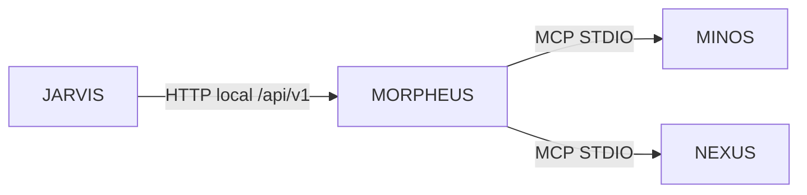
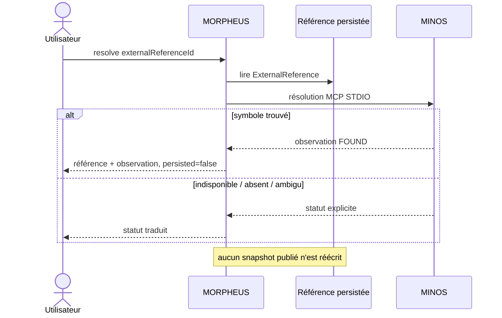
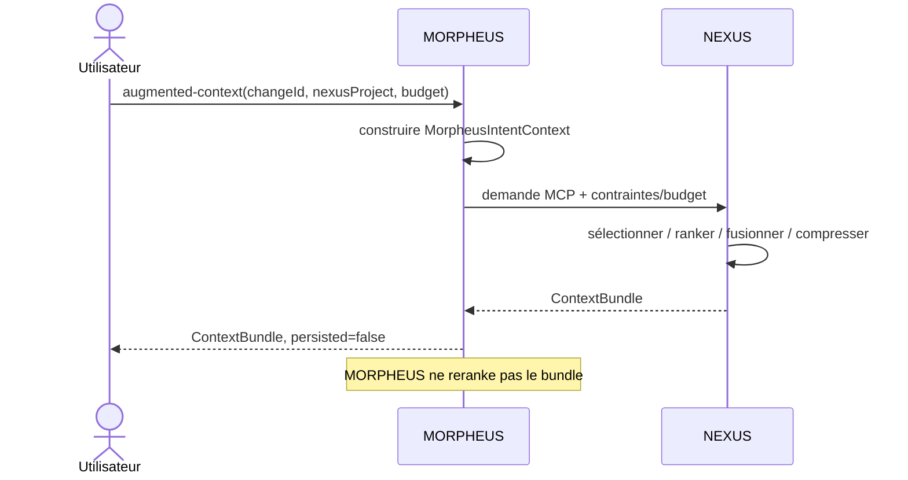
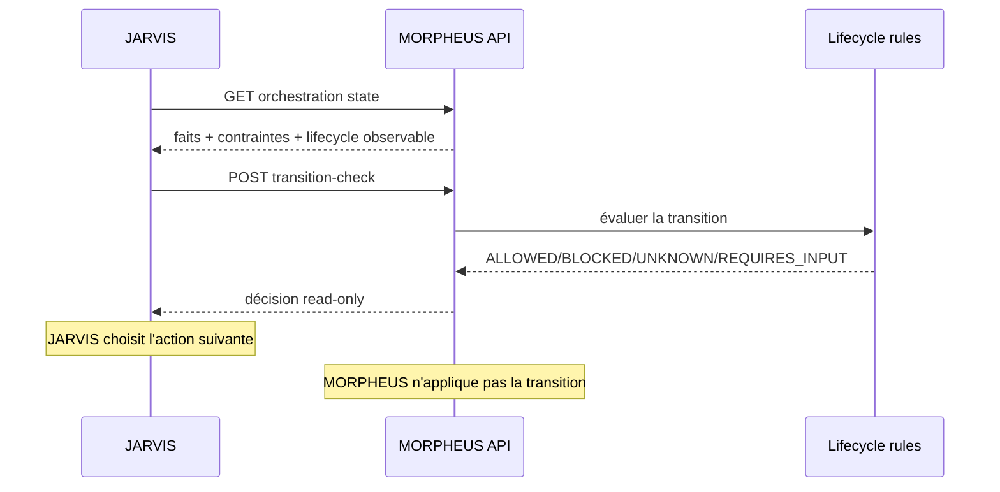

# Intégrations optionnelles MORPHEUS

MORPHEUS fonctionne sans MINOS, NEXUS ni JARVIS. Chaque intégration enrichit une capacité précise sans déplacer la propriété du domaine.

```text
MORPHEUS = specification / intent / lifecycle rules
MINOS    = code intelligence
NEXUS    = context selection / ranking / fusion / compression
JARVIS   = orchestration / sequencing
```



## 1. Principe d’optionalité

Une intégration externe est toujours traitée comme une capacité additionnelle :

- elle ne doit pas empêcher les requêtes MORPHEUS natives ;
- elle ne doit pas réécrire un snapshot publié à partir d’une observation live ;
- son indisponibilité doit rester distinguable d’un résultat négatif métier ;
- les données d’un moteur externe restent la propriété de ce moteur.

| Intégration | Transport | Activée par défaut | En cas d’absence |
|---|---|---:|---|
| MINOS | MCP STDIO inter-processus | non | résolution code indisponible seulement |
| NEXUS | MCP STDIO inter-processus | non | contexte technique absent seulement |
| JARVIS | HTTP local | non côté client JARVIS | orchestration continue en fail-open côté JARVIS |

# 2. MINOS

MINOS permet à MORPHEUS de résoudre des `ExternalReference` vers des symboles de code.

## 2.1 Configuration

Variables d’environnement :

```text
MORPHEUS_MINOS_JAR
MORPHEUS_MINOS_JAVA
MORPHEUS_MINOS_HOME
MORPHEUS_MINOS_TIMEOUT_SECONDS
```

Le minimum est `MORPHEUS_MINOS_JAR`, qui pointe vers le JAR autonome `*-all.jar` de MINOS.

Exemple PowerShell :

```powershell
$env:MORPHEUS_MINOS_JAR = 'N:\workspace-dev\minos-code-intelligence\target\minos-code-intelligence-0.1.0-SNAPSHOT-all.jar'
```

`MORPHEUS_MINOS_JAVA` permet d’imposer l’exécutable Java utilisé pour lancer le processus externe. `MORPHEUS_MINOS_HOME` fixe son répertoire de travail lorsque nécessaire. Le timeout contrôle la durée maximale d’un échange.

## 2.2 Vérifier l’état

```bash
morpheus --json minos-status
```

Sans configuration : `DISABLED`.

Un processus MINOS indisponible ne rend pas MORPHEUS indisponible.

## 2.3 Lister et résoudre une référence

```bash
morpheus --json external-references list \
  --project <projectId> \
  --owner <domainIdentity>
```

Puis :

```bash
morpheus --json external-references resolve \
  --project <projectId> \
  --reference <externalReferenceId>
```



## 2.4 Résultats possibles

Selon le contrat MINOS, une résolution peut notamment produire :

```text
FOUND
NOT_FOUND
UNAVAILABLE
AMBIGUOUS
REVISION_MISMATCH
UNSUPPORTED
```

`NOT_FOUND` n’est pas équivalent à `UNAVAILABLE` : le premier signifie qu’une recherche a pu être effectuée sans trouver le symbole ; le second signifie que la résolution n’a pas pu être obtenue.

# 3. NEXUS

NEXUS construit un contexte technique sous budget à partir d’une intention MORPHEUS.

## 3.1 Configuration

```text
MORPHEUS_NEXUS_JAR
MORPHEUS_NEXUS_JAVA
MORPHEUS_NEXUS_HOME
MORPHEUS_NEXUS_TIMEOUT_SECONDS
```

`MORPHEUS_NEXUS_JAR` pointe vers le runner Java NEXUS, typiquement :

```text
adapters/mcp-java/target/nexus-mcp-java-0.1.0-SNAPSHOT-runner.jar
```

Vérifier :

```bash
morpheus --json nexus-status
```

Sans configuration : `DISABLED`.

## 3.2 Mapping du projet

Chaque requête NEXUS exige un mapping explicite :

```text
--nexus-project <UUID-ou-nom-unique>
```

MORPHEUS ne déduit pas ce projet NEXUS à partir du chemin du workspace et ne lance pas lui-même `project add`, index ou rebuild côté NEXUS.

## 3.3 Construire un contexte pour un change

```bash
morpheus --json augmented-context change \
  --project <projectId> \
  --change <changeId> \
  --nexus-project <id-or-name> \
  --budget 2000
```

Pour un requirement :

```bash
morpheus --json augmented-context requirement \
  --project <projectId> \
  --requirement <requirementId> \
  --nexus-project <id-or-name> \
  --budget 2000
```

Sources filtrables :

```text
FILE | SYMBOL | TEST | DOCUMENTATION | INSTRUCTION | SKILL | GIT
```



La frontière est volontairement stricte :

```text
MORPHEUS = construction de l'intention déterministe
NEXUS    = sélection / ranking / fusion / compression / budget technique
```

Le `ContextBundle` retourné reste live et `persisted=false`.

# 4. JARVIS

JARVIS consomme le contrat HTTP read-only de MORPHEUS pour orchestrer des actions sans importer le domaine MORPHEUS.

## 4.1 Côté MORPHEUS

Démarrer l’API :

```bash
morpheus api --host 127.0.0.1 --port 8765
```

Les routes d’orchestration M14 sont :

```text
GET  /api/v1/projects/{projectId}/changes/{changeId}/orchestration
POST /api/v1/projects/{projectId}/changes/{changeId}/transition-check
```

Le `POST` évalue une transition ; il ne l’applique pas.

## 4.2 Côté JARVIS

Configuration validée dans le client JARVIS :

```text
MORPHEUS_ENABLED=true
MORPHEUS_URL=http://127.0.0.1:8765
MORPHEUS_PROJECT_ID=<projectId>
MORPHEUS_TIMEOUT_SECONDS=3
```

## 4.3 Séparation des responsabilités



```text
MORPHEUS = facts + lifecycle rules + transition decisions
JARVIS   = sequencing + orchestration + action choice
```

Le client JARVIS validé est fail-open : si MORPHEUS est désactivé, non configuré, indisponible ou répond avec un contrat incompatible, le provider retourne une absence de contexte plutôt que de faire tomber JARVIS.

# 5. Lifecycle et décisions JARVIS

États possibles :

```text
DRAFT | PROPOSED | SPECIFIED | DESIGNED | PLANNED
IMPLEMENTING | VERIFYING | COMPLETED | ARCHIVED | ABANDONED
```

Décisions :

```text
ALLOWED
BLOCKED
UNKNOWN
REQUIRES_INPUT
```

Sans lifecycle explicitement fourni au contrat d’orchestration :

```text
lifecycle.state  = absent
lifecycle.source = UNAVAILABLE
```

MORPHEUS ne déduit pas le lifecycle depuis les tâches, timestamps, chemins d’archive ou diagnostics qualité.

# 6. Diagnostic des intégrations

## MINOS/NEXUS reste `DISABLED`

Vérifier que la variable `*_JAR` est visible dans **le même processus** qui lance MORPHEUS.

PowerShell :

```powershell
$env:MORPHEUS_MINOS_JAR
$env:MORPHEUS_NEXUS_JAR
```

## Le processus externe existe mais la requête échoue

Vérifier :

- le chemin du JAR ;
- l’exécutable Java choisi ;
- le répertoire `*_HOME` ;
- le timeout ;
- la compatibilité du contrat MCP ;
- `stderr` du processus MORPHEUS.

## Le résultat live diffère du snapshot

C’est possible et volontaire. La référence persistée décrit l’état publié ; l’observation externe live décrit ce que le moteur externe observe au moment de l’appel.

## JARVIS ne reçoit aucun contexte MORPHEUS

Vérifier dans cet ordre :

1. `MORPHEUS_ENABLED=true` côté JARVIS ;
2. API MORPHEUS démarrée ;
3. `MORPHEUS_URL` correct ;
4. `MORPHEUS_PROJECT_ID` présent dans la base de l’API ;
5. même `--db`/layout que celui utilisé pour la synchronisation ;
6. disponibilité de la route `/api/v1/health`.

# 7. Documentation développeur

Les ports, adapters, contrats et invariants de dépendances sont détaillés dans [Intégrations développeur](../developer/INTEGRATIONS.md).
