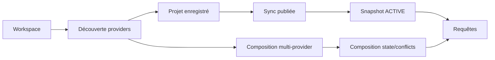
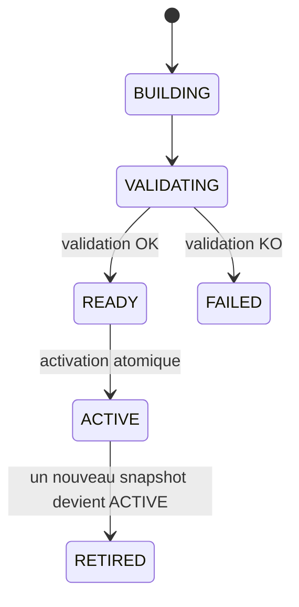

# Démarrage rapide MORPHEUS

Ce guide conduit un utilisateur depuis une distribution fraîche jusqu’à une première interrogation de la spécification, puis montre le chemin multi-provider M18 et les surfaces HTTP/MCP.

## 1. Extraire et lancer la distribution

La distribution portable embarque son runtime Java : aucun JDK n’est requis pour l’utilisateur final.

### Windows

Après extraction de `morpheus-<version>-windows-x64.zip` :

```powershell
.\morpheus\morpheus.exe --version
.\morpheus\morpheus.exe help
```

### Linux

Après extraction de `morpheus-<version>-linux-x64.tar.gz` :

```bash
chmod +x ./morpheus/bin/morpheus
./morpheus/bin/morpheus --version
./morpheus/bin/morpheus help
```

Dans la suite, `morpheus` désigne le launcher de la plateforme.

## 2. Vérifier les chemins utilisés

```bash
morpheus paths
```

Base explicite pour un test :

```bash
morpheus --db /path/to/demo-morpheus.db paths
```

Toutes les commandes d’un même scénario doivent utiliser la même base si `--db` est précisé.

## 3. Préparer un workspace compatible

MORPHEUS découvre les providers à partir du workspace. La baseline M18 valide deux providers réels :

```text
OpenSpec
Structured Markdown
```

Un projet peut exploiter un seul provider ou plusieurs providers compatibles. Les adapters normalisent leurs lectures avant la composition MORPHEUS.



## 4. Enregistrer le projet

```bash
morpheus projects add --workspace /path/to/project
```

La commande retourne un `projectId` MORPHEUS stable dans la base locale.

```bash
morpheus projects list
```

Conserver le `projectId` : le chemin du workspace n’est pas l’identité métier.

## 5. Synchroniser et publier

```bash
morpheus sync --project <projectId>
```

Révision source optionnelle :

```bash
morpheus sync --project <projectId> --revision <revision>
```

Le launcher utilise une reconstruction complète conservatrice pour produire une synchronisation publiée. Un snapshot candidat ne remplace l’`ACTIVE` qu’après validation réussie.



**Si la construction ou la validation du candidat échoue, l’ancien snapshot `ACTIVE` reste la référence publiée.**

```bash
morpheus sync-status --project <projectId>
```

## 6. Composer plusieurs providers — M18

Pour construire l’état de composition :

```bash
morpheus composition sync --project <projectId>
```

Avec révision explicite :

```bash
morpheus composition sync --project <projectId> --revision <revision>
```

Lire l’état :

```bash
morpheus composition status --project <projectId>
```

Inspecter les conflits :

```bash
morpheus composition conflicts --project <projectId>
```

Mode JSON :

```bash
morpheus --json composition status --project <projectId>
morpheus --json composition conflicts --project <projectId>
```

La composition respecte :

```text
provider identifier != DomainIdentity
source path != identity
precedence != provenance erasure
conflict != silent last-write-wins
ambiguous continuity must be surfaced
```

Un provider optionnel absent ne fait pas échouer le projet si la politique de composition autorise son absence. Un provider requis absent échoue explicitement.

## 7. Faire les premières requêtes

Chercher des requirements :

```bash
morpheus requirements find \
  --project <projectId> \
  --query "session"
```

Lister les changements :

```bash
morpheus changes list --project <projectId>
```

Lire un changement :

```bash
morpheus changes get --project <projectId> --change <changeId>
```

Artefacts associés :

```bash
morpheus constraints list --project <projectId> --change <changeId>
morpheus acceptance-criteria list --project <projectId> --change <changeId>
morpheus decisions list --project <projectId> --change <changeId>
morpheus tasks list --project <projectId> --change <changeId>
```

## 8. Explorer traçabilité, contexte et qualité

```bash
morpheus trace-requirement --project <projectId> --requirement <requirementId> --depth 2
morpheus change-context --project <projectId> --change <changeId> --depth 2
morpheus analyze-change --project <projectId> --change <changeId> --depth 2
morpheus quality --project <projectId>
```

MORPHEUS n’invente pas de relation pour combler une absence et n’effectue aucune promotion implicite depuis une analyse.

## 9. Évaluer puis appliquer explicitement un lifecycle

Évaluation read-only :

```bash
morpheus --json change-orchestration transition-check \
  --project <projectId> \
  --change <changeId> \
  --from DRAFT \
  --to PROPOSED
```

Une décision `ALLOWED` n’applique rien.

Mutation M17 distincte :

```bash
morpheus --json lifecycle apply \
  --project <projectId> \
  --change <changeId> \
  --expected-revision 0 \
  --to PROPOSED \
  --idempotency-key demo-1 \
  --actor user \
  --confirm
```

```text
READ_CHANGES != WRITE_CHANGE
ALLOWED != applied
```

## 10. Démarrer l’API HTTP

```bash
morpheus api --host 127.0.0.1 --port 8765
```

Test minimal :

```bash
curl http://127.0.0.1:8765/api/v1/health
```

Composition M18 :

```bash
curl http://127.0.0.1:8765/api/v1/projects/<projectId>/composition
curl http://127.0.0.1:8765/api/v1/projects/<projectId>/composition/conflicts
```

OpenAPI contract : **1.7.0**.

## 11. Démarrer MCP STDIO

```bash
morpheus mcp --stdio
```

Catalogue M18 :

```text
22 tools read-only
+ 1 tool write M17 explicite
```

Composition :

```text
get_composition_status
list_composition_conflicts
```

Le protocole MCP utilise `stdout` pour JSON-RPC ; les diagnostics vont sur `stderr`.

## 12. Mode JSON et codes de sortie

```bash
morpheus --json requirements find --project <projectId> --query "session"
```

Règle d’automatisation :

1. lire le code de sortie ;
2. parser le JSON de `stdout` ;
3. utiliser `stderr` pour le diagnostic humain.

Codes principaux :

| Code | Sens |
|---:|---|
| 0 | succès |
| 2 | usage/argument invalide |
| 3 | ressource absente |
| 4 | état incompatible |
| 5 | erreur I/O classifiée |
| 10 | erreur interne inattendue |

## 13. Baseline actuelle

```text
M18             ✅ VALIDÉ / INTÉGRÉ — PR #86
Code validé     7e8caacff567f51354fcb88bd7505a6d135071c0
Merge           30f11ac3ffc522bcc0c71e31216a3fb70f0631d7
Tests           418/418 PASS
Architecture    170/170 PASS
Packaging       Windows + smokes + API health PASS
```

Pour le détail des commandes : [Référence CLI](CLI.md).