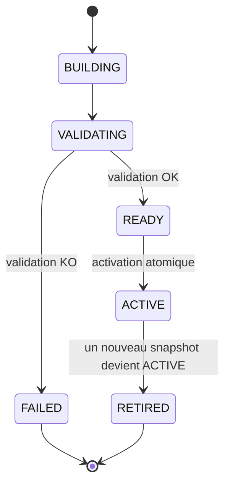
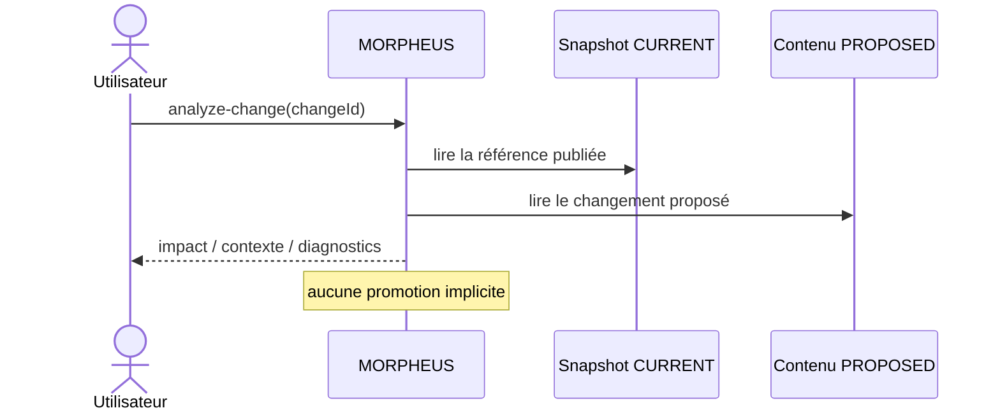

# Démarrage rapide MORPHEUS

Ce guide conduit un utilisateur depuis une distribution fraîche jusqu’à une première interrogation de la spécification, puis montre comment exposer les mêmes données par HTTP ou MCP.

## 1. Extraire et lancer la distribution

La distribution portable embarque son runtime Java : aucun JDK n’est requis pour l’utilisateur final.

### Windows

Après extraction de `morpheus-<version>-windows-x64.zip` :

```powershell
.\morpheus\morpheus.exe --version
.\morpheus\morpheus.exe help
```

### Linux

Après extraction de `morpheus-<version>-linux-x64.tar.gz` :

```bash
chmod +x ./morpheus/bin/morpheus
./morpheus/bin/morpheus --version
./morpheus/bin/morpheus help
```

Dans la suite, `morpheus` désigne le launcher de la plateforme.

## 2. Vérifier les chemins utilisés

Avant le premier projet, vérifier où MORPHEUS stockera sa base et sa configuration :

```bash
morpheus paths
```

Pour isoler un test, il est possible d’utiliser une base explicite :

```bash
morpheus --db /path/to/demo-morpheus.db paths
```

Sous PowerShell :

```powershell
morpheus --db "$env:TEMP\demo-morpheus.db" paths
```

Toutes les commandes d’un même scénario doivent utiliser la même base si `--db` est précisé.

## 3. Préparer un workspace compatible

MORPHEUS découvre le provider à partir du workspace. OpenSpec est le provider de référence initial.

Le workspace doit donc contenir une structure reconnue par un provider installé. L’enregistrement du projet ne signifie pas encore que le contenu a été publié : la publication est réalisée par `sync`.


## 4. Enregistrer le projet

```bash
morpheus projects add --workspace /path/to/project
```

La commande retourne un `projectId` MORPHEUS stable dans la base locale.

Lister les projets :

```bash
morpheus projects list
```

Pour un script :

```bash
morpheus --json projects list
```

Conserver le `projectId` : les commandes métier utilisent cette identité plutôt que le chemin du workspace.

## 5. Synchroniser et publier

```bash
morpheus sync --project <projectId>
```

Révision source optionnelle :

```bash
morpheus sync --project <projectId> --revision <revision>
```

Le launcher officiel utilise une reconstruction complète conservatrice pour produire une synchronisation publiée. Un snapshot candidat ne remplace l’`ACTIVE` qu’après validation réussie.



Le point important est opérationnel : **si la construction ou la validation du candidat échoue, l’ancien snapshot `ACTIVE` reste la référence publiée**.

Vérifier l’état :

```bash
morpheus sync-status --project <projectId>
```

## 6. Faire les premières requêtes

### Chercher des requirements

```bash
morpheus requirements find \
  --project <projectId> \
  --query "session"
```

### Lister les changements

```bash
morpheus changes list --project <projectId>
```

### Lire un changement

```bash
morpheus changes get \
  --project <projectId> \
  --change <changeId>
```

### Explorer les artefacts d’un changement

```bash
morpheus constraints list --project <projectId> --change <changeId>
morpheus decisions list   --project <projectId> --change <changeId>
morpheus tasks list       --project <projectId> --change <changeId>
```

Les commandes de listes/recherches acceptent `--offset` et `--limit` lorsque la surface le prévoit ; la limite maximale est 100.

## 7. Explorer la traçabilité et le contexte

### Requirement

```bash
morpheus trace-requirement \
  --project <projectId> \
  --requirement <requirementId> \
  --depth 2
```

### Change

```bash
morpheus change-context \
  --project <projectId> \
  --change <changeId> \
  --depth 2
```

La profondeur contrôle l’expansion de la vue. MORPHEUS n’invente pas de relation pour combler une absence de lien.

## 8. Analyser un changement proposé

```bash
morpheus analyze-change \
  --project <projectId> \
  --change <changeId> \
  --depth 2
```

L’analyse confronte le contenu proposé à l’état `CURRENT`. Elle ne promeut ni n’active le changement.



## 9. Diagnostiquer la qualité

```bash
morpheus quality --project <projectId>
```

Les diagnostics sont des vues dérivées. Ils n’écrivent pas dans le snapshot publié.

## 10. Passer en mode JSON pour les scripts

```bash
morpheus --json requirements find \
  --project <projectId> \
  --query "session"
```

Règle d’automatisation :

1. lire le code de sortie ;
2. parser le JSON de `stdout` ;
3. utiliser `stderr` pour le diagnostic humain uniquement.

Codes principaux :

| Code | Sens |
|---:|---|
| 0 | succès |
| 2 | usage/argument invalide |
| 3 | ressource absente |
| 4 | état incompatible |
| 5 | erreur I/O classifiée |
| 10 | erreur interne inattendue |

## 11. Démarrer l’API HTTP

```bash
morpheus api
```

Defaults :

```text
host = 127.0.0.1
port = 8765
base = /api/v1
```

Démarrage explicite :

```bash
morpheus api --host 127.0.0.1 --port 8765
```

Test minimal :

```bash
curl http://127.0.0.1:8765/api/v1/health
curl http://127.0.0.1:8765/api/v1/version
```

Utiliser la même option `--db` que lors de la synchronisation si le scénario emploie une base personnalisée :

```bash
morpheus --db /path/to/demo-morpheus.db api
```

Référence : [API HTTP](../developer/API.md).

## 12. Démarrer le serveur MCP

```bash
morpheus mcp --stdio
```

En mode MCP :

```text
stdin/stdout = protocole JSON-RPC MCP
stderr       = diagnostics
```

Ne pas ajouter `--json` : `stdout` doit rester réservé au protocole.

Le serveur expose actuellement 20 tools métier read-only. Référence : [Serveur MCP](../developer/MCP.md).

## 13. Activer MINOS si une référence de code doit être résolue

Configurer le JAR autonome MINOS :

```powershell
$env:MORPHEUS_MINOS_JAR = 'N:\workspace-dev\minos-code-intelligence\target\minos-code-intelligence-0.1.0-SNAPSHOT-all.jar'
```

Puis :

```bash
morpheus --json minos-status
```

Résolution :

```bash
morpheus --json external-references resolve \
  --project <projectId> \
  --reference <externalReferenceId>
```

Une résolution live ne réécrit pas le snapshot.

## 14. Activer NEXUS pour obtenir un contexte technique

Configurer `MORPHEUS_NEXUS_JAR`, puis vérifier :

```bash
morpheus --json nexus-status
```

Exemple :

```bash
morpheus --json augmented-context change \
  --project <projectId> \
  --change <changeId> \
  --nexus-project <id-or-name> \
  --budget 2000
```

Le contexte retourné reste live et non persisté.

## 15. Observer le contrat d’orchestration JARVIS

État observable :

```bash
morpheus --json change-orchestration state \
  --project <projectId> \
  --change <changeId>
```

Évaluation de transition :

```bash
morpheus --json change-orchestration transition-check \
  --project <projectId> \
  --change <changeId> \
  --from PROPOSED \
  --to SPECIFIED
```

Une réponse `ALLOWED` signifie que la transition est autorisée compte tenu des faits fournis/observables. **Elle ne signifie pas que la transition a été appliquée.**

## 16. Diagnostic rapide

### Le projet n’apparaît pas

```bash
morpheus paths
morpheus projects list
```

Vérifier que toutes les commandes utilisent le même `--db` ou le même `--data-dir`.

### Les requêtes retournent `NOT_FOUND`

Vérifier qu’une synchronisation a réussi :

```bash
morpheus sync-status --project <projectId>
```

### MINOS ou NEXUS est `DISABLED`

C’est un état normal lorsque l’intégration n’est pas configurée. MORPHEUS reste utilisable.

### Une transition retourne `UNKNOWN`

Un ou plusieurs faits nécessaires ne sont pas observables. MORPHEUS ne les infère pas artificiellement.

## 17. Étapes suivantes

- [Guide utilisateur](README.md)
- [Référence CLI](CLI.md)
- [Intégrations optionnelles](INTEGRATIONS.md)
- [Architecture](../developer/ARCHITECTURE.md)
