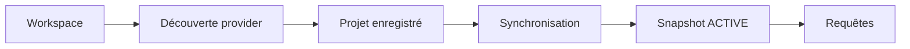
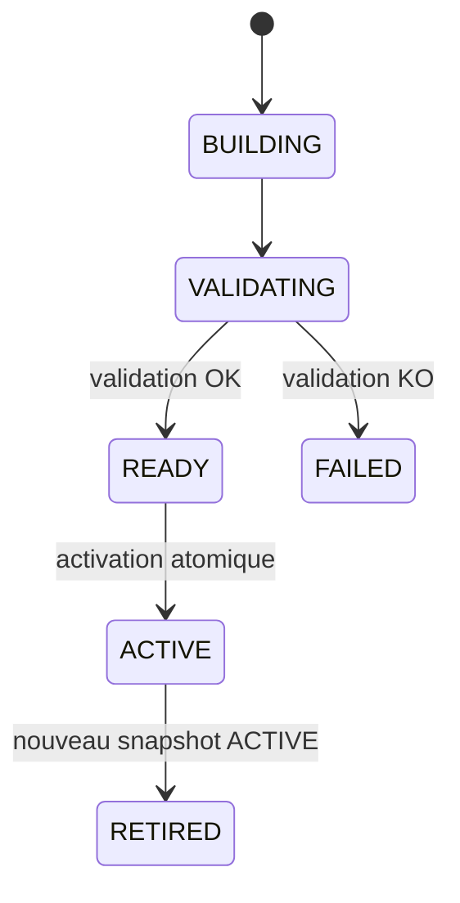

# Démarrage rapide MORPHEUS

Ce guide conduit un utilisateur depuis une distribution fraîche jusqu’à une première interrogation de la spécification, puis montre la composition multi-provider M18 et les surfaces HTTP/MCP.

## 1. Extraire et lancer la distribution

La distribution portable embarque son runtime Java : aucun JDK n’est requis pour l’utilisateur final.

### Windows

Après extraction de `morpheus-<version>-windows-x64.zip` :

```powershell
.\morpheus\morpheus.exe --version
.\morpheus\morpheus.exe help
```

### Linux

```bash
chmod +x ./morpheus/bin/morpheus
./morpheus/bin/morpheus --version
./morpheus/bin/morpheus help
```

Dans la suite, `morpheus` désigne le launcher de la plateforme.

## 2. Vérifier les chemins

```bash
morpheus paths
```

Base explicite pour un test :

```powershell
morpheus --db "$env:TEMP\demo-morpheus.db" paths
```

Toutes les commandes d’un même scénario doivent utiliser la même base si `--db` est précisé.

## 3. Préparer un workspace compatible

M18 valide deux providers réels :

```text
OpenSpec
Structured Markdown
```

Le workspace doit contenir une structure reconnue par au moins un provider installé. L’enregistrement du projet ne publie encore aucun contenu.



## 4. Enregistrer le projet

```bash
morpheus projects add --workspace /path/to/project
morpheus projects list
```

Conserver le `projectId` retourné.

## 5. Synchroniser et publier

```bash
morpheus sync --project <projectId>
morpheus sync-status --project <projectId>
```

Révision source optionnelle :

```bash
morpheus sync --project <projectId> --revision <revision>
```

Un snapshot candidat ne remplace l’`ACTIVE` qu’après validation réussie.



Si le candidat échoue, l’ancien `ACTIVE` reste publié.

## 6. Composer plusieurs providers — M18

Pour un projet contenant plusieurs sources reconnues :

```bash
morpheus composition sync --project <projectId>
```

Avec révision explicite :

```bash
morpheus composition sync --project <projectId> --revision <revision>
```

État de composition :

```bash
morpheus --json composition status --project <projectId>
```

Conflits :

```bash
morpheus --json composition conflicts --project <projectId>
```

La composition M18 conserve :

```text
provider ownership
provider-scoped identity
source precedence
provenance
candidats non sélectionnés
conflits explicites
```

Elle ne fait jamais de last-write-wins silencieux.

```text
provider identifier != DomainIdentity
source path != identity
precedence != provenance erasure
conflict != silent last-write-wins
```

## 7. Faire les premières requêtes

Requirements :

```bash
morpheus requirements find --project <projectId> --query "session"
```

Changements :

```bash
morpheus changes list --project <projectId>
morpheus changes get --project <projectId> --change <changeId>
```

Artefacts :

```bash
morpheus constraints list --project <projectId> --change <changeId>
morpheus acceptance-criteria list --project <projectId> --change <changeId>
morpheus decisions list --project <projectId> --change <changeId>
morpheus tasks list --project <projectId> --change <changeId>
```

## 8. Traçabilité, analyse et qualité

```bash
morpheus trace-requirement \
  --project <projectId> \
  --requirement <requirementId> \
  --depth 2

morpheus change-context \
  --project <projectId> \
  --change <changeId> \
  --depth 2

morpheus analyze-change \
  --project <projectId> \
  --change <changeId> \
  --depth 2

morpheus quality --project <projectId>
```

L’analyse ne promeut ni n’active le contenu proposé.

## 9. Évaluer puis appliquer explicitement un lifecycle

Évaluation read-only :

```bash
morpheus --json change-orchestration transition-check \
  --project <projectId> \
  --change <changeId> \
  --from DRAFT \
  --to PROPOSED
```

Une réponse `ALLOWED` ne signifie pas qu’une mutation a eu lieu.

Application contrôlée :

```bash
morpheus --json lifecycle apply \
  --project <projectId> \
  --change <changeId> \
  --expected-revision 0 \
  --to PROPOSED \
  --idempotency-key demo-change-1 \
  --actor user \
  --confirm
```

```text
READ_CHANGES != WRITE_CHANGE
ALLOWED != applied
```

## 10. Mode JSON

```bash
morpheus --json requirements find --project <projectId> --query "session"
```

Pour automatiser :

1. lire le code de sortie ;
2. parser le JSON de `stdout` ;
3. utiliser `stderr` pour le diagnostic humain.

Codes principaux :

| Code | Sens |
|---:|---|
| 0 | succès |
| 2 | usage/argument invalide |
| 3 | ressource absente |
| 4 | état incompatible |
| 5 | erreur I/O classifiée |
| 10 | erreur interne inattendue |

## 11. Démarrer l’API HTTP

```bash
morpheus api --host 127.0.0.1 --port 8765
```

Test :

```bash
curl http://127.0.0.1:8765/api/v1/health
curl http://127.0.0.1:8765/api/v1/readiness
curl http://127.0.0.1:8765/api/v1/metrics
curl http://127.0.0.1:8765/api/v1/version
```

Baseline M18 : **OpenAPI 3.1.0 / contract version 1.7.0**.

Candidat M19 en qualification : **contract version 1.8.0**, avec readiness SQLite réelle et métriques process-local.

Composition HTTP :

```text
GET /api/v1/projects/{projectId}/composition
GET /api/v1/projects/{projectId}/composition/conflicts
```

Référence : [API HTTP](../developer/API.md).

## 12. Démarrer le serveur MCP

```bash
morpheus mcp --stdio
```

```text
stdin/stdout = protocole JSON-RPC MCP
stderr       = diagnostics
```

Ne pas ajouter `--json`.

Catalogue M18 :

```text
22 tools read-only
+ 1 tool write explicite
```

Tools de composition :

```text
get_composition_status
list_composition_conflicts
```

Référence : [Serveur MCP](../developer/MCP.md).

## 13. MINOS optionnel

Configurer le JAR MINOS si nécessaire, puis :

```bash
morpheus --json minos-status
morpheus --json external-references resolve \
  --project <projectId> \
  --reference <externalReferenceId>
```

Une résolution live ne réécrit pas le snapshot.

## 14. NEXUS optionnel

```bash
morpheus --json nexus-status
morpheus --json augmented-context change \
  --project <projectId> \
  --change <changeId> \
  --nexus-project <id-or-name> \
  --budget 2000
```

Le contexte retourné reste live et non persisté.

## 15. Diagnostic rapide

Le projet n’apparaît pas :

```bash
morpheus paths
morpheus projects list
```

Les requêtes retournent `NOT_FOUND` :

```bash
morpheus sync-status --project <projectId>
```

MINOS ou NEXUS est `DISABLED` : c’est normal si l’intégration optionnelle n’est pas configurée.

Une transition retourne `UNKNOWN` : un fait nécessaire n’est pas observable et MORPHEUS refuse de l’inventer.

Un conflit de composition apparaît : inspecter `composition conflicts`; ne pas remplacer le conflit par une priorité implicite côté client.

## 16. Baseline validée

```text
M18 code validé  7e8caacff567f51354fcb88bd7505a6d135071c0
M18 merge        30f11ac3ffc522bcc0c71e31216a3fb70f0631d7
Tests            418/418 PASS
Architecture     170/170 PASS
Packaging Win    PASS
```

## 17. Étapes suivantes

- [Guide utilisateur](README.md)
- [Référence CLI](CLI.md)
- [Intégrations optionnelles](INTEGRATIONS.md)
- [Architecture](../developer/ARCHITECTURE.md)
- [Validation M18](../validation/VALIDATION_M18.md)
