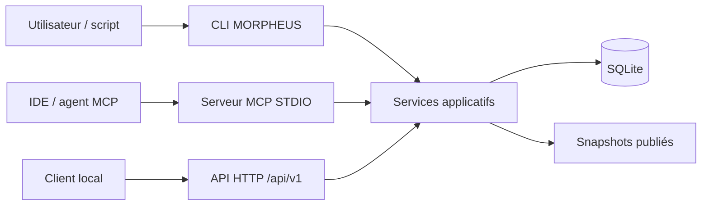
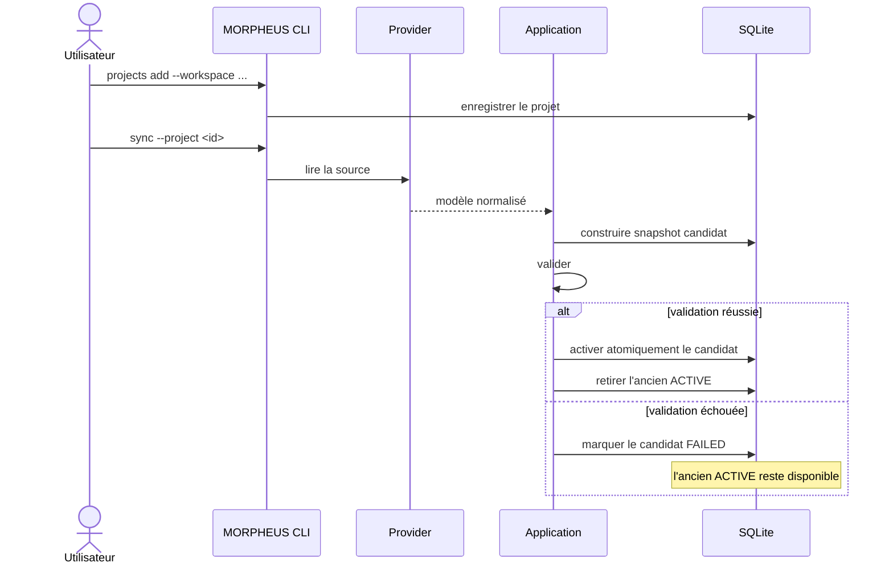
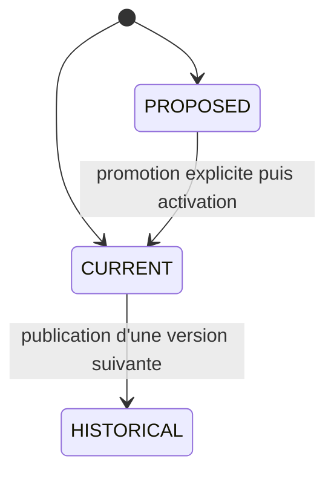
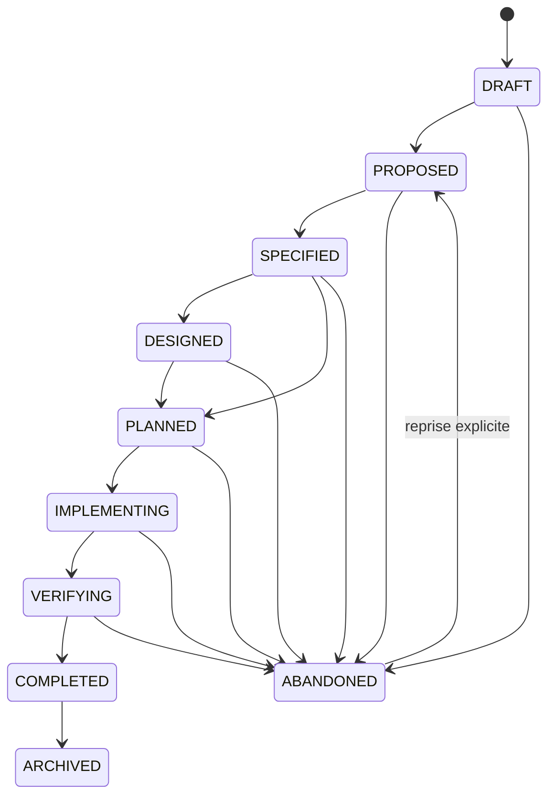
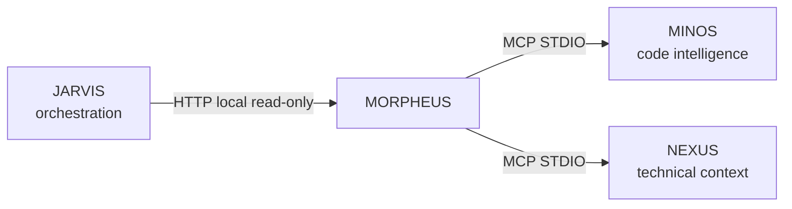

# Guide utilisateur MORPHEUS

MORPHEUS est un **Specification & Intent Intelligence Engine** local-first. Il transforme une source de spécification en un modèle normalisé, versionné et interrogeable, puis expose ce modèle par trois surfaces : CLI, MCP STDIO et API HTTP locale.

Ce guide explique **ce que MORPHEUS manipule**, **dans quel ordre l’utiliser**, **ce qu’il garantit** et **quelle surface choisir**.

## 1. À quoi sert MORPHEUS ?

MORPHEUS répond notamment aux questions suivantes :

- quelles exigences sont actuellement publiées pour ce projet ?
- quels changements sont proposés sans encore appartenir à l’état courant ?
- quelles contraintes, décisions et tâches sont liées à un changement ?
- d’où vient une information et à quoi est-elle reliée ?
- qu’est-ce qui a changé entre deux snapshots publiés ?
- la spécification présente-t-elle des informations manquantes ou incohérentes ?
- une transition de lifecycle serait-elle autorisée compte tenu des faits disponibles ?
- quelles références de code MINOS ou quel contexte NEXUS sont disponibles en complément ?

MORPHEUS ne remplace ni Git, ni un tracker de tickets, ni MINOS, ni NEXUS, ni JARVIS. Il reste propriétaire de la **spécification**, de l’**intention**, de la **temporalité** et des **règles de lifecycle**.

## 2. Les trois surfaces d’utilisation

| Surface | Usage principal | Transport | Écriture protocolaire |
|---|---|---|---|
| CLI | humain, scripts, administration locale | processus local | oui pour l’enregistrement projet et la synchronisation |
| MCP | IDE, agents, orchestrateurs compatibles MCP | STDIO / JSON-RPC | catalogue métier read-only |
| API HTTP | intégration locale JSON | HTTP `/api/v1` | limitée à l’enregistrement projet et à la synchronisation |



Les trois surfaces utilisent le même moteur. Elles ne réimplémentent pas les règles métier.

## 3. Modèle mental minimal

### 3.1 Projet, version et snapshot

Un projet enregistré dans MORPHEUS pointe vers un workspace. Une synchronisation lit ce workspace via un provider, normalise son contenu et construit un nouveau snapshot candidat.



Une `SpecificationVersion` identifie une version logique de la spécification. Un `KnowledgeSnapshot` représente l’ensemble cohérent des connaissances persistées et publiables. Ces deux notions sont liées, mais **ne sont pas interchangeables**.

### 3.2 CURRENT, PROPOSED et HISTORICAL

MORPHEUS distingue explicitement trois états temporels :



- `CURRENT` : état publié de référence ;
- `PROPOSED` : intention de modification qui ne doit pas contaminer implicitement `CURRENT` ;
- `HISTORICAL` : état publié antérieur conservé pour comparaison et audit.

### 3.3 ChangeProposal et lifecycle

Un changement peut porter des requirements, contraintes, décisions, critères d’acceptation et tâches. Son **lifecycle** est distinct de son état temporel.



Certaines transitions dépendent de faits connus : exigences identifiées, contraintes critiques connues, critères d’acceptation définis, plan présent, absence de bloqueur, etc. Une évaluation peut donc être `ALLOWED`, `BLOCKED`, `UNKNOWN` ou `REQUIRES_INPUT`.

**Évaluer une transition ne l’applique jamais.**

## 4. Parcours recommandé

1. Installer ou extraire la distribution portable.
2. Enregistrer le workspace avec `projects add`.
3. Synchroniser avec `sync`.
4. Vérifier `sync-status`.
5. Rechercher requirements et changements.
6. Explorer la traçabilité, le contexte et les diagnostics qualité.
7. Utiliser l’API ou MCP si un outil doit consommer MORPHEUS.
8. Activer MINOS ou NEXUS uniquement si le besoin existe.
9. Exposer le contrat d’orchestration à JARVIS uniquement si JARVIS doit consommer les faits et décisions de transition.

Le parcours exécutable est détaillé dans [Démarrage rapide](QUICKSTART.md).

## 5. Choisir la bonne commande

| Besoin | Commande |
|---|---|
| enregistrer un workspace | `projects add` |
| lister les projets | `projects list` |
| reconstruire/publier un snapshot | `sync` |
| contrôler la fraîcheur | `sync-status` |
| chercher une exigence | `requirements find` |
| lister/lire les changements | `changes list`, `changes get` |
| lire contraintes/décisions/tâches | `constraints`, `decisions`, `tasks` |
| explorer les liens d’une exigence | `trace-requirement` |
| construire le contexte d’un changement | `change-context` |
| analyser un changement proposé | `analyze-change` |
| diagnostiquer la qualité | `quality` |
| résoudre une référence de code | `external-references resolve` |
| demander un contexte technique NEXUS | `augmented-context` |
| observer l’état d’orchestration | `change-orchestration state` |
| évaluer une transition | `change-orchestration transition-check` |

Référence détaillée : [CLI](CLI.md).

## 6. Ce que MORPHEUS garantit

Les invariants suivants sont structurants :

```text
DomainIdentity != EntityVersionId != SourceLocator != ExternalReference
SpecificationVersion != KnowledgeSnapshot
CURRENT / PROPOSED / HISTORICAL sont explicites
PROPOSED ne fuit jamais implicitement dans CURRENT
published history = RETIRED* -> ACTIVE
APPLY != PROMOTE != ACTIVATE
Scenario != AcceptanceCriterion
absence d'un moteur optionnel != panne MORPHEUS
observation externe live != mutation d'un snapshot publié
lifecycle indisponible != lifecycle inféré
évaluation d'une transition != application d'une transition
```

Conséquence pratique : MORPHEUS préfère retourner une information `UNAVAILABLE`, `UNKNOWN` ou absente plutôt que d’inventer un fait métier.

## 7. Stockage local et chemins

MORPHEUS utilise SQLite par défaut. Les chemins peuvent être contrôlés par options ou variables d’environnement :

```text
--data-dir PATH       MORPHEUS_DATA_DIR
--config-dir PATH     MORPHEUS_CONFIG_DIR
--db PATH             MORPHEUS_DB
```

Defaults de plateforme :

```text
Windows  data   %LOCALAPPDATA%\Morpheus
         config %APPDATA%\Morpheus
Linux    répertoires XDG data/config
```

Utiliser `morpheus paths` pour afficher les chemins effectivement résolus par le launcher.

### Partage de la même base

La CLI, l’API et le serveur MCP voient les mêmes données **uniquement s’ils résolvent le même layout ou le même `--db`**.

Exemple :

```bash
morpheus --db /tmp/demo.db sync --project <projectId>
morpheus --db /tmp/demo.db api
morpheus --db /tmp/demo.db mcp --stdio
```

## 8. Sorties humaines et JSON

Sans `--json`, la CLI privilégie une sortie lisible par un humain.

Avec `--json`, `stdout` devient contractuel pour les scripts :

```bash
morpheus --json requirements find --project <projectId> --query "session"
```

Pour automatiser :

- parser le JSON ;
- vérifier le code de sortie ;
- ne pas dépendre du texte humain de `stderr` ;
- ne pas utiliser `--json` avec `morpheus mcp --stdio`, car `stdout` est réservé à JSON-RPC MCP.

## 9. Intégrations optionnelles



| Intégration | Apport | Si absente |
|---|---|---|
| MINOS | résolution de références vers le code | seule la résolution code est indisponible |
| NEXUS | sélection d’un contexte technique sous budget | seul le contexte augmenté est indisponible |
| JARVIS | orchestration à partir des faits/règles MORPHEUS | MORPHEUS reste autonome |

MINOS, NEXUS et JARVIS ne sont pas embarqués dans la distribution MORPHEUS. Voir [Intégrations optionnelles](INTEGRATIONS.md).

## 10. Erreurs fréquentes

### `NOT_FOUND`

Le projet, snapshot ou identifiant métier demandé n’existe pas dans la base utilisée. Vérifier :

```bash
morpheus paths
morpheus projects list
morpheus sync-status --project <projectId>
```

### `STATE_ERROR`

L’état persisté ou la synchronisation demandée n’est pas compatible avec l’opération. Ne pas supprimer la base avant d’avoir vérifié le projet, le snapshot actif et la sortie JSON.

### MINOS/NEXUS `DISABLED`

Ce n’est pas une erreur MORPHEUS : l’intégration n’est simplement pas configurée.

### Le résultat semble ancien

Contrôler `sync-status`, puis relancer une synchronisation explicite. Les requêtes lisent le snapshot publié ; elles ne rescannent pas automatiquement le workspace.

## 11. Documentation associée

- [Démarrage rapide](QUICKSTART.md)
- [Référence CLI](CLI.md)
- [Intégrations optionnelles](INTEGRATIONS.md)
- [Architecture développeur](../developer/ARCHITECTURE.md)
- [API HTTP](../developer/API.md)
- [Serveur MCP](../developer/MCP.md)
- [Portail de documentation](../README.md)
