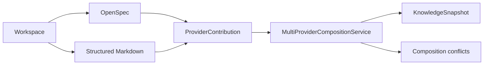
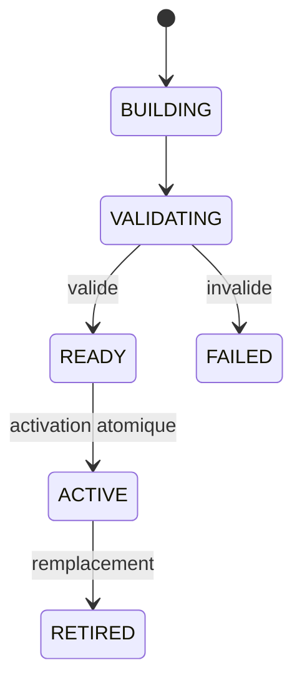

# Guide utilisateur MORPHEUS

MORPHEUS est un **Specification & Intent Intelligence Engine** local-first. Il transforme une ou plusieurs sources de spécification en un modèle normalisé, composé, versionné et interrogeable, puis expose ce modèle par trois surfaces : CLI, MCP STDIO et API HTTP locale.

Ce guide explique **ce que MORPHEUS manipule**, **dans quel ordre l’utiliser**, **ce qu’il garantit** et **quelle surface choisir**.

## 1. À quoi sert MORPHEUS ?

MORPHEUS répond notamment aux questions suivantes :

- quelles exigences sont actuellement publiées pour ce projet ?
- quels changements sont proposés sans encore appartenir à l’état courant ?
- quelles contraintes, décisions et tâches sont liées à un changement ?
- d’où vient une information et à quoi est-elle reliée ?
- plusieurs providers décrivent-ils la même entité avec des observations divergentes ?
- quelle priorité a sélectionné la valeur principale sans effacer la provenance ?
- qu’est-ce qui a changé entre deux snapshots publiés ?
- la spécification présente-t-elle des informations manquantes ou incohérentes ?
- une transition de lifecycle serait-elle autorisée compte tenu des faits disponibles ?
- quelles références de code MINOS ou quel contexte NEXUS sont disponibles en complément ?

MORPHEUS ne remplace ni Git, ni un tracker de tickets, ni MINOS, ni NEXUS, ni JARVIS. Il reste propriétaire de la **spécification**, de l’**intention**, de la **temporalité**, des **règles de lifecycle**, des **invariants d’état contrôlé** et des **faits de composition provider**.

## 2. Les trois surfaces d’utilisation

| Surface | Usage principal | Transport | Écriture métier |
|---|---|---|---|
| CLI | humain, scripts, administration locale | processus local | sync + mutation lifecycle M17 explicite |
| MCP | IDE, agents, orchestrateurs MCP | STDIO / JSON-RPC | 22 tools read-only + 1 write M17 explicite |
| API HTTP | intégration locale JSON | HTTP `/api/v1` | sync + mutation lifecycle M17 explicite |

Les trois surfaces utilisent le même moteur. Elles ne réimplémentent pas les règles métier.

## 3. Modèle mental minimal

### 3.1 Projet, providers, composition et snapshot

Un projet enregistré dans MORPHEUS pointe vers un workspace. M18 permet d’observer plusieurs providers réels dans un même projet. Les adapters normalisent leurs lectures en contributions provider-neutral avant composition.



La composition conserve :

```text
provider observations
explicit precedence
provenance
conflicts
diagnostics
```

Elle ne confond jamais chemin source et identité métier.

### 3.2 Snapshot publié

Un nouveau snapshot candidat suit un lifecycle technique :



Un candidat échoué ne doit jamais remplacer partiellement l’`ACTIVE` précédent.

Une `SpecificationVersion` identifie une version logique de la spécification. Un `KnowledgeSnapshot` représente un ensemble cohérent de connaissances persistées et publiables. **`SpecificationVersion != KnowledgeSnapshot`.**

### 3.3 CURRENT, PROPOSED et HISTORICAL

```text
CURRENT     état publié de référence
PROPOSED    intention de modification isolée
HISTORICAL  état publié antérieur
```

```text
PROPOSED never leaks into CURRENT
APPLY != PROMOTE != ACTIVATE
```

### 3.4 ChangeProposal et lifecycle

Le lifecycle métier est distinct de la temporalité et du snapshot technique.

```text
DRAFT -> PROPOSED -> SPECIFIED -> DESIGNED/PLANNED
      -> IMPLEMENTING -> VERIFYING -> COMPLETED -> ARCHIVED
```

Une évaluation peut être :

```text
ALLOWED
BLOCKED
UNKNOWN
REQUIRES_INPUT
```

**Évaluer une transition ne l’applique jamais.**

## 4. Parcours recommandé

1. Installer ou extraire la distribution portable.
2. Enregistrer le workspace avec `projects add`.
3. Synchroniser l’état publié avec `sync`.
4. Vérifier `sync-status`.
5. Pour un projet multi-provider, exécuter `composition sync` puis consulter `composition status` et `composition conflicts`.
6. Rechercher requirements et changements.
7. Explorer traçabilité, contexte et diagnostics qualité.
8. Utiliser l’API ou MCP si un outil doit consommer MORPHEUS.
9. Activer MINOS ou NEXUS uniquement si le besoin existe.
10. Laisser JARVIS choisir/séquencer les actions ; MORPHEUS ne devient pas l’orchestrateur.

Le parcours exécutable est détaillé dans [Démarrage rapide](QUICKSTART.md).

## 5. Choisir la bonne commande

| Besoin | Commande |
|---|---|
| enregistrer un workspace | `projects add` |
| lister les projets | `projects list` |
| reconstruire/publier un snapshot | `sync` |
| contrôler la fraîcheur | `sync-status` |
| composer les providers | `composition sync` |
| lire l’état de composition | `composition status` |
| inspecter les conflits | `composition conflicts` |
| chercher une exigence | `requirements find` |
| lister/lire les changements | `changes list`, `changes get` |
| lire contraintes/décisions/tâches | `constraints`, `decisions`, `tasks` |
| explorer les liens d’une exigence | `trace-requirement` |
| construire le contexte d’un changement | `change-context` |
| analyser un changement proposé | `analyze-change` |
| diagnostiquer la qualité | `quality` |
| résoudre une référence de code | `external-references resolve` |
| demander un contexte technique NEXUS | `augmented-context` |
| observer l’état d’orchestration | `change-orchestration state` |
| évaluer une transition | `change-orchestration transition-check` |
| appliquer explicitement une transition | `lifecycle apply` |

Référence détaillée : [CLI](CLI.md).

## 6. Ce que MORPHEUS garantit

```text
DomainIdentity != EntityVersionId != SourceLocator != ExternalReference
SpecificationVersion != KnowledgeSnapshot
CURRENT / PROPOSED / HISTORICAL sont explicites
PROPOSED ne fuit jamais implicitement dans CURRENT
published history = RETIRED* -> ACTIVE
APPLY != PROMOTE != ACTIVATE

Scenario != AcceptanceCriterion
AcceptanceCriterion != Test
Test existence != VERIFIED
Evidence != assertion

UNKNOWN != FAILED
UNKNOWN != BLOCKED
applicable != blocking
warning != blocker
severity != blocking policy

transition evaluation != lifecycle mutation
READ_CHANGES != WRITE_CHANGE
ALLOWED != applied
published snapshot != operational lifecycle state
stale revision != overwrite
idempotent retry != duplicate mutation/audit

provider identifier != DomainIdentity
source path != identity
precedence != provenance erasure
conflict != silent last-write-wins
ambiguous continuity must be surfaced

optional provider absence != project failure when optional
optional engine absence != MORPHEUS failure
MORPHEUS rules != JARVIS action sequencing
```

MORPHEUS préfère retourner une information `UNAVAILABLE`, `UNKNOWN`, un diagnostic ou un conflit explicite plutôt que d’inventer un fait.

## 7. Stockage local et chemins

MORPHEUS utilise SQLite par défaut.

```text
--data-dir PATH       MORPHEUS_DATA_DIR
--config-dir PATH     MORPHEUS_CONFIG_DIR
--db PATH             MORPHEUS_DB
```

Defaults de plateforme :

```text
Windows  data   %LOCALAPPDATA%\Morpheus
         config %APPDATA%\Morpheus
Linux    répertoires XDG data/config
```

Utiliser `morpheus paths` pour afficher les chemins réellement résolus.

La CLI, l’API et MCP voient les mêmes données uniquement s’ils résolvent le même layout ou le même `--db`.

## 8. Surfaces M18

### CLI

```text
composition sync
composition status
composition conflicts
```

### MCP

```text
get_composition_status
list_composition_conflicts
```

### HTTP

```text
GET /api/v1/projects/{projectId}/composition
GET /api/v1/projects/{projectId}/composition/conflicts
```

OpenAPI contract : **1.7.0**.

## 9. Baseline validée

```text
M18             ✅ VALIDÉ / INTÉGRÉ — PR #86
Code validé     7e8caacff567f51354fcb88bd7505a6d135071c0
Merge           30f11ac3ffc522bcc0c71e31216a3fb70f0631d7
Tests           418/418 PASS
Architecture    170/170 PASS
Packaging       Windows + smokes + API health PASS
```

M19 — **Production Hardening, Scale & Operability** — est le prochain jalon.