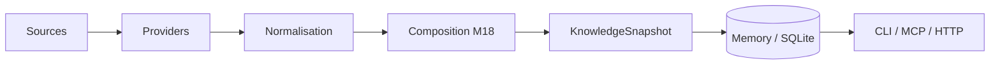

# Guide utilisateur MORPHEUS

MORPHEUS est un **Specification & Intent Intelligence Engine** local-first. Il transforme une ou plusieurs sources de spécification en un modèle normalisé, versionné, composable et interrogeable, puis expose ce modèle par CLI, MCP STDIO et API HTTP locale.

## 1. À quoi sert MORPHEUS ?

MORPHEUS permet notamment de savoir :

- quelles exigences sont actuellement publiées ;
- quels changements restent proposés ;
- quelles contraintes, décisions, critères d’acceptation et tâches sont liés ;
- d’où vient une information et à quoi elle est reliée ;
- quels providers ont contribué à une vue et selon quelle priorité ;
- quels conflits de composition existent entre sources ;
- ce qui a changé entre snapshots ;
- si une transition lifecycle est autorisée compte tenu des faits disponibles ;
- quelles références MINOS ou quel contexte NEXUS sont disponibles en complément.

MORPHEUS ne remplace ni Git, ni un tracker, ni MINOS, ni NEXUS, ni JARVIS.

```text
MORPHEUS = specification facts + intent + lifecycle rules
           + controlled state invariants + provider composition facts
MINOS    = code intelligence
NEXUS    = context selection / ranking / fusion / compression
JARVIS   = sequencing / orchestration / action choice
```

## 2. Les trois surfaces

| Surface | Usage principal | Transport | Écriture contrôlée |
|---|---|---|---|
| CLI | humain, scripts, administration locale | processus local | projet/sync + lifecycle write explicite |
| MCP | IDE, agents, orchestrateurs | STDIO / JSON-RPC | **22 read-only + 1 write explicite** |
| API HTTP | intégration locale JSON | HTTP `/api/v1` | projet/sync + lifecycle write explicite |

Les trois surfaces utilisent les mêmes services applicatifs ; elles ne réimplémentent pas les règles métier.

## 3. Projet, snapshot et providers

Un projet MORPHEUS pointe vers un workspace. M18 valide deux providers réels :

```text
OpenSpec
Structured Markdown
```

Une synchronisation normale construit un snapshot candidat. Une composition M18 peut agréger plusieurs contributions provider-neutral en conservant provenance, priorité et conflits explicites.



## 4. Temporalité et lifecycle

```text
CURRENT     état publié de référence
PROPOSED    intention non encore publiée
HISTORICAL  état publié antérieur
```

`SpecificationVersion != KnowledgeSnapshot`.

Le lifecycle métier d’un changement est une dimension distincte :

```text
DRAFT -> PROPOSED -> SPECIFIED -> DESIGNED/PLANNED
      -> IMPLEMENTING -> VERIFYING -> COMPLETED -> ARCHIVED
      -> ABANDONED selon transitions autorisées
```

Une évaluation peut être :

```text
ALLOWED
BLOCKED
UNKNOWN
REQUIRES_INPUT
```

**Évaluer une transition ne l’applique jamais.**

## 5. Parcours recommandé

1. extraire la distribution ;
2. `projects add` ;
3. `sync` ;
4. vérifier `sync-status` ;
5. si plusieurs providers sont présents, exécuter `composition sync` ;
6. examiner `composition status` et `composition conflicts` ;
7. interroger requirements, changes, traçabilité et qualité ;
8. utiliser HTTP/MCP si un outil consomme MORPHEUS ;
9. activer MINOS/NEXUS uniquement si nécessaire ;
10. appliquer un lifecycle uniquement via la commande write explicite et ses garde-fous.

Voir [Démarrage rapide](QUICKSTART.md).

## 6. Commandes principales

| Besoin | Commande |
|---|---|
| enregistrer un workspace | `projects add` |
| lister les projets | `projects list` |
| reconstruire/publier | `sync` |
| contrôler la fraîcheur | `sync-status` |
| composer les providers | `composition sync` |
| voir l’état de composition | `composition status` |
| voir les conflits | `composition conflicts` |
| chercher une exigence | `requirements find` |
| lister/lire les changements | `changes list`, `changes get` |
| critères d’acceptation | `acceptance-criteria list` |
| contraintes | `constraints list/evaluate` |
| traçabilité | `trace-requirement` |
| contexte d’un changement | `change-context` |
| analyser un changement | `analyze-change` |
| qualité | `quality` |
| référence code | `external-references resolve` |
| contexte NEXUS | `augmented-context` |
| observer lifecycle | `change-orchestration state` |
| évaluer transition | `change-orchestration transition-check` |
| appliquer transition | `lifecycle apply` |

Référence détaillée : [CLI](CLI.md).

## 7. Composition M18

```text
provider identifier != DomainIdentity
source path != identity
provider ownership is explicit
same logical entity may have multiple provider observations
precedence != provenance erasure
ambiguous continuity must be surfaced
conflict != silent last-write-wins
optional provider absence != project failure when optional
```

Une priorité choisit un résultat ; elle n’efface pas la provenance ni l’existence des candidats concurrents.

## 8. Garanties structurantes

```text
DomainIdentity != EntityVersionId != SourceLocator != ExternalReference
SpecificationVersion != KnowledgeSnapshot
PROPOSED never leaks into CURRENT
published history = RETIRED* -> ACTIVE
APPLY != PROMOTE != ACTIVATE
Scenario != AcceptanceCriterion
AcceptanceCriterion != Test
Test existence != VERIFIED
Evidence != assertion
UNKNOWN != FAILED
UNKNOWN != BLOCKED
applicable != blocking
warning != blocker
severity != blocking policy
transition evaluation != lifecycle mutation
READ_CHANGES != WRITE_CHANGE
ALLOWED != applied
published snapshot != operational lifecycle state
stale revision != overwrite
idempotent retry != duplicate mutation/audit
optional engine absence != MORPHEUS failure
```

MORPHEUS préfère `UNAVAILABLE`/`UNKNOWN` à un fait inventé.

## 9. Stockage local

SQLite est le store persistant par défaut.

```text
--data-dir PATH       MORPHEUS_DATA_DIR
--config-dir PATH     MORPHEUS_CONFIG_DIR
--db PATH             MORPHEUS_DB
```

Utiliser `morpheus paths` pour afficher les chemins résolus.

CLI, API et MCP partagent les mêmes données seulement s’ils utilisent le même layout ou `--db`.

M18 utilise SQLite **V012** pour l’état de composition.

## 10. JSON et automatisation

```bash
morpheus --json composition status --project <projectId>
```

Pour automatiser :

- vérifier le code de sortie ;
- parser le JSON de `stdout` ;
- ne pas dépendre du texte humain de `stderr` ;
- ne pas utiliser `--json` avec `morpheus mcp --stdio`.

## 11. Intégrations optionnelles

| Intégration | Apport | Si absente |
|---|---|---|
| MINOS | résolution vers le code | seule la résolution code est indisponible |
| NEXUS | contexte technique sous budget | seul le contexte augmenté est indisponible |
| JARVIS | séquencement/orchestration | MORPHEUS reste autonome |

MINOS, NEXUS et JARVIS ne sont pas embarqués comme moteurs dans MORPHEUS.

## 12. Contrats M18

```text
OpenAPI 3.1.0 / contract 1.7.0
MCP 22 read-only + 1 write explicite
CLI composition sync/status/conflicts
HTTP GET .../composition
HTTP GET .../composition/conflicts
SQLite V012
```

## 13. Baseline validée

```text
code M18 validé  7e8caacff567f51354fcb88bd7505a6d135071c0
merge M18        30f11ac3ffc522bcc0c71e31216a3fb70f0631d7
tests            418/418 PASS
architecture     170/170 PASS
packaging Win    PASS
```

## 14. Documentation associée

- [Démarrage rapide](QUICKSTART.md)
- [Référence CLI](CLI.md)
- [Intégrations optionnelles](INTEGRATIONS.md)
- [Architecture développeur](../developer/ARCHITECTURE.md)
- [API HTTP](../developer/API.md)
- [Serveur MCP](../developer/MCP.md)
- [Validation M18](../validation/VALIDATION_M18.md)
- [Portail de documentation](../README.md)